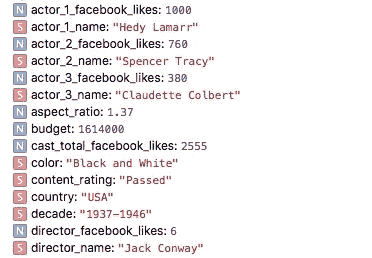
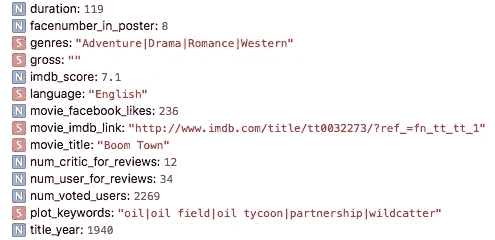
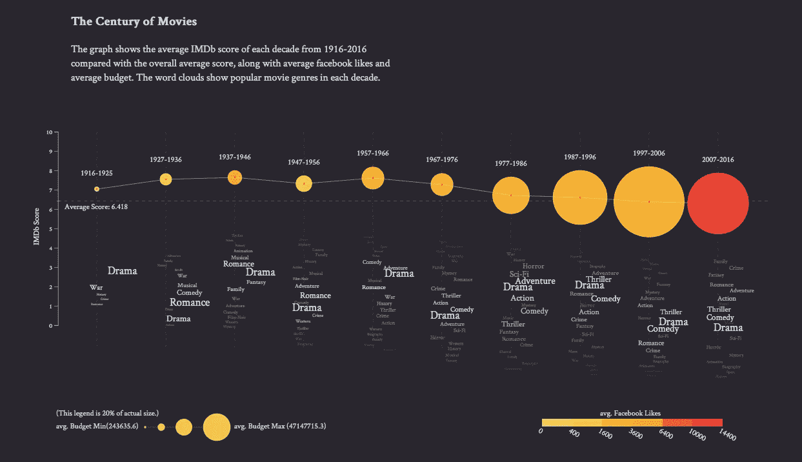

# 电影的世纪

> 原文：<https://towardsdatascience.com/the-century-of-movies-12a4b5a4c004?source=collection_archive---------3----------------------->

最初，这只是一个使用 d3 的数据可视化任务。令人惊讶的是，我实际上从我们从头制作的图表中发现了许多故事。

原始数据是一个文件，包含 5000 多部电影和许多功能，如 IMDB 评分、标题年份、预算、脸书喜欢等。所有的功能都在下面得到了安慰。

我选择了 IMDB 评分，冠军年，预算，FB 喜欢和流派，这是最后的作品。

我们可以从中讲述很多故事。

先说电影质量，几乎可以从每个圈的垂直位置表现出来。1977 年以前的电影似乎有相对较高的声誉。有些人可能会认为“电影业对待电影不那么认真了”，这是可能的，我们也需要考虑一下，是不是因为最近人们对电影的期望更高了，因为投入了更多的预算，高科技的应用，所以他们给了老电影相对较高的分数？此外，电影业的繁荣增加了一吨的电影，这些电影在后来的几十年里相对糟糕，拉低了这几十年的平均值。或者也许人们认为老电影更好，因为它们老了。

然后我们可以谈谈预算。前 60 年差别不大。那时候，电影预算都很低。我们可以看到在 1977 年至 1986 年的十年间有了急剧的增长。根据我们的调查，那是年轻群体开始被电影吸引的时候。像《星球大战》这样的电影获得了巨大的声誉和知名度。当更多的人去电影院时，制片人肯定会投入更多。还有，我们可以从体裁上看到，“冒险”和“科幻”开始跳出来。这些电影应该比“戏剧”和“爱情片”等类型的电影花费更多。另一件有趣的事情是，我们都认为平均预算肯定会越来越大。然而，最近几十年的预算比十年前少得多。我们假设的原因之一是，在这十年里有大量的电影，其中很多是低成本电影，这将降低平均预算。有可能在十年前，这个行业推崇高科技和花哨的显示器。十年后，人们更愿意倒着走，呈现更在乎故事和情感的东西。

下一个角色是脸书喜欢，我们可以看到“网络”时代是如何影响脸书喜欢的，因为相当数量的喜欢确实来自于电影实际制作时，粉丝只是喜欢页面来看预告片，更新等。我们还可以看到 facebook 喜欢和 IMDB 评分之间的关系。比如说。1937-1946 年和 1957-1966 年这十年的 IMDB 得分最高，与 2007-2016 年以外的其他十年相比，它们的颜色也更深。

最后一集是关于流派的。回溯到 1916 年至 1925 年，战争类型相当流行。随着时间的推移，现在我们几乎看不到它了。“浪漫”在 1927-1966 年间扮演了重要角色。当时也制作了许多浪漫电影，如《罗马假日》和《滑铁卢桥》。还有，一个有趣的事情是，二战期间“家庭”电影相对更受欢迎。我们也可以看到科幻小说从 60 年代诞生到 80 年代，然后变得相对模糊。

实际上，我们从这张图表中发现的比我们预期的要多，我相信还有很多可以探索的地方。