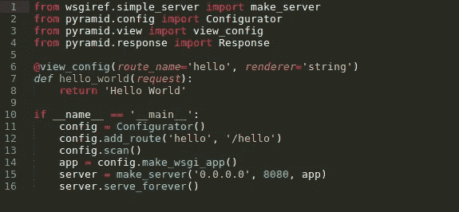

# 冷启动问题:如何打入机器学习

> 原文：<https://towardsdatascience.com/the-cold-start-problem-how-to-break-into-machine-learning-732ee9fedf1d?source=collection_archive---------2----------------------->

我是一名物理学家，在 YC 的一家初创公司工作。我们的工作是帮助新毕业生进入他们的第一个机器学习角色。

很难被雇佣到你的第一个机器学习角色。这意味着我会被问很多类似这样的问题:现在，我做 x，我想成为一名机器学习工程师。我该怎么做？

根据 X 是什么，范围从非常难做的事情(物理、软件工程)到非常难做的事情(UI 设计、市场营销)。

因此，为了同时帮助每个人，我整理了一个进度，你可以从任何起点开始，真正成为一名机器学习工程师。我遇到的每一个 ML 工程师(没有在 T2 赛尔号或类似的地方读研究生)都经历过这种形式。

在你开始学习 ML 之前，你首先需要一些基础知识。

# 1.学习微积分

你首先需要的是多变量微积分(直到大学二年级)。

**哪里学的:** [可汗学院的微分学课程](https://www.khanacademy.org/math/differential-calculus)还不错。一定要做练习题。否则你只会跟着课程点头，什么也学不到。

# 2.学习线性代数

你需要的第二件事是线性代数(直到大学一年级)。

**去哪里学:** [瑞秋·托马斯(Rachel Thomas)的计算线性代数迷你课程](https://github.com/fastai/numerical-linear-algebra/blob/master/README.md)针对的是想学 ML 的人。

**注:**我听过令人信服的论点，你可以跳过微积分和线性代数。我认识的一些人已经直接进入了 ML，并通过反复试验和直觉学到了他们所需要的大部分东西，结果证明他们还不错。您的里程会有所不同，但无论您做什么，都不要跳过下一步:

# 3.学习编码

你最不需要的是 Python 编程经验。你可以用其他语言做 ML，但是现在 Python 是黄金标准。

**去哪里学:**按照[这个 Reddit 跟帖](https://www.reddit.com/r/learnpython/comments/35iyuc/what_is_the_best_way_to_learn_python/)的置顶答案里的建议。你还应该密切注意[号](http://www.numpy.org)和[号](https://www.scipy.org)包裹。这些经常出现。

关于良好的编程实践，我还有很多要说的，这里就不多说了。一句话:用好的测试和[错误处理](https://www.datacamp.com/community/tutorials/exception-handling-python)让你的代码[清晰可见](https://blog.hartleybrody.com/python-style-guide/)和[模块化](https://docs.python-guide.org/writing/structure/)。

专业提示:如果你正在从头开始学习编码，不要费心去记住每一个命令。只需学会如何快速在线查找问题。而且没错，[这就是专业人士做的](https://twitter.com/patio11/status/988508062431432704?lang=en)。

还有:[学习 git 的基础知识](http://try.github.io)。回报很快。

# 学习机器学习

现在你可以学习机器学习本身。2018 年，最好的地方之一是杰瑞米·霍华德的 [fast.ai](http://www.fast.ai) 课程，该课程以最先进的方式教授人工智能，课程平易近人。至少完成[课程 1](http://course.fast.ai) ，最好是[课程 2](http://course.fast.ai/part2.html) ，完成所有练习，你将在建模方面领先于大多数行业从业者(真的)。

在过去的 6 年里，机器学习的大部分进展都是在深度学习方面，但这个领域还有更多。还有决策树、支持向量机、线性回归和一堆其他技术。随着你的进步，你会遇到这些问题，但是当它们出现的时候，你可能会学到它们。Python 的 [scikit-learn](http://scikit-learn.org/stable/) 包是学习和使用它们的一个很好的集中地方。

# 构建个人项目

每个申请第一个 ML 职位的人都做过机器学习和数据科学方面的个人项目，所以你也应该这样做。但是把它做好是很重要的，我会在以后的文章中详细介绍。现在，我唯一要说的是:当人们展示个人项目时，我看到的最常见的错误是*他们将众所周知的算法应用于* [*众所周知的数据集*](https://www.kaggle.com/c/titanic) *。*

这是一个错误，因为(1)机器学习招聘经理已经知道所有众所周知的数据集，以及(2)他们也知道，如果你展示一个项目，其中你将一个众所周知的算法应用于一个众所周知的数据集，你可能不知道如何做其他任何事情。

# 有些东西是很难自学的

事实是，很多让你鹤立鸡群的东西，是你自己很难学会的。在机器学习中，三个最大的是(1)数据准备，(2) ML devops，和(3)专业网络。

数据准备是您在处理真实数据时使用的技巧。这意味着处理异常值和缺失值。但这也意味着当你想要解决的问题还没有数据集时，你要自己收集数据。在现实生活中，您将花费 80%的时间清理和收集数据。在现实世界中，建模是事后的想法，工程经理知道这一点。

ML devops 就是你在云上运行你的模型所做的事情。租用计算时间是要花钱的，所以人们有时不会在他们的个人项目中这样做。但是如果你能负担得起，熟悉一下基础知识是值得的。从 [Paperspace](https://www.paperspace.com) 或 [Floyd](https://www.floydhub.com) 开始介绍在云上运行 ML。

诚实的工程师经常忽视人际关系网，因为他们认为他们应该仅凭自己的技能被录用。现实世界不是这样的，尽管它应该是这样的。所以要和人们交谈。我会在以后的文章中写更多关于这部分的内容。

# 请求帮助

有些步骤你自己很难做到。学校不擅长教授数据准备、ML devops 或网络。大多数人在工作中学习这些东西，或者如果幸运的话，从导师那里学习。很多人根本就没学过。

但是，在一般情况下，如何弥合这一差距呢？当你需要一份工作来获得经验的时候，没有经验的你如何获得一份工作？

这里有一个提议:如果你已经完成了 fast.ai 或同等课程，并且有几个你已经建立的个人项目，请随时与我联系，我会尽我所能给你提供你所缺少的建议。你可以在<my company="">发邮件到<my first="" name="">找我。com，或者在 Twitter 上 DM 我( [@_edouardharris](https://twitter.com/_edouardharris) )。</my></my>