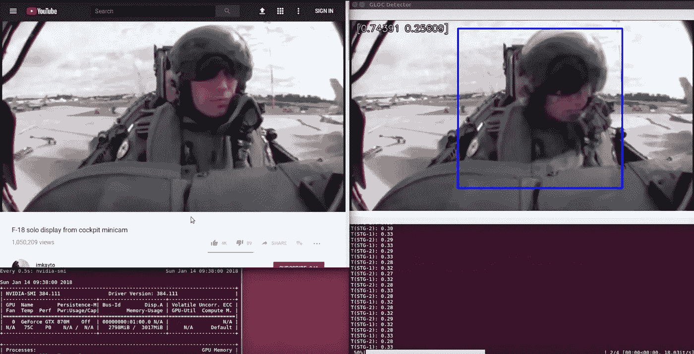

# 冷启动问题:如何建立你的机器学习组合

> 原文：<https://towardsdatascience.com/the-cold-start-problem-how-to-build-your-machine-learning-portfolio-6718b4ae83e9?source=collection_archive---------0----------------------->

我是一名物理学家，在 YC 的一家初创公司工作。我们的工作是帮助新毕业生获得他们的第一份机器学习工作。

不久前，我[写了关于](/the-cold-start-problem-how-to-break-into-machine-learning-732ee9fedf1d)的文章，你应该做些什么来获得你的第一份机器学习工作。我在那篇文章中说，你应该做的一件事是建立你个人机器学习项目的投资组合。但是我遗漏了如何实际做到这一点的部分，所以在这篇文章中，我将告诉你如何做到。[1]

因为我们的创业公司所做的事情，我已经看到了数百个个人项目的例子，从非常好到非常差。让我告诉你两个非常好的例子。

# 全押

接下来的是一个真实的故事，除了为了隐私我改了名字。

X 公司使用人工智能来提醒杂货店该订购新库存了。我们有一个学生，罗恩，他*真的*想在 X 公司工作。罗恩非常想在 X 公司工作，事实上，他建立了一个个人项目，100%致力于让他在那里面试。

我们通常不建议像这样全押一家公司。如果你刚开始，这样做是有风险的。但是——就像我说的——Ron*真的*想在 x 公司工作。

那么罗恩建造了什么？

The red bounding boxes indicate missing items.

1.  罗恩开始用胶带把他的手机粘在一辆购物车上。然后，他开着手推车在一家杂货店的过道里来来回回，同时用相机记录下过道的情况。他在不同的杂货店这样做了 10-12 次。
2.  一回到家，罗恩就开始构建一个机器学习模型。他的模型识别了杂货店货架上的空白点——货架上玉米片(或其他任何东西)不见的地方。
3.  最棒的部分来了:Ron 在 GitHub 上，在完全公开的情况下，实时构建了他的模型。每天，他都会改进自己的回购协议，并在回购协议的自述文件中记录这些变化。
4.  当 X 公司意识到罗恩在这么做时，X 公司被激起了兴趣。不仅仅是好奇。事实上，X 公司有点紧张。他们为什么会紧张？因为罗恩在不知情的情况下，在几天内，复制了他们专有技术的一部分。[2]

X 公司非常有能力，他们的技术在同行业中名列前茅。尽管如此，在 4 天之内，Ron 的项目引起了 X 公司 CEO 的直接关注。

# 试点项目

这是另一个真实的故事。

Alex 是历史专业，辅修俄罗斯研究(真的)。对于一个历史专业的学生来说，不同寻常的是，他对机器学习产生了兴趣。更不寻常的是，尽管他从未写过一行 Python 代码，但他决定学习它。

亚历克斯选择通过构建来学习。他决定建造一个分类器来检测战斗机飞行员是否在飞机上失去意识。亚历克斯想通过观看飞行员的视频来发现这一点。他知道当飞行员失去知觉时，人很容易通过观察来判断，所以亚历克斯认为机器也应该可以判断。

以下是亚历克斯在几个月的时间里所做的事情:

A demo of Alex’s G-force induced loss-of-consciousness detector.

1.  亚历克斯在 YouTube 上下载了飞行员驾驶飞机的所有视频剪辑，都是从驾驶舱拍摄的。(如果你想知道，这里有几十个这样的片段。)
2.  接下来，他开始标记他的数据。Alex 建立了一个 UI，让他滚动浏览数千个视频帧，按下一个按钮表示“有意识”和另一个按钮表示“无意识”，并自动将该帧保存在正确标记的文件夹中。这个标签非常非常无聊，花了他很多很多天。
3.  亚历克斯为图像建立了一个数据管道，将飞行员从驾驶舱背景中裁剪出来，使他的分类器更容易专注于飞行员。最后，他建立了意识丧失分类器。
4.  在做这些事情的同时，Alex 在社交活动中向招聘经理展示了他的项目快照。每次他拿出他的项目展示(在他的手机上)，他们都问他是怎么做的，他建的管道，他是怎么收集数据的。但是他们从来没有抽出时间来询问他的模型的准确性，低于 50%。

当然，亚历克斯计划提高他的准确性，但他在得到机会之前就被录用了。事实证明，对公司来说，他的项目的视觉冲击力，以及他在数据收集方面的不懈努力，比他的模型实际上有多好更重要。

我说过亚历克斯主修历史，辅修俄罗斯研究吗？

# 他们的共同点是

是什么让罗恩和亚历克斯如此成功？以下是他们做对的四件大事:

1.  **罗恩和亚历克斯在造型上没花多少功夫。**我知道这听起来很奇怪，但是对于现在的许多用例来说，建模是一个已经解决的问题。在真正的工作中，除非你在做最先进的人工智能研究，否则你会花 80-90%的时间清理你的数据。为什么你的个人项目会不同？
2.  **罗恩和亚历克斯收集了他们自己的数据。**正因为如此，他们最终得到的数据比你在 Kaggle 或 UCI 数据库中找到的数据更乱。但是处理混乱的数据教会了他们如何处理混乱的数据。这也迫使他们比从学术服务器上下载数据更好地理解数据。
3.  罗恩和亚历克斯制作了视觉上的东西。面试不是让一位无所不知的评委客观地评估你的技能。面试是向另一个人推销自己。人类是视觉动物。所以，如果你拿出手机，向面试官展示你做的东西，确保你做的东西看起来有趣是值得的。
4.  **罗恩和亚历克斯的所作所为看起来很疯狂。**这太疯狂了。正常人不会用胶带把手机粘在购物车上。正常人不会花时间从 YouTube 视频中剪辑飞行员。你知道谁会这么做吗？*愿意不惜一切代价完成工作的人。*还有公司*真的真的*想雇佣那些人。

罗恩和亚历克斯所做的可能看起来像是太多的工作，但实际上，这并不比你在真正的工作中所期望做的多。这就是全部要点:当你没有做 X 的工作经验时，招聘经理会寻找你做过的模拟做 X 的工作经验的事情。

幸运的是，你只需要在这个层次上做一两次项目——Ron 和 Alex 的项目在他们所有的采访中被反复使用。

因此，如果我必须用一句话来总结一个伟大的 ML 项目的秘密，那就是:*用一个有趣的数据集构建一个项目，这个数据集需要花费明显的努力来收集，并使它尽可能具有视觉冲击力*。

如果你有一个项目想法，但你不确定它是否好——在 Twitter 上问我！我的句柄是 [@_edouardharris](https://twitter.com/_edouardharris) ，我的 DMs 是打开的:)

***************************************************************

[1]如果你想知道为什么这很重要，那是因为招聘经理试图通过查看你的履历来评估你。如果你没有记录，个人项目是最接近的替代品。

[2]当然，罗恩的尝试远非完美:X 公司在这个问题上投入的资源比他多几个数量级。但这是足够相似的，他们很快要求罗恩把他的回购私有化。