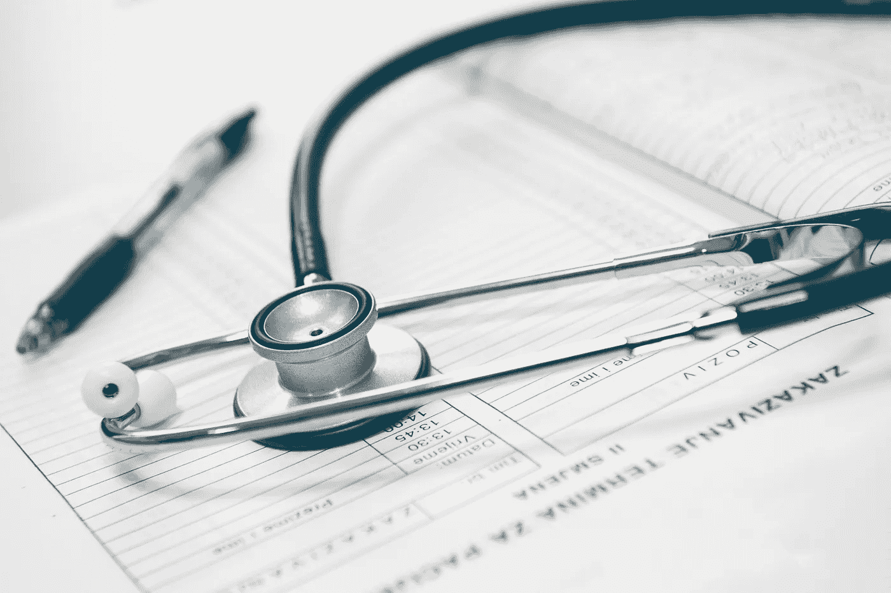
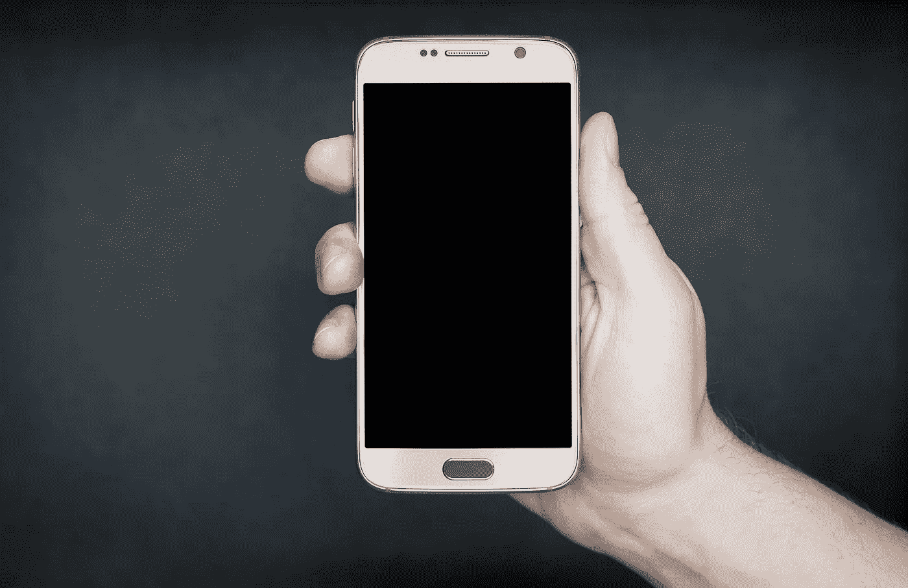

# 即将到来的医疗革命

> 原文：<https://towardsdatascience.com/the-coming-healthcare-revolution-e48ea06a12df?source=collection_archive---------6----------------------->

We won’t be needing these soon to be obsolete, 20th century tools!

我们正处于健康革命的边缘。

几个世纪以来，医学一直是精英专业人士的领域，他们经过多年的学习，掌握了使人恢复健康的知识。日复一日，他们看着患有各种疾病的病人:受伤后再次恶化的膝盖，胃部剧痛或嗡嗡作响的头痛。

随着抗生素在 21 世纪掀起医学革命，人们开始将我们当前的医疗体系视为解决他们身体面临的任何问题的一种方式:如果你生病了，你就去看医生。如果你没有生病，不要担心——生活太忙了，没有理由特意去看医生，尤其是对年轻健康的人来说。

虽然这些专业人员是**拯救生命和无私的英雄，**他们所见患者的性质使他们的工作变得更加困难。病人的反应性很强，他们只有在已经患病的情况下才会寻求治疗，这使得医生扮演了一个不值得羡慕的角色，成为反应性疾病战士，寻找对抗隐性感染的工具。

照片显示带着剧烈的胃痛去了医院。你不仅可能要等几个小时才能看到医生；但是你冒着你的医生在诊断你的疾病时成为人为错误的牺牲品的风险，导致处方在最好的情况下不会解决你的问题，在最坏的情况下会加剧它们。

这种人为错误只会随着医生负担过重而增加。在中国，每 1000 人中只有 1.5 名医生(大约是北美的一半)，病人们来到城市，在医院外扎营等待看病。难怪中国医生偶尔会犯判断失误的错误，他们几乎不能在停车场找到自己的车而不被未治疗的人包围！

问题的一部分在于，患者一般*不会质疑医生的诊断。*他们为什么要这么做？患者没有对自己健康的知识或洞察力来质疑训练有素的专业人员的判断。由于没有反映他们身体整体健康状况的实时数据，病人必须将所有的权力交给医生。

相比之下，医疗保健记录令人沮丧地孤立且低效，你的医生可能会错过你过去医疗中的关键信息，这可能导致对潜在致命疾病的误诊。事实上，仅去年一年，美国就有 250，000 例死亡可直接归因于协调不当的护理。虽然医疗记录目前正在向电子形式过渡，但这种过渡可能会慢得令人沮丧。目前，大量的患者数据都是纸质的，由于医生的笔迹难以辨认，要将我们所有的数据都放在一个容易访问的地方还需要一段时间。

这就是说，病人对自己的健康缺乏控制和了解。与此同时，令人沮丧的是，医生经常重复工作。我们非常接近解决这两个问题。两个主要趋势正在结合在一起，将永远改变我们对待健康和医学的方式:**个人数据将被推回给患者，允许更积极的行为来改善健康和避免疾病，而人工智能将使医生更加准确和高效。**

在未来，这两种趋势将允许实时健康数据转化为基于您个人健康状况的有意义的见解，并将为您提供日常建议，使您更加健康，避免潜在的疾病。让我们检查这两者，并从将数据返回给消费者开始。

**把数据放回你的手中**

在人类历史的大部分时间里，人类不得不依靠自己的直觉来理解我们何时需要医疗。如果你*感到*不舒服，你会寻求治疗。

互联网目前允许你在任何你喜欢的地方寻求在线咨询。智能手机等技术使人们能够使用前所未有的实时数据来监控自己的健康。然而，目前缺少的是在任何给定时间对医疗记录的即时和无限制的访问，以及与信任的个人快速共享这些记录的能力。

这种对信息的永久访问将通过更好地了解您的个人健康状况以及它在您一生中的变化来减少您个人治疗中的低效。与此同时，通过可信的中介数据库与他人共享电子医疗档案，将能够利用数百万个数据点训练医疗算法，释放基于年龄、性别和基因构成的丰富洞察力，所有这些都基于像你一样的其他人的数据。

A better doctor than Dr. Phil

虽然这种将数据推回给消费者的进步似乎不是革命性的，但它确实减少了物理医生诊断个人和监控复杂疾病的需要。像表带这样的简单可穿戴技术现在可以包含医疗级心脏监护仪，从而可以检测和诊断心律失常。同样，糖尿病应用程序可以监控食物摄入量和血糖水平，减少坏疽等长期伤害的可能性。

由于可以方便地访问医疗记录、历史和做好事情的强烈动机，患者能够发现医生建议中的错误，作为对医生目前掌握的健康信息权力平衡的检查。为了更好地实现这一点，苹果公司最近制定了计划，要求各组织使用智能手机下载自己的医疗记录。

最后，跟踪我们日常行为的应用程序让我们更好地了解我们的行为如何影响我们的整体健康。MyFitnessPal 和类似的应用程序可以轻松跟踪营养和卡路里，让我们看到我们的活动水平和食物消耗对我们健康的影响，并在我们偏离轨道时发出温和的警告。最后，当我们在晚餐后伸手拿第二块蛋糕时，有东西让我们负责任！

越来越多的信息被传回给患者，这使得诊断、主动性和疾病管理变得更好。我们只是刚刚开始这项在病人指尖随时获取实时健康数据的实验。然而，随着复杂性和数据流呈指数级增长，我们很快就会被大量可用的数据淹没。谁有时间分析所有这些信息，以便提出改善个人健康的见解？这就是人工智能的用武之地。

**算法现在会看到你**

让患者负责自己的健康史的另一个好处来自于数据的生成和汇总。共享来自可穿戴设备和智能手机的数据可以在越来越多的数据上训练人工智能，从而更容易看到其他具有类似疾病和健康状况的人，以及他们对不同治疗的反应。这些信息是非常强大的，因为它允许你为你的个人需求寻求治疗，同时减少对医生诊断的需求。

算法不仅有助于将信息反馈给病人。目前，医生最好能表现得更像电脑。即使是最好的医生也容易健忘或分心。这就是为什么像清单这样简单的东西，最低级的自动化形式，可以大大减少错误。事实上，数据显示，基本清单的实施(包括手术患者身份和身体部位的验证、手术环境和设备无菌性的确认以及所有医疗工具的术后清点)显著减少了医疗过程中的错误*。*

此外，每年都有这么多新的医学证据出现，让医生跟上信息的洪流是不现实的。即使是最好的医生，专注于医学研究结果的一小部分，也很难阅读和整合所有的结果。仅在 2014 年，就有 **75 万篇**医学研究发表。在这些研究中， **150，000** 基于癌症治疗。对于研究癌症的医生来说，期望他们能够消化所有的信息并将其整合到他们的实践中是荒谬的。另一方面，计算机擅长分析大量复杂数据以获得洞察力，这些洞察力可以转化为新的最佳实践，并通过简短的声音片段和温和的提醒直接提供给医生。

今天这已经开始发生了。北京协和医院的眼科医生于说，她过去常常要花两天时间来分析患者的眼睛，仔细检查模糊的图像，然后与同事讨论她的发现并撰写报告。医院目前正在测试的人工智能软件可以帮助她更快地完成所有这些工作。

随着卫生系统因人口增长和老龄化的压力而不堪重负，世界各地的医院已经开始认真讨论人工智能是否可以减轻机械、重复工作的负担。这种医学方法——算法充当医生的工具，减少人为错误，缩短诊断常规疾病的时间——是我们的医疗保健系统在短期内将如何转型。例如，谷歌的母公司 Alphabet 已经在接受识别癌组织和视网膜损伤的训练，并且正在迅速变得比最有知识的人类专家更准确。目前，标记癌症图像可能需要几个小时，并且通常由医生在传统工作时间之后完成，这带来了不必要的压力。通过快速准确地标记癌症，人工智能已经显示出其巨大的潜力，可以消除医生工作中最常规和最细致的部分。

**然而，**医疗保健领域的权力从人类转移到算法的一个潜在后果是无菌性增加。安慰剂效应是真实存在的，病人经常向医生寻求希望。研究表明，如果人们与医生有密切的私人关系，他们更有可能遵循处方治疗。此外，人们对机器诊断持怀疑态度:2010 年发表在《健康事务》上的一项研究发现，消费者不相信医生可以提供不合标准的医疗服务。相比之下，他们认为严格基于证据和指南的护理——作为一个自动化医疗护理系统，显然是这样的——是为最低共同标准量身定制的，只符合最低护理标准。因此，未来医生的角色将越来越多地从人工智能程序的大量手工护理选项中进行选择，并以个人化、移情的方式提供护理。

**完全整体化:......的药的未来**

当前医学的问题是，从根本上说，它是被动的，而不是主动的。我们现在的制度是为了对抗疾病，而不是养活一个人；它将具体数据(如胆固醇水平和心率)视为健康的决定性指标，并等待疾病发作后再采取行动“解决问题”。由此可见，[传统医学](http://www.huffingtonpost.com/michael-finkelstein-md/doctors-have-a-moral-resp_b_7347648.html)在 21 世纪初已经是只见树木不见森林。

Oh, what a pretty tree! *doesn’t notice burning forest fire*

应该说，在治疗急性疾病时，这种被动采取行动解决问题的做法是有意义的。然而，当涉及到糖尿病、肥胖症或多动症等慢性健康问题时，你必须积极主动地解决疾病的根本问题。

根据主要科学家的说法，环境毒素和完全缺乏营养的食物已经导致了一系列的健康问题。这些因素，加上当今社会的疯狂状态——快，看看这条突发新闻！不，看看这封你老板发来的紧急邮件！等等，亚马逊在打折，你真的需要买这双鞋！造成了一系列无法用传统方法治疗的健康问题。换句话说，我们的医疗系统必须借鉴古代医疗从业者的智慧，他们承认身体、思想、精神和社区之间有着深刻的相互联系，以应对我们当前的健康挑战。幸运的是，新兴技术将为我们提供解决当前问题的工具；另一方面，为了有效地使用这些工具，需要思维方式的重大转变。我们需要让我们目前的医疗系统继续发挥其优势，同时利用新技术开辟积极治疗的新途径，以减少对急性护理的需求。

让我们来看看这个新系统会是什么样子。以生活在 2045 年的 62 岁妇女佩内洛普为例。

This is Penelope with her grandchildren. Aren’t they cute?

佩内洛普在早上 7 点 23 分准时被一声轻柔的闹钟吵醒，当她的身体传感器发现她已经离开最后一轮快速眼动睡眠时，闹钟就会被触发。根据佩内洛普需要的最佳睡眠时间，根据数百万与她年龄和健康状况相似的女性的数据，这种闹钟被训练成响起。

在淋浴和使用洗手间后，佩内洛普家中的智能传感器发现她的粪便中缺乏纤维和维生素 C。虽然目前没有危险，但如果不加以解决，这些缺陷可能会导致长期慢性消化问题，甚至坏血病。她的个人人工智能助理给了她一个微妙的建议，在她的正常早餐中加入一杯橙汁，午餐加入豌豆汤，这两种食物都将她的缺陷提高到健康水平。

早餐是热燕麦片和新鲜浆果，还有一杯橙汁，佩内洛普的助手提醒她每天的体育活动——瑜伽课。这个课程是在她的人工智能注意到佩内洛普在照看她的孙子孙女后挣扎着捡起地上的玩具后推荐的，并且是为了增加灵活性和避免关节炎而推荐的。

瑜伽之后，佩内洛普坐下来喝了一碗美味的豌豆汤。当她吃东西时，她注意到手机上有一个警报——她的人工智能已经识别出一颗痣，在过去的两个月里，这颗痣已经微妙地长了 0.3 毫米！根据对类似痣的追踪数据，佩内洛普的助手称，佩内洛普有 1.3%的癌症肿瘤风险；不太重要，但仍然值得研究。佩内洛普从她的口腔中取样，并将唾液样本直接送到当地医生的办公室，在那里一个小时内癌症检测结果呈阳性。

虽然最初很担心，但 Penelope 冷静下来，因为她意识到这是早期发现的，并不是一个主要问题。当她进入一辆自动驾驶汽车带她去当地医院时，她的人工智能助理建议进行正念练习，并辅以平静的自然声音，以减轻压力。出于显而易见的原因，这些诊断往往是令人紧张的事情！

到达医院后，Penelope 被直接允许进入一个房间，由人工智能医生通过血液扫描确认最初的诊断。从那里，一名人类医生进入房间，并引导她完成即将到来的程序——一个小手术，将在癌症肿瘤开始扩散之前将其移除。他用抚慰、同情的声音向她保证，这是完全正常的，因为发现得这么早，不会有任何风险。

一个小时内，手术完成(完全由机器人手术设备完成)，痣已经被移除。当佩内洛普回家时，她的人工智能提醒她给一个已经有一段时间没联系的朋友打电话。知道维持重要的关系对心理健康至关重要，人工智能的建议在这个时候是恰当的。佩内洛普从这令人烦恼的一天开始就有短暂抑郁的风险，和老朋友的一次快速视频通话让她振作起来。

在助手的再次推荐下，佩内洛普吃了一顿健康的晚餐，包括清淡的沙拉、烤鸡和糙米，她在手持设备上查看自己的个人医疗记录。她的医疗记录很全面，包括她的家庭、儿童疾病和个人健康风险的记录。她的主动手术已经被记录下来，她的助手根据她所在年龄段的 153，658 名在过去 5 年内做过完全相同手术的人的数据，推荐了最佳恢复做法。当佩内洛普准备睡觉时，她再次提醒自己生活在 2045 年是多么幸运。

这个现实可能很快就会降临到我们头上。专注于将疾病扼杀在萌芽状态，人类将能够过上更幸福、更长寿和更有成效的生活。在考虑了医疗保健的未来之后，问自己以下问题。

1.为了训练算法为每个人提供更好的医疗服务，你愿意把私人医疗信息交给企业吗？

2.如果我们通过主动治疗来“解决”衰老问题，将人类寿命延长 50-100 年或更长时间，会发生什么？

3.2068 年的医院里有人类医生的位置吗？