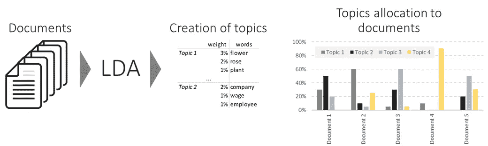
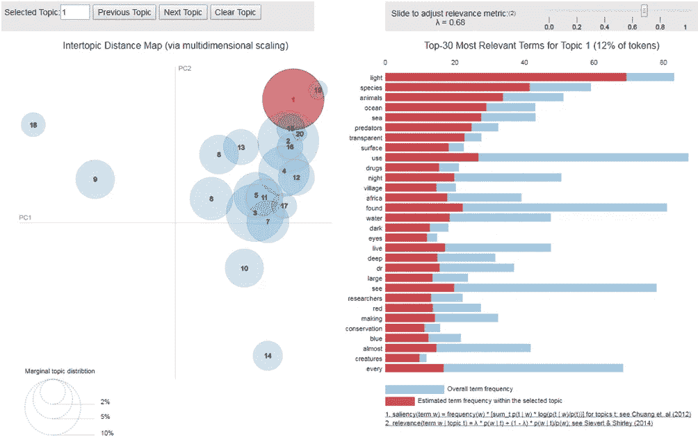
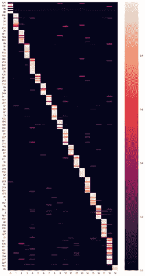
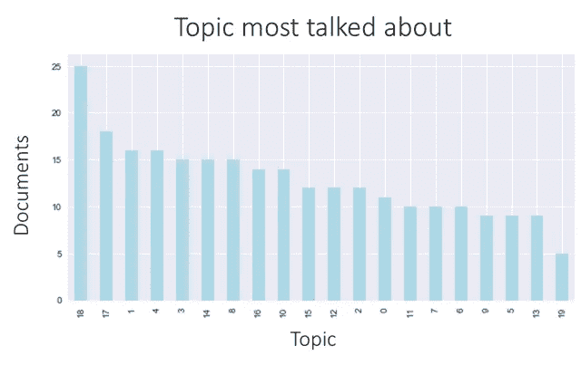

# 基于 LDA 的 Python 主题抽取综述

> 原文：<https://towardsdatascience.com/the-complete-guide-for-topics-extraction-in-python-a6aaa6cedbbc?source=collection_archive---------3----------------------->

## 使用 LDA(潜在狄利克雷分配)从文档语料库中抽取主题

自然语言处理中一个反复出现的主题是通过主题抽取来理解大型文本语料库。无论是分析用户的在线评论、产品描述还是搜索栏中输入的文本，理解关键主题总是会派上用场的。


Popular picture used in literature to explain LDA

在进入 LDA 方法之前，让我提醒你不要重新发明轮子，寻求快速解决方案通常是最好的开始。有几个提供商有很好的主题提取 API(并且在一定数量的调用下是免费的):[谷歌](https://cloud.google.com/natural-language/)，[微软](https://docs.microsoft.com/en-us/azure/cognitive-services/text-analytics/how-tos/text-analytics-how-to-entity-linking)，[含义云](https://www.meaningcloud.com/developer/topics-extraction) …这三个我都试过了，都工作得很好。

但是，如果您的数据非常具体，并且没有通用的主题可以表示它，那么您将不得不采用更加个性化的方法。本文主要关注其中一种方法: **LDA** 。

# 了解 LDA

## 直觉

LDA ( *潜在狄利克雷分配*的缩写)是一个无监督的机器学习模型，它将文档作为输入，并将主题作为输出。该模型还显示了每个文档谈论每个主题的百分比。

主题被表示为单词的加权列表。主题示例如下所示:

> 花* 0.2 |玫瑰* 0.15 |植物* 0.09 |…



Illustration of LDA input/output workflow

该模型有 3 个主要参数:

*   主题的数量
*   每个主题的字数
*   每个文档的主题数

实际上，最后两个参数在算法中并不完全是这样设计的，但我更喜欢坚持使用这些更容易理解的简化版本。

## 履行

*【最后分享专用 Jupyter 笔记本】*

在这个例子中，我使用了来自 BBC 网站的文章数据集。

为了用 Python 实现 LDA，我使用了包 *gensim* 。

A simple implementation of LDA, where we ask the model to create 20 topics

之前显示的参数是:

1.  主题的数量等于 **num_topics**
2.  每个主题的*字数由 **eta** 处理*
3.  *每个文档主题的*数量由 **alpha** 处理**

**要打印找到的主题，请使用以下内容:**

```
**0: 0.024*"base" + 0.018*"data" + 0.015*"security" + 0.015*"show" + 0.015*"plan" + 0.011*"part" + 0.010*"activity" + 0.010*"road" + 0.008*"afghanistan" + 0.008*"track" + 0.007*"former" + 0.007*"add" + 0.007*"around_world" + 0.007*"university" + 0.007*"building" + 0.006*"mobile_phone" + 0.006*"point" + 0.006*"new" + 0.006*"exercise" + 0.006*"open"1: 0.014*"woman" + 0.010*"child" + 0.010*"tunnel" + 0.007*"law" + 0.007*"customer" + 0.007*"continue" + 0.006*"india" + 0.006*"hospital" + 0.006*"live" + 0.006*"public" + 0.006*"video" + 0.005*"couple" + 0.005*"place" + 0.005*"people" + 0.005*"another" + 0.005*"case" + 0.005*"government" + 0.005*"health" + 0.005*"part" + 0.005*"underground"2: 0.011*"government" + 0.008*"become" + 0.008*"call" + 0.007*"report" + 0.007*"northern_mali" + 0.007*"group" + 0.007*"ansar_dine" + 0.007*"tuareg" + 0.007*"could" + 0.007*"us" + 0.006*"journalist" + 0.006*"really" + 0.006*"story" + 0.006*"post" + 0.006*"islamist" + 0.005*"data" + 0.005*"news" + 0.005*"new" + 0.005*"local" + 0.005*"part"**
```

***【前 3 个话题显示其前 20 个最相关的词】* 话题 0 好像是关于军事和战争的。
话题 1 关于印度的健康，涉及妇女和儿童。
话题 2 关于马里北部的伊斯兰教徒。**

**要打印文档主题的百分比，请执行以下操作:**

```
**[(14, 0.9983065953654187)]**
```

**第一个文档 99.8%是关于话题 14 的。**

**预测未知文档的主题也是可行的，如下所示:**

```
**[(1, 0.5173717951813482), (3, 0.43977106196150995)]**
```

**这份新文件 52%谈到了主题 1，44%谈到了主题 3。请注意，4%不能被标记为现有主题。**

## **探测**

**有一个很好的方法来可视化您使用包 *pyLDAvis* 构建的 LDA 模型:**

****

**Output of the pyLDAvis**

**这种可视化允许您在两个缩减的维度上比较主题，并观察主题中单词的分布。**

**另一个很好的可视化方式是根据主题以对角线格式显示所有文档。**

****

**Visualization of the proportion of topics in the documents *(Documents are rows, topic are columns)***

****

**Topic 18 is the most represented topic among documents: 25 documents are mainly about it.**

# **如何成功实施 LDA**

**LDA 是一种复杂的算法，通常被认为难以微调和解释。事实上，使用 LDA 获得相关结果需要对它的工作原理有深入的了解。**

## **数据清理**

**你在使用 LDA 时会遇到的一个常见问题是，单词会出现在多个主题中。解决这个问题的一个方法是将这些单词添加到你的停用词表中。**

**另一件事是复数和单数形式。我会推荐词干化——或者词干化，如果你不能词干化，但是你的主题中有词干不容易理解。**

**删除包含数字的单词也将清理主题中的单词。保持年份(2006，1981)可能是相关的，如果你认为它们在你的主题中是有意义的。**

**过滤出现在至少 3 个(或更多)文档中的单词是删除与主题无关的罕见单词的好方法。**

## **数据准备**

**包括二元和三元语法，以掌握更多相关信息。**

**另一个经典的准备步骤是使用[词性标注](https://en.wikipedia.org/wiki/Part-of-speech_tagging)(词性:词性)只使用名词和动词。**

## **微调**

*   **话题数量:尝试几个话题数量，以了解哪个数量有意义。你实际上需要*看到*主题，才能知道你的模型是否有意义。至于 K-Means，LDA 收敛并且该模型在数学水平上有意义，但是它不意味着在人类水平上有意义。**
*   **清理你的数据:在你的主题中添加过于频繁的停用词，并重新运行你的模型是一个常见的步骤。只保留名词和动词，从文本中删除模板，反复测试不同的清理方法，会提高你的主题。准备在这里呆上一段时间。**
*   **阿尔法预计到达时间。如果你对技术不感兴趣，忘掉这些吧。否则，你可以调整阿尔法和埃塔来调整你的主题。从“auto”开始，如果主题不相关，尝试其他值。我建议使用较低的 Alpha 和 Eta 值，以便每个文档中有少量的主题，每个主题中有少量的相关单词。**
*   **增加*道次*数量，拥有更好的模型。3 或 4 是一个很好的数字，但你可以更高。**

## **评估结果**

*   **你的主题是可解释的吗？**
*   **你的主题独特吗？(两个不同的题目用词不同)**
*   **你的话题详尽吗？(你所有的文档都很好的表现了这些主题吗？)**

**如果你的模型遵循这三个标准，它看起来就是一个好模型:)**

# **LDA 的主要优势**

## **它很快**

**使用 Jupyter 中的 *%time* 命令进行验证。该模型通常运行速度很快。当然，这取决于你的数据。有几个因素会降低模型的速度:**

*   **长文档**
*   **大量文件**
*   **大词汇量(尤其是当你使用 n 元语法时)**

## **这很直观**

**将主题建模为单词的加权列表是一种简单的近似，但如果你需要解释它，这是一种非常直观的方法。没有嵌入也没有隐藏的维度，只有一袋袋有重量的文字。**

## **它可以预测新的看不见的文档的主题**

**一旦模型运行，它就可以为任何文档分配主题了。当然，如果你的训练数据集是英文的，而你想预测中文文档的主题，这是行不通的。但是，如果新文档具有相同的结构，并且应该有或多或少相同的主题，它就可以工作。**

# **LDA 的主要缺点**

## **大量微调**

**如果 LDA 运行速度很快，要用它获得好的结果会给你带来一些麻烦。这就是为什么提前知道如何微调真的会对你有帮助。**

## **它需要人类的解释**

**话题是由机器发现的。为了向非专业人士展示结果，人们需要对它们进行标记。**

## **你不能影响话题**

**知道你的一些文档讲的是你知道的一个话题，而在 LDA 找到的话题里找不到，肯定会很沮丧。并且没有办法对模型说一些单词应该属于一起。你必须坐下来等着 LDA 给你你想要的。**

# **结论**

**LDA 仍然是我最喜欢的主题提取模型之一，我已经在很多项目中使用了它。但是，需要一定的练习才能掌握。这就是我写这篇文章的原因，这样你就可以跳过使用 LDA 的门槛，毫无痛苦地使用它。**

**代码:[https://github . com/Felix shop/medium articles/blob/master/LDA-BBC . ipynb](https://github.com/FelixChop/MediumArticles/blob/master/LDA-BBC.ipynb)**