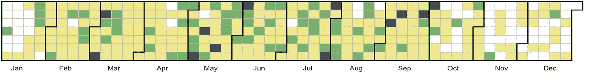
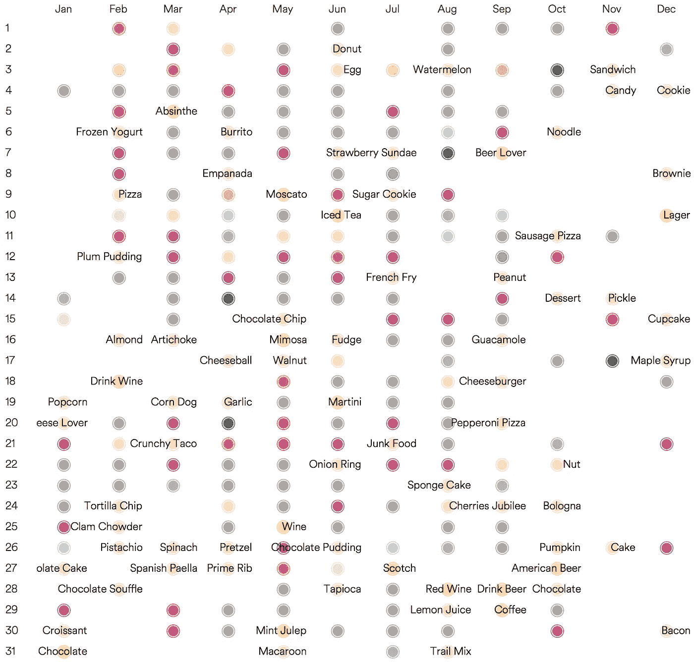
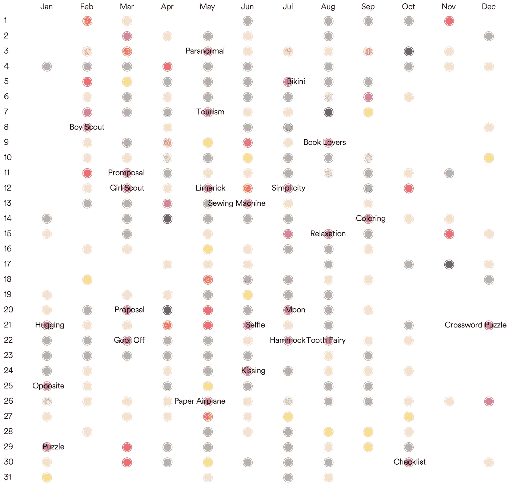

# 多余假期完全指南

> 原文：<https://towardsdatascience.com/the-complete-guide-to-superfluous-holidays-7be26f0a86db?source=collection_archive---------6----------------------->

从*全国鸡翅日*到*全国打扮你的宠物日*到*全国清理你的虚拟桌面* *日*，我不禁想知道到底有多少——其中一半听起来像是由你十几岁的表弟建立的，但同时它们听起来都是隐约必要的，甚至可能对一群特殊的人很重要。因此，今天我踏上了探索这些场合的旅程——公共假日的失败者。

**数据收集**

为了获得这些数据，我使用 rvest 礼貌地删除了一个名为 National Today 的[网站](https://nationaltoday.com/),该网站主要收集美国和一些全球的日期。这种场合被分为从活动到流行文化到职业生涯的广泛话题。

**可视化覆盖范围**

有了数据，我想看看一年有多少。

Color indicate number of occasions on a day

365 天中有 300 天被标记。这涵盖了一年的 82%!一月/十一月/十二月是平静期，三月/六月/九月每天都有事情发生。十二天中的每一天有多达三个场合，例如 3 月 6 日是国家牙医日、着装日和冷冻食品日。

**食物上的天数&饮料上的天数**

**活动天数**

**下一步**

一个可能的下一步是提取这些场合的社交媒体聊天，以了解人们这些天是如何观察的。

另一个方向是研究这些日子里某些物品的消费增加或相关的财务收益。中国 11 月 11 日的光棍节是近年来最热门的购物活动之一，去年的交易额达到 178 亿美元。值得研究一下某些场合是如何变得比其他场合更受欢迎的。

如果你想知道今天是什么日子，可以总结一下:今天是 day☕国际咖啡日，世界素食日🍅以及全国自制饼干日🍪。

这是我关于数据科学和视觉故事的[# 100 日项目](https://medium.com/@yanhann10)的第 63 天。数据集在 [Kaggle](https://www.kaggle.com/hanyan/unofficialholidays) 上可用，代码部分在我的 [github](https://github.com/yanhann10/opendata_viz) 上。感谢阅读。如果喜欢，请分享。欢迎新主题的建议和反馈。