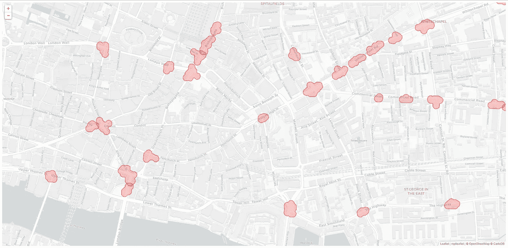
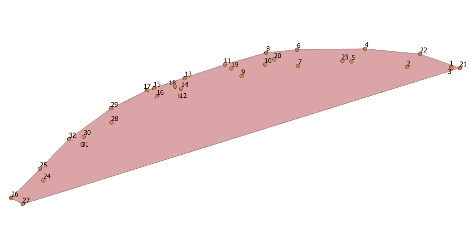
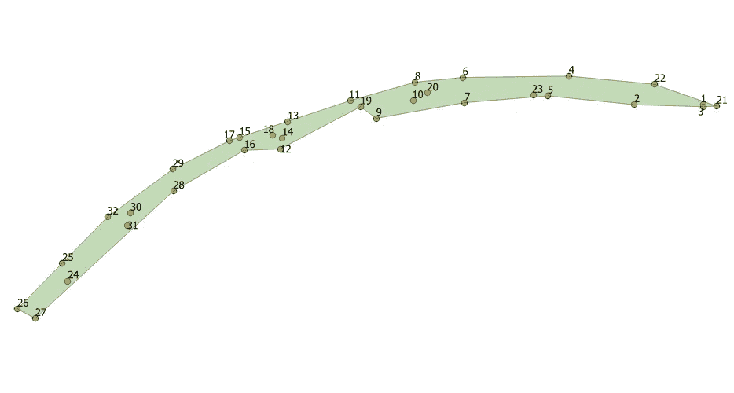
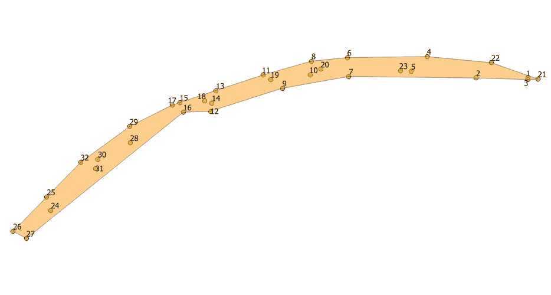
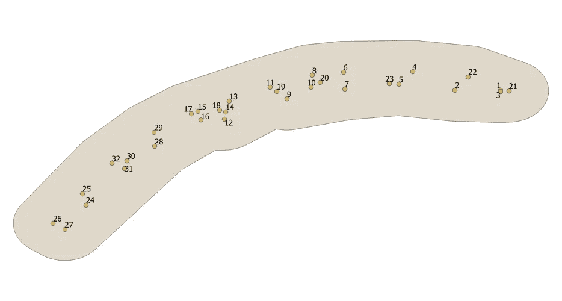

# 凹形船体

> 原文：<https://towardsdatascience.com/the-concave-hull-c649795c0f0f?source=collection_archive---------5----------------------->

使用一种 *K* 最近邻方法创建聚类边界


“white boat on green grass field under gray sky” by [Daniel Ian](https://unsplash.com/@danieliandotco?utm_source=medium&utm_medium=referral) on [Unsplash](https://unsplash.com?utm_source=medium&utm_medium=referral)

一个几个月前，我在 Medium 上写了一篇[文章](https://medium.com/@joao.figueira/mapping-the-uks-traffic-accident-hotspots-632b1129057b)描绘了英国的交通事故热点。我最关心的是演示地理数据上的 [DBSCAN](https://en.wikipedia.org/wiki/DBSCAN) 聚类算法的使用。在文章中，我使用了英国政府公布的交通事故地理信息。我的目的是运行一个基于密度的聚类过程来找到交通事故报告最频繁的区域。最终结果是创建了一组代表这些事故热点的地理围栏。

通过收集给定聚类中的所有点，您可以了解该聚类在地图上的样子，但是您将缺少一条重要的信息:聚类的外部形状。在这种情况下，我们讨论的是一个可以在地图上表示为地理围栏的闭合多边形。地理围栏内的任何点都可以被假设为属于该聚类，这使得该形状成为一条有趣的信息:您可以将它用作鉴别器函数。所有落在多边形内的新采样点都可以被认为属于相应的聚类。正如我在文章中暗示的那样，您可以使用这样的多边形来断言您的驾驶风险，通过使用它们来对您自己的采样 GPS 位置进行分类。

# 从云到多边形

现在的问题是，如何从构成特定集群的点云中创建一个有意义的多边形。我在第一篇文章中的方法有些天真，反映了我已经在生产代码中使用的解决方案。这个解决方案需要放置一个以每个聚类点为中心的圆，然后将所有的圆合并在一起，形成一个云状的多边形。结果不是很好，也不现实。此外，通过使用圆形作为构建最终多边形的基础形状，这些多边形将比更流线型的形状具有更多的点，从而增加了存储成本并使得包含检测算法运行更慢。



Cloud-shaped polygons

另一方面，这种方法具有计算简单的优点(至少从开发人员的角度来看)，因为它使用 [Shapely](https://shapely.readthedocs.io/en/latest/) 的`cascaded_union`函数将所有的圆合并在一起。另一个优点是多边形的形状是使用集群中的所有点隐式定义的。

对于更复杂的方法，我们需要以某种方式识别集群的边界点，这些点似乎定义了点云的形状。有趣的是，对于一些 DBSCAN 实现[1]，您实际上可以恢复边界点，作为聚类过程的副产品。不幸的是，这个信息(显然)在 SciKit Learn 的[2] [实现](http://scikit-learn.org/stable/modules/generated/sklearn.cluster.DBSCAN.html)上是不可用的，所以我们不得不凑合。

首先想到的方法是计算点集的[凸包](https://en.wikipedia.org/wiki/Convex_hull)。这是一个很好理解的算法，但是存在不能处理凹形的问题，就像这个:



The convex hull of a concave set of points

这种形状没有正确地抓住潜在点的本质。如果将其用作鉴别器，一些点会被错误地分类为在聚类内，而实际上它们并不在聚类内。我们需要另一种方法。

# 凹面外壳备选方案

幸运的是，除了这种情况还有其他选择:我们可以计算出一个凹壳。以下是凹面外壳应用于与上一幅图像中相同的一组点时的外观:



Concave Hull

或者这个:



A less concave hull

正如你所看到的，与凸包相反，点集的凹包并没有单一的定义。使用我在这里介绍的算法，你希望你的船体有多凹的选择是通过一个参数来完成的:*k*——在船体计算过程中考虑的最近邻居的数量。让我们看看这是如何工作的。

# 该算法

我在这里展示的算法是十多年前由葡萄牙米尼奥大学的阿德里亚诺·莫雷拉和玛丽贝尔·亚斯米娜·桑托斯描述的。从摘要来看:

> 本文描述了一种计算平面上一组点的包络的算法，该算法在非凸包上生成凸包，表示给定点所占据的区域。所提出的算法基于 k-最近邻方法，其中唯一的算法参数 k 的值用于控制最终解的“平滑度”。[…]

因为我将把这个算法应用于地理信息，所以必须做一些改变，即在计算角度和距离时[4]。但是这些并没有以任何方式改变算法的要点，该要点可以通过以下步骤来概括描述:

1.  找到具有最低 *y* (纬度)坐标的点，并使其成为当前点。
2.  找到距离当前点最近的第 k 个*点。*
3.  从 *k* 最近的点中，选择与前一角度最大右转相对应的点。这里我们将使用方位的概念，从 270 度的角度(正西[)开始。](https://www.youtube.com/watch?v=LNBjMRvOB5M)
4.  通过将新的点添加到增长线字符串，检查它是否不与自身相交。如果是这样，从 *k* 中选择另一个最近的点，或者用更大的 *k* 值重新开始。
5.  使新点成为当前点，并将其从列表中删除。
6.  在 *k 次*迭代之后，将第一个点添加回列表。
7.  循环到 2 号。

这个算法看起来很简单，但是有一些细节必须注意，特别是因为我们处理的是地理坐标。距离和角度的测量方法不同。

# 代码

这里我发布的是前一篇文章代码的改编版本。您仍然会发现相同的聚类代码和相同的云形聚类生成器。更新后的版本现在包含一个名为`geomath.hulls`的包，在这里可以找到`ConcaveHull`类。要创建凹面外壳，请执行以下操作:

在上面的代码中，`points`是一个维数为(N，2)的数组，其中行包含观察点，列包含地理坐标(*经度*，*纬度*)。生成的数组具有完全相同的结构，但只包含属于簇的多边形形状的点。某种过滤器。

因为我们将处理数组，所以将 NumPy 加入争论是很自然的。只要有可能，所有的计算都进行了适当的矢量化，并且在从数组中添加和删除项目时努力提高性能(剧透:它们根本没有移动)。缺失的改进之一是代码并行化。但那可以等。

虽然在翻译过程中做了一些优化，但我还是按照论文中公开的算法组织了代码。该算法是围绕许多子程序构建的，这些子程序已在论文中明确指出，所以我们现在就把它们放在一边。为了方便阅读，我将使用与论文中相同的名称。

**clean list[list of points]**—清理点列表在类构造函数中执行:

如您所见，出于性能原因，点列表被实现为 NumPy 数组。列表的清理在第 10 行执行，这里只保留唯一的点。数据集阵列由行中的观察值和两列中的地理坐标组成。请注意，我还在第 13 行创建了一个布尔数组，它将用于主数据集数组的索引，减轻了删除项目和偶尔添加项目的负担。我在 NumPy 文档中看到过这种叫做“mask”的技术，它非常强大。至于质数，我以后再讨论。

**FindMinYPoint【list of points】**—这需要一个小函数:

调用此函数时将数据集数组作为参数，并返回纬度最低的点的索引。注意，行是用第一列中的经度和第二列中的纬度编码的。

**RemovePoint[vector，e]
AddPoint[vector，e]** —由于使用了`indices`数组，这些都是无需动脑的。这个数组用于存储主数据集数组中的活动索引，因此从数据集中删除项目非常容易。

尽管论文中描述的算法要求在构成外壳的数组中添加一个点，但这实际上是通过以下方式实现的:

稍后，当线串被认为不相交时，`test_hull`变量将被赋回`hull`。但是我已经领先了。从数据集数组中移除一个点非常简单:

```
self.indices[current_point] = **False**
```

把它加回去只是把相同索引处的数组值变回 true。但是，所有这些便利都伴随着必须密切关注索引的代价。稍后将详细介绍。

**NearestPoints[listOfPoints，point，k]** —这里的事情开始变得有趣，因为我们不是在处理平面坐标，所以不用毕达哥拉斯，而用[哈弗辛](https://en.wikipedia.org/wiki/Haversine_formula):

注意，第二个和第三个参数是数据集格式的数组:第一列是经度，第二列是纬度。如您所见，该函数返回第二个参数中的点和第三个参数中的点之间的距离(以米为单位)数组。一旦我们有了这些，我们就可以用最简单的方法得到最近的邻居。但是有一个专门的功能，值得解释一下:

该函数首先创建一个包含基本索引的数组。这些是尚未从数据集数组中移除的点的索引。例如，如果在一个十点集群上，我们从移除第一个点开始，基本索引数组将是[1，2，3，4，5，6，7，8，9]。接下来，我们计算距离并对结果数组索引进行排序。第一个 *k 个*被提取，然后被用作检索基本索引的掩码。这有点扭曲，但很管用。如您所见，该函数返回的不是坐标数组，而是数据集数组的索引数组。

**SortByAngle[listOfPoints，point，angle]**——这里有更多的麻烦，因为我们不是在计算简单的角度，我们是在计算[方位](https://en.wikipedia.org/wiki/Bearing_(navigation))。这些被测量为正北零度，角度顺时针增加。以下是计算方位的核心代码:

该函数返回一个方位角数组，该数组从索引位于第一个参数中的点开始测量，直到索引位于第三个参数中的点为止。排序很简单:

此时，候选数组包含按方位降序排序的第 *k* 个最近点的索引。

IntersectQ[lineSegment1，lineSegment2] —我没有使用自己的线相交函数，而是求助于 [Shapely](https://github.com/Toblerity/Shapely) 。事实上，在构建多边形时，我们实际上是在处理一个线串，即追加与前面的线不相交的线段。对此的测试很简单:我们选择正在构建的外壳数组，将其转换为形状良好的线串对象，并测试它是否简单(非自相交)。

简而言之，如果一个形状良好的行字符串自交叉，它就会变得复杂，因此`is_simple`谓词会变为 false。简单。

PointInPolygon[point，listOfPoints] —这是最难实现的一个。请允许我通过查看执行最终外壳多边形验证的代码来解释(检查是否所有的聚类点都包含在多边形中):

Shapely 用于测试相交和包含的函数应该足以检查最终的外壳多边形是否与所有聚类的点重叠，但事实并非如此。为什么？Shapely 是坐标不可知的，因此它将以与笛卡尔平面上的坐标完全相同的方式处理以纬度和经度表示的地理坐标。但是当你生活在一个球体上时，世界会有不同的表现，而且沿测地线的角度(或方位)不是恒定的。参考文献[4]中连接巴格达和大阪的测地线的例子很好地说明了这一点。碰巧的是，在某些情况下，该算法可以基于方位角标准包括一个点，但是后来，使用 Shapely 的平面算法，该点被认为稍微超出了多边形。这就是小距离修正的作用。

我花了一段时间才想明白。我的调试帮助是 [QGIS](https://www.qgis.org/en/site/) ，一个伟大的自由软件。在可疑计算的每一步，我都会将 [WKT](https://en.wikipedia.org/wiki/Well-known_text) 格式的数据输出到一个 CSV 文件中，作为一个层读入。真正的救命恩人！

最后，如果多边形未能覆盖所有聚类的点，唯一的选择是增加 *k* 并重试。这里我补充了一点自己的直觉。

# 质数 k

该文章建议将 *k* 的值增加 1，并从头开始再次执行该算法。我对这个选项的早期测试不是很令人满意:在有问题的集群上运行时间会很慢。这是由于 k 的缓慢增长，所以我决定使用另一个增长计划:质数表。该算法已经从 k = 3 开始，所以很容易扩展到一系列素数。这是您在递归调用中看到的情况:

我对质数情有独钟，你知道…

# 爆炸

由该算法生成的凹壳多边形仍然需要一些进一步的处理，因为它们将仅辨别壳内部的点，而不是接近壳的点。解决方案是给这些瘦的簇添加一些填充。这里我使用了和以前完全一样的技术，看起来是这样的:



Buffered concave hull

在这里，我使用了 Shapely 的`buffer`函数来完成这个技巧。

该函数接受一个形状良好的多边形，并返回其自身的放大版本。第二个参数是添加的填充半径，单位为米。

# 运行代码

首先将代码从 [GitHub 库](https://github.com/joaofig/uk-accidents)中提取到您的本地机器中。你要执行的文件在主目录下的`ShowHotSpots.py`。首次执行时，该代码将读入 2013 年至 2016 年英国交通事故数据，并对其进行聚类。然后将结果缓存为 CSV 文件，供后续运行使用。

然后，您将看到两个地图:第一个是使用云状聚类生成的，而第二个使用这里讨论的凹形聚类算法。当多边形生成代码执行时，您可能会看到一些失败的报告。为了帮助理解为什么算法不能创建凹面外壳，代码将集群写到 CSV 文件的`data/out/failed/`目录中。通常，您可以使用 QGIS 将这些文件作为图层导入。

本质上，当该算法没有找到足够的点来“环绕”该形状而不自交时，该算法会失败。这意味着您必须准备好丢弃这些簇，或者对它们应用不同的处理(凸包或合并的气泡)。

# 凹度

它是一个包裹。在本文中，我提出了一种后处理 DBSCAN 生成的地理聚类成凹形的方法。与其他方法相比，该方法可以为聚类提供更好的外部多边形拟合。

感谢您的阅读，并享受修改代码的乐趣！

# 参考

[1] Kryszkiewicz M .，Lasek P. (2010) TI-DBSCAN:通过三角形不等式使用 DBSCAN 进行聚类。载于:Szczuka M .、Kryszkiewicz M .、Ramanna S .、Jensen R .、Hu Q .(编辑)粗集和计算的当前趋势。RSCTC 2010。计算机科学讲义，第 6086 卷。施普林格，柏林，海德堡[ [施普林格链接](https://link.springer.com/chapter/10.1007/978-3-642-13529-3_8)

[2][sci kit-learn:Python 中的机器学习](http://jmlr.csail.mit.edu/papers/v12/pedregosa11a.html)，Pedregosa *等人*，JMLR 12，第 2825–2830 页，2011 年

[3] Moreira，A .和 Santos，M.Y .，2007 年,《凹壳:计算一组点所占据区域的最近邻法》*K*

【4】[计算经纬度点之间的距离、方位等](https://www.movable-type.co.uk/scripts/latlong.html)

[5] [GitHub 资源库](https://github.com/joaofig/uk-accidents)