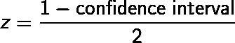
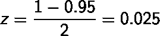
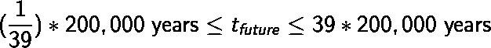
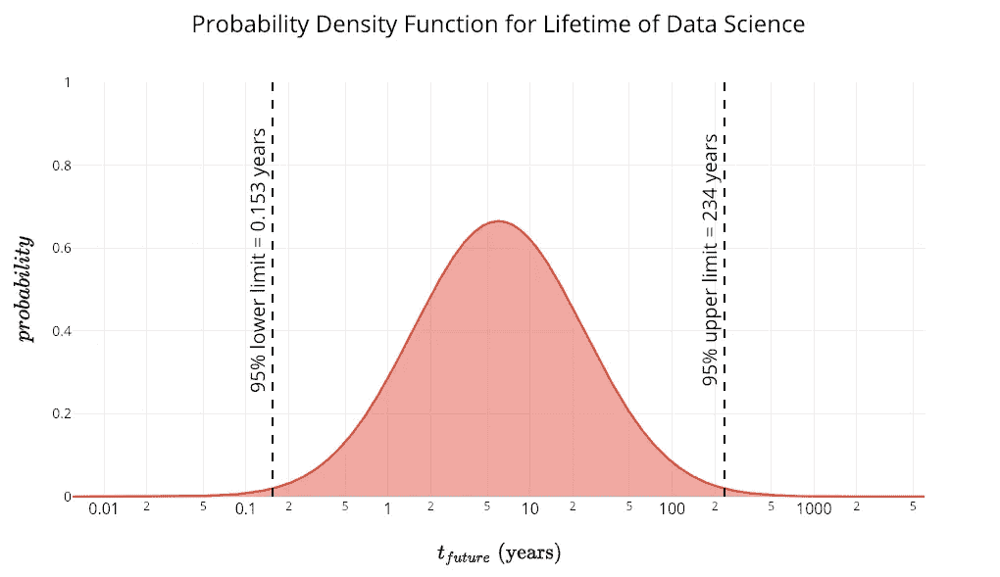
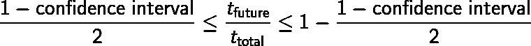
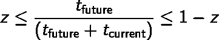

# 哥白尼原理以及如何使用统计学来计算任何事物持续的时间

> 原文：<https://towardsdatascience.com/the-copernican-principle-and-how-to-use-statistics-to-figure-out-how-long-anything-will-last-9cceb7aba20a?source=collection_archive---------2----------------------->

([Source](https://www.pexels.com/photo/time-lapse-photo-of-stars-on-night-924824/))

## 统计学、生命周期方程以及数据科学何时终结

对天文学的追求是一个逐渐发现人类渺小的过程。我们从宇宙的[中心](https://en.wikipedia.org/wiki/Geocentric_model)出发，宇宙确实围绕着我们旋转。然后我们[被粗暴地归为围绕太阳运行的](https://en.wikipedia.org/wiki/Heliocentrism) [8](https://www.space.com/2791-pluto-demoted-longer-planet-highly-controversial-definition.html) 颗行星中的颗，后来发现太阳只是我们银河系中数十亿颗恒星中的[颗(而不是](https://www.google.com/search?q=stars+in+our+galaxy&oq=stars+in+our+g&aqs=chrome.0.0j69i57j0l4.3921j1j4&sourceid=chrome&ie=UTF-8)[甚至不是一颗大恒星](https://www.schoolsobservatory.org/learn/astro/stars/class/starsize))。

这个星系，雄伟的[银河系](https://www.space.com/19915-milky-way-galaxy.html)，看起来令人印象深刻，直到[哈勃发现天空中所有那些模糊的物体](https://amazing-space.stsci.edu/resources/explorations/groundup/lesson/scopes/mt_wilson/discovery.php)都是数十亿个*其他*星系，每个星系都有数十亿颗恒星([潜在地拥有它们自己的智慧生命](http://www.hawking.org.uk/life-in-the-universe.html))。随着数学家和物理学家得出结论[宇宙是统称为](https://www.space.com/18811-multiple-universes-5-theories.html)[多元宇宙](https://en.wikipedia.org/wiki/Multiverse)的*无限宇宙* 中的一个，这种降级在 21 世纪还在继续。

Go [here](https://www.eso.org/public/images/eso1242a/zoomable/) to be blown away

除了被降级到宇宙中越来越小的部分之外，现在一些思想家[声称我们生活在一个模拟世界](https://www.simulation-argument.com/simulation.html)，并且很快将创造我们*自己的模拟世界*。所有这些都很难说*我们* *并不特别*。地球，乃至人类，在宇宙中并不占据优势地位的观点被称为[哥白尼原理](https://en.wikipedia.org/wiki/Copernican_principle)。

虽然哥白尼原理首次用于我们的物理位置——x、y 和 z 坐标——1993 年，J·理查德·戈特应用了我们不是宇宙第四维*、*、**时间**的特殊观察者的概念。在“哥白尼原理对我们未来前景的影响”(200 美元[这里](https://www.nature.com/articles/363315a0)或免费通过有争议的法律科学中心[这里](https://sci-hub.tw/10.1038/363315a0))中，戈特解释说，如果我们假设我们没有占据历史上*一个独特的时刻*，我们可以使用一个基本方程来预测任何现象的寿命。

## 哥白尼寿命方程

这个等式简单明了(推导见文章末尾),就是:

其中 *t_current* 是某物已经存在的时间量， *t_future* 是它从现在开始将持续的预期时间量，*置信区间*表示我们在估计中有多确定。这个等式是基于一个简单的想法:我们不存在于一个独特的时刻，因此，当我们观察一个事件时，我们最有可能看的是中间，而不是开始或结束。

You are most likely not at the beginning or end of an event but in the middle ([Source](https://www.washingtonpost.com/news/wonk/wp/2017/10/06/we-have-a-pretty-good-idea-of-when-humans-will-go-extinct/?utm_term=.4411e2585021)).

和任何方程一样，弄清楚它是如何工作的最好方法是输入一些数字。让我们把这个应用到一些简单的事情上，比如说人类的一生。我们将使用 95%的置信区间，并假设现代人类已经存在了 20 万年。输入数字，我们得到:

关于人类将存在多久的经典晚宴问题(好吧，只有我参加的晚宴)的答案是 5130 到 780 万年，有 95%的把握。这与[的实际证据](https://simple.wikipedia.org/wiki/Extinction)非常吻合，该证据显示哺乳动物物种的平均寿命约为 200 万年，[尼安德特人的平均寿命为 30 万年，直立人的平均寿命为 160 万年](https://www.newyorker.com/magazine/1999/07/12/how-to-predict-everything)。

这个等式的巧妙之处在于，它可以应用于任何事情，而仅仅依靠统计数据，而不是试图解开复杂的潜在原因网。一个电视节目持续多长时间，一项技术的生命周期，或者一家公司存在的时间长度，都受到许多因素的影响，这些因素是不可能区分开来的。我们可以利用*时间*(时间的别称)哥白尼原理，对任何现象的寿命做出合理的估计，而不是挖掘所有的原因。

为了将这个等式应用于离家更近的东西，数据科学，我们首先需要找到该领域当前的生命周期，根据《哈佛商业评论》发布的文章[“数据科学家:21 世纪最性感的工作”](https://hbr.org/2012/10/data-scientist-the-sexiest-job-of-the-21st-century)，我们将它定为 6 年。然后，我们使用这个等式找到我们可以预期的，有 95%的信心，**数据科学至少还会存在 8 周，最多 234 年。**

如果我们想要一个更窄的估计，我们减少我们的置信区间:在 50%，我们得到 2 到 18 年。

> 这说明了统计学中的一个重要观点:如果我们想提高精度，就必须牺牲准确性。较小的置信区间不太可能是正确的，但它为我们的答案提供了一个较窄的范围。

如果你想玩数字游戏，这里有一个 [Jupyter 笔记本](https://github.com/WillKoehrsen/Data-Analysis/blob/master/copernican/Copernican%20Time%20Principle.ipynb)。

## 正确、原子弹和外卖

你可能会反对这个等式的答案过于宽泛，这一点我承认。然而，我们的目标并不是得到一个单一的数字——几乎没有任何情况下，即使使用最好的算法，我们也能找到一个确定的数字——而是找到一个合理的范围。

我喜欢把**哥白尼寿命方程**想象成[费米估算](https://en.wikipedia.org/wiki/Fermi_problem)，一种以物理学家恩利克·费密命名的信封式计算的背面。1945 年，[费米仅仅用一些纸片估算了三位一体原子弹试验的当量](http://www.lanl.gov/science/weapons_journal/wj_pubs/11nwj2-05.pdf)，误差在 2 以内！同样，我们可以用这个等式来得到一个现象寿命的合理估计值。

使用哥白尼原理来发现某物存在的时间有两个重要的教训，一个是技术上的，一个是哲学上的:

1.  我们可以利用统计学快速获得不受人为因素影响的客观估计。(还有，统计也能过瘾！)
2.  一个很好的事物持续时间的第一近似值是它已经持续了多长时间

关于第一点，如果你想知道一场百老汇秀会持续多长时间，你从哪里开始收集数据呢？你可以看看评论，演员的名声，甚至剧本中的对话来决定吸引力，并计算出这部剧还会持续多久。或者，你可以像 Gott 那样，应用他的简单等式，正确预测百老汇 44 场秀中 42 场的运行时间。

> 当我们考虑单个数据点时，很容易迷失在细节中，并误解人类行为的某些方面。有时候，我们需要退一步，抽象出所有的细节，应用基本的统计学，而不是试图弄清楚人类的心理。

关于后一点，正如纳西姆·塔勒布在他的书《抗脆弱》中指出的，要想知道一个不易腐烂的东西——比如一个想法或者一件艺术品——会存在多久，最简单的方法就是看看它目前的寿命。换句话说，一项技术的未来寿命与其过去寿命成正比。

这被称为“林迪效应”,稍加思考就会明白:一个已经存在了很长时间的概念——书籍作为交换信息的媒介——一定有其存在如此之久的原因，而且我们可以预计它将持续到很久以后。另一方面，一个新想法——谷歌眼镜——在统计上不太可能存活，因为每天都有大量的新概念出现。

> 此外，已经有 100 年历史的公司——卡特彼勒(T0)公司(T1)——肯定在做正确的事情，我们可以预计它们比初创公司(T2)公司(Theranos)公司(T3)存在的时间更长，后者没有证明它们满足了需求。

再举一个更能说明哥白尼生命方程的例子，想想你一小时前发的精彩推特。统计数据告诉我们，这将在 *90 秒到不到 2 天*之间。另一方面，[最古老的英语故事，*贝奥武夫*](https://en.wikipedia.org/wiki/Beowulf) ，至少从现在起 26 年后，直到未来 39000 年后，仍然会被无聊的学生阅读。更重要的是，这个故事不会在虚拟现实中体验到——消费者虚拟现实还有 73 天到 311 年——而是在最持久的媒体形式上，书籍，它还有 29.5 到 45000 年的统治期。

有些人可能认为哥白尼原理——时间和空间——是一场悲剧，但我觉得它令人兴奋。就像我们只有在抛弃了地心说模型之后才意识到宇宙的惊人壮观一样，一旦我们放弃了我们的时代是特殊的、我们处于人类顶峰的神话，可能性是巨大的。是的，我们现在在宇宙尺度上可能是微不足道的，但是 5000 年后，我们的祖先——或者可能是我们——将会扩展到整个银河系，甚至从根本上改变银河系。

正如大卫·多伊奇在他的书《现实的结构》中指出的那样，只要有足够的时间，任何不被物理定律所禁止的事情都会被人类实现。与其担心你现在应该做的工作毫无意义，不如把它看作是对人类已经开始的伟大努力的贡献。我们目前受制于哥白尼原理，但也许人类真的不同:毕竟，我们是进化出思考我们在宇宙中的位置的能力的恒星。

## 来源:

1.  [哥白尼原理对我们未来前景的影响](https://www.nature.com/articles/363315a0)
2.  [如何预测一切](https://www.newyorker.com/magazine/1999/07/12/how-to-predict-everything)
3.  [我们很清楚人类何时会灭绝](https://www.washingtonpost.com/news/wonk/wp/2017/10/06/we-have-a-pretty-good-idea-of-when-humans-will-go-extinct/)
4.  [哥白尼原理:如何预测任何事情](https://fs.blog/2012/06/how-to-predict-everything/)

## 衍生物

哥白尼寿命方程的推导如下。任何事物的总寿命是当前寿命加上未来寿命:

如果我们不相信我们的时间位置是有特权的，那么我们对一个现象的观察既不发生在开始也不发生在结束:

对 z 进行如下替换:

插入总寿命的定义，得到:

然后求解未来有生之年的任何现象:

在置信区间为 95%的情况下，我们得到乘法因子 1/39 和 39；置信区间为 50%时，因子为 1/3 和 3；对于 99%的置信度，我们的因子变成 1/199 和 199。

你可以在这个 [Jupyter 笔记本](https://github.com/WillKoehrsen/Data-Analysis/blob/master/copernican/Copernican%20Time%20Principle.ipynb)里摆弄方程式。另外，看看 Gott 的原始[论文](https://sci-hub.tw/10.1038/363315a0)了解更多细节。

一如既往，我欢迎建设性的批评和反馈。可以在 Twitter [@koehrsen_will](http://twitter.com/@koehrsen_will) 上找到我。