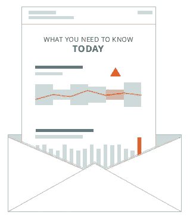

# 解决分析过载的方法

> 原文：<https://towardsdatascience.com/the-cure-for-analytics-overload-fefeb7529ea3?source=collection_archive---------10----------------------->

> 你知道你花了多少时间试图在你的指标中找到意义吗？如果有更好的方法呢？

早上你坐在办公桌前，手里拿着咖啡，准备开始工作。你用仪表板开始你的一天，检查事情进展如何。实际上，您可以查看一些仪表板，因为一个仪表板无法涵盖您的全部业务。和一些电子表格。你看着它们——然后你做了很多思考。你问自己，这个指标看起来对吗？你将它与你认为它应该是什么样子的，以及你认为它去年是什么样子的进行比较。你上周不是开展了一场新的营销活动吗？这肯定会改变数字。你强调正在发生什么事情，以及该向谁询问。

听起来熟悉吗？如果是这样，你并不孤单。事实上，你的经历和今天的大多数商业领袖是一样的。

您使用几十种不同的软件工具，每一种都会产生无数的度量标准，其中任何一种都可能在任何时候指出问题或机会。这些仪表板有些是电子表格，有些是图表，但所有这些都需要研究才能提取价值。试图从数字中获得洞察力所浪费的时间是惊人的。如果您每天浏览 4 到 5 个仪表盘，然后花几个小时参加仪表盘驱动状态/规划会议，那么您每周大约要花 6 个小时来检查指标。这占了你一周时间的 15%,只是想弄清楚到底发生了什么！在一年的时间里，加起来超过 300 个小时，几乎是你两个月的时间。

有更好的方法。机器学习正在开启一种新形式的商业智能，称为[商业分析自动化](http://outlier.ai/2017/04/04/the-end-of-business-intelligence/)。您无需从仪表板、电子表格和数字中开始一天的工作，只需一次更新，您就可以将所有重要的业务见解发送到收件箱中。在花五分钟阅读你的更新后，你会知道当天你需要改善业务的一切。

想象一下这将如何加速您的业务。不要试图找出哪些营销活动有效或无效，你会立即知道你应该在哪些方面加大投入或减少投入。如果您的客户行为发生变化，您不必试图找出原因，您将实时了解原因和影响。不要等着你的收入下降并试图找出原因，只要出现收入问题，你就会知道，并在它变成危机之前采取行动阻止它。

你可能认为这项技术还需要几年的时间，但这个世界已经到来，公司今天已经在利用自动化分析。像 Outlier 这样的软件应用程序将公司从试图从数据中提取洞察力的负担中解放出来，从而节省了时间和金钱。相反，他们利用这些见解在很短的时间内推动更好的业务决策。

您准备好看到自动化分析每周为您节省 6 个小时了吗？[让我们知道](http://outlier.ai/request-a-demo/)。