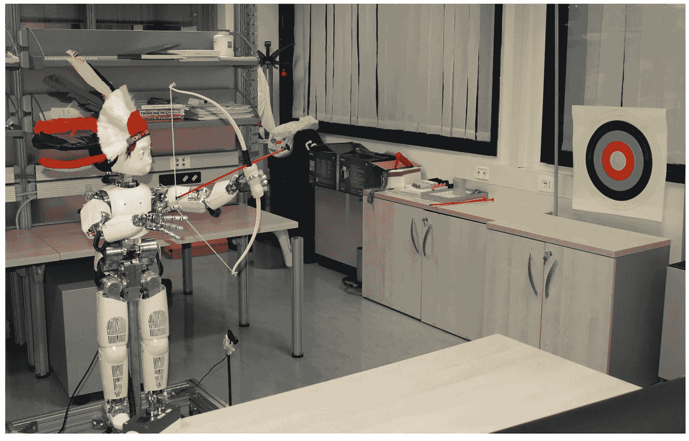

# 人工智能的当前趋势

> 原文：<https://towardsdatascience.com/the-current-trends-in-artificial-intelligence-198a80e820c5?source=collection_archive---------5----------------------->

除非你生活在岩石下，否则你会看到过多的文章，让你相信人工智能革命已经到来，而且会持续下去。当我们试图理解这些说法背后的一些理论时，会有更多的文章试图通过阴谋末日理论在非专业观众中制造恐慌。当对人工智能不能做什么缺乏理解时，就会对人工智能能做什么产生恐惧。我认为了解人工智能领域的技术现状很重要。

最近，我有机会参加在澳大利亚悉尼举行的 2017 年机器学习国际会议(ICML)。作为一个著名的人工智能会议，有几个令人惊讶的演讲者介绍了人工智能各个子领域的最新进展。在本文的其余部分，我将讨论一些研究论文，这些论文突出了这些子领域中的一个主题。鉴于我参加会谈的时间有限，这些主题是基于我的观察。然而，为了这篇文章的简洁，在回顾这些趋势之前，我没有提到任何子领域的基础知识。因此，需要熟悉这些子领域的概念才能理解。

# **1)强化学习及其现实应用**

[http://www.mdpi.com/robotics/robotics-02-00122/article_deploy/html/images/robotics-02-00122-g009.png](http://www.mdpi.com/robotics/robotics-02-00122/article_deploy/html/images/robotics-02-00122-g009.png)

当一个代理被部署在现实世界中时，它可能热衷于探索它的环境，但是它需要遵循某些约束，以便服从该环境的限制。来自 Berkeley AI Research (BAIR)的一个团队展示了他们名为[的受限策略优化(CPO)](https://arxiv.org/abs/1705.10528) 的工作，该工作为策略搜索引入了由安全驱动的约束。它有许多应用，在探索时可以确保安全。此外，BAIR 发表了[一篇文章解释他们在 CPO 上的工作](http://bair.berkeley.edu/blog/2017/07/06/cpo/)。

如果代理/机器人被非技术所有者购买，她应该能够通过提供反馈来培训代理。[麦格拉申等人。al](https://arxiv.org/abs/1701.06049) 提出了人类的收敛行动者批评(蔻驰)，这是一种从依赖于政策的反馈中学习的算法，用于利用非技术用户提供的反馈来训练代理/机器人。他们证明，蔻驰也可以在有噪声图像的物理机器人上学习多种行为。

以便进行任何人类活动，如烹饪、家务等。RL 代理需要执行长指令序列，并对新的看不见的子任务进行归纳。有时，会有其他意想不到的指示，如电池电量不足等。，它需要一个偏差来完成剩下的子任务。为了实现这些目标。al 已经提出了一种通用的方法，它采用自然语言的任务序列，并且主要是顺序地执行子任务。他们分两步解决了这个问题:1)学习执行子任务的技能和基于类比的概括框架。2)确定子任务执行顺序的元控制器。与现有的工作不同，他们的架构通用性很好，还能处理意想不到的子任务。

为了完成多组任务，我们需要一个策略，既能理解子任务，又能在完成任务的同时优化整体回报。通常，代理不会因为完成子任务而立即获得奖励。[安德里亚斯等人。al](https://arxiv.org/abs/1611.01796) 提出了一个在多任务环境中学习深度子策略的框架。该算法仅由高层行为的抽象草图指导。

# 2)深度学习优化

为了正则化深度神经网络，使用了几种方法，如批量归一化、白化神经网络(WNN)。为了应用白化，构建协方差矩阵和求解 SVD 的计算开销成为瓶颈。[平罗](http://personal.ie.cuhk.edu.hk/~pluo/pdf/pluoICML2017.pdf)提出的工作试图通过一种称为广义白化神经网络(GWNN)的新方法来克服 WNN 的局限性，这种方法通过紧凑的表示来减少计算开销。

Budden 等人研究了硬件实现 ConvNets 的高维张量核的局限性。al 。他们提出了一种 Winograd 风格的更快的计算，用于为 CPU 优化的更高维度。他们将自己的算法与支持 AVX 和英特尔 MKL 优化库的流行框架(如 Caffe、Tensorflow)进行了基准测试，并得出了一个有趣的结论，即当前的 CPU 限制主要是由于软件而不是硬件。

扩展快速计算类，如 FFT、Winograd、 [Cho 和 Brand](https://arxiv.org/pdf/1706.06873.pdf) 提出了一种内存高效计算(MEC ),它降低了内存需求并改进了卷积过程。MEC 采用滚动的列子集，并将其扩展为行，以形成一个更小的矩阵。这个过程与核矩阵乘法一起重复，以产生有效的计算。

随着特征映射数量的增加，冗余增加，导致低效的存储器使用。[王等人。al](http://proceedings.mlr.press/v70/wang17m/wang17m.pdf) 提出了一种称为 RedCNN 的方法，该方法试图通过保留固有信息并降低特征图之间的相关性来降低特征图的维度。他们使用循环矩阵进行投影，从而提高了训练速度和映射速度。

梯度之间的相关性随着网络中的深度缓慢衰减，导致梯度表现为白噪声。这些[粉碎梯度](https://arxiv.org/abs/1702.08591)主要在前馈网络中观察到，然而跳跃连接网络是有抵抗力的。作者提出了 Looks 线性(LL)初始化，它解决了前馈网络中的粉碎梯度，而不增加任何跳跃连接。

# 3)深度学习应用

识别睡眠模式将有助于诊断睡眠障碍，从而提供更好的医疗保健。然而，现有的识别睡眠模式的方法涉及使用大量附着在患者身体上的传感器，并且通常在医院或实验室中进行。实验设置本身会使患者经历睡眠困难，从而导致测量不可靠。麻省理工学院的一个[团队进行了一项研究，在病人身上没有任何传感器的情况下，使用无线射频(RF)信号来识别睡眠模式。他们使用 CNN-RNN 组合来识别睡眠阶段预测的模式。然而，RF 信号会受到环境中任何附近源反射的噪声的影响。因此，他们增加了一种对抗性训练，这种训练会丢弃任何个体特有的无关信息，但保留预测睡眠阶段所需的有用信息。他们已经取得了明显好于使用手工制作的信号特征的现有最先进水平(大约 64%)的结果(大约 80%)。](http://sleep.csail.mit.edu/files/rfsleep-paper.pdf)

来自百度的团队展示了他们在[深度语音](https://arxiv.org/abs/1702.07825)方面的工作，这是一种端到端的神经语音合成。他们详细介绍了五个主要的构建模块，包括使用 Wavenet 的变体将音素转换为音频合成。由于他们的整个架构是由神经网络驱动的，因此他们的系统比现有的文本到语音转换系统更加灵活。他们还描述了优化的 Wavenet 推断，与现有实现相比，可以实现高达 400 倍的加速。

# **4)元学习**

模型不可知元学习(MAML)由[芬恩等人提出。al](https://arxiv.org/pdf/1703.03400.pdf) 创建了一个元学习模型，其参数是从任务分布的随机抽样中学习到的。这种模型可以使用少量的训练样本和迭代快速适应新的任务，这通常被称为少镜头学习。作者还演示了 MAML 在分类、回归和强化学习任务中的应用。

[Cortes 等人提出了一篇关于学习网络结构和权重的有趣论文。al](https://arxiv.org/abs/1607.01097) 。这种被称为 AdaNet 的方法通过增加网络的深度来学习网络结构。新网络的 k^th 层连接到现有网络的 k^th 和 k-1^th 层。通过比较它们在经验损耗函数和正则化参数上的性能来选择网络架构。

[威奇罗夫斯卡等人。al](https://arxiv.org/abs/1703.04813) 介绍了一种学习型梯度下降优化器，它可以在减少内存和计算需求的情况下推广到新任务。他们在定义优化器时使用了分层的 RNN 架构，它在 MNIST 数据集上的表现优于 RMSprop/Adam。

# 5)顺序建模

音段结构是许多序列中的一种自然模式，如人类语言中的短语或字母组，用于识别音位规则。[王等人。al](https://arxiv.org/pdf/1702.07463.pdf) 提出了一种通过分段的序列建模方法。他们已经使用 LSTM 学习了片段结构，并且通过限制搜索空间和进一步探索片段的结构来搜索可能片段的空间。

脸书人工智能研究所(FAIR)使用[卷积进行序列到序列学习](https://arxiv.org/pdf/1705.03122.pdf)的流行实现在 ICML 2017 上吸引了很多关注。他们使用多层卷积创建了分层结构，从而复制了在传统的基于 LSTM 的架构中捕获的长程相关性。他们还在每个解码层使用门控线性单元、剩余连接和注意力。

[Bamler 等人研究了单词嵌入的时间演化。al](https://arxiv.org/pdf/1702.08359.pdf) 在他们题为“动态单词嵌入”的论文中。在他们的方法中，他们将跳跃图扩展到概率动态跳跃图，以模拟具有潜在时间序列的连续文本数据。他们的方法的主要贡献是使用卡尔曼滤波器作为潜在嵌入的先验。这允许他们在任何时候都可以共享信息，同时允许嵌入内容自由移动。

# **6)机器学习优化**

来自微软印度研究院的一个团队已经提出了强大的基于树的模型，可以帮助在像物联网这样的资源受限设备中运行机器学习，只有 [2 KB RAM](http://manikvarma.org/pubs/kumar17.pdf)

对于分类问题，通常梯度增强决策树(GBDT)表现相对较好。然而，当多标记分类的输出空间变得高维和稀疏时，GBDT 算法会遇到内存问题和长运行时间。以便具有更好的预测时间和减小的模型尺寸。al 提出了 GBDT 稀疏算法来处理高维稀疏数据。

# **7)创成式模型应用**

来自 Google Brain 的团队提交了一篇关于使用 Wavenet 自动编码器进行音频合成的论文。他们的主要贡献是 Wavenet 自动编码器架构，该架构包括建立在扩展卷积上的时间编码器，该编码器利用时间和信道的独立维度对隐藏码序列进行编码。此外，他们还引入了 NSynth 数据集，该数据集包含来自约 1k 种乐器的约 300k 个带注释的音符。

对像用户浏览历史这样的顺序数据建模具有很大的动作空间，其中许多动作具有相似的意图或主题。像 LSTM 这样的递归神经网络需要许多参数来模拟这样的数据，使得模型非常难以解释。然而，像 LDA 这样的模型可以模拟这种顺序数据，并且是可解释的，但是性能并不比 LSTMs 好。为了克服这些限制，Zaheer 等人。a l 提出了一种结合层次贝叶斯模型和 LSTMs 的用户建模潜在 LSTM 分配(LLA)。

由 [Rippel 和 Bourdev](https://arxiv.org/pdf/1705.05823.pdf) 提出的图像压缩算法使用 GANs 代替自动编码器。提出的解决方案包括金字塔分解编码器，提取不同尺度的图像特征。使用量化、位平面分解、算术编码和码长正则化将提取的特征分解成相等大小的仓。接下来是通过对抗训练进行现实重建。

# **8)自然语言生成架构**

为了克服判别模型在自然语言文本生成中的局限性，Wen 等。al 提出了一个[潜在意图对话模型](https://arxiv.org/pdf/1705.10229.pdf)，用于使用潜在变量学习意图，然后组成适当的机器响应。本文背后的关键思想是将潜在意图分布表示为反映人类决策的内在策略，并使用基于策略梯度的强化学习来学习。

[胡等人提出了一种使用潜在语义结构的自然语言生成方法。他们使用 VAEs 生成基于潜在属性代码的文本样本。使用每个代码的单独鉴别器来学习属性代码，该鉴别器使用 softmax 近似来测量生成的样本和期望属性之间的匹配。](https://arxiv.org/pdf/1703.00955.pdf)

# **9)高效的在线学习**

对于在线多类 bandit 算法，Banditron 以前的工作虽然计算效率高，但只实现了 O(T^2/3 预期的遗憾。这是次优的，因为 Exp4 算法对于 0-1 的损失实现了 O(T^1/2 遗憾。[贝格尔齐默等人。al](https://arxiv.org/pdf/1702.07958.pdf) 曾用 O(T^1/2 提出了一个高效的在线强盗多类学习)遗憾。

多武装匪徒的环境评估是一个棘手的问题，因为在线评估的成本太高，无法评估不同的政策，而非政策评估方法在估计中存在差异。虽然存在诸如逆倾向分数(IPS)的方法，其给出了对 MSE 的良好估计，但是它们在选择行动时没有考虑背景信息。作者[王等人。al](https://arxiv.org/abs/1612.01205) 提出了一个算法开关，它有效地使用了奖励模型和 IPS，与之前的工作相比，方差减少了。

# 10)基于图形的算法

许多现有的从数据生成知识图的方法认为该图是静态快照。在由[特里维迪等人发表的作品中。al](https://arxiv.org/pdf/1705.05742.pdf) 他们已经证明了知识图是随时间演化的，并且他们已经开发了一个多维点流程来为演化的知识图建模。

仅从节点访问计数识别转移概率可以帮助理解用户的导航行为。[梅斯特雷等人。al](https://arxiv.org/abs/1610.06525) 提出了 ChoiceRank，这是一种迭代算法，可以通过只观察节点级流量来学习边缘转移概率。

在 ICML 2017 年会上还有很多有趣的论文和海报，我不可能用一篇文章来概括。我与一些来自工业界和学术界的顶尖人物会面，度过了一段美好的时光。

如果有任何需要修改的地方，请务必通知我。另外，我很乐意谈论这些研究论文中的任何一篇。如果你想进一步讨论，请给我发邮件到 gsk.krishna@gmail.com。