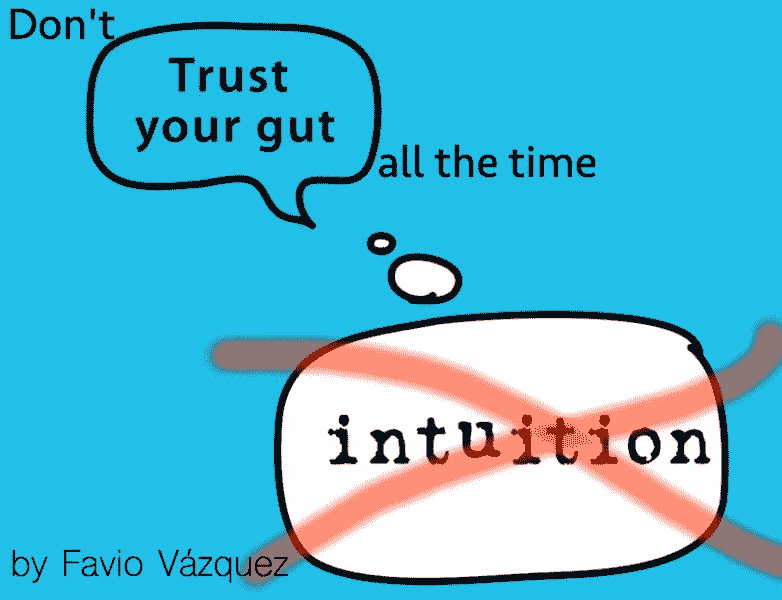
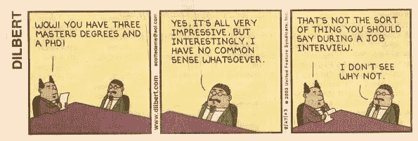
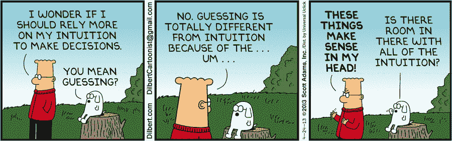

# 数据科学中“直觉”的诅咒

> 原文：<https://towardsdatascience.com/the-curse-of-intuition-in-data-science-552bc28c55e5?source=collection_archive---------5----------------------->

## 我们习惯很快就下结论，而不分析所有方面。因此，当试图理解世界时，直觉经常失败。在这里，我提出了一个不同的系统来做数据科学，而不是“相信你的直觉”。

免责声明:我不是以常识或直觉专家的身份在这里说话。我只是说，它并不总是适用于数据科学。

# 我们的常识

我们有常识:一种基于对我们人类“有益”的事物来看待和理解事物的方式。这可能是一个定义，我们可以扩展到一些更技术性的东西:

> 关于日常事务的合理的实际判断，或者几乎所有人都具有的感知、理解和判断的基本能力。

按照这个定义，如果要遵循常识，就需要基于与“大多数人”共有的东西来理解和判断。

好吧，别误会，这在生活的某些方面很重要。我的意思是，如果一只危险的动物正在接近你，逃跑或者只是做一些让自己活下来的事情是*常识*。不吃这种杀死了半个村子的植物也是常识。那太好了。

但是正如我在之前所说的[，可悲的是，主导我们文化的常识是**亚里士多德式的**和**中世纪式的**。这意味着直觉在试图理解世界时失败了很多次(想象一下科学家仍然认为石头掉到地上是因为那是他们的自然位置！).“常识”有时伴随着糟糕的判断，使我们看待事物的方式产生偏见。](/going-beyond-with-agile-data-science-fcff5aaa9f0c)

我们习惯于只看到眼前的东西，并且“相信我们的直觉”。

# 我们的直觉

我的意思是，我试图在这里写点什么，但我只是让三个定义和三张图片来说话。

> 在没有证明、证据或有意识的推理的情况下获得知识的能力**，或者在不了解知识是如何获得的情况下获得知识的能力**。****

**哇。**

> 凭直觉而非有意识的推理知道或认为可能的事情。

哦，我的……

> 不需要有意识的推理就能立即理解某事的能力。

**好的……**

斯科特·亚当斯的《伟大的图像》:

[http://dilbert.com/strip/2014-07-22](http://dilbert.com/strip/2014-07-22)

[http://dilbert.com/strip/2011-08-17](http://dilbert.com/strip/2011-08-17)

[http://dilbert.com/strip/2013-04-24](http://dilbert.com/strip/2013-04-24)

无可奉告。

# 数据世界中的常识和直觉

显然，正如所料，我们将我们的常识和“做事”方式融入到了我们的公司和工作生活中。虽然前阵子常识和直觉都造就了百万富翁，但现在世界变了。现在，相信自己无知直觉的人不太可能打败那些通过对世界和我们拥有的数据的深入研究和分析做出决策的人。

> 此时此刻，值得思考的一件有趣的事情是，知识不在我们体内，而是在我们之间的空间里。它就在那里，等着我们去解释它要说的话。

好吧，我知道这听起来有点奇怪，但是在判断之前(或者相信你的直觉，谁在尖叫，“胡说！”)，先详细了解一下:

 [## 伊曼努尔·列维纳斯(斯坦福大学哲学百科全书)

### 话语和博爱的主体间性起源只有通过现象学描述才能达到。否则…

plato.stanford.edu](https://plato.stanford.edu/entries/levinas/)  [## 雅克·拉康(斯坦福大学哲学百科全书)

### 雅克·拉康(1901 年 4 月 13 日至 1981 年 9 月 9 日)是巴黎知识界的重要人物

plato.stanford.edu](https://plato.stanford.edu/entries/lacan/) 

那么数据科学和这些有什么关系呢？超越常识和直觉是解决复杂商业问题的唯一途径。在一个充满直觉模型的世界里，颠覆和进步来自于更进一步，用数据去理解肉眼或“专家的眼光”看不到的东西。

正如 Russell Jurney 在 T2 的“敏捷数据科学宣言”中所说

> 在**软件应用开发**中，有三个视角需要考虑:客户**的视角**，开发者**的视角**，以及商业**的视角**。在**分析**应用开发中，这里有另一个视角:数据视角。如果不了解数据对任何特性的“说明”，产品负责人就无法做好工作。**产品讨论中必须始终包含数据的观点**，这意味着它们必须通过内部应用程序中的探索性数据分析以可视化为基础，这成为我们工作的重点。

再次强调:**数据的观点必须始终包含在产品讨论中。**

在脑子里重复一遍。这很重要。

我们需要听听数据是怎么说的。不要再相信我们总是比数据知道得更多。如果我们在该领域的“专家”可以解决所有问题，那么还需要什么数据科学家呢？模型要么来自数据(不是轶事“经验”或直觉)，要么根本不是模型。

我认为，打造数据驱动型组织的第一步是向团队、董事、经理和董事会证明,“倾听”、使用和理解数据远胜于使用我们的感觉。换句话说，他们需要知道这是可行的，并且只有在整个分析和数据科学周期结束后才能做出明智的决策。

我很想听听你对此有什么看法，并分享你对这个问题的想法。

感谢你阅读这篇文章。希望你在这里发现了一些有趣的东西:)

如果你有问题，就在推特上加我

 [## 法维奥·巴斯克斯(@法维奥·巴斯克斯)|推特

### Favio Vázquez 的最新推文(@FavioVaz)。数据科学家。物理学家和计算工程师。我有一个…

twitter.com](https://twitter.com/faviovaz) 

还有 LinkedIn。

 [## Favio Vázquez —首席数据科学家— OXXO | LinkedIn

### 查看 Favio Vázquez 在世界上最大的职业社区 LinkedIn 上的个人资料。Favio 有 15 个工作职位列在…

linkedin.com](http://linkedin.com/in/faviovazquez/) 

那里见:)