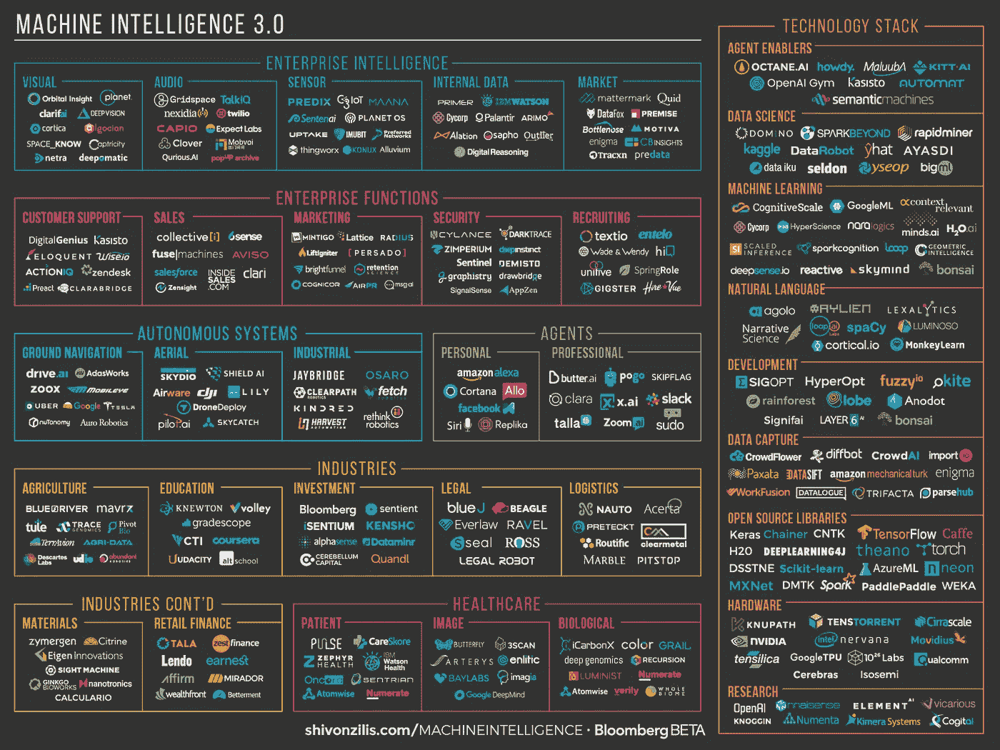

# 富有数据的人越来越富有——人工智能的现状(第一部分)

> 原文：<https://towardsdatascience.com/the-data-rich-are-getting-richer-the-current-state-of-artificial-intelligence-part-1-c7a26400f1a5?source=collection_archive---------1----------------------->

你可能还没错过最近关于人工智能(AI)和机器学习的讨论。在一个两部分的博客中，我们看看什么是人工智能，以及它的影响，然后探索人工智能在北欧的状态。

人工智能将在未来几年对经济、公司和个人产生重大影响，并在“富人”(数据、软件、资本、资源、人才)和“穷人”之间形成新的、日益扩大的数字鸿沟。简而言之，数据丰富的人越来越富有，在这篇博客文章中，我们旨在解释其中的原因。

每个人都使用人工智能和大数据这样的时髦词汇，但它到底是什么？从基础开始，我们邀请了总部位于伦敦和斯德哥尔摩的人工智能公司 [Augify](http://www.augify.com/) 的 Jay Solomon，坐下来谈谈人工智能和机器学习。

[人工智能](https://en.wikipedia.org/wiki/Artificial_intelligence)是关于创造具有智能行为能力的计算机和软件。我们用这个术语来描述模仿人类认知功能的机器，比如学习、听觉和视觉。近年来，[深度学习](https://en.wikipedia.org/wiki/Deep_learning)已经帮助我们极大地提高了计算机视觉、语言和语音理解能力。深度学习是一套[算法](https://en.wikipedia.org/wiki/Algorithm)，其灵感来自大脑的工作方式和我们的学习方式。它真正的含义是什么？自学成才的机器新世界。我们不是像我们习惯的那样给计算机编程来执行特定的任务，而是给计算机编程来知道如何学习。这就是我们所说的[机器学习](https://en.wikipedia.org/wiki/Machine_learning)。

深度学习的核心是[神经网络](https://en.wikipedia.org/wiki/Artificial_neural_network)，这基本上是一种计算方法，也反映了大脑。由于近年来的两项进步，人工智能和神经网络变得非常强大。1)更好地理解如何在网络学习时对其进行微调，这在一定程度上要归功于速度更快的计算机，以及 2)大规模数据库([大数据](https://en.wikipedia.org/wiki/Big_data))的可用性来训练网络。人工智能以数据为食，系统能够消化的数据越多，它们学习和改进的就越多。

简单来说，数据和计算能力的原始结合，让 AI 一天比一天强。这激发了流行的末日未来场景，当由“天网”运行的类似终结者的机器接管地球时，我们已经失去了对我们创造的控制。

如果你没有进一步阅读，让我们用五个基本概念来总结一下上面的概述，这至少会让你在任何晚餐谈话中看起来更聪明。

*   **人工智能**(当机器模仿人类智能行为时)
*   **机器学习**(编程机器学习如何学习)
*   **深度学习**(受大脑功能启发的网络和算法)
*   **神经网络**(互联网络，也基于人脑)
*   **算法**(定义计算操作的一组规则)

这五个概念都是相关的，因为人工智能是机器智能的高级通用术语，机器学习是关于获取这种智能，即自学、自主机器、深度学习和神经网络是由人脑启发的用于机器学习的算法和架构，而算法本身，在最细粒度的操作计算级别上，是代码、软件。

从另一个角度来看，人工智能就是软件。这种“人工智能软件”现在被用来增强其他现有软件的智能。一个典型的例子是，像脸书这样拥有海量数据的社交平台，部署数字助理来为平台上的消费者更多地利用这些数据。例如，参见我们之前的博客[机器人的含义](http://www.standoutcapital.com/blog/the-meaning-of-bots/)。人工智能只是数据和软件，尽管非常强大和改变模式，这激发了短语[“软件正在吞噬世界”](http://www.wsj.com/articles/SB10001424053111903480904576512250915629460)，由[马克·安德里森](https://a16z.com/author/marc-andreessen/)使之流行。

正如我们所知，我们的世界已经运行在人工智能之上。Siri 管理我们的日历，脸书为我们的朋友提供建议，电脑管理我们的养老基金，汽车现在可以自动泊车，空中交通管制几乎完全自动化。人工智能正变得无处不在。人工智能被用于许多不同的领域，如语音理解、机器翻译、计算机视觉、手写识别、人脸识别、自然语言理解、自动文案、自动生成的广告活动，以及我们已经看到的智能(和不那么智能的)机器人。

人们也开始意识到算法的负面副作用，这些算法根据我们在社交网络和搜索引擎上的自动配置文件向我们提供信息，甚至无法区分真实和 T2 假新闻。这反过来引发了一场关于这些算法实际上有多好的讨论，引发了一些观点，例如，脸书[在机器学习](http://blog.eladgil.com/2016/11/facebook-must-really-suck-at-machine.html)方面真的很烂。但是毫无疑问，全球数字巨头[在人工智能竞赛中积极投资以获得优势](http://www.osborneclarke.com/insights/artificial-intelligence-silicon-valley-tech-giants-continue-their-race-to-compete-for-ai-advantage/)。

由于人工智能现在无处不在，引发了另一个想法——人工智能是“新的电力”。这个概念正由阿里巴巴的创始人马云推动，凯文·凯利在他关于塑造我们未来的科技力量的书《不可避免的未来》中也探讨了这个概念。其中一个大趋势是“认知”，或者说是向软件添加认知的、类似人类的技能的进化。

正如凯文·凯利所说，“即将出现的人工智能看起来更像亚马逊网络服务——廉价、可靠、工业级的数字智能运行在一切事物的背后，除了闪烁之外几乎看不见。这个普通的工具将为你提供你想要的智商，但不会超过你的需要。像所有的公用事业一样，人工智能将会非常无聊，即使它改变了互联网、全球经济和文明。它将使无生气的物体活跃起来，就像一个多世纪前电所做的那样。我们以前电气化的一切我们现在将认知。这种新的功利主义人工智能也将增强我们作为人的个体(加深我们的记忆，加快我们的识别)和作为物种的集体。我们能想到的几乎没有什么东西不能通过注入一些额外的智商而变得新颖、不同或有趣。其实接下来一万家创业公司的商业计划书很好预测:*取 X 加 AI* 。这是一件大事，现在它来了。”

拿个牙刷加个电机=电动牙刷。拿个房子加 AI =智能家居。拿企业软件来说，像 HR 工具，加上 AI =机器人招聘人员。例如， [Mya](http://trymya.io/) 是一个[人工智能工具，旨在自动化大部分招聘过程](http://www.forbes.com/sites/louisefron/2016/07/12/how-a-i-is-about-to-disrupt-corporate-recruiting/#338146d8547f)。

果然，谷歌云已经[宣布了](https://martechtoday.com/google-machine-learning-192476)面向企业使用的新机器学习功能，提供“随时可用的人工智能”,让你可以租用自己的机器学习计算机，包括用于翻译、工作匹配和分析等任务的 API。谷歌首席执行官[桑德尔·皮帅](https://en.wikipedia.org/wiki/Sundar_Pichai)最近因声明他们正在从一个“移动优先”的公司转变为[人工智能优先](http://www.businessinsider.com/sundar-pichai-ai-first-world-2016-4)公司而备受关注，为他们所有的核心产品添加更多的智能功能。

然而，世界领先的人工智能专家之一、斯坦福大学教授、硅谷百度研究院首席科学家吴恩达建议人工智能现在能为公司做些什么。“尽管人工智能的影响范围很广”，吴恩达说，“它被部署的类型仍然非常有限。AI 最近的进展几乎都是通过一种类型，在这种类型中，一些输入数据(A)被用来快速生成一些简单的响应(B)”。比如:输入 A(图片)，响应 B(“有人脸吗？”)，应用(照片标注)，或者输入 A(车载摄像头)，响应 B(“其他车的位置？”)、应用(自动驾驶汽车)。

人工智能领域已经有 60 年的历史了，但直到现在，它才真正在更广泛的范围内发生，并进入我们的生活。我们可以问为什么吗？在硅谷投资者安德森·霍洛维茨(Andre essen Horowitz)([当人类遇到人工智能](http://a16z.com/2016/06/29/feifei-li-a16z-professor-in-residence/))最近的播客中，斯坦福大学副教授[费-李非](http://vision.stanford.edu/feifeili/)(谷歌聘请的另一位人工智能专家[)解释说，我们现在正处于“人工智能的一个历史时刻”。三种力量结合在一起触发了开关。首先，人工智能技术(上面提到的深度学习和神经网络)已经成熟，第二，支持该技术的大数据现在已经可用，第三，计算硬件(处理器和深度学习芯片)近年来发展迅速。人工智能的下一个大领域之一将是芯片。](http://fortune.com/2016/11/15/google-fei-fei-li-snapchat-machine-learning/)

那么，AI 行业到底是怎么回事？要回答这个问题，我们必须先看看美国发生了什么。最近，Sam DeBrule(每周 [Machinelearnings](http://machinelearnings.co/) 时事通讯的策展人)发布了一份关于美国人工智能状况的“[人类非技术指南](https://medium.com/@samdebrule/a-humans-guide-to-machine-learning-e179f43b67a0)”。这个关于[机器智能领域](https://www.oreilly.com/ideas/the-current-state-of-machine-intelligence-3-0)(如上图)的总结包括了大约 320 家人工智能&人工智能公司，活跃在企业智能(视觉、传感器)、企业功能(销售、招聘)、自主系统(导航、机器人)、代理(个人、专业)、行业(教育、投资)、医疗保健(病人、图像)和技术栈(自然语言、数据科学)等领域。该名单还包括大约 80 名有影响力的人，其中最著名的可能是发起 OpenAI 倡议的埃隆·马斯克和大约 30 个人工智能新闻来源。此外，美国政府发布了一份雄心勃勃的报告和一份战略计划来支持人工智能。

但最激烈的人工智能竞赛正在全球最大的软件公司中进行。当今全球市值最大的三家公司是苹果、谷歌(Alphabet)和微软。脸书和亚马逊都在前 10 名之列(有时是前 5 名)，它们的总价值目前接近 2.5 万亿美元。他们有大量的现金可以花。这些公司通过全球数十亿人每天使用的产品和服务，在全球数字网络上建立了自己的价值。他们现在正在迅速吸收人工智能和人工智能领域的初创公司、资源和专家，以保持领先地位。人工智能的许多研究和实际应用现在都发生在这些公司内部，进一步确立了它们已经占据的主导地位。他们有能力使用人工智能作为他们海量数据的一个极其强大的杠杆，随着数据量的增长，系统会变得更加强大。人工智能是一种不断升级的优势的催化剂，这种优势将其他公司和国家甩在了后面。

总之，我们认为上述人工智能和人工智能的发展将对社会、行业和消费者产生深远的影响。至少有四点，长期影响非常明显。

*   随着人工智能利用数据，已经拥有海量数据的公司将变得更加强大(谷歌、苹果、脸书等)
*   我们将看到更多的人工智能初创公司，通过获得更强的计算能力、第三方数据、廉价的云存储和开源人工智能软件来实现
*   随着人工智能添加到现有软件中，面向消费者的人工智能商业化将提供新的智能服务和产品的爆炸式供应
*   有人工智能政治议程(研究、投资、基础设施、立法、教育等)的国家将获得优势

然而，我们不确定行动缓慢的老牌公司将如何收获人工智能的好处，或者它们将如何在竞争中保持领先。此外，已经落后的国家将会看到与最先进的人工智能国家的差距越来越大。

人工智能与大数据相结合的性质，为已经拥有先进人工智能技术、研究、数据和资本的公司和国家(如美国和中国)带来了越来越大的优势。人工智能和大数据的动态将我们推向一个新的全球数字世界秩序，进一步将力量平衡转移到硅谷和上海等已经占据主导地位的科技地区。

因此，在一个潜在的新的或强化的数字世界秩序中，已经拥有丰富数据的人会变得更富有，欧洲会怎样？北欧人会跟上人工智能的新机遇并取得成功吗？我们现在转向我们自己的地区，想知道加速的人工智能发展对这里的公司和投资意味着什么。在我们的下一篇博客中，“人工智能的现状，第二部分——北欧有智能吗？”我们探索发生了什么，也许没有发生。