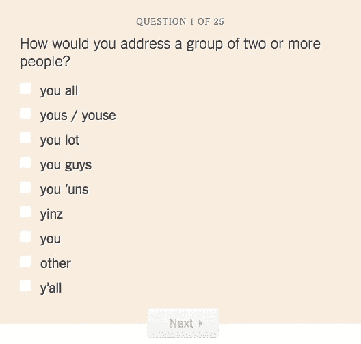
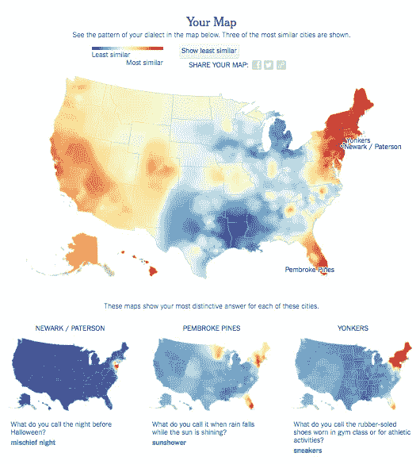
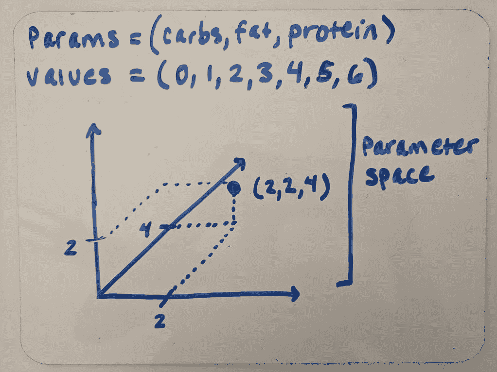
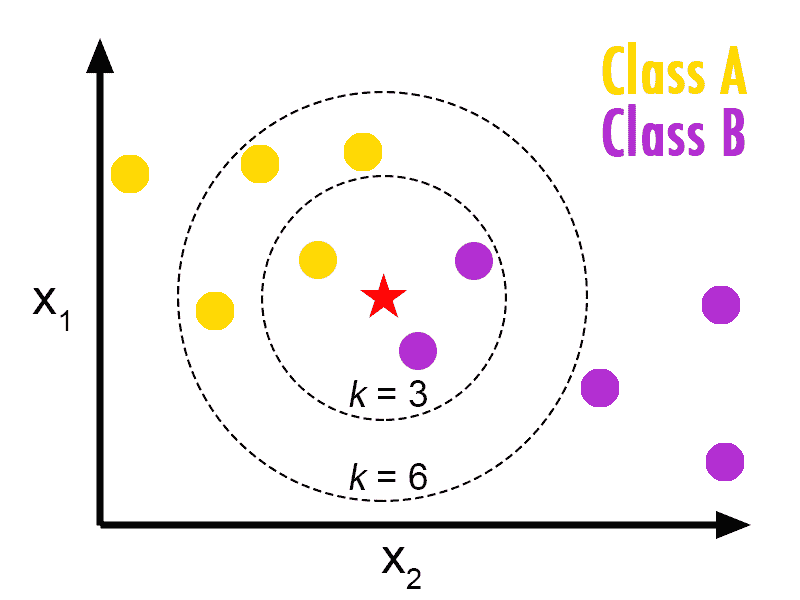
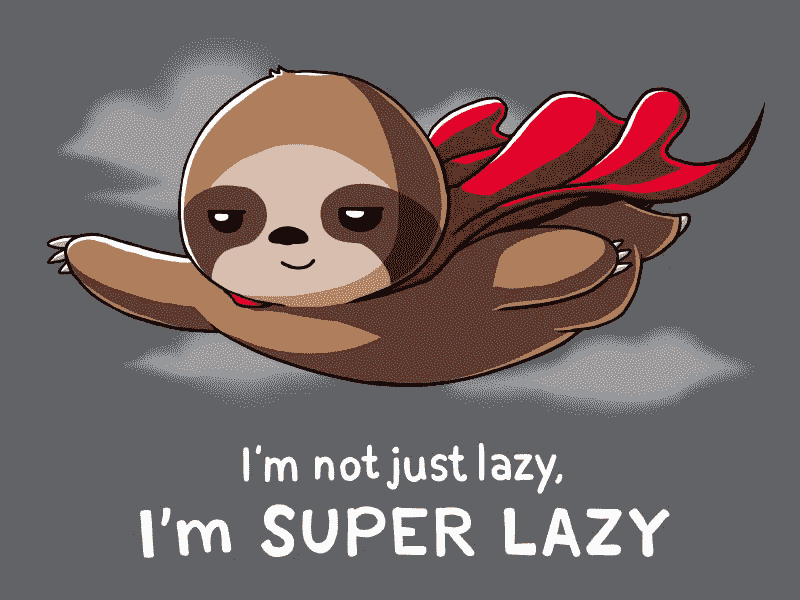

# 《纽约时报》方言测验背后的数据科学，第 1 部分

> 原文：<https://towardsdatascience.com/the-data-science-behind-the-new-york-times-dialect-quiz-part-1-4935ff06069a?source=collection_archive---------8----------------------->

2013 年,《纽约时报》发表了约什·卡茨的《[你们，你们和你们这些家伙是怎么说话的》](https://www.nytimes.com/interactive/2014/upshot/dialect-quiz-map.html?_r=0)你可能记得服用过，或者至少听说过。它会问你一些问题，比如“在十字路口与你隔着两条街的东西叫什么？”你可以选择的答案包括“猫眼”和“猫眼”(后者显然是正确的选择)。我认识的每个人都对它的准确性印象深刻。

在回答了 25 个旨在梳理你的语言特质的问题后，你被归类为在美国的某个特定地区长大(从技术上来说，这个测试向你展示了哪个地区的人最有可能像你一样说话*，所以它可能表面上向你展示了你的父母是在哪里长大的，而不是你是在哪里长大的[，正如瑞安·格拉夫指出的](https://knightlab.northwestern.edu/2014/01/20/behind-the-dialect-map-interactive-how-an-intern-created-the-new-york-times-most-popular-piece-of-content-in-2013/)。令我惊讶的是，每次我参加测验，它都把我归类为来自某个城镇，离我实际长大的地方不超过 15 英里。我的经历并不是独一无二的——[尽管它的出版日期是 12 月 21 日，但它却是《纽约时报》当年最受欢迎的文章。它是如此的成功，以至于三年后 Katz 出版了一本关于它的书。](https://www.theatlantic.com/technology/archive/2014/01/-em-the-new-york-times-em-most-popular-story-of-2013-was-not-an-article/283167/)*

**

*Yes, I’m from the Yonkers area.*

*除了是 2013 年的全国现象，为什么现在还要关心卡茨的方言竞猜？我非常关心它，因为我是一个语言和信息科学的书呆子。但是*你*应该关心它，因为它是将数据科学带入数百万美国家庭的成功尝试，而不考虑技术技能或智力。*

## *重要的事情先来:测验的简史。*

*(以下大部分信息基于 [Katz 在纽约数据科学院](https://nycdatascience.com/blog/meetup/the-new-york-times-josh-katz-on-the-dialect-map/)的演讲。)*

*   *卡茨测验中的问题是基于一个更大的研究项目，名为“哈佛方言调查”，由哈佛大学语言学系的伯特·沃克斯和斯科特·戈德于 2003 年发表(你可以在这里找到沃克斯关于 NPR [的精彩访谈](http://www.wnpr.org/post/man-behind-dialect-quiz))。*
*   *沃克斯和戈德在网上分发了他们的 122 个问题的测验，它集中在三个方面:发音、词汇和句法。*
*   *最初的测验产生了大约 50k 个观察结果，所有这些观察结果都是由邮政编码编码的。*
*   *2013 年，Katz 在北卡罗来纳州立大学(North Carolina State University)学习统计学期间，以研究生实习生的身份撰写了时报版的这个测试。([在他们发现了他对沃克斯和高达原始数据的可视化后，他被邀请去纽约时报实习。](https://knightlab.northwestern.edu/2014/01/20/behind-the-dialect-map-interactive-how-an-intern-created-the-new-york-times-most-popular-piece-of-content-in-2013/))*
*   *时报测验中涉及的技术包括 R 和 D3，后者是一个 JavaScript 库，用于将数据绑定到页面的 DOM 进行操作和分析，类似于 jQuery。*

## *数据科学*

*那么这个测验实际上是如何进行的呢？它的基础是监督机器学习算法**K-最近邻** (K-NN)，正如我的研究生院助教告诉我们的，这是一种机器学习算法，用于“根据参数空间中新数据点周围点的值来预测新数据点的类别。”我们将在后面的帖子中深入研究机器学习的思想以及特定 K-NN 算法的来龙去脉。现在，让我们来解决我的助教定义中的一些术语。*

***什么是“参数空间”？***

*根据[维基百科](https://en.wikipedia.org/wiki/Parameter_space)，参数空间是“特定数学模型中包含的所有不同参数的所有可能值组合的集合。”虽然听起来令人印象深刻，但这个定义对于外行人来说并不是特别有帮助。因为我是视觉学习者，也许涂鸦会更有启发性:*

**

*Personal doodle.*

*本质上，如果您有可以绘制的参数(即自变量或变量)，那么绘制它们的空间就是参数空间。对于 K-NN，参数空间将是两个轴之间的一切，我们试图分类的点是星。(暂时忽略 k 值。)*

**

*[http://bdewilde.github.io/blog/blogger/2012/10/26/classification-of-hand-written-digits-3/](http://bdewilde.github.io/blog/blogger/2012/10/26/classification-of-hand-written-digits-3/)*

*在上图中，有两种类型的圆圈:黄色圆圈和紫色圆圈。在这样的数据集上执行 K-NN 的目的是根据它与周围圆圈的接近程度来预测我们的新输入恒星是属于黄色圆圈类别还是紫色圆圈类别。*

*所以参数空间。检查。*

*在深入 K-NN 背后的思想和数学之前，我们还需要解决一件事。这个术语在我的助教上面的定义中没有，但是理解它将帮助我们理解当我们运行 K-NN 分析时到底发生了什么。，而那个术语就是*算法懒惰* **。***

**

*[https://www.theodysseyonline.com/im-secretly-lazy](https://www.theodysseyonline.com/im-secretly-lazy)*

## *K-NN 是一种“懒惰”算法。*

*但是一个算法怎么可能偷懒呢？算法会不会累？他们会有糟糕的日子吗？遗憾的是，没有。在这里，懒惰意味着算法不使用训练数据点进行任何推广，[正如阿迪·布朗什坦写的](https://medium.com/@adi.bronshtein/a-quick-introduction-to-k-nearest-neighbors-algorithm-62214cea29c7)。*

*我们还没有解决*训练*一个算法的想法，但是我们仍然可以理解 Bronshtein 的意思。本质上，所有受监督的机器学习算法都需要一些数据作为其预测的基础。在 K-NN 的情况下，它需要像上面图表中黄色和紫色圆圈这样的数据，以便知道如何对恒星进行分类。与*急切的*算法(例如[决策树](/decision-trees-in-machine-learning-641b9c4e8052))相反，*懒惰的*算法*存储*他们将需要的所有训练数据，以便对某样东西进行分类，并且直到他们被给予某样东西进行分类的确切时刻才使用它。*

*懒惰算法的另一个术语是“基于实例的学习”，它可能传达更多的功能顾名思义，这种类型的算法(通常)接受一个数据实例，并将其与内存中的所有实例进行比较。*

*Cathy O'Neil，又名“mathbabe”，[给出了一个基于实例的学习的好例子](https://mathbabe.org/2013/04/04/k-nearest-neighbors-dangerously-simple/)，使用了一个杂货店场景:*

> *当然，你真正想要的是在新用户购买任何东西之前，根据他们到达时你对他们的了解，即他们的属性，预测他们的类别。所以问题是，给定一个用户的属性，你对该用户的类别的最佳猜测是什么？*
> 
> *让我们使用 k-最近邻。设 k 为 5，说有一个新顾客叫莫妮卡。然后，该算法搜索与 Monica 最接近的 5 个客户，即在属性方面与 Monica 最相似的客户，并查看这 5 个客户属于哪个类别。如果他们中的 4 个是“中等支出者”，1 个是“小支出者”，那么你对莫妮卡的最佳猜测是“中等支出者”。*
> 
> *我靠，这太简单了！*

*当然，事情没有那么简单，但是我们将把 K-NN 的复杂性留到以后的文章中讨论。目前，K-NN =一种惰性算法=存储它需要进行分类的数据，直到它被要求进行分类。*

*就是这样！现在我们有了继续讨论的基础，比如训练，K-NN 实际上是如何工作的，最重要的是，Katz 如何在他的方言测验中使用它。请继续关注第 2 部分中的所有内容！*

*与此同时，我鼓励你们所有人，如果你们还没有参加方言测验的话，参加一次(即使你们已经参加了，也要再参加一次)。稍后你会需要你的答案！*