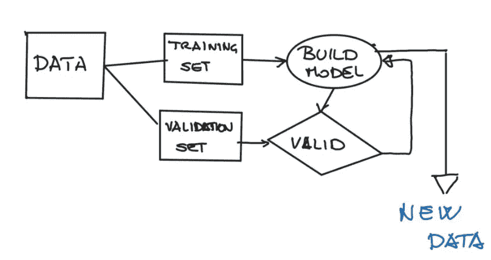
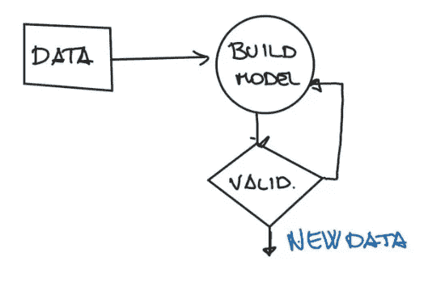
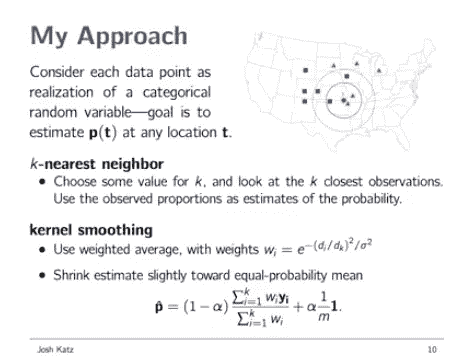
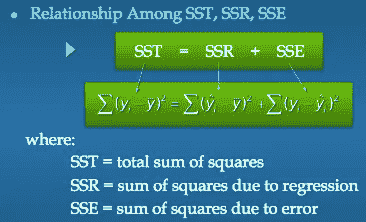
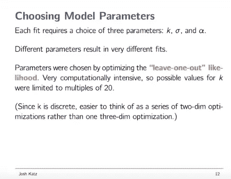

# 纽约时报方言测验背后的数据科学，第 2 部分

> 原文：<https://towardsdatascience.com/the-data-science-behind-the-new-york-times-dialect-quiz-part-2-5c60216b7503?source=collection_archive---------19----------------------->

本系列的第一个[部分](/the-data-science-behind-the-new-york-times-dialect-quiz-part-1-4935ff06069a)探讨了 Josh Katz 的 [NYT 方言测验](https://www.nytimes.com/interactive/2014/upshot/dialect-quiz-map.html?_r=0)，并触及了一些数据科学主题，如参数空间和“懒惰”算法。在这一部分，我们将首先定义一些常见的机器学习(ML)术语，然后探讨 Katz 如何在测验中使用 ML。

**一个警告:**我是数据科学的新手。如果你在下面的帖子中看到任何不准确的地方，*请*评论并告诉我。我喜欢加深对这个领域的理解。此外，这篇文章只是对我喜欢数据科学项目进行逆向工程的一次高级尝试。(我试图联系 Josh Katz 并找到他的项目代码，但没有成功。)

# 一些额外的方言测验背景

通过听 Katz 在纽约数据科学院的演讲和阅读他对 Ryan Graff 的采访，我得到了以下信息:

*   Katz 创建了一个有 142 个问题的*试点*方言测验，其中有 Vaux 和 Golder 在他们的调查中使用的最初的 122 个问题，加上 Katz 通过来自 [RStudio](https://www.rstudio.com/) 社区的输入提出的另外 20 个问题(他在同一个社区发布了他最初的方言地图可视化，这使他受到了《纽约时报》的注意)。
*   除了回答这 142 个问题，用户还可以为每个问题选择“其他”答案，并填写自定义答案。
*   在试点研究中，除了语言和位置问题，Katz 还调查了人们的年龄和性别。
*   总共有 35 万人参加了试点测试。
*   卡茨用来自试点的数据为 NYT 版本建立了最终模型。
*   Katz 根据他发现的最具启发性的问题，将最终方言测验的问题从 142 个减少到 35 个(其中只有 25 个在一次会议中提供给用户，使得每次测试都略有不同)。

# 监督与非监督 ML

正如在本系列的第一部分中提到的，Katz 在他的方言测验中使用的算法 K-Nearest Neighbors (K-NN)是一种*监督的* ML 算法。这意味着 K-NN 通过输入既有问题*又有答案*的数据来学习如何工作。与 ***un*** 有监督的 ML、K-NN 以及类似的算法相反，给它们一组问题*以及它们的解决方案*，以便它们可以很容易地看到未来期望它们产生什么类型的输出。

Claudio Masolo 在他的博客文章“[有监督的、无监督的和深度学习](/supervised-unsupervised-and-deep-learning-aa61a0e5471c)”中很好地描述了这两种类型的人工智能之间的区别:

> 使用监督学习，在训练阶段将一组示例(训练集)作为输入提交给系统。每个输入都标有一个期望的输出值，这样系统就知道[输出应该如何，取决于输入]。。。另一方面，在无人监督的学习中，系统提供的训练样本并不被标上所属的类别。因此，系统开发和组织数据，寻找它们之间的共同特征，并根据内部知识进行改变

Supervised learning schema from Masolo’s post “[Supervised, Unsupervised, and Deep Learning](/supervised-unsupervised-and-deep-learning-aa61a0e5471c)”

*Un*supervised learning schema from Masolo’s post “[Supervised, Unsupervised, and Deep Learning](/supervised-unsupervised-and-deep-learning-aa61a0e5471c)”

总而言之:

*   监督 ML(例如 K-NN) =向你的模型输入包含问题和答案的数据，以便它能够做出准确的预测。
*   无监督 ML =输入包含问题的模型数据，并要求它从这些问题中梳理出模式，然后它可以使用这些模式做出准确的预测。

# 更多行话！

因此，我们知道 K-NN 是一种监督的 ML 算法，现在我们知道这意味着什么。在我们继续之前，我们还需要解决一些术语。

[https://instapage.com/blog/avoiding-bad-agency-proposals](https://instapage.com/blog/avoiding-bad-agency-proposals)

在 ML 的世界中，数据科学家通过向它们提供*训练数据*(通常是我们数据集的 80%)来训练我们的算法。这些训练数据由称为特征向量和标签的东西组成。除了几个术语之外，让我们回顾一下这两个概念，以便快速理解。

## 特征

要素本质上是数据集的列标题。它们是你的自变量，其中任何一个变量的变化都可能会导致你的因变量(或“目标”)的变化。(如果你听说过一个数据科学家做“[特征工程](https://en.wikipedia.org/wiki/Feature_engineering)”这些是他们为了优化他们的模型而添加/删除的东西。)

在方言测验的情况下，一些特征可能是测验中不同的问题、年龄和性别。

## 特征向量

特征*向量*本质上是数据集的行。每个特征向量都是数据集中观察值的数字表示(耶，[线性代数](https://www.youtube.com/watch?v=fNk_zzaMoSs&list=PLZHQObOWTQDPD3MizzM2xVFitgF8hE_ab)！).

假设您正在创建一个房价数据集。每行代表一所房子的价格信息。虽然您的特征可能是“要价”、“卧室数量”和“售价”，但特征向量可能是“1，200，000，3.0，950，000”这个特征向量将代表一栋*特定房屋*的要价(120 万美元)、卧室数量(3 间)和售价(95 万美元)。在 K-NN 中，特征向量通常是数据点的位置(经度，纬度)和它们彼此之间的[欧几里得距离](https://en.wikipedia.org/wiki/Euclidean_distance)。

在方言测验中，特征向量可能是一个人对测验中每个问题的答案、年龄和性别(除了位置数据之外)的数字表示。

## 标签

标签是你的因变量。它们是你试图预测的目标或类别。对于方言测验，这些可能是地理位置。

(从技术上讲，标注是数据集要素的一部分。然而，在特征工程阶段和所谓的训练-测试-分割阶段，你可以把它/它们拿出来，以隔离你的因变量和自变量之间的关系。)

# 最后，让我们开始吧

好了，现在我们都在一些关键的 ML 术语上达成一致，我们可以开始探索 Katz 实际上是如何使用 K-NN 来产生他的方言测验的。从他的数据科学院演讲中，我找到了下面这张幻灯片。

现在，这张幻灯片中有很多内容，其中大部分必须保持抽象，不能探究他的代码。

从顶部开始，我将在这篇文章的剩余部分(简要地)探索两个信息块:

*   **选择 K 值**
*   **内核平滑**

所以，开始疯狂吧！

## 选择 K 值

在上面的幻灯片中，Katz 似乎在说，他想使用他选择的 *k* 值和一个点的 *k* 最近邻( *t)* 之间的差值(比例)来估计一个人来自某个位置的概率。那么，一个人如何选择这个难以捉摸的 *k* 值，k 是什么*？*

*k* 是一个“[超参数](https://en.wikipedia.org/wiki/Hyperparameter_(machine_learning))，这只是一个花哨的词，用来描述你的模型的一些属性，你可以独立于你的数据进行调整。例如，如果你是一个专业的快速吃热狗者，你可能关心的一个超参数是你一次放进嘴里的热狗的数量。也许你想试着一次吃 3 个，也许一次吃 1 个。无论你吃的是希伯来民族热狗还是格雷的木瓜热狗，你都可以改变你策略的这一总体属性。

在 K-NN 中，您的超参数 *k* 基本上是您希望您的模型关心的最近邻居的数量。实际上，不同的 k 值导致不同的“[决策边界](https://www.youtube.com/watch?v=JtBtVNtTXRQ)”由您选择最适合您的数据的。下面是 Kevin Zakka 在 K-NN 上发表的[伟大博客](https://kevinzakka.github.io/2016/07/13/k-nearest-neighbor/)中的插图，展示了不同的 K 值可能是什么样子。

正如 Zakka 指出的，更小的 k 值(例如 1)将导致更灵活的拟合(具有低偏差，但高方差，在本文中我们没有时间讨论其平衡)。较大的 k 值(例如 20)会产生更平滑的边界，因为它更能抵抗异常值(具有高偏差和低方差)。

Katz 可能使用的一个策略是交叉验证。交叉验证是[估计泛化误差](http://efavdb.com/leave-one-out-cross-validation/)的一种方式。[通过交叉验证和 K-NN](http://www.statsoft.com/Textbook/k-Nearest-Neighbors#crossvalidation) ，您可以将样本数据分成随机段，并将 K-NN 模型应用于每个段，其中 K*K*的值各不相同。然后分析每个片段的[**SSR**](https://en.wikipedia.org/wiki/Explained_sum_of_squares)**或其“回归平方和”用回归的话来说，SSR 代表你从数据的实际平均值到预测值的移动。在对分段数据使用不同的 K*K*值运行 K-NN 后，对每个 SSR 进行平均，然后选择产生最小误差的 K 值。**

****

**Flatiron School slide from Linear Regression deck created by [Sean-Abu Wilson](https://www.linkedin.com/in/seanabu/).**

**无论你为 k 选择什么值，都会改变你的模型的输出。**

**虽然我们不知道 Katz 为他的模型选择了哪一个，但我们至少可以理解它的重要性。**

## **内核平滑**

**卡茨似乎也在他的模型中使用了一种叫做内核平滑器的东西。[维基百科](https://en.wikipedia.org/wiki/Kernel_smoother)告诉我们，内核平滑器是一个**

> **将实值函数估计为相邻观测数据的加权平均值的统计技术。权重由内核定义，这样更近的点被赋予更高的权重。**

**因此，核帮助我们在 K-NN 模型中对 K 值进行加权。**

**在他们的论文《关于核差分加权 K-最近邻分类的 T2》中，左等人写道，加权度量(【在我们的情况下是】k )被定义为“未分类样本 **x** 和训练样本 **x** 之间的距离……”(248)。这似乎与卡茨在我们之前查看的幻灯片中描述的非常相似，他的策略是使用未知值 *t* 与其最近邻居之间的差异比例，因此我们似乎走上了正确的轨道。**

**在他们的论文中，左等人提到了另一篇可能对我们有所帮助的论文:“[学习加权度量来最小化最近邻分类错误](http://citeseerx.ist.psu.edu/viewdoc/download;jsessionid=AC975B0AE891B7719EB3B6465B236AF0?doi=10.1.1.80.7192&rep=rep1&type=pdf)”。在本文中，Roberto Paredes 和 Enrique Vidal 讨论了通过最小化“遗漏一项”( [LOOCV](https://en.wikipedia.org/wiki/Cross-validation_%28statistics%29#Leave-one-out_cross-validation) )分类错误交叉验证技术来优化其 K-NN 模型的策略。**

**在我从他在纽约数据科学学院的演讲中发现的另一张幻灯片上，卡茨特别指出，他利用 LOOCV 来选择他的模型参数，其中之一是 *k* 。虽然我们不会在这篇文章中讨论西格玛和阿尔法参数，但让我们简要地谈谈 LOOCV，了解一下这里发生了什么。**

****

**Slide from Katz’s NYC Data Science Academy talk**

**在 LOOCV，您选择 1 个数据点进行测试。这是“被忽略”的一点。然后，您构建没有这 1 个数据点的 K-NN 模型*(T19)，并评估您的模型与这一遗漏数据点之间的误差值。对所有训练数据点重复此操作，并对结果取平均值。众所周知，LOOCV 非常“计算昂贵”，因为你必须创建和运行这么多模型。正因为如此，正如您在上面的幻灯片中所看到的，卡茨选择将其可能的 k 值限制为 20 人一组。***

**因此，通过使用交叉验证策略，如加权核和 LOOCV，卡茨得到了他的完美 k 值。**

**这是大量的信息。正如我之前所说的，请在这篇文章的评论中提出任何更正、澄清或我应该探索的其他资源，以加深我对 K-NN 和 ML 的理解。**

**在我们结束之前，关于方言测验，还有几件事要知道:**

*   **在你进行方言测验时，出现在每个问题旁边的迷你热图只是用 r 语言预先渲染的静态图像。**
*   **与小地图不同，用户在测验结束时得到的大地图是在 [D3.js](https://en.wikipedia.org/wiki/D3.js) 中动态生成的，因为每个问题的答案组合超出了 Katz 事先可以生成的数量。**
*   **模型计算是在服务器端完成的——每次计算完成后，服务器都会生成一个代表每个答案的向量。在此基础上，完成向量矩阵乘法，然后服务器返回每个答案的值，然后呈现在用户的屏幕上。**
*   **卡茨在一个名为“闪亮 T5”的 [R 包中建立了这个测验。](https://shiny.rstudio.com/)**

**我们做到了！我们现在知道了著名的 NYT 方言测验的大部分内容。**