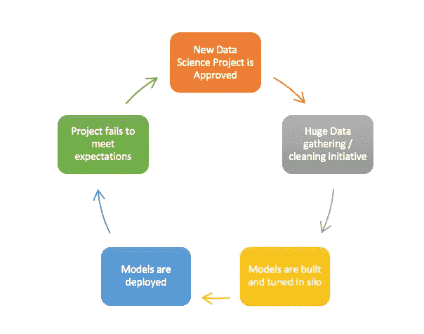

# 数据科学泡沫

> 原文：<https://towardsdatascience.com/the-data-science-bubble-99fff9821abb?source=collection_archive---------5----------------------->

## 为什么数据科学需要企业家精神

[Pixabay](https://pixabay.com/photos/bubbles-water-globule-sphere-wet-51675/)

恐怕我有一些坏消息要告诉我的数据科学家同事；数据科学是当今公司最糟糕的投资之一。

虽然单个项目可以获得 1000 倍的投资回报，但你的公司的下一个项目做到这一点的可能性几乎为零，事实上，它完全失败的可能性相当高。去年，Gartner 估计多达 85%的数据计划失败。

The Real Data Science Workflow

对于远离公司董事会的幸运儿来说，可能很难想象说服一家财富 500 强公司的高管为某个只有 15%成功机会的项目投资 1000-1000 万美元，但这种情况经常发生。

有些人会说，是时候结束了，挂起我们的神经网络，让我们的 GPU 退休，回到我们来自的物理实验室或数学大楼。

我，我不确定。问题不在于数据科学是假的，而是数据科学本身就有风险。当处理真正尖端的问题时，在项目开始时很难说它是否会成功。

好消息是有人已经找到了解决这个问题的方法，进入创业公司。

> “初创公司是一个人类机构，旨在极端不确定的条件下创造一种新产品或服务。”— [Eric Reis 精益创业](https://www.amazon.com/Lean-Startup-Entrepreneurs-Continuous-Innovation/dp/0307887898/ref=sr_1_3?ie=UTF8&qid=1529697358&sr=8-3&keywords=the+lean+startup)

如果这不是你的普通数据科学项目，我不知道什么是。从创业的角度研究数据科学的意义是直接而深远的。为了让这篇文章不超过五分钟，我将简要强调三大要点。

# 1.构建最小可行模型

> “如果你不为你产品的第一个版本感到尴尬，那你推出的太晚了”——雷德·霍夫曼联合创始人 LinkedIn

霍夫曼的评论完全适用于模特。

**第一个模型应该很糟糕，把它看作是最低可行的模型。**

不幸的是，现实往往是相反的。数据科学项目通常是资金涌入的黑洞，有一天一个原始的模型出现了，有不错的分数和漂亮的基础数据。团队总是震惊地发现模型没有解决客户的真正问题。

这正是问题所在，尽管数据科学一直在谈论实验和科学，但它可能是软件中最不敏捷的分支。

与其将数据科学项目视为博士论文，不如将它们视为创业软件项目。构建一个 MVM，让它出现在用户面前，并不断迭代。

# 2.通过融资降低风险

创业融资模式的天才之处很简单。

**通过重复项目评估降低风险。**

众所周知，数据科学项目很难评估，部分原因是它们经常承诺一些非常创新的东西，以至于以前从来没有做过。资助这样的项目与资助一家声称拥有改变行业的技术的初创公司没有什么不同。

值得注意的是，最具破坏性的失败不是一个提议的项目没有得到资助，而是一个完全资助的项目花费了全部预算，交付了一个非运营模型，并且在这个过程中没有学到任何有意义的东西。这意味着在企业家的思维模式中，风险不是通过接近完成来降低的，而是通过降低围绕提议解决方案有效性的不确定性来降低的。有人可能会半开玩笑地把企业家精神描述为寻找使系统熵减少某个因子所需的局部最小工作。

一个项目通过证明或反证有效性来反复展示它是如何降低风险的，并根据该证明如何为项目展示更大的预期价值来获得资金。如果项目开始不稳定，考虑旋转，也许这个项目不能解决它要解决的问题，但是对其他事情来说是一个理想的解决方案。

# 3.通过竞争实现增长

大多数数据科学组织声称是扁平化的，但却极其层级化。资金和项目想法是自上而下的，而不是由头脑设计出来的。

**数据科学发展太快，自上而下的组织跟不上。**

创造一个开放的环境，让项目可以在任何级别上发起，这是一个组织能够跟上这个领域令人眼花缭乱的步伐的唯一方法。组织间的竞争不应被视为一种威胁，而应被视为一种必要的适应功能，它能让最佳创意脱颖而出。

> “和平时期你[流汗](https://www.definitions.net/definition/sweat)越多，战争时期你[流血](https://www.definitions.net/definition/bleed)就越少。”乔治。巴顿将军

虽然 Patton 将军不是传统的创业领袖，但他关于竞争的观点在数据科学的竞争领域听起来确实如此。现实是，不管一个组织是扼杀竞争还是接受竞争，从它的产品离开它的前提开始，竞争就是一件非常真实的事情。

# 摘要

数据科学在过去十年中产生了一些最伟大的技术创新，但正如许多组织所实践的那样，它也是完全不可持续的。生产更相关的模型、降低风险并跟上该领域的步伐将要求组织重新思考他们如何进行数据科学。将数据科学构建为企业家精神使其再次成为一项伟大的投资。