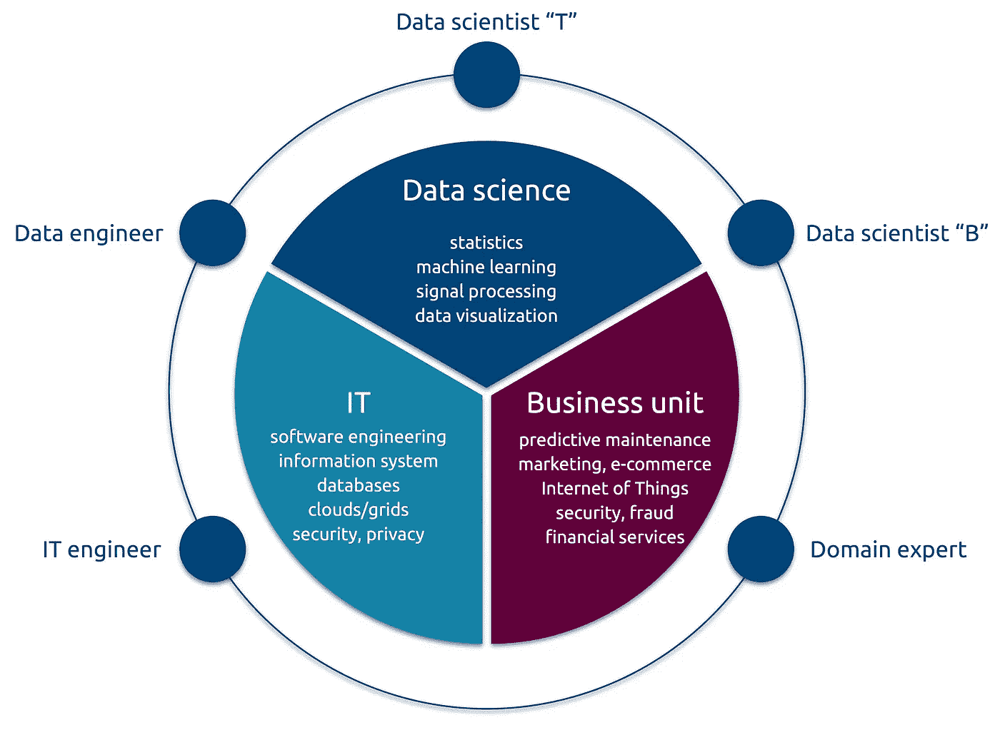
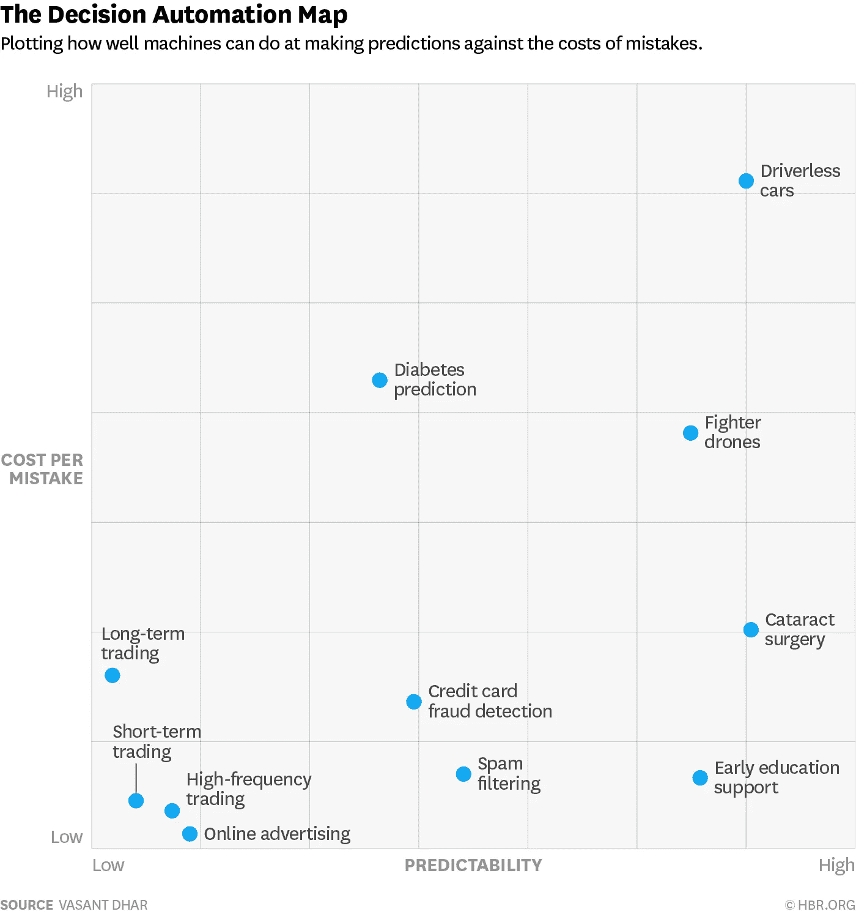

# 数据科学生态系统:工业版

> 原文：<https://towardsdatascience.com/the-data-science-ecosystem-industrial-edition-938582427466?source=collection_archive---------1----------------------->

在[之前的一篇文章](https://medium.com/@balazskegl/the-data-science-ecosystem-678459ba6013)中，我研究了数据科学生态系统及其在科学界的参与者、激励和挑战。在这里，我尝试将这种分析移植到工业数据科学生态系统中。这两种生态系统及其参与者的动机在几个方面有所不同，因此高管们在构建和管理它们时面临着非常不同的挑战。然而，场景的结构、演员和角色都非常相似。

The schematic data science ecosystem in a company

业务和 IT 是几乎所有公司的既定职能部门，当然也包括那些考虑使用数据的公司。在这里**我将分析剩下的三个新角色，他们做什么，他们的动机是什么**。正如在[之前的文章](https://medium.com/@balazskegl/the-data-science-ecosystem-678459ba6013)中，角色是角色，而不是人:任何给定的人都可以担任多个角色，并且可以在任职期间多次转换角色。

## 数据科学家“T”:技术大师

这些技术专家出现在流行的数据挑战网站上，他们中的许多人在那里对各种工业和科学数据集进行最直观的拍摄，就像在多人视频游戏中一样。最好的是最先进的数据科学工具包的**大师，他们可以深度学习和远视，他们可以提升、交叉验证和融合。然而，他们不是魔术师:他们不会从原始数据中发明商业解决方案(这是他们的老板希望他们做的)。他们的输入是定义良好的业务问题和相对干净的数据源。他们*构建和调整*原型工作流，但很少关注原型之外的管道。最重要的是，他们 80-90%的时间真正做的是数据清理、连接、格式化、扩充，然后再清理。所以他们最好擅长这个。在一些高端 IT 公司，他们做研究(例如，见 [FAIR](https://research.facebook.com/ai) —脸书人工智能研究)，但是，与科学生态系统不同，这种情况很少见。**

## 数据科学家“B”:形式化者

如果这个图中有人是魔术师，那么*形式化者*就是。有时他们来自业务部门，学习数据科学，有时他们是前技术大师，学习业务专业知识。无论是哪种情况，**都掌握了数据科学方面的*可能*和业务方面的*需要*什么**。至少他们可以流利地与领域专家交流。没有他们就没有创新。他们的技术贡献是将业务目标转化为损失指标。他们*形式化*数据科学原型工作流(但他们不一定构建它们)。他们可以定义和确定数据收集工作的规模，并估计其成本。他们还可以估计构建和调整工作流并将其投入生产所需的工作量。简而言之，他们拥有做出关于构建以数据为中心的产品的明智决策的所有要素。下图说明了他们的心态(从[到](http://www.globaladvisors.biz/inc-feed/20160517/when-to-trust-robots-with-decisions-and-when-not-to/))，混合了数据科学概念(可预测性)和业务概念(每错误的成本)。

The mindset of a formalizer. Mixing business and data science concepts.

高端 IT 公司通常建立他们的形式化团队:例如，参见脸书的[核心数据科学](https://research.facebook.com/datascience)，这至少同样重要，当然对于短期和中期业务目标而言，也同样重要。

## 数据工程师

数据工程师的角色是**将原型工作流转化为产品**。他们了解最新的数据工程系统和架构，并且对现有的 IT 基础设施有深入的了解。他们可以确定生产工作流程的规模并估计其成本。如果形式化者没有这些元素的信息，数据工程师应该从一开始就参与项目定义。他们还知道构建数据科学工作流的基础知识，并且能够**通过提取并可能清理和管理足够的数据来为原型制作过程提供支持**。

如果你在一家围绕以数据为中心的产品而建立的 IT 公司，我的分析可能看起来相当琐碎、简单。尽管如此，它对非 It 公司还是很有用的，这些公司通常有很好的理由，但也受到大数据宣传的压力，正试图转变他们的组织，以适应数据科学工作流的构建。他们的核心业务不是以数据为中心的，但他们希望使用数据来预测机器的故障，留住他们的客户，或减少内部采购欺诈。他们构建产品和生态系统的最佳策略是什么？

## IT 驱动的数据科学生态系统的构建

大多数大中型非 IT 公司的 IT 基础设施中都有数据仓库。他们通常将存储数据作为满足法律或业务需求的副作用。聪明的 IT 工程师的自下而上的计划通常会遇到自上而下的指令，这是由大数据热引发的，他们会做出决定:

> “让我们安装 Hadoop，购买基础架构，构建一个数据湖”。

为了利用新打造的基础设施，公司**然后雇佣数据科学家**。这是一段艰难的时期:数据科学家，尤其是形式化者，稀缺而昂贵，他们更喜欢在以数据为中心的公司中为更令人兴奋的项目工作。但是主要问题是**到业务单元(核心或非核心)的连接来得太晚**。这个问题

> 利用现有的数据科学团队和我们购买的基础架构，我们可以解决哪些业务问题？

应该早点问的。有可能基础设施不足、规模过大或过小，并且数据科学家不是合适的类型，与业务案例脱节。

## 数据科学家驱动的数据科学生态系统的构建

一个稍微不常见的情况是，数据科学项目是由技术数据科学家发起的。这些技术大师大多都有自己喜欢的技术。他们可能专注于 15 年前在课堂上学到的工具，或者他们可能刚刚走出学校，在深度学习的浪潮中冲浪。说，第二种类型的大师到来，并说服它:

> 我是深度学习的忠实粉丝，我们买个 GPU 集群吧。

然后他去见业务部门:

> 嘿，我能建造和训练这些整洁的网，我能为你做什么？

可能性是:什么都没有。业务案例可以通过十行代码和一个调优的随机森林来解决，并且可以在现有的 CPU 园区上运行。或者更糟:项目因为缺乏数据而受阻。你应该投资一个注释界面或者更多的传感器。

## 业务驱动的数据科学生态系统构建

到目前为止，您应该已经猜到了构建数据科学生态系统的正确方法。第一步是**确定公司应该改进的 KPI** 以及为建立管道需要收集或注释的**数据**。主动性应该来自业务单位，可能在一个好的形式化者的帮助下。然后可以雇佣数据科学家(或者更安全的说法:顾问)来**建立一个原型**，并且应该开始与它讨论数据提取和原型生产化的准备工作。**迭代是这里的关键**:在开始原型制作之前，成本和收益都不容易估计。迭代越快，成本越低，你冒的风险就越小。这个过程一点也不新，只是稍加修改，IBM 的[CRISP-DM](https://en.wikipedia.org/wiki/Cross_Industry_Standard_Process_for_Data_Mining)(1996 年的！)完全正确。

**主要的困难当然是找到形式化者**。找到技术大师相对容易(即使他们很贵)，但他们大多数都是
不是那种能帮你*定义*你的数据科学项目的人。其次， [**很少有**](http://www.tektosdata.com/#data-science-for-business-managers) **甚至没有为业务主管提供的非技术课程，**向他们解释数据科学过程(管道的迭代构建和管道本身)，数据科学家做什么，以及他们在迭代构建以数据为中心的产品时需要做出什么类型的决策。

## 如果你喜欢你所阅读的内容，请在[媒体](https://medium.com/@balazskegl)、 [LinkedIn](https://www.linkedin.com/in/balazskegl/) 、&、 [Twitter](https://twitter.com/balazskegl) 上关注我。