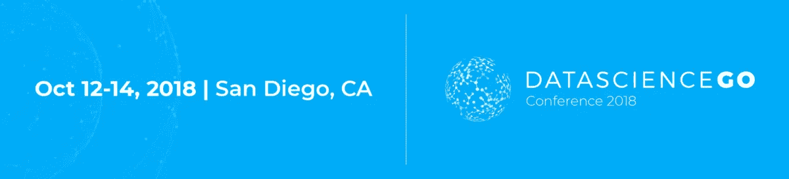
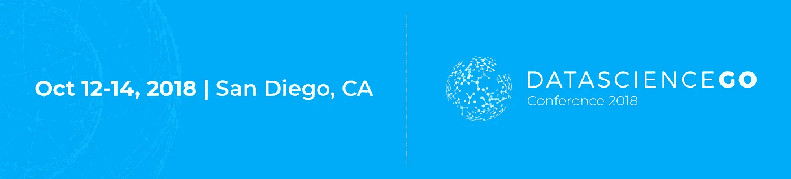

# 数据科学差距

> 原文：<https://towardsdatascience.com/the-data-science-gap-5cc4e0d19ee3?source=collection_archive---------1----------------------->

## 似乎每隔一天就有一篇关于数据科学如何成为就业前景最佳领域的新文章。

无论是需求还是高薪，它看起来都是寻找工作保障的学生和寻求更高工资的工人的理想选择。获得数据科学技能的建议并没有被忽视——在世界各地，成千上万的学生现在在大学和网络上注册了分析课程。

尽管如此，人们还是注意到了市场上的工作数量和可供选择的候选人之间的差距。毕业生是否应该担心这种数据科学的差距，他们可以做些什么来提高他们找到工作的机会？

# 是的，对数据科学家的需求仍然很高…

有一些关于数据科学已经达到全盛时期的错误信息流传开来。自 2012 年以来，该领域的角色数量增长了超过 650%。此外， [LinkedIn 的 2017 年新兴工作报告](https://economicgraph.linkedin.com/research/LinkedIns-2017-US-Emerging-Jobs-Report)关于美国增长最快的工作(基于他们的用户数据)强调，“技术为王”，该平台指出，机器学习工程师、数据科学家和大数据工程师等头衔的工作在一系列行业中都非常受欢迎。

这份报告分析了五年来 LinkedIn 上发布的职位数据，指出今天发布的数据科学家职位是 2012 年的 6.5 倍。更好的是，在他们列出的 10 项“新兴工作中最常见的技能”中，有 3 项与数据科学直接相关(Python、软件开发、分析)。

# …但是没有足够多的人有合适的经验

三年前，SAS 的执行副总裁吉姆·戴维斯和 CMO 说:“如果你想快速找到工作，就想办法成为一名数据科学家”([来源](https://www.cio.co.nz/article/574429/data-scientist-job-negative-unemployment-rate/))。或者去正确的地方提升自己的技能——比如 [DataScienceGO2018。](http://www.datasciencego.com)

问题是这个领域发展得太快了:现在有太多缺乏经验的数据科学家进入了一个几乎没有专家的就业市场，给我们留下了一个“底部沉重”的候选人池。这意味着，尽管数据科学领域仍有机会，但希望充分利用这一差距的个人需要聪明地开辟职业道路并取得成功。

# …对最好工作的竞争更加激烈

时代变了。当这个术语还是相对较新的时候，公司接受只有基本数据知识的候选人，并让他们在工作中学习。现在，公司通常不会雇佣数据科学家，除非他们有更深层次的知识，比如编码和统计。需求仍然很高，但现在门槛更高了。Umbel 公司的高级工程总监凯文·萨福德说:

> “每年，统计学、计量经济学、硬科学和计算机科学的博士毕业生——许多人专门研究机器学习——发现他们对学术界毫无兴趣，并进入了劳动力市场。”([来源](https://insidebigdata.com/2017/11/14/myth-entry-level-data-science/))

这意味着候选人现在不得不面对一个竞争异常激烈的市场。一个五年前看起来很有吸引力的应用程序今天可能会被拒绝。

# 但是……这真的是全部情况吗？

《赫芬顿邮报》声称，目前世界上大约有[150 万到 300 万数据科学家](https://www.huffingtonpost.com/quora/where-will-data-science-b_b_12375864.html)——真的没有具备合适经验的候选人吗？

如果我告诉你，造成这种“差距”的人并不是真正的数据科学家；而是不同公司的主管、人力资源部门甚至招聘人员。

为什么？

事实是，数据科学已经成为一个时髦词，一种炒作。五年来，这份工作一直被《哈佛商业评论》评为[【市场上最性感的工作】](https://hbr.org/2012/10/data-scientist-the-sexiest-job-of-the-21st-century)，现在许多公司都争相将数据专家纳入他们的行列。但真正的问题是，他们不知道什么是真正的数据科学家，他们做什么，一个团队是如何配置的，是什么让一个伟大的数据科学家真正“伟大”——对这个职业本身的知识存在巨大的差距。

有很多数据科学家，有成千上万有才华的专业人士可以轻松地颠覆一个前数据业务，但他们很少有机会证明自己。大多数公司急于“雇佣数据专家”，认为他们需要一个有 5-8 年经验的人来解决他们的所有问题(尽管讽刺的是，这个领域已经不存在很多年了)，并且他们得出结论，没有这种经验的每个数据科学家都不是好东西。

# 幸运的是，这意味着机会

推诿责任并说一切都是因为对专业的无知是不公平的——我们数据科学家也有责任。人力资源部门可能一直在以传统方式工作，这并不奇怪，因此他们为这些新的工作岗位而挣扎是完全正常的。他们在我们的数据科学职业生涯中寻找尚不存在的学位，他们想要没有领域可以获得的经验，他们想要他们还不清楚的技能。

这取决于我们展示我们的优势、能力和我们真正能带来的东西。数据是商业的未来，这是不可避免的，我们知道这一点，所以让我们向其他人展示我们是由什么组成的。

但是我们如何做到这一点呢？

我们应该努力缩小数据科学的差距。

# 填补数据科学空白的 6 种方法

那么我们应该如何定位自己，才能保证得到自己想要的工作呢？我们应该变得擅长视觉吗？我们应该获得分析软件的全面知识吗？现在放下水晶球，考虑一下你的雇主:所有公司都希望从他们的数据科学家那里获得解决**实际**问题的能力，更好的是:能够交流他们的发现。如果我们可以用数据来回答真正的商业问题，那么我们将有更好的机会获得我们想要的工作。

但为此我们需要经验和专业知识；成为受欢迎的数据科学家没有捷径可走。这里有六种方法可以提高我们的机会:

# 1.了解该领域

从制药到体育，各个领域都需要数据科学家。一家销售公司可能想知道如何针对正确的客户群定制营销活动。一家金融集团可能希望利用他们的历史数据来帮助他们降低风险。一家视频游戏出版社可能想知道他们可以采取哪些措施来增加忠实玩家的数量。一个政府机构可能想看看他们如何开始在他们的城市实施智能技术。

你越了解一个领域，你就越有可能成功地管理它的数据。如果你不了解金融行业是如何运作的，那么在银行担任数据科学职位是没有意义的。你必须仔细了解它的实践和方法，以便回答那些至关重要的**实际**商业问题。

# 2.学一门课程

在一个像数据科学一样快速发展的领域中，你需要能够变得敏捷。明天，你会发现今天重要的一些话题不再重要；因此，在这个领域保持相关性的最佳方式是保持对知识的渴望，并提升自己的技能。Morning Future 建议，最好的准备方式是参加有针对性的课程，因为“[十家公司中有四家会去那里寻找未来的数据分析师。”](https://www.morningfuture.com/en/article/2018/02/21/data-analyst-data-scientist-big-data-work/235/)

无论是在网上还是在校园里，拥有良好声誉的数据科学课程都是至少初步了解数据工作的最佳方式。许多在线课程都附有学习证书，以证明你已经关注并完成了课程——目前它们可能不是最受欢迎的(相信我，我知道),但将来会是。

# 3.找一个导师

导师是寻求建议和明确工作前景和职业的好方法。许多数据科学家乐于开发有前途的新候选人，以我的经验来看，他们欢迎给别人提建议的想法。我们是一个分享信息和最佳实践的团体。这毕竟是最好的提高方法！

# 4.阅读新闻

如果你没有听说过数据=速度，那么你就落后了一步。

数据移动得很快，成百上千的人在从事成千上万的项目，谁知道呢？也许你一直在努力解决的那个问题的缺失部分，今天早上可能已经被其他人解决了！

作为一个建立在成员间协作前提上的领域，数据科学不断受益于他人的工作，让每个人都能构建更宏大、更有影响力的东西。

跟上新闻，订阅正确的博客，听完美的播客或接收正确的时事通讯可能是你可能忽略的解决方案。

# 5.申请合适的公司

数据科学吸引了很多媒体的关注，因为它可以解决公司及其收集的越来越多的信息，但这是一把双刃剑——大多数公司最终仍然不知道他们在候选人身上寻找什么。

如果你想保护自己不为那些不了解他们想要什么的公司工作， [Robert Chang](https://medium.com/@rchang/advice-for-new-and-junior-data-scientists-2ab02396cf5b) 建议避开曲折的工作规范。明智的建议:列出一长串你需要了解的方法和软件的潜在工作，只能显示出一家公司对其数据战略、数据需求的了解有多么少，更不用说“他们会雇佣任何人，因为他们认为雇佣任何数据人员都会解决他们所有的数据问题。”

# 6.网络

不喜欢认识新朋友？如果你真的想成为一名数据科学家，请重新考虑。记住上面的第三点:数据科学最终是一个社会领域。人脉不一定要面对面；可以从自己客厅的舒适度开始。在 Twitter 上与其他数据科学家交谈，在 LinkedIn 上与他们联系，或者在 Reddit 上加入讨论。

如果你想提高你的游戏水平，有一个超级友好、信息丰富和轻松的活动可以让你开始建立你的社交技能:[data science ego](http://www.datasciencego.com)，一个以职业为重点的数据科学会议。

新数据科学家比以往任何时候都更需要学习如何创建实现职业目标的可靠途径。这正是我们在设计 DSGO 的个体元素时所想的:以职业为中心的数据科学方法。DSGO 将参与者与适合其技能水平、经验和兴趣的客户、导师和合作伙伴联系起来。该活动将举办技术讨论、知名行业演讲人、实践活动和激励会议，让参与者开始了解数据科学，并给予他们在该领域前进的灵感。

关于[数据科学大会 2018](http://www.datasciencego.com) 的最新确认发言人名单，请访问我们的[会议网站](https://www.datasciencego.com/)。订阅我们的时事通讯，了解最新的演讲者和预定活动。快点，我们的早鸟票很快就卖光了！

[Get your Ticket here!](http://www.datasciencego.com)

# 现在不要退出！

最终，作为优秀的数据科学家，我们必须看到证据，而不是专注于猜测。

事实是，数据为公司提供了他们在竞争中领先所需的信息，因此他们解决了商业中最重要的一个需求:赚钱。我们使用的技术并不比五年前少。智能设备、积分卡、社交网络平台、互联网搜索，所有这些东西每年都会产生更多的数据。人们总是需要管理不断增长的信息量。证据表明，数据科学领域的工作仍将增长，而且该领域相对安全，不会受到自动化的影响。

是的，这个领域的竞争变得更加激烈，但是不要让竞争在你试图有所作为之前就击败了你。有很多工作在进行，只要付出一点努力，努力工作，态度端正，即使没有工作经验，你也很有可能成功。