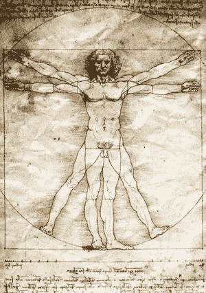
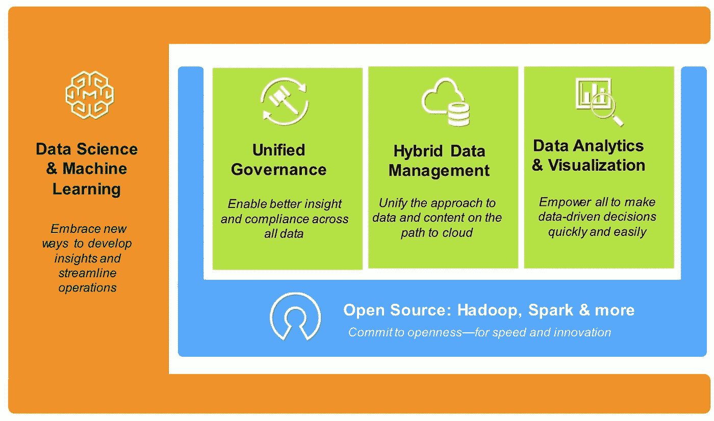
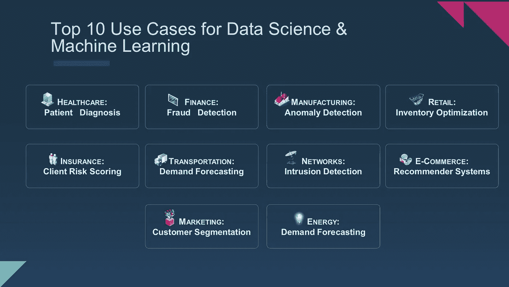

# 数据科学复兴

> 原文：<https://towardsdatascience.com/the-data-science-renaissance-166cddde898f?source=collection_archive---------3----------------------->

“如果人们知道我是多么努力才掌握这门技能，那就一点也不美妙了。”——米开朗基罗

复兴意味着重生。多种因素同时出现，可以引发重生。在分析领域，我们正面临着一系列因素的叠加:经济混乱、[大规模再培训](http://www.robdthomas.com/2015/10/preparing-your-career-for-data-science.html)，以及前所未有的数据访问。这些因素的结合正在引发数据科学的重生，专家主导的模式已经成为过去。历史是一位伟大的老师，它证明了文艺复兴与最初的文艺复兴并没有太大的不同。

文艺复兴是 15 世纪初发生在意大利的一个发展。文艺复兴时期的艺术家们打破了常规(简单的风格),开创了表现主义的新时代。归根结底，文艺复兴是一种新的思维方式，这引发了一段时间的艺术创新。

17 世纪晚期，佛罗伦萨成为一个富裕的城市，富人用他们的财富雇佣当地的工匠。正如通常发生的那样，这场运动导致了竞争，而竞争反过来又激发了创造力。这种情况一直持续到 14 世纪美第奇家族在佛罗伦萨掌权，并利用他们的金钱和影响力继续这场运动。在 15 世纪，文艺复兴从它的发源地佛罗伦萨迅速传播到意大利的其他地方，然后传播到欧洲的其他地方。

虽然这一时期创作了许多艺术杰作，但与文艺复兴联系最紧密的可能是《维特鲁威人的素描》。结合了一个圆形和一个正方形，中间是人，这件作品象征着两个事物的结合:天上的和地上的。这个想法是由作家维特鲁威首次提出的，并以此命名。但是，达芬奇被认为是第一个以解剖学上正确的方式阐述了这个观点。这提醒我们，那些有独到见解的人，并不总是那些在历史上留下印记的人。

数据科学的现代复兴也是一种新的思维方式，与多年前意大利的文艺复兴有许多相似之处:

1)它是经济驱动的，因为计算、存储和数据的成本使得新工匠启蒙运动的资金成为可能。

2)新的工匠可以是任何人，而不仅仅是少数富人或受过某种训练的人。数据科学的专家模式正在终结。

3)数据和科学的应用和融合正在结合成现代的未来愿景:通过机器学习和深度学习的应用实现持续智能。

如果没有一系列预先存在的条件，意大利的文艺复兴和数据科学的文艺复兴都不会存在。在这两种情况下，市场条件激发了创造力，并成为未来创新的起点。就佛罗伦萨的工匠而言，当他们开始理解科学及其应用时，新技术可能会超出他们的想象(想想列奥纳多早期的直升机图纸)。同样，今天的数据科学复兴正在决定每个行业的赢家和输家，在新技术应用的推动下，那些适应的人将生存下来。

今天，旨在利用数据科学的组织本能地知道他们需要做什么，只是有一个指示性的路线图，这将导致成功和领导地位。大多数公司会跳到模型构建和算法选择。对一些公司来说，这是正确的起点。但对另一些人来说，这可能有点过了。

查理·芒格讲述了一个故事，一架飞机正飞越地中海，朝着一个充满异国情调的地方飞去。飞行员的声音通过对讲机传来，说道:“刚刚发生了一件可怕的事情，我们将不得不进行水上迫降。飞机将在水上停留足够长的时间，以便打开舱门，让所有人都出去。我们必须有序地做这件事。所有会游泳的人都去右翼站着，所有不会游泳的人都去左翼站着。”

飞行员继续说道，“右翼的人，你们会发现两英里外有一个小岛。飞机沉下去了，游到岛上就没事了。对于左翼人士，我们要感谢你们今天与我们一起飞行。”

大多数组织感觉他们被飞机的左翼抛弃了。没有指导，没有帮助。只是一系列明显的挑战。机器学习问题是数据问题。数据科学将从根本上改变、自动化和优化所有行业。但是，它从基础开始:数据和分析的基本元素。

数据策略是数据科学的推动者，因为在将数据输入模型之前，所有数据都是脏的。数据和分析的 5 个基本要素为数据科学的复兴创造了适当的先决条件。

这 5 个基本要素是:

**开源**是全面分析战略的关键促成因素。开放确保创新和速度，同时链接到位于开放平台之上的创新。开源是一个永恒的创新社区。

**统一治理**对于洞察力和合规性是必要的。统一治理对数据的作用就像图书馆对书籍的作用一样。组织、编目、屏蔽、保护、归档任何资产，并使其能够立即被找到。数据库提供了洞察力，但也提供了对关键法规的遵从性(如 GDPR)。

**混合数据管理**让组织做好应对多云世界的准备。它使内部和私有云数据投资与公共云部署保持一致。无论关注的是非结构化数据还是结构化数据，数据管理的未来都是私有/公共的，两者之间无缝集成。

**可视化**是关于数据发现的。理解数据资产，以用户期望的形式呈现它们，并使数据能够被操作和浏览。这是动态的、实时的，不是静态的。

**机器学习和数据科学**是所有分析要素的组成部分。这是“哈哈”时刻的来源，因为一个组织增强并自动化了决策制定和运营。构建、部署和训练模型。不断学习新的数据。机器学习和数据科学必须驻留在数据驻留的位置，以实现最大影响。

每个人、每个部门、每个组织的起点都不一样。但是，这五个要素是一致的。它们是成功复兴的先决条件。虽然许多组织已经在这些领域中的每一个领域做了一些事情，但是大多数都是在前一个时代完成的。

我们正在进入一个简约的新时代。分析和数据科学方法必须简单:在 15 分钟或更短时间内安装并运行。在以前漫长而昂贵的项目时代，IT 部门是替罪羊。在这个新时代，它不再是业务转型的受害者。相反，就像 1400 年意大利的美第奇家族一样，它领导并促成了这场文艺复兴。

数据科学正在形成，机器学习用例引领了方向。公司开始通过机器学习取得胜利，并且有可重复的模式来推动结果。以一家制药公司为例，该公司习惯于新药需要 12-14 年才能上市的市场，平均成本为 26 亿美元。在这个[案例](https://elifesciences.org/content/5/e10047)中，应用了数据科学和机器学习，将成本降低了 70%。该算法在两个不同的数据集上进行训练，一个是各种化学品的毒性，另一个是已批准药物的已知副作用。根据这两个数据集，该算法能够以合理的准确度预测药物的毒性。

出现了许多用例。以下是我今天看到的前 10 名:

这里唯一不变的就是变化。我预计前 10 名将每 6-12 个月出现一次。

如前所述，虽然达芬奇是第一个正确画出维特鲁威人的人，但历史表明他并不是自己想出这个主意的。秘诀是让几何图形偏离中心，这归功于贾科莫·安德里亚·达·费拉拉。贾科莫·安德里亚的版本充满了反复，最终取得了成功。他和达芬奇是同事，一起吃饭，还被看到在一起。然而，历史只记得达芬奇的版本。

不同之处在于对行动的偏好。达芬奇付诸行动，其他人只是迭代，停留在实验模式。复兴是对行动的呼唤，而不是对反思的呼唤。现在是数据科学的时代了。

订阅阅读更多关于数据科学和领导力的信息[点击这里](http://www.robdthomas.com)。

点击这里开始学习数据科学[。](https://datascience.ibm.com)