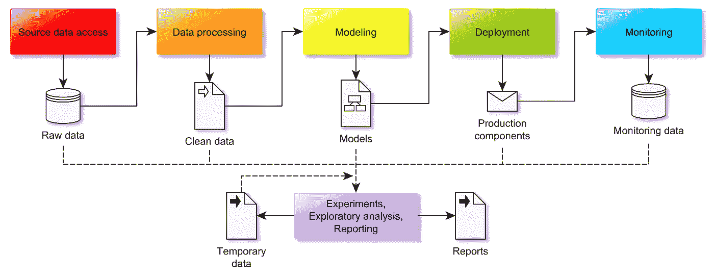
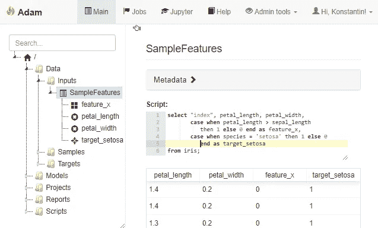
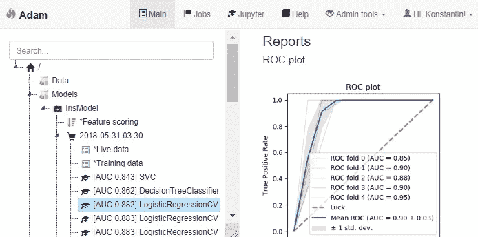
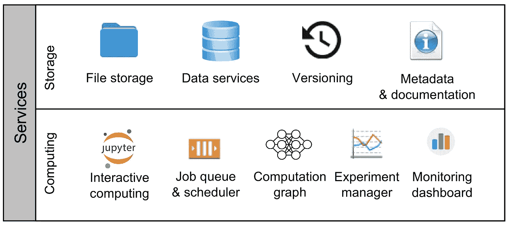

# 数据科学工作流程

> 原文：<https://towardsdatascience.com/the-data-science-workflow-43859db0415?source=collection_archive---------4----------------------->

假设您正在开始一个新的数据科学项目(可能是一个数据集的简短分析，也可能是一个复杂的多年合作)。你应该如何组织你的工作流程？你把数据和代码放在哪里？你用什么工具，为什么？一般来说，在一头扎进你的数据之前，你应该考虑什么？在软件工程行业中，这样的问题有一些众所周知的答案。尽管每个软件公司都有其独特的特点和怪癖，但大多数公司的核心流程都是基于相同的既定原则、实践和工具。这些原则在教科书和大学里都有描述。

数据科学是一个不太成熟的行业，事情不一样。虽然你可以找到各种各样的[模板项目](https://drivendata.github.io/cookiecutter-data-science/)、[文章](https://journals.plos.org/ploscompbiol/article?id=10.1371/journal.pcbi.1000424)、[blo](/structure-and-automated-workflow-for-a-machine-learning-project-2fa30d661c1e)g[po](https://medium.com/datadriveninvestor/the-data-science-method-dsm-a-framework-on-how-to-take-your-data-science-projects-to-the-next-91f9fd81e5d1)s[ts](https://medium.com/thelaunchpad)、[讨论](https://stackoverflow.com/questions/3759723/best-way-to-organize-bioinformatics-projects)，或者[专门的平台](https://docs.google.com/spreadsheets/u/1/d/1ZHLzlMdBEHDorCUEeeiSx3WAgfLGw34pC08C9T0IMkE/edit?usp=sharing)(开源 [1](https://github.com/mitdbg/modeldb) 、 [2](https://dvc.org/) 、 [3](https://github.com/datmo/datmo) 、 [4](https://www.mlflow.org/) 、 [5](https://github.com/TensorLab/tensorfx) 、) 商业[ [11](https://hyperdash.io/) ， [12](https://www.dataiku.com/) ， [13](https://quiltdata.com/) ， [14](https://neptune.ml/) ， [15](http://www.pachyderm.io/) ， [16](https://www.floydhub.com/) ， [17](https://www.comet.ml/) 和内部[ [18](https://code.fb.com/ml-applications/introducing-fblearner-flow-facebook-s-ai-backbone/) ， [19](https://www.tensorflow.org/tfx/) ， [20](https://eng.uber.com/michelangelo/) ]帮助您组织工作流程的各个部分 每个数据科学家最终都会形成自己的个人偏好，这些偏好大多是从经验和错误中获得的。我也不例外。随着时间的推移，我逐渐理解了什么是典型的“数据科学项目”，它应该如何构建，应该使用什么工具，以及应该考虑什么。我想在这篇文章中分享我的观点。

## 工作流程

尽管数据科学项目在目标、规模和使用的技术方面可能有很大差异，但在一定的抽象级别上，大多数项目都可以按照以下工作流来实现:



彩色方框表示关键过程，而图标分别表示输入和输出。根据项目的不同，关注点可能在某个过程上。其中一些可能相当复杂，而另一些则微不足道或缺失。例如，科学数据分析项目通常缺少“部署”和“监控”组件。现在让我们逐一考虑每一步。

## 源数据访问

无论你是在研究人类基因组还是在玩`[iris.csv](https://en.wikipedia.org/wiki/Iris_flower_data_set)`，你通常都有一些“原始源数据”的概念来开始你的项目。它可能是一个包含`*.csv`文件的目录，一个 SQL 服务器或 HDFS 集群中的一个表。数据可以是固定的、不断变化的、自动生成的或流式的。它可以存储在本地或云中。无论如何，您的第一步是*定义对源数据的访问*。以下是这种情况的一些例子:

*   您的源数据以一组`*.csv`文件的形式提供。您遵循[cookiecutter-data-science](https://drivendata.github.io/cookiecutter-data-science/)方法，在项目的根文件夹中创建一个`data/raw`子目录，并将所有文件放在那里。您创建了`docs/data.rst`文件，在这里您描述了源数据的含义。(注:Cookiecutter-DataScience 模板实际上推荐`references/`作为数据字典的位置，而我个人更喜欢`docs`。不是说关系很大)。
*   您的源数据以一组`*.csv`文件的形式提供。您设置了一个 SQL server，创建了一个名为`raw`的模式，并将所有 CSV 文件作为单独的表导入。您创建了`docs/data.rst`文件，其中描述了源数据的含义以及 SQL server 的位置和访问过程。
*   您的源数据是基因组序列文件、患者记录、Excel 文件和 Word 文档的杂乱集合，这些数据可能会以不可预测的方式增长。此外，您知道您将需要查询几个外部网站来接收额外的信息。您在云中创建一个 SQL 数据库服务器，并从那里的 Excel 文件中导入大多数表。您在项目中创建了`data/raw`目录，将所有巨大的基因组序列文件放入 dna 子目录中。有些 Excel 文件太脏，无法导入到数据库表中，所以您将它们与 Word 文件一起存储在`data/raw/unprocessed`目录中。你创建一个亚马逊 S3 桶，并使用 [DVC](https://dvc.org/) 将你的整个`data/raw`目录推到那里。您创建了一个用于查询外部网站的 Python 包。您创建了`docs/data.rst`文件，其中指定了 SQL server、S3 桶、外部网站的位置，描述了如何使用 DVC 从 S3 下载数据，以及如何使用 Python 包来查询网站。您还应尽可能描述所有 Excel 和 Word 文件的含义和内容，以及添加新数据时应采取的步骤。
*   您的源数据由不断更新的网站日志组成。您设置了 [ELK stack](https://www.elastic.co/elk-stack) 并配置了网站以在那里传输所有新日志。您创建了`docs/data.rst`，在这里您描述了日志记录的内容以及访问和配置 ELK 堆栈所需的信息。
*   您的源数据由 100，000 幅大小为 128x128 的彩色图像组成。你将所有的图像放入一个大小为 100，000 x 128 x 128 x 3 的张量中，并保存在一个 HDF5 文件`images.h5`中。您创建一个 [Quilt](https://quiltdata.com/) 数据包，并将其推送到您的私有 Quilt 存储库中。您创建了`docs/data.rst`文件，在这里您描述了为了使用数据，必须首先通过`quilt install mypkg/images`将数据拉入工作区，然后通过`from quilt.data.mypkg import images`导入代码。
*   您的源数据是模拟数据集。您将数据集生成实现为一个 Python 类，并在一个`README.txt`文件中记录它的使用。

通常，在设置源数据时，请记住以下经验法则:

*   每当你*能够*以方便查询/索引的形式(SQL 数据库、ELK 堆栈、HDF5 文件或[栅格数据库](http://www.rasdaman.org/))有意义地存储你的源数据时，你*应该*去做。即使您的源数据是一个单独的`csv`并且您不愿意建立一个服务器，也可以帮自己一个忙，将它导入到一个 SQLite 文件中。如果您的数据很好而且干净，它可以简单到:

*   如果你在团队中工作，确保数据易于共享。使用 NFS 分区、S3 桶、Git-LFS 库、被子包等等。
*   确保您的源数据始终是只读的，并且您有一个备份副本。
*   花点时间*记录*您所有数据的含义及其位置和访问程序。
*   总的来说，要非常认真地对待这一步。您在这里犯的任何错误，不管是无效的源文件、被误解的特性名称还是配置错误的服务器，都可能会浪费您大量的时间和精力。

## 数据处理

*数据处理*步骤的目的是将源数据转换成“干净”的形式，适用于随后的*建模*阶段。在大多数情况下，这种“干净”的形式是一个特征表，因此“数据处理”的要点通常可以归结为[特征工程*的各种形式*](https://www.logicalclocks.com/feature-store/)。这里的核心需求是确保特征工程逻辑是可维护的，目标数据集是可再现的，有时，整个管道是可追踪的，否则你将无法部署模型。如果在明确描述的*计算图*中组织处理，则可以满足所有这些要求。然而，实现该图有不同的可能性。以下是一些例子:

*   您遵循[cookiecutter-data-science](https://drivendata.github.io/cookiecutter-data-science/)路线，而[使用 Makefiles](/structure-and-automated-workflow-for-a-machine-learning-project-2fa30d661c1e) 来描述计算图。每个步骤都在一个脚本中实现，该脚本将一些数据文件作为输入，并生成一个新的数据文件作为输出，该文件存储在项目的`data/interim`或`data/processed`子目录中。您可以通过`make -j <njobs>`享受简单的并行计算。
*   你依靠 [DVC](https://dvc.org/) 而不是 Makefiles 来描述和执行计算图。整个过程在很大程度上类似于上面的解决方案，但是您获得了一些额外的便利特性，比如结果文件的轻松共享。
*   你用[路易吉](https://github.com/spotify/luigi)、[气流](https://airflow.apache.org/)或[任何其他](https://github.com/meirwah/awesome-workflow-engines)专用[工作流管理系统](https://en.wikipedia.org/wiki/Workflow_management_system)代替 Makefiles 来描述和执行计算图。除了其他方面，这通常会让您在一个基于 web 的仪表板上观察您的计算进度，与计算集群的作业队列集成，或者提供一些其他特定于工具的好处。
*   所有的源数据都作为一组表存储在 SQL 数据库中。您根据 [SQL 视图](https://en.wikipedia.org/wiki/View_(SQL))实现所有的特征提取逻辑。此外，您使用 SQL 视图来描述对象的*样本*。然后，您可以使用这些特征视图和样本视图，通过自动生成的查询来创建最终的建模数据集，例如

这种特殊的方法非常通用，所以让我稍微扩展一下。首先，它让您可以轻松地跟踪所有当前定义的特性，而不必将它们存储在庞大的数据表中——特性定义只作为代码保存，直到您实际查询它们。其次，将模型部署到生产环境变得相当简单——假设动态数据库使用相同的模式，您只需要复制各自的视图。此外，您甚至可以使用一系列 CTE 语句将所有特征定义与最终模型预测计算一起编译到单个查询中:

这项技术已经在我设计的一个内部数据科学工作台工具中实现了(不幸的是，目前还没有公开提供)，并提供了一个非常简化的工作流。



Example of an SQL-based feature engineering pipeline

无论您选择哪种方式，请记住以下几点:

1.  始终以*计算图*的形式组织加工，并牢记*再现性*。
2.  这是您必须考虑您可能需要的计算基础架构的地方。你打算进行长时间的计算吗？您需要并行化还是租用集群？使用带有管理 UI 的作业队列来跟踪任务执行，您会从中受益吗？
3.  如果您计划稍后将模型部署到生产中，请确保您的系统将支持这个开箱即用的用例。例如，如果你正在开发一个包含在 Java Android 应用程序中的模型，但你更喜欢用 Python 来做你的数据科学，一个避免未来许多*麻烦的可能性是用一个特别设计的 DSL 而不是免费的 Python 来表达你所有的数据处理。然后，这个 DSL 可以被翻译成 Java 或者像 PMML 这样的中间格式。*
4.  考虑存储一些关于你设计的特性或临时计算的元数据*。*这并不复杂——例如，您可以将每个特征列保存到一个单独的文件中，或者使用 Python 函数注释，用输出列表来注释每个特征生成函数。如果你的项目很长，并且涉及到几个人设计特性，拥有这样一个注册表可能会非常有用。

## 建模

一旦你完成了清理数据、选择合适的样本和设计有用的特征，你就进入了*建模*的领域。在一些项目中，所有的建模都归结为一个简单的`m.fit(X,y)`命令或者一个按钮的点击。在其他情况下，可能需要数周的重复和实验。通常，您会在“特性工程”阶段就开始建模，当您决定一个模型的输出有助于伟大的特性本身时，所以这一步和前一步之间的实际界限是模糊的。这两个步骤都应该是*可重复的*，并且必须成为你的*计算图*的一部分。两者都围绕计算，有时涉及作业队列或集群。尽管如此，单独考虑建模步骤仍然是有意义的，因为它有一个特殊的需求:*实验管理*。像以前一样，让我用例子来解释我的意思。

*   您正在训练用于在`iris.csv`数据集中对虹膜进行分类的模型。你需要尝试十个左右的标准`sklearn`模型，对每个模型应用一些不同的参数值，并测试你手工制作的特征的不同子集。你没有一个合适的计算图或计算基础设施——你只是在一个 Jupyter 笔记本上工作。但是，您要确保所有训练运行的结果都保存在单独的 pickle 文件中，您可以在以后分析这些文件以选择最佳模型。
*   您正在设计一个基于神经网络的图像分类模型。你用 [ModelDB](http://modeldb.csail.mit.edu:3000/projects/) (或者替代的实验管理工具，比如 [TensorBoard](https://www.tensorflow.org/guide/summaries_and_tensorboard) 、[神圣](https://github.com/IDSIA/sacred)、 [FGLab](https://kaixhin.github.io/FGLab/) 、 [Hyperdash](https://hyperdash.io/) 、 [FloydHub](https://www.floydhub.com/) 、 [Comet。ML](https://www.comet.ml/) ， [DatMo](https://github.com/datmo/datmo) ， [MLFlow](https://www.mlflow.org/) ，…)记录所有实验的学习曲线和结果，以便以后选择最好的一个。
*   您使用 Makefiles(或 DVC，或工作流引擎)来实现整个管道。模型训练只是计算图中的一个步骤，它输出一个`model-<id>.pkl`文件，将模型最终 AUC 分数附加到一个 CSV 文件，并创建一个`model-<id>.html`报告，其中包含一系列有用的模型性能图表，供以后评估。
*   这是实验管理/模型版本化在上面提到的定制工作台的 UI 中的样子:



要点是:决定如何计划用不同的超参数拟合多个模型，然后选择最佳结果。您不必依赖复杂的工具——如果使用一致，有时甚至手动更新的 Excel 表格也能很好地工作。然而，如果你计划进行冗长的神经网络训练，请考虑使用基于网络的仪表板。所有酷小孩都这么做。

## 模型部署

除非您的项目纯粹是探索性的，否则您可能需要将您的最终模型部署到生产中。根据具体情况，这可能会是一个相当痛苦的步骤，但是仔细的计划会减轻痛苦。以下是一些例子:

*   您的建模管道用训练好的模型吐出一个 pickle 文件。所有的数据访问和特征工程代码都是作为一组 Python 函数实现的。您需要将您的模型部署到 Python 应用程序中。您创建一个 Python 包，其中包含必要的函数和模型 pickle 文件，作为里面的[文件资源](https://docs.python.org/3/library/importlib.html#module-importlib.resources)。你记得测试你的代码。部署过程是一个简单的包安装，然后运行集成测试。
*   您的管道用训练好的模型吐出一个 pickle 文件。为了部署这个模型，您[使用 Flask](/a-flask-api-for-serving-scikit-learn-models-c8bcdaa41daa) 创建一个 REST 服务，将其打包成 docker 容器，并通过您公司的 Kubernetes 云提供服务。或者，你[将保存的模型上传到一个 S3 桶，然后通过亚马逊λ](https://datascience.com.co/creating-an-api-using-scikit-learn-aws-lambda-s3-and-amazon-api-gateway-d9d10317e38d)提供服务。您要确保您的部署已经过测试。
*   你的训练管道产生一个张量流模型。您使用 [Tensorflow Serving](https://medium.com/zendesk-engineering/how-zendesk-serves-tensorflow-models-in-production-751ee22f0f4b) (或[任何一个备选方案](https://medium.com/@vikati/the-rise-of-the-model-servers-9395522b6c58))作为 REST 服务。您不要忘记创建测试，并在每次更新模型时运行它们。
*   你的管道[产生](https://stackoverflow.com/questions/33221331/export-python-scikit-learn-models-into-pmml) [一个](https://cran.r-project.org/web/packages/pmml/index.html) [PMML](https://en.wikipedia.org/wiki/Predictive_Model_Markup_Language) 文件。您的 Java 应用程序可以使用 [JPMML](https://github.com/jpmml) 库来读取它。您确保您的 PMML 出口商在 PMML 文件中包含模型验证测试。
*   您的管道以定制的 JSON 格式保存模型和预处理步骤的描述。为了将它部署到您的 C#应用程序中，您开发了一个知道如何加载和执行这些 JSON 编码的模型的专用组件。确保对 Python 中的模型导出代码、C#中的模型导入代码以及您部署的每个新模型的预测进行 100%的测试。
*   您的管道使用 [SKompiler](https://github.com/konstantint/SKompiler) 将模型编译成 SQL 查询。将这个查询硬编码到应用程序中。你记得关于测试的事。
*   你通过付费服务训练你的模型，这也提供了一种将它们发布为 REST 的方式(例如 [Azure ML Studio](https://studio.azureml.net/) ， [YHat ScienceOps](http://docs.yhat.com/) )。你付了很多钱，但你仍然测试部署。

总结一下:

1.  有许多方法可以部署一个模型。确保你了解你的情况并提前计划。您是否需要将模型部署到用不同于您用来训练它的语言编写的代码库中？如果您决定通过 REST 为其提供服务，那么该服务期望什么样的负载，它应该能够批量预测吗？如果你打算购买一项服务，估计一下它会花你多少钱。如果您决定使用 PMML，请确保它能够支持您预期的预处理逻辑和您计划使用的奇特的随机森林实现。如果您在培训期间使用了第三方数据源，请考虑您是否需要在生产中与它们集成，以及您将如何在从您的管道导出的模型中编码这些访问信息。
2.  一旦您将您的模型部署到生产中，它就从数据科学的人工制品变成了实际的代码，因此应该符合应用程序代码的所有要求。这意味着*测试*。理想情况下，您的部署管道应该生成用于部署的模型包以及测试该模型所需的一切(例如，样本数据)。模型从它的诞生地转移到生产环境后，停止正确工作的情况并不少见。可能是导出代码的 bug，可能是`pickle`版本不匹配，可能是 REST 调用中输入转换错误。除非您显式地测试已部署模型的预测的正确性，否则您将冒着在不知道的情况下运行无效模型的风险。一切看起来都很好，因为它会继续预测一些值，只是一些错误的值。

## 模型监控

当您将模型部署到生产中时，您的数据科学项目并没有结束。热度还在。也许在你的训练集中输入的分布与真实生活不同。也许这种分布漂移缓慢，模型需要重新训练或重新校准。也许这个系统没有像你预期的那样工作。也许你对 A-B 测试感兴趣。在任何情况下，您都应该设置基础设施来持续收集关于模型性能的数据并对其进行监控。这通常意味着设置可视化仪表板，因此主要示例如下:

*   对于你的模型的每个请求，你将输入和模型的输出保存到 [logstash](https://www.elastic.co/guide/en/logstash/current/getting-started-with-logstash.html) 或者一个数据库表(确保你以某种方式保持 [GDPR](https://en.wikipedia.org/wiki/General_Data_Protection_Regulation) 兼容)。您设置[元数据库](https://www.metabase.com/)(或[表格](https://www.tableau.com/)、 [MyDBR](https://mydbr.com/) 、 [Grafana](https://grafana.com/) 、[等](https://www.quora.com/Is-there-an-inexpensive-alternative-to-Tableau))并创建可视化您的模型的性能和校准指标的报告。

## 勘探和报告

在数据科学项目的整个生命周期中，为了探索数据、尝试各种假设、制作图表或报告，您必须不断地避开主要的建模管道。这些任务在两个重要方面不同于主要管道。

首先，它们中的大多数没有*具有*可再现性。也就是说，您不一定需要像处理数据预处理和模型拟合逻辑那样将它们包含在计算图中。当然，您应该总是*尝试*坚持可再现性——当您拥有从原始数据重新生成给定报告的所有代码时，这是非常好的，但是在许多情况下，这种争论是不必要的。有时在 Jupyter 中手工制作一些图表，然后粘贴到 Powerpoint 演示文稿中就可以了，不需要过度设计。

第二，*实际上*这些“探索”任务有问题的特殊性在于，它们往往有些杂乱无章和不可预测。有一天，您可能需要分析性能监控日志中一个奇怪的异常值。第二天你想测试一个新的算法，等等。如果您没有决定一个合适的文件夹结构，很快您的项目目录将充满了奇怪名称的笔记本，团队中没有人会明白什么是什么。这些年来，对于这个问题，我差不多只找到了一个可行的解决方案:*按日期*给子项目排序。即:

*   您在项目文件夹中创建一个`projects`目录。您同意每个“探索性”项目必须创建一个名为`projects/YYYY-MM-DD - Subproject title`的文件夹，其中`YYYY-MM-DD`是子项目开始的日期。经过一年的工作，你的`projects`文件夹看起来如下:

```
./2017-01-19 - Training prototype/
                (README, unsorted files)
./2017-01-25 - Planning slides/
                (README, slides, images, notebook)
./2017-02-03 - LTV estimates/
                 README
                 tasks/
                   (another set of 
                    date-ordered subfolders)
./2017-02-10 - Cleanup script/
                 README
                 script.py
./... 50 folders more ...
```

请注意，您可以根据需要自由组织每个子项目的内部结构。特别是，它本身甚至可能是一个“数据科学项目”，有自己的`raw/processed`数据子文件夹，自己的基于 Makefile 的计算图，以及自己的子项目(在这种情况下，我倾向于将其命名为`tasks`)。在任何情况下，总是记录每个子项目(至少有一个`README`文件)。有时有一个根文件`projects/README.txt`会有所帮助，它简要地列出了每个子项目目录的含义。

最终您可能会发现项目列表变得太长，并决定重新组织`projects`目录。你压缩了其中的一些文件，并移动到一个`archive`文件夹中。您重组了一些相关的项目，并将它们移动到某个父项目的`tasks`子目录中。

探索任务有两种风格。有些任务是真正的一次性分析，可以使用 Jupyter 笔记本解决，永远不会再次执行。其他的目标是产生*可重用的*代码(不要与*可重复的*输出混淆)。我发现为如何保存可重用代码建立一些约定是很重要的。例如，惯例可能是在子项目的根中有一个名为`script.py`的文件，它在执行时输出一个基于`argparse`的帮助消息。或者您可能决定要求提供一个`run`函数，配置为一个[芹菜](http://docs.celeryproject.org/en/latest/)任务，这样它可以很容易地提交到作业队列。也可能是别的——什么都可以，只要一致。

## 服务清单

对于数据科学工作流，还有另外一个正交的视角，我觉得很有用。也就是说，我们可以讨论数据科学项目通常依赖的关键服务*而不是按照*流程*的管道来谈论它。通过这种方式，您可以具体说明以下 9 项关键服务的具体提供方式，从而描述您的特定(或所需)设置:*



1.  **文件存储**。你的项目必须有一个家。通常这个家必须由团队共享。它是网络驱动器上的文件夹吗？它是 Git 存储库的工作文件夹吗？你如何组织它的内容？
2.  **数据服务**。你如何存储和访问你的*数据*？这里的“数据”包括您的源数据、中间结果、对第三方数据集的访问、元数据、模型和报告——实质上是由计算机读取或写入的一切。是的，保存一堆 HDF5 文件也是“数据服务”的一个例子。
3.  **版本化**。代码、数据、模型、报告和文档——一切都应该在某种形式的版本控制下保存。Git 换代码？被子换数据？模特的 DVC？报表的 Dropbox？文档维基？一旦我们做到了，不要忘记为每件事建立常规备份。
4.  **元数据和文档**。你如何记录你的项目或子项目？您是否维护关于您的要素、脚本、数据集或模型的任何机器可读元数据？
5.  **交互计算**。交互式计算是数据科学中大多数艰苦工作的完成方式。你用 JupyterLab，RStudio，ROOT，Octave 还是 Matlab？您是否为交互式并行计算设置了集群(例如 ipyparallel 或 dask)？
6.  **作业队列&调度器**。你如何运行你的代码？您使用作业处理队列吗？您有能力(或需要)安排定期维护任务吗？
7.  **计算图**。你如何描述计算图并建立再现性？Makefiles？DVC？气流？
8.  **实验经理**。你如何收集、查看和分析模型训练进度和结果？ModelDB？超破折号？FloydHub？
9.  **监控仪表板**。你如何收集和跟踪模型在生产中的表现？元数据库？画面？PowerBI？格拉夫纳？

## 工具

这里有一个小的[电子表格](https://docs.google.com/spreadsheets/d/1ZHLzlMdBEHDorCUEeeiSx3WAgfLGw34pC08C9T0IMkE/edit?usp=sharing)，列出了这篇文章中提到的工具(以及一些我添加或稍后将添加的额外工具)，根据它们旨在支持数据科学工作流的哪个阶段(按照这篇文章中定义的术语)对它们进行分类。免责声明——我确实尝试了大部分，但不是全部。特别是，我对列表中的非免费解决方案的能力的理解，到目前为止只是基于他们的在线演示或网站上的描述。

*原载于 2018 年 11 月 29 日*[*four years . eu*](http://fouryears.eu/2018/11/29/the-data-science-workflow/)*。*