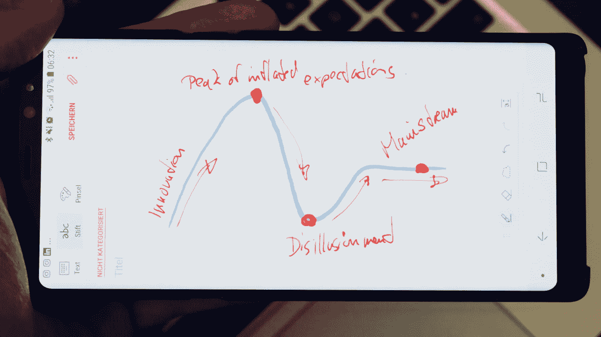

# Gartner 炒作周期巅峰的深度学习炒作

> 原文：<https://towardsdatascience.com/the-deep-learning-hype-at-the-peak-of-gartners-hype-cycle-35fbccb7aa16?source=collection_archive---------9----------------------->

目前围绕深度学习有一个巨大的炒作。你也可以在 Gartner 的炒作周期中看到这一点。

什么是炒作周期，它是如何运作的？继续阅读以了解更多信息。

一段时间以来，Gartner 一直在为许多领域创造炒作周期，如机器学习、大数据等。我个人用它们来发现一项技术已经走了多远。

例如，像深度学习这样的技术已经走了多远。从想法、开发、第一次实现，进入生产力状态。

在这个国家，人们实际上从中受益，公司从中赚钱。Gartner 的炒作周期是一个非常好的工具。

# 炒作周期是怎样的

炒作周期是一条曲线，首先上升到一个顶点，然后下降到一个低点，然后回到一个平稳期。

## 创新ˌ革新

第一阶段当新技术出现时，创意被创造出来。这是创新阶段。

炒作周期是如何工作的，让我们看看深度学习(DL)的例子。它从左边开始，一路向弯道的山上驶去。

人们已经意识到 DL 是一个有趣的话题，人们正在为之努力。他们正在构思和尝试想法。

这是创新阶段。

越来越多的人这样做，DL 正在上升。

## 过高期望的顶峰

直到到达**第二阶段**:顶部。Gartner 将此称为膨胀预期的顶峰。

才是炒作真正大的时候。每个人都在谈论深度学习，每个人都在努力。人们认为数字图书馆是一项无处不在的技术，它影响着我们生活中的一切。

基本上，这是一个很多人认为你可以在任何地方实现某个东西并从中赚很多钱的时代。

这也是 2017 年当前炒作周期中 deep larning 的位置。

## 幻灭的低谷

接下来发生的是，随着越来越多的公司致力于此，他们意识到这比他们想象的要难。

DL 更难实现，更难开发，更难作为产品销售。这是很多人感到沮丧的时候，也是很多人放弃和公司倒闭的时候。

在这一点上，DL 的情况是它在走下坡路。它正在从膨胀的期望的顶峰走向低谷。

在这一点上，人们醒悟了，从炒作中醒来。

## 生产力的稳定期

从那一点开始，DL 将在下一座山上再往上走一点，到达一个平台。Gartner 称之为生产率的稳定期。

当一项技术经历了幻灭的低谷，达到生产力的平台期，那么它就被公众接受了。在 DL 的情况下，这将是我们每天与深度学习算法进行交互的时候。往往连自己都不知道。

这是生产力的高原，人们已经意识到你实际上可以用它做什么。

技术或工具是主流应用。

# 达到稳定状态的时间预测

同样非常有趣的是，Gartner 试图预见一个时间框架。炒作周期中的一个项目需要多长时间才能达到生产率的平台期。

因此，在人类扩增的情况下，我最喜欢的话题之一，Gartner 预测超过 10 年。这已经很多年没变了，:D

当你看其他技术时，你会发现这需要 5 年，2 到 5 年的时间。所以，你实际上可以预测一下，在整个炒作周期中，这需要多长时间。

我完全推荐的是不要只看今年的炒作周期。再看看过去几年的炒作周期。这样你就能感受到事情发生得有多快。

那些关于它需要多长时间才能达到右侧生产率稳定水平的预测发生了变化。年复一年，有时甚至技术完全从循环中消失。

前一年说是五年，第二年就完全消失了。这是因为它已经经历了炒作周期，已经达到了生产率的稳定期。

因为这不是精确的科学，这是 Gartner 的估计。

# 一个你必须使用的令人敬畏的工具

炒作周期是一个非常有趣的工具，它可以帮助你感受到事物出现的速度有多快。它试图预测某样东西成为主流需要多长时间。

所以，如果你想跟踪趋势，我强烈推荐 Gartner 炒作周期。

不仅新兴技术有许多炒作周期。谷歌一下，你会发现很多。

他们也会做一个分析，但是这个分析要花很多钱。但是炒作周期通常你可以谷歌一下就能找到。

## 你目前密切关注的趋势是什么？

你用炒作周期吗？还是在用别的？

请留下评论，这将是超级真棒☺

.

上打招呼:[insta gram](http://instagram.com/andreaskayy)|[LinkedIn](http://linkedin.com/in/andreas-kretz)|[脸书](http://facebook.com/andreaskayy)|[Twitter](https://twitter.com/andreaskayy)|[YouTube](https://youtube.com/andreaskayy)|[Snapchat](https://www.snapchat.com/add/andkret)

不要错过我在 [SoundCloud](https://soundcloud.com/andreaskayy) 上的每日数据科学和大数据播客

订阅我的简讯:[这里](http://andreaskretz.com/)