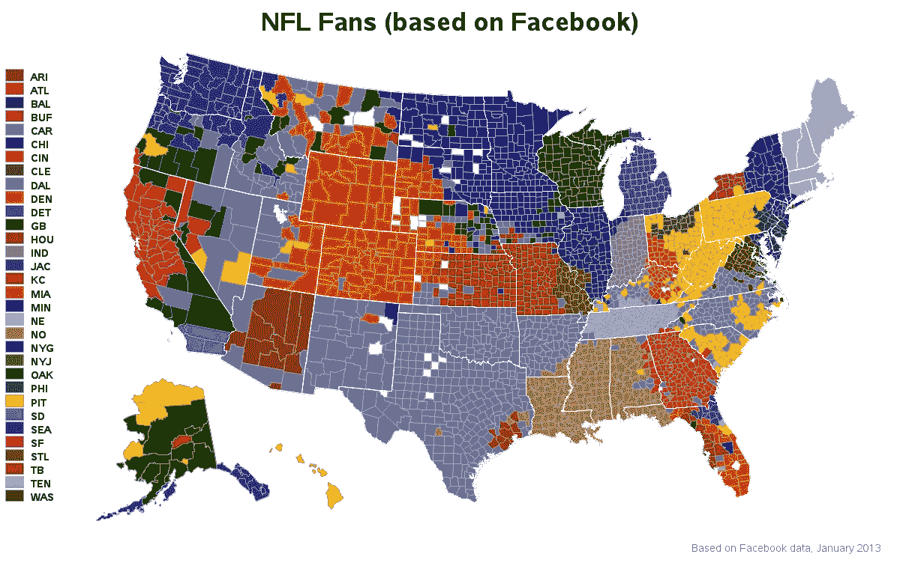
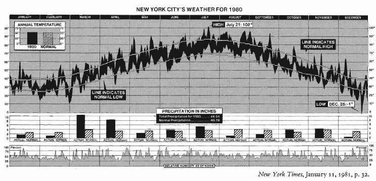
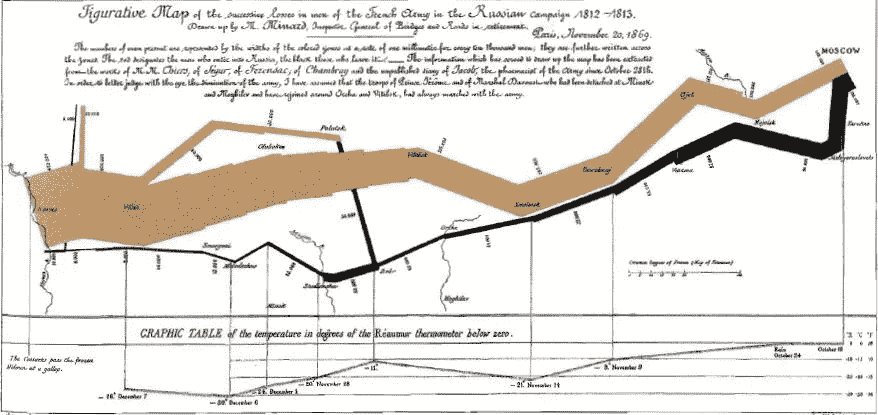
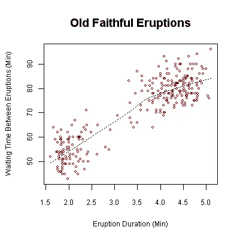
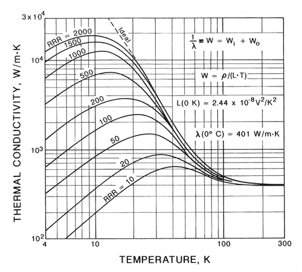

# 统计图形的设计

> 原文：<https://towardsdatascience.com/the-design-of-statistical-graphics-5265485e9bb5?source=collection_archive---------10----------------------->

## 一瞥信息丰富的图形世界

今天我们将学习人类大脑——枕叶是哺乳动物大脑中大脑皮层的四个主要叶之一。

没有吗？为什么我们在一篇应该是关于“统计图表”的文章中学习生物学？

嗯，视觉处理中心或大脑皮层处理和帮助我们解释视觉信息的部分，是我们在讨论复杂想法、不可思议的波动、上升和下降趋势、波动结构等描述时间接谈论的内容；如此清晰，精确和有序的连贯性。
这些正是我们所说的图形结构或统计图应该有的形容词。

数据的图形化展示给我们一个清晰的画面，在一个小空间里呈现如此多的想法和数字，帮助我们避免数据试图呈现的想法的扭曲，并最终服务于描述、探索、制表和装饰的合理清晰的目的。

统计图表，就像计算一样，只有输入进去的东西才是好的。一个定义糟糕的图表，一个不合适的模型，甚至一个营养不良的数据集，都不能被一个图表所拯救，不管它有多花哨或多吸引人。

> "我们需要理解、学习和采纳卓越图形化的实践."

我们需要理解、学习和采用图形化的优秀实践。换句话说，在正确的时间在正确的地方使用正确的图表，导致各种定量思想的完美沟通；这才是动机所在。

因此，要传达这一理念，理解实现图形卓越的艺术，进而欣赏这些图形能够表现数据的美；我们将学习并尝试理解以下基本的图形设计，想象并看看图形设计有多好，多迷人:

**1。资料图
2。时间序列
3。时空叙事设计
4。关系图形**

# **资料图**

数据地图基本上是制图表达和统计技能的结合，在当今的可视化中被广泛使用。

为了更好地理解数据映射，我们将以两个数据映射为例，对其进行一些分析。这些地图中的每一幅都描绘了大量的数据，这些数据只有在图片的帮助下才能可视化。在一个简洁的空间中承载大量的数据是这些数据地图的目标，并且成功地做到了这一点。此外，正如我们将看到的，这些地图使得可视化分析比使用如此庞大的数据集要容易得多。

对于第一个例子；这张地图显示了美国从 2000 年到 2006 年 35 岁以上的成年人中风死亡率。
颜色方案代表按每 100，000 人中的平均年死亡率调整的年龄。

Source: www.cdc.gov

现在，我们可以清楚地看出，在美国东南部和南部，中风的死亡率非常高。阿拉巴马州、密西西比州、路易斯安那州、阿肯色州、田纳西州、得克萨斯州、南卡罗来纳州和北卡罗来纳州以及受灾最严重的地区。西部的怀俄明州、南部的亚利桑那州和新墨西哥州以及远东的纽约州、佛蒙特州、新罕布什尔州、罗德岛州和康涅狄格州受影响最小。

现在让我们看另一个例子，我们将根据 32 支 NFL 球队来看美国的分区。

Source: [hermanhissjewelers.com](http://www.hermanhissjewelers.com/)

通过对下面的地图进行简单的视觉分析，我们可以确定并分辨出哪个州主要跟随哪个队。就地理范围而言，牛仔队确实是美国队。他们的粉丝帝国从加利福尼亚延伸到佛罗里达中部、弗吉尼亚南部到蒙大拿州北部。钢人队还有另一个庞大的球迷帝国，声称几乎整个宾夕法尼亚州，并横跨阿巴拉契亚和两个卡罗莱纳州。
现在，德克萨斯人的影响力很小，他们的粉丝群只覆盖休斯顿市区。德克萨斯的其余部分属于牛仔，路易斯安那西部属于圣徒。就黑豹队而言，他们的球迷基础覆盖了夏洛特周围的北卡罗莱纳州西部核心地区，但四周都是钢人队的球迷。

这个快速分析的目的是让你意识到并注意到，我们可以多快、多准确地预测数据集中比其他数据更重要的事物、点或模式，并将我们的注意力引向它们。

除了数据地图可能带来的所有缺陷之外，没有其他方法能够如此强大地显示统计信息。

# 时间序列

时间序列方法用一些内部结构来说明随着时间推移所获得的数据点；例如一些相关性或季节变化或趋势，其中一个维度沿着秒、分、小时、天、周、月、季度或年的节奏移动。这个图形模型所聚集的力量和效率来自时间尺度的自然秩序；它被用来做预测或者只是描绘一个及时的趋势。

例如，让我们看一个时间序列图，它显示了纽约市 1980 年的天气概况。该图有 1，888 个数据点，我们可以看到每日最高和最低温度与长期平均值的关系。正常温度的路径也提供了一年中预期变化的预测。例如，在 2 月中旬，纽约人可以期待以每周 1.5 度的速度变暖，一直到 7 月，这是一年一度的峰值。这张杰出的图表成功地组织了大量的数字，对不同部分的数据进行了比较，并讲述了一个故事。

Source: The Visual Display of Quantitative Information

此外，时间的流逝并不是最好的解释变量，当数据为我们提供了驱动 Y 变量的清晰机制时，偶尔会有例外。在这种情况下，我们需要采用另一种方法，那就是在图形设计中加入额外的变量，并给出一个随意的解释。

# 时空叙事设计

让我介绍一下，这是对时间序列显示的一个有效和增强的改进。将空间维度包括到时间序列图形的设计中，并使数据能够在多维空间中进行，而观察者甚至不会意识到图形是多维的，这就是时空设计所实现的。

我们将借助一个例子来试图理解这一点；法国工程师查尔斯·约瑟夫·密纳德(1781-1870)的经典作品，他以残酷而雄辩的设计展示了拿破仑军队在俄罗斯的可怕命运。

Source: Google Images

我们在这里看到的是数据地图和时间序列的惊人组合，描绘了拿破仑在 1812 年俄罗斯战役中遭受的一系列损失。绘制了六个变量:军队的规模、在 2D 表面上的位置、军队移动的方向(棕色和黑色区域)以及从莫斯科撤退期间不同日期的温度。

在左侧，我们可以看到粗流线，代表入侵俄罗斯的大军规模(422，000 人)。这条线的宽度表示地图上每个地方和实例的军队规模。我们可以看到，当军队在 9 月到达莫斯科时，人数少得可怜，只有近 10 万人。

拿破仑撤退的路线通过黑线显示，黑线与图表底部的温标和日期相联系。在向俄罗斯进军的过程中，许多士兵冻死了，因此可以观察到黑线明显变细。

在黑线的尽头，我们可以看到一条分界线。这一部分描绘了贝雷兹纳河的交叉点。这是一场彻底的灾难，我们可以看到黑线是如何突然变细的。军队最终艰难地退回波兰，只剩下 10，000 人。

米纳德的图表通过其多元数据告诉我们一个丰富而连贯的故事，比一组数字或线条聊天显示军队规模随时间的趋势更具启发性。

# 关系图形

数据图形概念的诞生需要用更抽象的方法来代替地图的经纬度坐标。对于各种图表的出现和存在，它需要努力和时间，因为过渡是一个大动作。对物理世界的类比导致了早期时间序列的发展。在 Lambert 和 Playfair 的伟大作品的帮助下，物理类比在相当长的一段时间内推动了图形设计的想法。这意味着可以在任何变量与另一个变量之间建立关系，只要它们具有相同的测量单位。由于这一最新的认识和对这一思想的接受，数据图形，因为它们是有关系的，不依赖于地理或时间坐标，变得与所有的定量研究相关。

今天，许多发表的图形都是关系型的，从饼状图、线图、条形图、散点图(所有设计中最伟大的)等等。

例如，美国怀俄明州黄石国家公园老忠实间歇泉的喷发间隔时间和喷发持续时间。这张图表表明，通常有两种类型的爆发:短时间的爆发和长时间的爆发。

Source: Wikipedia

在另一个例子中，我们有温度和铜的热导率之间的关系。该图表显示了从 4 K 到大约 300 K 的热导率和温度之间的关系。不同的曲线代表了不同等级的纯铜，通过剩余电阻率比率进行评级，其中 RRR =2000 为最高纯度。

我们观察到铜的热导率随着温度的降低而增加；我们还可以看到，从 300 K 到 200 K，热导率变化相对平缓，略有增加。

所以总结一下，什么是图形化的优秀？在最短的时间和最小的空间内给观众带来最多、最大数量的想法。而且，还要求对数据说实话。

> “至于用空间的一部分来表示金钱和时间的适当性和公正性，虽然大多数人都很容易同意，但似乎有少数人担心其中可能有一些他们没有意识到的欺骗……”
> —威廉·普莱费尔，《商业与政治地图集》(1786)