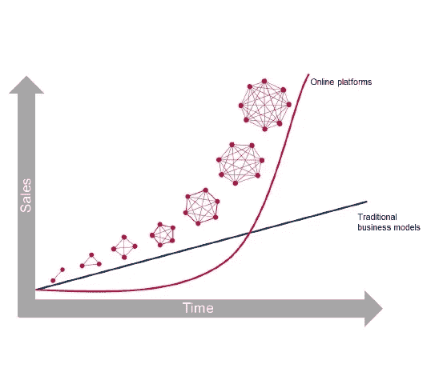
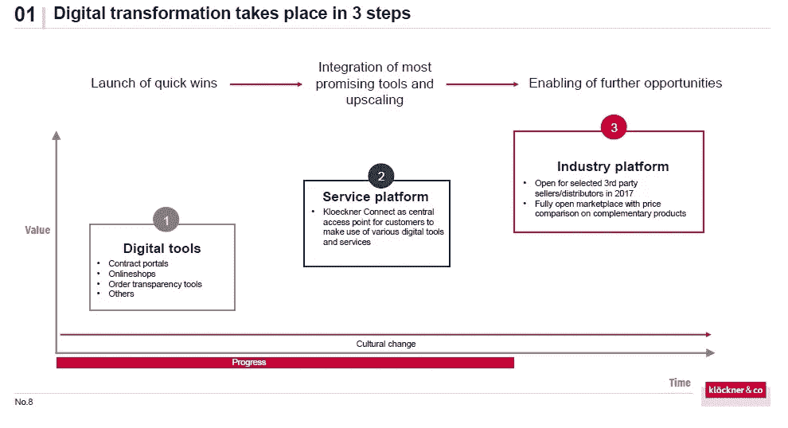
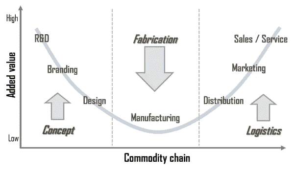
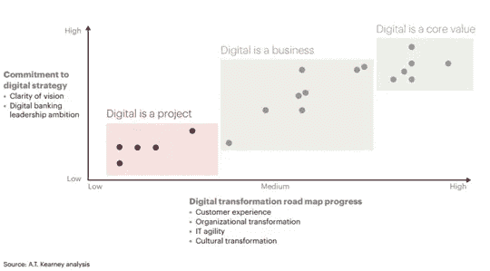
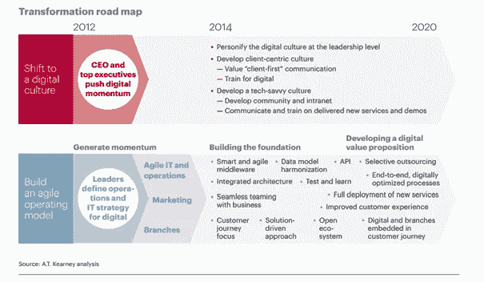

# 数据是业务转型的驱动力

> 原文：<https://towardsdatascience.com/the-drivers-of-ai-business-transformation-941c5c4bc685?source=collection_archive---------2----------------------->

Photo by [Headway](https://unsplash.com/@headwayio?utm_source=unsplash&utm_medium=referral&utm_content=creditCopyText) on [Unsplash](https://unsplash.com/s/photos/digital?utm_source=unsplash&utm_medium=referral&utm_content=creditCopyText)

在数字化转型的时代，人工智能将改变所有类型的组织，从驾驶汽车(计算机视觉技术)开始，然后是制造业(吴恩达[刚刚宣布](https://medium.com/@andrewng/revitalizing-manufacturing-through-ai-a9ad32e07814)他的[新公司](https://www.landing.ai/)利用人工智能改变制造业)。随着数据科学作为现代组织的核心战略的使用，这种变化将使新的创新业务模式和新的项目管理方法成为可能。

我想在这篇文章中展示这种新的[数字化转型](https://www.capgemini.com/resources/digital-transformation-a-roadmap-for-billiondollar-organizations/)的一些主要驱动力，以及对商业模式、社会和就业的潜在影响。在数据驱动的管理决策为组织提供动力的背景下，面对新的敏捷方法，旧的方法(高度官僚化、严格的范围和时间表)变得过时，组织应该尽快适应这种工资，而不失去他们的身份。

**1。以客户为中心的生产计划。**

数字化转型的主轴是将核心业务战略的重要性转移到客户，而不再是产品、能力或市场。商业应该以客户为中心，这是亚马逊在如此不同的领域取得成功的主要理念。

以客户为中心意味着产品是按需的、可定制的、可连接的和可共享的。为了实现这一点，客户应该被视为价值创造者。公司正在认识到，每个客户都是大客户网络的一部分，而不是一个孤立的实体。新组织的目标是更接近客户的期望并预测他们，这可以通过在社交网络或应用程序中保持实时互动来实现，实体可以在社交网络或应用程序中研究客户的行为。

该客户网络需要持续**访问**产品，这意味着全渠道体验(即从桌面、餐桌、移动设备、物联网无缝迁移)，这意味着数据在云中，可从每个设备访问，并且服务可以按需*提供*。客户应该**参与**公司，例如公司使用产品演示或*讲故事*让客户*觉得*他总是在做正确的选择。

顾客也应该能够**定制**他想要的产品。推荐引擎对于给顾客提供他想要什么的建议是非常有用的。个性化的界面、信息和内容将使经典品牌和新兴品牌有所不同。因此，接触、参与和定制是使客户**与公司**建立联系的必要条件。有几个策略可以创造与客户的*融洽关系*:社交倾听、社交客户服务、向网络寻求想法和内容，甚至是主持一个社区(例如，IOS 或 Androids 开发者)

让客户成为公司成功之旅的一部分的最后一步，是让他**协作**开发他想要的产品。从被动贡献转向主动贡献，例如通过开放合作平台、众筹或竞争。

例如，大多数金融机构开始了推动内部生产力的数字化之旅，主要关注提高效率和降低成本。然而，这没有考虑到日益复杂的客户对丰富、直观或超个性化客户体验的期望。该机构需要改造其前端和后端系统，为客户提供丰富的选择和巨大的价值，并在近乎实时的环境中安全交付。

**2。平台:赢家通吃。**

Source: [Going Digital, the banking transformation roadmap](https://www.atkearney.com/documents/10192/5264096/Going+Digital+-+The+Banking+Transformation+Road+Map.pdf/60705e64-94bc-44e8-9417-652ab318b233)

平台商业模式的兴起是因为它是一种通过直接互动创造价值的方式。由于广泛的迭代，它接触到不同类型的客户:网络中有给予者和接受者(例如卖家和买家)。在这些平台上，网络效应会产生更大的反响，而且很容易升级。他们也有附带的好处，如按需流程以及速度和信任的产生(见区块链)。

一个地方有所有的服务，不需要中介。一个主要的配送中心可以在竞争中领先，甚至在不同的竞争者之间合作(竞合)。此外，随着传统市场边界的扭曲，不对称的竞争对手出现了，例如在线书商(亚马逊)成为 IBM 等传统 IT 公司的竞争对手，或者谷歌等搜索引擎在网络服务领域的竞争对手。

但这种新业务的主要后果可以在“赢者通吃”中重现。由于轻资产、易于升级、经济高效和[梅特卡夫定律](https://es.wikipedia.org/wiki/Ley_de_Metcalfe)。赢家平台可能是市场的帕累托头:通过降低边际成本，数字化增加了积极的规模经济，有利于集中生产。集中生产意味着市场落入少数人手中，导致少数人主导的寡头垄断甚至垄断结构。

source: [Klockner presentation of digital transformation](https://www.kloeckner-i.com/wp-content/uploads/2017/09/Kloeckner_Digitalization_September_2017.pdf) This is an example of a company that reinvents itself from a linear supply chain steel manufacturing to a digital platform of metal distribution

这导致了所谓的“超级明星”经济。这些经济体的特点是就业减少，资本资产减少，不平等加剧，大企业和小企业之间的差距越来越大，国家内部和国家之间的收入不平等**越来越大。数字商品和服务的最低分销成本进一步提高了集中化程度。一旦新的东西被创造出来，只需要生产(组成、书写或计算)该商品的一个数字副本，通过互联网以接近零的边际成本复制和交付，然后复制、3D 打印等，来满足全球需求。**

Stan shish smiling curve

新公司将需要移动到斯坦希什微笑曲线的最末端，才能继续创造价值，否则他们将截然不同。

**3。数据是关键资产**

捕捉新技术全部潜力的能力始于一个能够了解、预测并快速响应客户需求的组织，这也是数据成为公司重要资产的原因之一*“一个机构或行业越依赖信息作为其核心产品，变革就越大、越彻底”* ( [克莱·舍基](https://www.penguin.co.uk/books/133150/here-comes-everybody/))。由于知识工作和认知过程的性质，专家预计数字化和大数据分析对基于知识的商业模式和认知工作者的冲击与非知识商业模式和体力工作者一样大，甚至可能更快。数字化和大数据分析与通常由公司和知识工人执行的自主信息处理任务相关联——他们的高利润和工资提供了经济激励，甚至加速了替代。

数据是知识的原材料。有经济学家说:[数据是新石油](https://www.economist.com/news/leaders/21721656-data-economy-demands-new-approach-antitrust-rules-worlds-most-valuable-resource)。今天，我们生活在一个非结构化数据爆炸的时代，明天会更大。用户参与其中，他们也参与其中，交换数据，创造数据；此外，他们的目标是创建数据，因此围绕数据创建的交换协议将呈指数级增长(例如区块链智能合同)。

Source: [Going Digital, the banking transformation roadmap](https://www.atkearney.com/documents/10192/5264096/Going+Digital+-+The+Banking+Transformation+Road+Map.pdf/60705e64-94bc-44e8-9417-652ab318b233)

数据是新的商业价值，它可以揭示洞察力，帮助最佳定位，在正确的上下文中个性化内容。简而言之，是燃料，使以客户为中心的战略暴露如下。因此，公司需要基于以下方面的数据策略:收集不同类型的数据，保证数据质量，在决策中使用数据(数据驱动的管理决策取代了过去成为标准的层级决策或“最高薪酬人员的意见”)。企业可以在正确的时间向正确的人提出正确的提议，将不同仓库的数据结合起来，这是可能的，因为云提供了灵活的存储和价格。

**4。创新&新价值产生**

一个“[商业模式](https://en.wikipedia.org/wiki/Business_model)描述了一个组织如何创造、传递和获取价值的基本原理”它抓住了任何公司的核心商业逻辑。在实践中，数字化和大数据分析挑战了许多传统行业的商业模式。数字化转型是一种文化转变。新数字化的客户需要新的技能。比如做快速实验或者模拟。

这种转变意味着不断改变在几个部门工作的人的习惯、信念、激励和经验。例如，将 IT 和营销团队结合起来，可以产生具体的用途，以尽快交付新的服务。创新生态系统的概念和出现是数字时代交付价值的关键。为此，公司需要组织灵活性，通过在云中集成灵活的平台来缩短上市时间。

Source: [Going Digital, the banking transformation roadmap](https://www.atkearney.com/documents/10192/5264096/Going+Digital+-+The+Banking+Transformation+Road+Map.pdf/60705e64-94bc-44e8-9417-652ab318b233)

这篇文章的灵感特别来自大卫·罗杰斯的《数字化转型手册》。[这份报告](https://sloanreview.mit.edu/article/the-digital-transformation-of-traditional-business/)麻省理工学院传统业务的数字化转型，这份[卡格米尼的十亿机构路线图](https://www.capgemini.com/wp-content/uploads/2017/07/Digital_Transformation__A_Road-Map_for_Billion-Dollar_Organizations.pdf)，这份[克罗克纳&公司的数字化转型](https://www.kloeckner-i.com/wp-content/uploads/2017/09/Kloeckner_Digitalization_September_2017.pdf)。

感谢阅读，这是一个长期研究的测试版。我将感谢反馈。