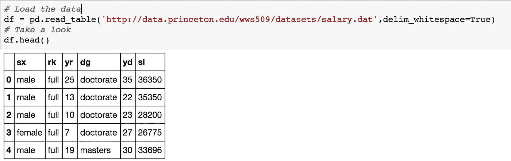
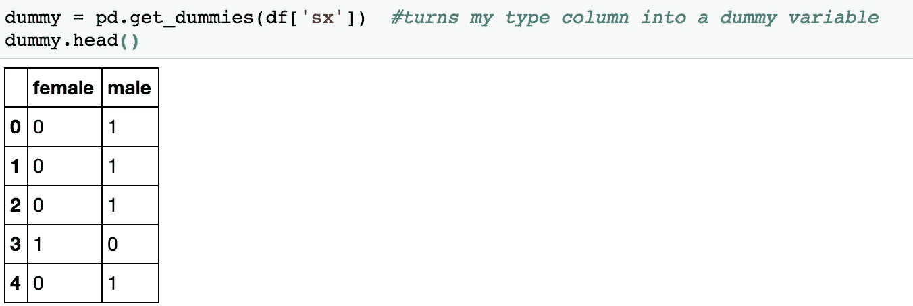
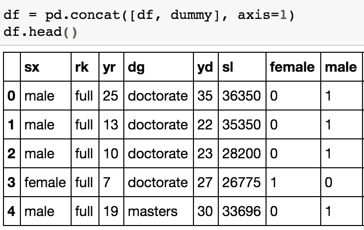
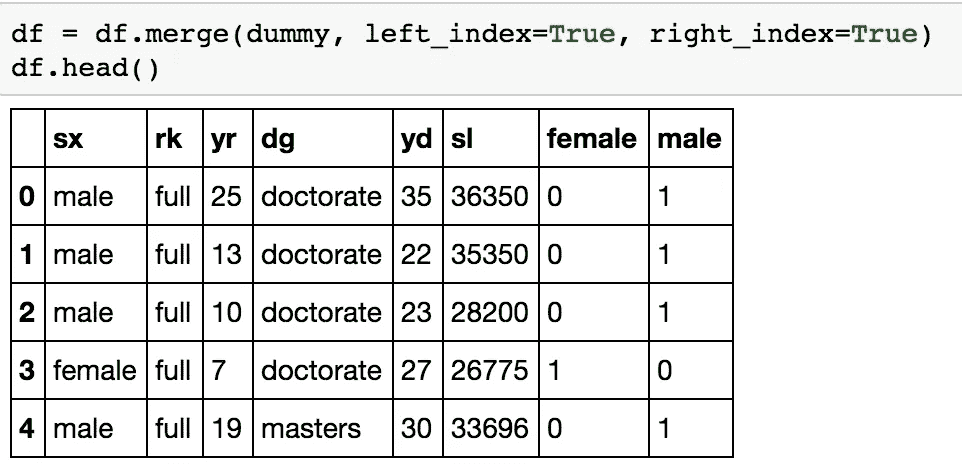

# 创建虚拟变量的虚拟指南

> 原文：<https://towardsdatascience.com/the-dummys-guide-to-creating-dummy-variables-f21faddb1d40?source=collection_archive---------1----------------------->

作为一个数学人，我试图量化日常生活中的一切，所以当我看到一个有很多定性变量的数据集时，我的大脑自然会试图量化它们。幸运的是，有一个漂亮、简洁的函数可以帮助我们做到这一点！

作为数据科学领域的新手，熊猫的发现改变了我的生活。在熊猫和 scikit learn 之间，我认为每个人都可以征服世界(或者至少是数据科学世界)。熊猫有一个功能，可以把一个分类变量变成一系列的 0 和 1，这使得它们更容易量化和比较。

我开始加载我从“[http://data.princeton.edu/wws509/datasets/#salary](http://data.princeton.edu/wws509/datasets/#salary)”网站上获得的数据。这是一个非常小的数据集，由一所小型大学的 52 名教授的工资数据组成，按性别、教授级别、最高学位和服务年限与工资进行分类。我在这个例子中使用了这个数据集，因为它很短，并且有一些分类变量。

sx= sex, rk = rank, yr = year in current rank, dg= degree, yd = years since earning highest degree, sl = salary

因为我在使用 pandas 中加载了数据，所以我使用 pandas 函数 pd.get_dummies 作为我的第一个分类变量 sex。因为这个变量只有两个答案选择:男性和女性(不是最进步的数据集，但它来自 1985 年)。pd.get_dummies 创建一个由 0 和 1 组成的新数据帧。在这种情况下，根据教授的性别，数据帧将有一个 1。

由于我们已经创建了一个全新的数据帧，为了将其与原始数据帧进行比较，我们需要合并或连接它们，以便正确地使用它们。在创建虚拟变量的过程中，我们实际上为原始数据集创建了新的列。新旧数据集没有任何共同的列，所以将它们连接起来是最有意义的(尽管我将两种方式都经历一遍)。

我选择将我的虚拟变量放在我的数据帧的右边，所以当我使用 pd.concat(连接函数)时，先放我的数据帧，然后放我声明的虚拟变量。因为它们是列，所以我在 axis=1 上连接它们。

合并这些数据帧稍微困难一些，因为没有重叠的列。但是，可以做到！

要合并一个索引(我们最左边的列)，我们所要做的就是设置我们的 left_index=True 和 right_index=True！

只需两行代码，我们就可以将性别变量与其他数值列进行比较了！