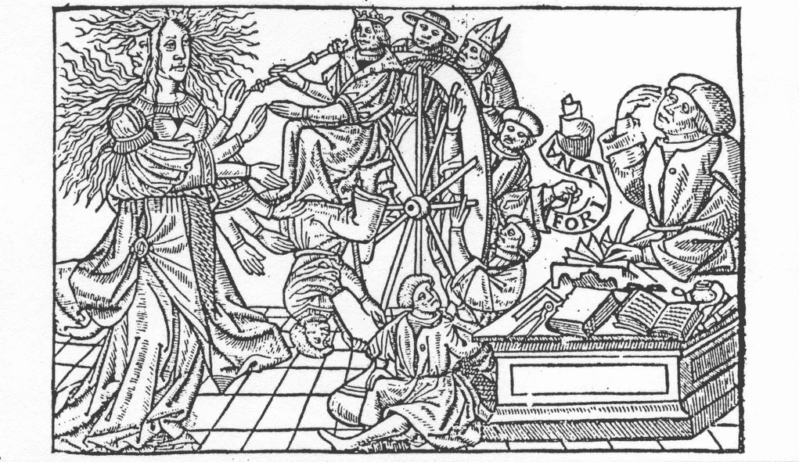
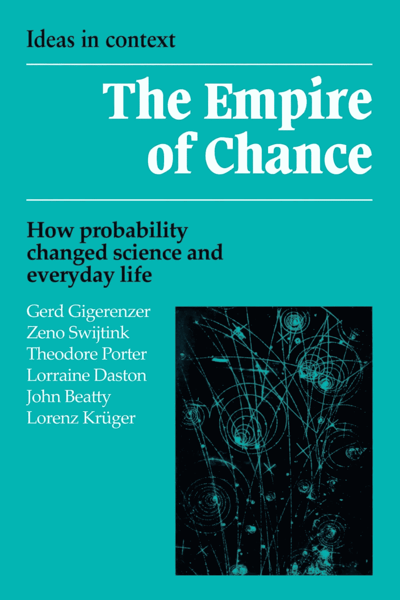
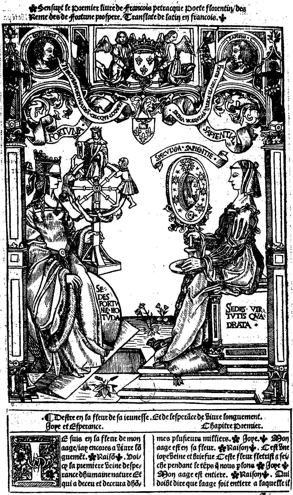
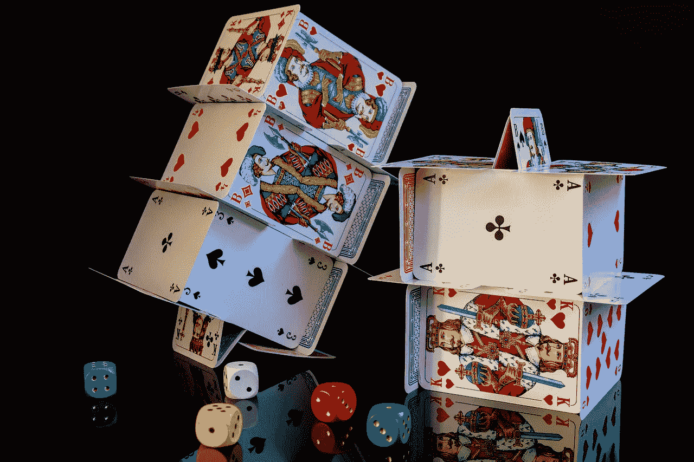
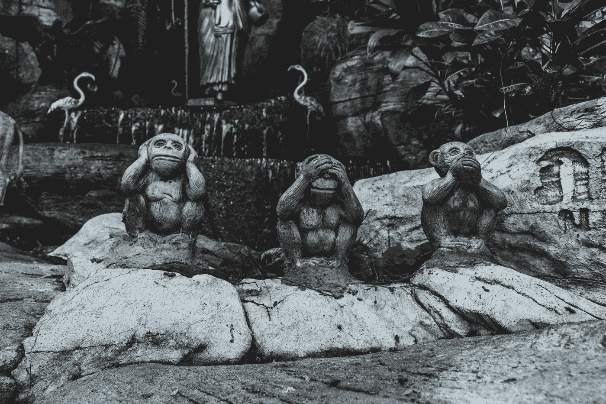
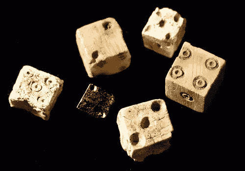
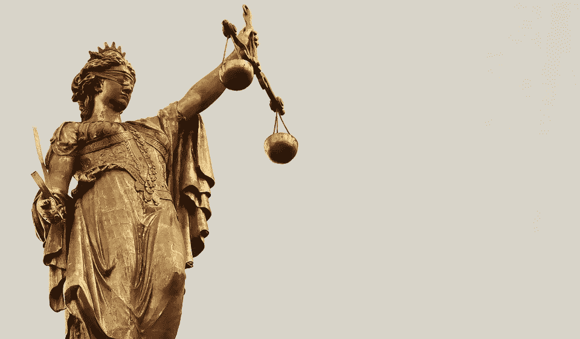
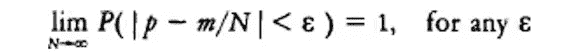
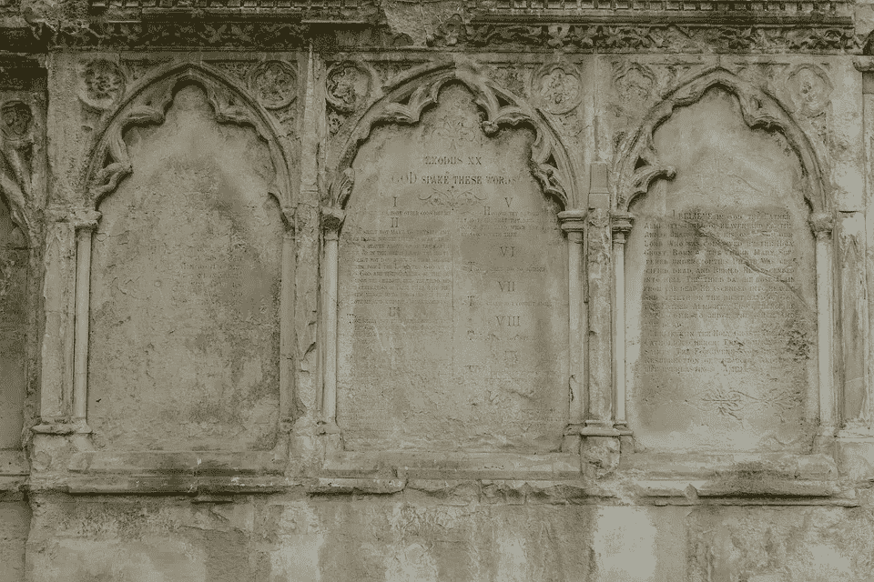
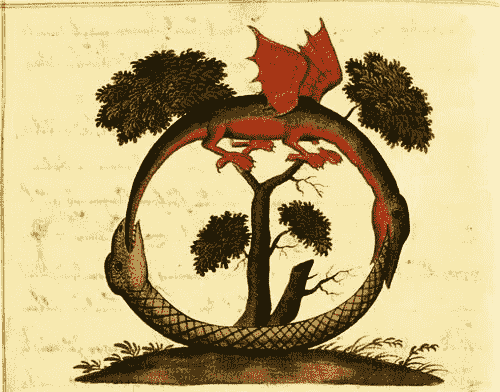

# 机会的帝国:概率如何改变科学和日常生活

> 原文：<https://towardsdatascience.com/the-empire-of-chance-how-probability-changed-science-everyday-life-a590e4274bb7?source=collection_archive---------11----------------------->

个人读书会第 1 卷-可节省笔记

Fortuna & her wheel

> ***这里有很多话，不需要全部看完。这篇简短的序言解释了接下来的内容

## 前言

我一直在阅读优秀的、开创性的概率史，*概率帝国。我想我会做一些公共笔记&评论[作为我的习惯](/the-many-futures-of-data-analysis-951bb2932943)。*

**

*根据作者自己的讲述，这本书大致可分为 4 个部分:*

1.  **我们从* ***两个历史章节开始，分别描述了从十七世纪中期到十九世纪末概率统计的起源和发展*** *。在这里，我们介绍了概率演算不断变化的解释、对决定论不断变化的态度、不断变化的平均值和误差概念——所有这些都是在不断变化的应用背景下进行的。**
2.  ****在接下来的四章的每一章中，我们都专注于一个广泛应用的领域*** *:实验方法论、生物学、物理学和心理学。**
3.  **同第七章，* ***我们把科学留给评估概率和统计对日常生活的影响*** *，从天气预报到乳房 x 光检查。**
4.  **最后，* ***我们调查*** *，从类似胜利将军的山头，* ***我们所覆盖的领土*** *。**

*这第一期 *Solo 书友*的分期重点是第一节的前半段(简介+第一章)，多为历史&概念叙述。后续部分将讨论以下章节。*

*我整理了摘录并添加了一些有限的评论。为了简洁和可消化性，我重新修改了文本，所以如果其中任何一个引起了你的兴趣，我强烈推荐购买并阅读[原文](https://www.amazon.com/Empire-Chance-Probability-Changed-Everyday/dp/052139838X/)！*

*完整的*斜体*段落&“引用”是摘录，我的评论是无格式的。*

**很多*，所以我尽量在长段落中**加粗**要点，方便略读。*

*我推荐阅读我的(短)**简介，然后略读第一章小节标题** (1.1，1.2 等) **&我对它们的一行摘要，然后让你的兴趣(或缺乏兴趣)引导你。***

# *介绍*

## *福尔图娜，历史中的机遇与科学*

**

*Fortuna (left) and Sapientia (right) are depicted here in traditional opposition. The slow breakdown of this opposition is the topic of this book. Source: Petrarch, Remède de l’un et l’autre fortune prospère et adverse (Paris, 1524); courtesy of the Bibliotheque Nationale, Paris. [caption reproduced from the book]*

*这本书以一个典型的历史哲学典故开始:辛酸，微妙和博学。*

> *福尔图娜，这位善变的命运女神，从来都不是哲学和科学的宠儿。在那本中世纪学术的试金石——波爱修斯的《哲学的慰藉》——中，清醒的贵妇人哲学警告说，只有当福尔图娜“表现出自己的不稳定和多变时，她才是真实的”,并且**鼓吹** **反对偶然性**的存在，偶然性被认为是“由随机运动产生的、没有任何原因序列的事件”*
> 
> *科学研究的是原因，而不是机遇。*

*历史的复杂性已经混淆了我目前对机会和因果关系的概念。在我看来，概率分析和理解是科学实践的核心，然而在这里它们是对立的。科学被等同于一个“原因序列”，&这个序列被认为是确定的。然而福尔图娜也被嘲笑为“不稳定且多变”，表面上是对偶然性和非决定论的攻击。但是，攻击福尔图娜是“可改变的”只有在福尔图娜被传统地认为是“注定的”预定论的情况下才有意义，这似乎是偶然性的对立面，而当时的*【科学】表面上推崇偶然性。**

**困惑。**

**但是这些历史逻辑的结将在接下来的章节中被解开，并最终在接下来的几章中被揭示。**

> **然而，就在伯纳德试图从生理学中驱逐偶然性和非决定论的时候，福尔图娜已经统治了一个庞大且不断增长的科学帝国。这个领域的法律是概率论和统计学。用伊恩·哈金令人回味的话来说，通过“驯服机遇”，概率和统计让科学女神和她的劲敌福尔图娜和解了。**
> 
> **从 17 世纪中期开始，概率论在 18 世纪的传播来自:**

*   ***赌博问题***
*   ***为了法理学，***
*   ***数据分析，***
*   ***归纳推理，***
*   ***和保险，***
*   ***并从那里转向社会学，***
*   ***十九中物理，生物，心理学，***
*   ***接着是农学，***
*   ***轮询，***
*   ***医学检测，***
*   ***棒球，***
*   ***二十世纪还有无数其他实际(和不那么实际)的事情。***

**这简明扼要地概述了概率理论的发展和领域背后的叙事弧线，将在以后的章节中深入探讨。但是“概率论”这个术语本身是有问题的，正如这本书的一个主要论点反复强调的:**

> **在其历史的大部分时间里，概率论是它的应用。**
> 
> **这意味着概率论被它所征服的学科和它所侵入的学科一样多。**

*   ***例如，当概率成为评估出生、死亡、犯罪、气压波动、死信和其他类型统计数据汇编的工具时，概率的真正含义发生了变化，从头脑中确定的程度变成了世界上统计事件的比率(见 2.2)。* **【我注:从贝叶斯或'** [**逆概率**](https://en.wikipedia.org/wiki/Inverse_probability)**’到** [**频率主义**](https://en.wikipedia.org/wiki/Frequentist_probability)**】****
*   ***当英国学者弗朗西斯·高尔顿发明了一种方法来测量后代豌豆偏离其父母代的程度时，他启动了相关性分析(见 2.5；4.4).***
*   ***因素分析的根源在于教育心理学，优生学和农学中的方差分析等等。事实上，概率思想和技术的规则是起源于非常具体的背景，并依靠生动的类比而发展。***
*   ***正态或钟形曲线首先代表天文学中观察误差的概率，然后代表社会学中 l'homme moyen 的自然“误差”,然后代表表现出有序集体属性的无政府单个气体分子(参见 2.5；5.6).***
*   **最终，正态曲线开始代表几乎所有事物的分布，从智商到农业产量，并摆脱了早期应用中的特殊解释(见 8.1)。但近一个世纪以来，这种具体的类比是它和其他概率概念从一门学科传递到另一门学科的桥梁。**

> **这本书是关于概率和统计在科学和生活中的应用，其中“应用”被理解为一种特殊的含义:数学工具塑造了它的对象，但也被它塑造了。概率和统计的数学发展在艾萨克·托德亨特、L. A .麦斯特洛夫、O. B .谢宁、斯蒂芬·斯蒂格勒和伊沃·施耐德等学者的工作中得到了令人钦佩的处理。然而，我们主要关心的不是他们。**我们分析概率和统计如何改变我们对自然、思维和社会的观念。****

**这充分地为即将到来的历史叙述搭建了舞台:系谱而非形而上学，概念而非技术。**

# **第一章:古典概率，1660-1840**

****

**God . . . has afforded us only the twilight of probability; suitable, I presume, to that state of mediocrity and probationership he has been pleased to place us in here. . .
— John Locke (1690) *[quoted in original]***

## **1.1 简介**

**第一章以现代概率理论的典型起源故事开始:**

> **1654 年 7 月，布莱士·帕斯卡就一个赌博问题给 Pierre Fermat 写信，这个问题后来被称为分数问题:两名玩家在一场碰运气的游戏中被打断，此时分数不均衡。股权应该怎么分？这两位法国数学家之间随后的通信被认为是数学概率的创始文件，尽管这并不是第一次试图用数学方法处理机会游戏。**

**这一事件已经成为概率的*零号病人*，以至于不得不发表一项对 Pasca l 之前的[证据&概率的明确研究，以填补先前的空白。](https://jhupbooks.press.jhu.edu/content/science-conjecture)**

**《机缘的*帝国*作者强调了这一点，&帕斯卡后来的[著名的赌注](https://en.wikipedia.org/wiki/Pascal%27s_Wager)，*一个* ***数学*** *另一个* ***哲学*** *，揭示了* ***概率的数学理论*** :**

> **它出现在十七世纪两次重要的知识分子运动的关键时刻:一种新的实用主义理性，抛弃了传统的确定性理想；以及将数学应用于新的经验领域的持续且卓有成效的尝试。没有另一个，任何一个都是不够的。关于大部分时间里会发生什么，以及与这种不可靠的体验相关的不同程度的确定性的哲学概念可以追溯到古代，就像概率游戏一样。但是在大约 1650 年之前，没有人试图量化这些可能性。光有数学企业的精神是不够的，因为量化需要一个主题，一种充实数学形式主义的解释。对于概率计算的**来说尤其如此，直到本世纪**它还没有独立于应用**的数学存在。****

****本章出现了两个主题**:**

*   **欧洲启蒙运动特定环境下哲学与数学的交汇**
*   **概率演算在其存在的最初几个世纪中与它的实际应用密不可分**

## **1.2 开端**

****

**Photo by [Sushobhan Badhai](https://unsplash.com/photos/LrPKL7jOldI?utm_source=unsplash&utm_medium=referral&utm_content=creditCopyText) on [Unsplash](https://unsplash.com/search/photos/seedling?utm_source=unsplash&utm_medium=referral&utm_content=creditCopyText)**

**在这一小节中:概率论前身的简史。**

> **数学概率的史前史吸引了相当多的学术关注，也许是因为它似乎姗姗来迟。机会是我们永恒的伴侣，最早的概率论公式的数学是初级的。概率思维的暗示性片段在古典和中世纪的学术文集里几乎随处可见:**

*   **大约在公元前 85 年，西塞罗在他的修辞学著作中将通常发生的事情与通常认为的事情联系起来，称之为两者都是可能的。**
*   **在一份 10 世纪的手稿中，一位僧侣列举了掷骰子的全部 36 种可能性**
*   ***塔木德信徒对继承和亲子关系进行概率推理。***

> **然而，这些都没有发展成概率数学。**

**有一些对各种假设的详细探索(&简要拒绝)来解释这种延迟的发展，但没有一个最终得到证实。**

***发现*的是，为了保持应用优先于理论，早期的概率学家更多地根据*期望值*或 [*期望值*](https://en.wikipedia.org/wiki/Expected_value) 而不是潜在概率本身来提出问题:**

> **如果我们回到帕斯卡的两个沉思，我们会发现，尽管它们被公认为是后来被称为概率演算的一部分，但它们并不是按照概率来铸造的。**相反，基本概念是期望**，后来被定义为事件 e 的概率与其结果值 V 的乘积:**

> **`P(e)V = E`**

> **因此，举例来说，一个人持有一千张彩票中的一张，奖金为 10，000 美元，他的期望值是 10 美元。正如定义所暗示的，我们现在从概率中得到期望，但是对于早期的概率学家来说**期望是先验的和不可约的概念**。**
> 
> **期望反过来被理解为公平交换或合同。**
> 
> **……这些直觉利用了在十六和十七世纪商法中变得越来越重要的一类法律协议，即**运气合同**。法学家将此类协议定义为用现在和确定的价值交换未来不确定的价值——赌一把、购买年金、购买保险、竞拍下一年的小麦收成，或者购买下一次的渔网。**

**“运气契约”标志着赌博和司法推理的交集，这是概率哲学基础中的两大支柱。在本书的这一部分，他们还提供了一个最引人注目的历史旁白:**

> **运气合同获得了突出地位和一定的恶名，作为免除商人贷款利息从高利贷的指控的首选方式。**佳能律师认为，风险因素**，**在道德上等同于劳动**，因此为商人赢得了他的利益，就像他额头上的汗水一样诚实。**

**这让我想起了一位当代自称概率研究者(&不证自明的精神病患者)的[新作](https://en.wikipedia.org/wiki/Skin_in_the_Game_(book))，我还没看过。**

**接着，作者描述了概率论是如何在信仰的确定性和极端怀疑主义的无底怀疑之间解决历史冲突的:**

*   ***《帕斯卡的赌注》是一个例子，说明到了 17 世纪中叶，通过预期进行推理几乎已经成为一种新的理性的同义词。***
*   ***在 16 世纪，一方面是新教徒和天主教徒之间的宗教改革争论，另一方面是 Sextus Empiricus 和他的学校的怀疑主义哲学的复兴，* ***结合在一起破坏了自亚里士多德*** *以来指导智力探究的某些知识的理想。***
*   **在它的位置上逐渐出现了一种更温和的学说，它接受少于确定知识的必然性，但仍然认为它仍然足以指导理性的人在言传身教和实践中 *。***
*   ***亚里士多德在《尼各马科伦理学》中的格言被大量引用:“一个受过教育的人的标志是在每一类事物中寻找精确，只要该学科的性质允许:显然，接受数学家的可能推理和要求修辞学家的论证是同样愚蠢的。”*【我注:lol】**
*   **宗教改革和反宗教改革在信仰及其辩护的基本原则上的冲突，以及米歇尔·德·蒙田和其他 16 世纪思想家的激进怀疑主义的最终结果极大地侵蚀了论证的领域，扩大了可能推理的领域。他们的直接影响是更具毁灭性的，挑战任何知识的所有主张。**

> **因此**所有确定性的传统来源**、宗教和哲学**同时受到攻击**。面对信仰教条主义和最具腐蚀性的怀疑主义之间的选择，越来越多的 17 世纪作家试图开辟一个中间立场，放弃除数学和形而上学之外的所有确定性的希望，但仍然坚持认为人们可以获得可能的知识。或者说，他们坚持认为可能的知识确实是知识。**

**机会的帝国正在增长，其基础在日常生活的实际应用只会加深:**

> **为了证明那些仅仅是可能的人值得尊敬，这些“温和的怀疑论者”从稀有的哲学话语转向了日常生活的行为。理性信念的新标准不再是无懈可击的论证，而是足以促使一个谨慎的人采取行动的确信程度。**
> 
> **强调行动是信仰的基础，而不是相反，是抵御怀疑主义的关键，因为正如这些作家惯于尖刻地观察的那样，即使是最坚定的怀疑主义者也吃饭，就好像外部世界存在一样。**

## **1.3 经典解释**

****

**Photo by [Dan Freeman](https://unsplash.com/photos/WHPsxhB4mWQ?utm_source=unsplash&utm_medium=referral&utm_content=creditCopyText) on [Unsplash](https://unsplash.com/search/photos/geometry?utm_source=unsplash&utm_medium=referral&utm_content=creditCopyText)**

**这一小节叙述了概率的所谓“经典”解释在它正式出现时的演变。**

> **因此，机会的演算首先是期望的演算，从而试图量化在十七世纪学术话语中几乎随处可见的新的、更温和的理性主义。**
> 
> **从惠更斯 1657 年的小论文到雅各布·伯努利 1713 年的权威 Ars 猜想，最早出版的关于这个主题的作品涵盖了一系列只有在这个背景下才一致的主题。像赌博(惠更斯，皮埃尔·德·蒙特，雅各布·伯努利)和年金(约翰·德·威特，哈雷，尼古拉斯·伯努利)这样的偶然性契约，以及后来的证据问题，如历史或法庭证词的评估(约翰·克雷格，乔治·胡珀，尼古拉斯和雅各布·伯努利)**构成了** **新理论**的应用领域。**
> 
> **到这个时期结束时，**概率已经成为一个独特而原始的概念**，尽管在此后的一段时间里，大多数应用仍然围绕着期望问题。**
> 
> **这些概率是如何衡量的，从一开始就不明确，直到今天仍然是一个有争议的问题。 *【暗指巴伊亚人 vs 常客等】***
> 
> ****最初,“概率”一词的意思是权威人士认可的观点**；因此，耶稣会的概率论学说，诡辩家挥舞着赦免几乎每一个越轨行为的理由是，一个或另一个神学家采取了温和的观点。然而，17 世纪早期缓和的怀疑主义甚至改变了这种概率的定性意义。**
> 
> **合理性的支持者说的不是确定性，而是确定性，从通过证明获得的最高等级的“数学”确定性，通过感官证据的“物理”确定性，到基于证词和推测的“道德”确定性。不同作者对这些层次的精确描述略有不同，但这种有序等级的概念，以及对大多数事情只承认道德确定性的强调，仍然是从雨果·格劳秀斯的《基督教宗教真理》(1624)到约翰·洛克的《关于人类理解的论文》(1690)及其后的文学作品的主要内容。当 Joseph Butler 主教在 1736 年声称“概率是生活的向导”时，他是在重复一句陈词滥调。**
> 
> **在这些讨论的背景下,“概率”一词的真正含义已经从中世纪的任何权威意见转变为与手头的证据成比例的同意程度，包括事物和证词。**

**作者描述了概率从定性到定量的渐进过程:**

> **正如大量的法庭案例和类比所表明的那样，这些概率是定性构思的，在很大程度上归功于法律证据的语言和实践。**
> 
> ****然而，像戈特弗里德·威廉·莱布尼茨和雅各布·伯努利这样的数学家抓住了新的“危险分析”作为量化这些确定度的手段，并在这样做的时候，将三个有序点转换成一个完整的连续体，从完全不相信或怀疑到最大确定性**。**
> 
> **事实上，莱布尼茨将羽翼未丰的概率演算描述为法律推理的数学翻译，这种法律推理使法官对提交的各种证据的把握程度达到精确的比例。事实上，这些法律概率有时用分数来表示，以创造一种“证据的算术”(例如，被告的一个亲戚的证词可能只把⅓算作一个无可指责的证人)，这可能使它们看起来在数学上容易处理。**
> 
> **着手尝试以某种非任意的方式测量这些概率的**数学家们提出了至少**三种方法** :
> - **基于物理对称性的同等可能性**；
> - **观察到的事件频率**；
> - **和主观确定度或信任度**。****
> 
> **—**第一款**非常适合硬币或骰子等赌博工具，但不适合其他工具；
> -**第二个**依赖于收集的统计数据和长期稳定的假设；
> —**第三**呼应了对证据确定度进行比例分配的法律实践。**

**有趣的是，作者们(大概是最初的概率学家)承认，对掷硬币、掷骰子和从瓮中拉出的概率的概括非常有限，但这些仍然是主要的教学手段&用于传达概率的类比。(前面提到的某个精神病患者称之为“[卢迪谬误](https://en.wikipedia.org/wiki/Ludic_fallacy)”)**

> **各种意义从不同的上下文中出现，并暗示了数学理论的不同应用。**

*   **源自赌博并应用于赌博的基于物理对称性的等概率结果集——很少有其他情况以明显的方式满足这些条件。**
*   **统计频率最初来自 16 世纪以来教区和城市收集的死亡率和出生率数据。1662 年，英国商人 John Graunt 使用伦敦死亡率清单来估算死亡率表，他假设大约相同比例的人口在六岁以后每十年死亡一次。**
*   ***18 世纪的作者收集了更详细的人口统计数据，并利用概率论来计算年金和后来的人寿保险的价格，并论证人类事务中的神圣天意。***
*   ***与证据成比例的认知信念感源于法律理论，即需要多少和什么样的证据才能在法官心中产生什么程度的信念，并激发了对法庭和历史证据以及判决的证词概率的应用。***

**作者继续描述了古典概率学家中客观和主观模式之间的流动转换，以及频率主义的增长蔓延[暗示不祥的配乐]:**

> **现代概率学家认为这三个问题的答案是，“概率衡量什么？”作为截然不同的，和许多墨水已经泼争论他们的相对优点和兼容性(纳格尔，1955)。特别是，**在概率的前两个“客观”意义和第三个“主观”意义之间画了一条粗线，前者对应于世界的状态，后者对应于精神状态**。**
> 
> **然而，古典概率学家使用“概率”来表示所有三种意义，漫不经心地从一种意义转移到另一种意义，这让他们更善良的继任者感到困惑。为什么经典概率学家能够如此容易地将这些不同的概率概念融合在一起，而且常常非常富有成效？在某种程度上，因为客观和主观感觉当时没有被当前哲学中它们之间张开的鸿沟分开。**

**在游行频繁主义:**

> **16 和 17 世纪的法律理论家发现，假设法官心中形成的信念与提交的证据的分量成比例似乎是合理的，洛克在更一般的背景下重复了这一假设，援引证据的定性概率:理性思维同意一项主张“与一方或另一方更大概率理由的优势成比例”。**
> 
> **约翰·洛克、大卫·哈特莱和大卫·休谟创造并完善了一种观念关联的理论，这种理论使大脑成为一种计数机器，自动记录过去事件的频率，并相应地衡量对其重现的信任程度。**
> 
> **哈特利甚至为这种心理记录提供了一种生理机制:每一次重复的感觉都会产生一种大脑振动，在大脑中蚀刻出一条越来越深的凹槽，对应着一种越来越强烈的信念，即事情会像以前一样。*【看似合法】***
> 
> **由于头脑不可抗拒地赋予信念与想法的生动性成正比，过去经历中的事件发生得越频繁，就越坚信它们会再次发生。**洛克和哈特利认为信仰与频率的匹配是合理的。****
> 
> **然而，所有人都同意，正常的头脑，当未被教养或偏见所污染时，会不可抗拒地将主观的信仰概率与客观的频率概率联系起来。**他们还显示出一种日益增长的趋势，那就是将所有形式的证据减少到一定的频率**，这与最初的法律学说形成了对比，法律学说认为证据与信仰程度成比例。**
> 
> **对法官来说，目击证人的证词，即有人看见被告拿着出鞘的带血的剑逃离谋杀现场，其证明力来自证据的质量，而不是数量。过去类似的证据导致成功定罪的次数并不重要。洛克在他对创造可能性的证据种类的讨论中仍然非常接近这一法律传统:证人的数量，他们的技能和正直，矛盾的证词，内在的一致性，等等。他讲述了暹罗国王的警示性故事，暹罗国王认为荷兰大使是个骗子，因为他在冰冻的运河上滑冰的故事与几代暹罗人积累的水总是流动的经验背道而驰。国王错误地相信他的经验的数量，而没有评估它的广度和多样性。然而，洛克也为“经验的频率和恒常性”和数量，以及证词的可信度留有一席之地。**

**我们最终来到这个荒谬的极端，新生的频率主义范式的逻辑结论:**

> **后来关于概率的哲学著作将证据的意义进一步缩小到可数的范围。休谟代表了这种进化的终点，在这种进化中，证据变成了重复、相同事件的总和。根据休谟的说法，头脑不仅会计算；它对总数中的微小差异非常敏感:**“当一方的机会或实验达到一万次，而另一方达到一万零一次时，由于这种优势，判断会优先考虑后者”。** *【啊！！！]***

**最后，事件的“客观”频率和信仰的“主观”程度之间日益增长的紧张在概率论及其实践者中分裂了一个持久的分歧:**

> **一些作者认为，主观信念与客观频率以及物理对称性成比例，这种保证使得经典概率学家在没有明确理由的情况下，从一种概率感滑向另一种概率感。只有当联想主义心理学将其重点转移到幻觉和扭曲上时，偏见和激情才会引入这种对概率的心理计算，主观和客观概率之间的差距才会变得足够明显，从而要求在两者之间做出选择。与其说是彻底的频率主义版本的概率论的发展和胜利标志着经典解释的终结，不如说是人们认识到必须在(至少)两种不同的概率意义之间做出选择。经典概率学家应用其理论的问题范围表明，他们对概率的理解包括客观和主观因素:统计精算概率与雅各布·伯努利或拉普拉斯工作中的认知证据概率愉快地共存。**

## **1.4 决定论**

****

**这一小节描述了认识论决定论的张力，这种张力支撑着经典概率的主观“相信程度”学派。
它也“解开”了我们在书的介绍中遇到的“机会”悖论。**

> **…**这两位数学概率史上的巨人的著作[ **拉普拉斯&伯努利** ]也包含了这样的宣言，不管是对是错，**导致了经典解释不可救药的主观的标准观点**。****
> 
> ****两人都认为概率衡量的是人类的无知，而不是真正的机会。上帝(或拉普拉斯世俗化的超智能)不需要概率；**必然的原因，无论多么隐蔽，支配着所有的事件**。因此，概率必须是精神状态，而不是世界状态，智力的临时工具太弱，不能立即穿透事物的真实本质。****
> 
> ****他们的是一种认识论决定论，认为所有事件原则上都是可预测的，因此概率与我们的知识相关。伯努利评论说，落后的民族仍然在赌欧洲天文学家现在可以预测的日食；有一天，当机械科学完善时，硬币和骰子的赌博会显得同样原始。****
> 
> ****那些在自然科学和道德科学中为偶然性开辟了一席之地的数学家们坚持认为，用亚伯拉罕·棣·美弗的话说，偶然性“既不能被定义，也不能被理解”。他们确实承认，某些统计数据每年不同，各地不同，但他们对死亡率等现象的潜在规律性有足够的信心，从而相应地简化和调整这些难以控制的数据。他们认为，经过充分调查，可变性将被证明与偶然性一样虚幻。****
> 
> ******为了解开古典概率学家的热情决定论的明显矛盾，我们必须超越概率论，看到它出现的那个时期的泛数学精神。在将数学应用到全新的经验领域——从彩虹到振动的琴弦——取得惊人成功的时期，古典概率兴起并繁荣起来。**像伽利略这样的自然哲学家认为，如果自然说数学语言，这是因为自然是完全确定的，至少从上帝的角度来看是这样的**:在数学论证中，连接因果的胶水必须和连接前提和结论的胶水一样强。******
> 
> ****决定论因此成为对自然进行数学描述的先决条件。****

****这仍然让我困惑，尽管我理解了培养这种心态的历史条件。想象我们的知识是不完美的*世界上存在真正的随机性，这似乎不是一个不可思议的逻辑飞跃。*****

*****无论如何……继续这些愚蠢的老天才:*****

> *******经典概率论在运气被放逐的时候到来；它需要一种彻底的决定论氛围，甚至包括可变事件，作为稳定潜在概率的表达，至少从长期来看是如此。*******
> 
> *******决定论通过将可变事件锚定在恒定概率上，创造了一种可以想象的“机会几何学”，因此，即使是偶然事件也符合当时将数学应用于经验的标准**。*****
> 
> *****那些标准与旧的真实的偶然性概念不相容，或者与我们可以称之为世界上真正的随机性不相容。*****
> 
> *******“机会”和“财富”自亚里士多德以来就一直是哲学词汇的一部分，意思是各种各样的巧合(在去市场的路上遇到欠你钱的人)，缺乏目的(通常被认为是必然的，如伊壁鸠鲁原子的“盲目的必然”)，或健康、财富、美丽和子女等“外部”物品的充足禀赋**(索拉布吉，1980)。*****
> 
> *******所有这些含义都保留在日常用法中，但只有一个在经典概率论中发挥了重要作用。这是机会和目的的对立，特别是神圣的目的**，自然神学家和他们的或然性盟友如德·莫维尔对此大加赞赏。*****
> 
> *****… **对于古典概率学家来说，因果顺序之外的“机会”和“运气”是迷信**。如果我们能看到世界的本来面目，穿透到事物的“隐藏的源泉和原理”，我们就只会发现必然的原因。概率只是暂时的，是人类无知的虚构，因此是主观的。*****
> 
> *******数学概率的经典解释因此具有决定论的特征，因此具有主观倾向，并且在实践中具有流动性的概率感，在联想心理学的帮助下将主观信念和客观频率融合在一起**。*****
> 
> *****正如拉普拉斯在一段著名的文章中所说的，数学概率在本质上是“仅有的理性化为微积分”。它的地位与其说是一种应用的数学理论，不如说是某种现象的数学模型，就像描述月球运动的天体力学部分。因此，它经受住了实证检验。如果天文理论未能预测月球扰动，那对理论来说就更糟了。当经典概率论的结果与理性人的直觉不符时，数学家们又回到了起点。*****

## *****1.5 合理性*****

**********

*****Photo by [Chris Tweten](https://unsplash.com/photos/wLx_WCkWvHg?utm_source=unsplash&utm_medium=referral&utm_content=creditCopyText) on [Unsplash](https://unsplash.com/search/photos/wise?utm_source=unsplash&utm_medium=referral&utm_content=creditCopyText)*****

*****这一小节详细介绍了古典概率，非常实用，是如何与“理性”和直觉相比较并最终服从于后者的。*****

> *******关于圣彼得堡问题的旷日持久的争论正是理性和概率论的规定之间的冲突，并说明了数学家们是如何认真对待他们的“良好判断力”建模任务的*******
> 
> *****尼古拉斯·伯努利(Nicholas Bernoulli)在给皮埃尔·德·蒙莫特(Pierre de Montmort)的一封信中首次提出了这个问题，并发表在后者的《哈萨尔的青年分析》(Essai d ' analyse sur les jeux de hasard，1713 年)第二版中。皮埃尔和保罗用一枚硬币玩抛硬币游戏。如果在第一次投掷中硬币正面朝上，皮埃尔同意付给保罗 1 美元；如果第二次掷硬币时正面没有出现，保罗得到 2 美元；如果没有，直到第三次投掷，4 美元，等等。根据标准方法计算，保罗的期望(以及玩这个游戏的公平价格)是:*****
> 
> *****`E = (1/2 x $1) + (1/4 x $2) + ... [(1/2)^n x $2^(n-1)] + ...`*****
> 
> *****因为即使是公平的硬币也有很小但有限的机会产生连续的尾部，而且回报随着这种事件发生的概率的降低而增加，所以期望值是无限的。然而，正如 Nicholas Bernoulli 和所有后来的评论员很快观察到的，没有一个理性的人会支付哪怕是很小的一笔钱来玩游戏。**尽管数学家们称之为悖论，但从同等有效性的假设中得出的结果并不矛盾**。*****
> 
> *****期望值的计算很简单，在期望值的数学定义中没有任何东西排除了一个无限的答案。**相反，令他们感到矛盾的是，数学理论的结果可能与良好判断力的明显要求如此不一致。现代意义上的应用数学家可能会简单地质疑数学理论对这类问题的适用性，但这条道路对十八世纪的混合数学家并不开放。在他们看来，数学结果和良好判断力之间的冲突威胁到了数学概率的有效性。*******
> 
> *****这就是为什么圣彼得堡问题本身微不足道，却成为经典概率学家关注的焦点。*****

*****作者回顾了关于“悖论”的微妙争论，特别是通过伯努利兄弟的视角，他们将概率应用的发展领域拟人化:*****

> *****伯努利兄弟之间争论的不是概率期望是否应该模拟合理性，而是这种合理性包含在哪里。尼古拉斯站在源自运气契约的古老公平观一边；丹尼尔与越来越重要的经济审慎意识，源自商业。*****
> 
> *****典型的理性人不再是公正的法官，而是精明的商人，概率的数学理论反映了这种转变。*****

*****因此，概率演算试图编纂当时的“合理”直觉，但也反映了那个时代的精英主义和方法论热情:*****

> *****如果他们的演算得出的结果与启蒙运动者一直以来所知道的相呼应——正如《数学序言》一篇接一篇地强调的那样——那么所有精心设计的方程和计算机制似乎都是对显而易见的东西的重复。概率学家回答说，用伏尔泰的话来说，**常识没有那么普遍**。*****
> 
> *****只有一小部分精英人物能够通过独立的直觉进行足够准确的推理；概率演算试图将这些直觉(概率学家认为这些直觉实际上是潜意识的计算)编纂成文，以供并非天生如此的普通人使用。*****
> 
> *****推理演算的理想，一套独立于内容的形式规则，对许多十七和十八世纪的思想家产生了某种致命的吸引力。概率学家希望将“猜想的艺术”变成这样一种演算，这与 17 世纪对极端方法的迷恋相呼应。*****

*****机械论方法中的这种极端乐观主义恰如其分地反映在“[拉普拉斯的恶魔](https://en.wikipedia.org/wiki/Laplace%27s_demon)”&一个“[发条宇宙](https://en.wikipedia.org/wiki/Clockwork_universe)的想法”中。它也随着最极端的乐观主义的终结而终结…*****

> *****因此，经典概率论立刻成为合理性的描述和处方。*****
> 
> *****两个含糊不清的地方，都没有被清楚地认识到，混淆并最终破坏了经典的程序，使合理性数学化。*****

*   ********第一个*** *在圣彼得堡问题引发的关于期望的争论中很早就浮出水面:* ***有几种截然不同的合理性品牌，它们有时会导致同一问题的截然不同的解决方案*** *。公平的法官和精明的商人没有就预期的正确定义达成一致，但他们都属于霍姆斯·克莱尔的精选公司。然而，概率学家坚持认为合理性是统一的，尽管对如何定义它有无休止的争论。***法国大革命的巨大动荡粉碎了他们对少数开明人士自然共识的信仰。*******
*   *******第二个*** *歧义关注的只是* ***描述与处方*** *之间的界限在哪里。*****

> ****在其漫长的职业生涯中，**由于**对理性理想的幻灭以及客观和主观概率之间日益扩大的差距**，经典概率论的重点慢慢从描述性转向规定性**。****

****作者以对当时概率理论的清晰描述来结束这一小节:****

> ******:*这些都是数学概率经典解释的标志*****

*   ******一种卓有成效的* ***主观与客观的融合*** *感官的概率；******
*   ******一种* ***彻底决定论*** *坚决否认真实偶然性的存在，并在纲领性陈述中突出概率的主观意义；******
*   ******一个致力于* ***混合数学目标的建模现象****；******
*   ******和* ***首先是理论与实践理性形式的认同，这种形式后来被称为合理性*** *。******

> *****对于那些在 20 世纪受过区分教育的人来说，数学理论独立于其无数可能的解释和应用，但是对于经典概率学家来说，它们都是一个整体。*****

## *****1.6 赌博和保险的风险*****

**********

*****接下来的两小节包含了概率领域发展的大量叙述细节，这些是要点:*****

> *****赌博是典型的随机契约，数学家们解决的第一批问题就是这种类型的。*****
> 
> *****尽管进步很快，大多数概率学家还是对他们的股票交易赌博问题和他们声名狼藉的关联感到不自在。*****
> 
> *****显然，大多数赌徒对这种教化没有什么兴趣。*****
> 
> *****经典概率学家感到他们对赌博数学的兴趣立刻被忽视和鄙视，急切地将他们的注意力转向其他更值得尊敬的运气契约类型:*****

*   ******葡萄酒期货******
*   ******年金******
*   ******海上保险******
*   ******遗产的期望******
*   ******嫁妆基金******
*   ******收益权******

> *****这一时期的统计数据以出生、婚姻和死亡的人口统计数据的形式出现，因为这是自 16 世纪上半叶以来政府一直要求教区登记的信息，原因与概率论无关。*****
> 
> *****数学家毫不犹豫地将这些统计频率解读为概率，并从中发现了从赌博向更有声誉的运气合约发展的途径。*****

*****但是唉，再一次…*****

> *****总的来说，18 世纪年金和人寿保险的买家和卖家并不比赌徒们对概率论更感兴趣。*****
> 
> *****因此，在十八世纪的大部分时间里，风险的数学理论对风险实践的影响实际上是零。*****

*****从业者对概率学家的数学方法的抵制是根深蒂固的，在今天的反经验主义中仍然可以看出:*****

> *****风险从业者抵制风险的数学理论还有其他更深层的原因。早在数学概率和统计学出现之前，**像赌博、年金和海上保险这样的偶然性合同**的当事人**已经**在直觉的基础上同意了未来偶然性**的价格，这与概率学家的直觉**完全相反。*****
> 
> *****风险中的**交易商表现得好像世界是一个个案例的马赛克**，每一个案例都由业内老手根据具体情况进行评估，而**数学家则提出了一个简单、稳定的规则世界，任何拥有正确数据和公式的人都可以利用**。*****
> 
> *******对于风险从业者来说，接受风险的数学理论需要信念的深刻变化**，对于人寿保险来说，还需要价值观的深刻变化。他们不得不用集体适用的规则取代个别案例，用估算取代经验丰富的判断。*****
> 
> *******数学家们认为从长远来看会相互抵消的局部扰动，从业者们却认为这正是他们的本行**。*****
> 
> *******只有良好的判断和对这些细枝末节的透彻理解才能对正在讨论的风险进行定价**。*****
> 
> *******风险的实践不仅仅是统计的；这是一种积极的反统计方法，因为它只关注个案，而忽略了大量数据和长期数据。*******
> 
> *****修行者把时间等同于不确定性，因为时间会给这些关键的条件带来不可预见的变化；概率学家将时间等同于确定性，大量的数字揭示了表观通量背后的规律。*****

*****领域专家和经验主义定量分析师(通常不计其数)之间的紧张关系，以前者对个别案例的微观关注和后者对更广泛的统计模式的总体宏观关注为代表，如今依然存在。在接下来的章节中，我们还会听到更多关于这些主题的内容。*****

## *****1.7 证据和原因*****

**********

> *****运气契约并不是古典概率学家从法学家那里接手的唯一应用领域。他们也很早就将注意力转向证据问题，尤其是证人证词的问题。*****
> 
> *****从雅各布·伯努利到泊松，几乎每一个概率学家都尝试过证词的概率，蒙莫特在询问这些事情是否真的是数学理论的合法应用方面是个例外。*****

*****这个问题的棘手刺激了频率主义的下一个大飞跃，这也许是一个太远的飞跃:*****

> *******从雅各布·伯努利著名的定理开始，概率学家解决了多少成功产生何种程度的确定性的问题。**这意味着从概率论的角度重新塑造因果观念，也就是说，将它们与**无处不在的瓮模型**联系起来，后者成为经典解释的标志。*****
> 
> *****想象一个瓮，里面装满了一些固定比例的彩球，从这些彩球中可以重复绘制替换图案。**伯努利定理指出，在极限情况下，随着抽奖次数 N 趋近于无穷大，观察到的彩球比例 m/N 对应于 urn 内实际比例 P 的概率 P 趋近于确定性:*******

**********

> *******伯努利定理相当于一种保证，即从长远来看，观察到的频率将稳定在“真实”的潜在值附近，规律性最终将战胜可变性，原因战胜机会**。*****
> 
> *****这个结果是平庸和创新的奇妙混合。*****
> 
> *******老生常谈**，因为正如伯努利自己在给莱布尼茨的信中承认的那样，“即使是最愚蠢的人也能通过自然本身的某种本能，而不是通过先前的指示知道”**证实的观察数量越多，推测就越可靠**；**革命性的**，因为**它将确定度的概率与频率的概率联系起来**，还因为它创造了一个本质上没有原因的因果关系模型。*****
> 
> *****此外，新的模型放弃了对机制的所有探索，而是寻找运行世界时钟的隐藏的弹簧和原理。*****
> 
> *******伯努利瓮模型中，数字生成数字；他们这样做的物理过程完全不可思议。*******
> 
> *****这个定理是原因概率的基石，然而它并没有真正提供一种从已知结果到未知原因的推理方法，即使是在频率和概率的有限意义上。因为在任何有限数量的试验中简单地从观察到的频率中读出潜在的概率是不合理的:**如果没有一些额外的简化假设，频率永远不会明确地收敛到一个值。*******
> 
> *****给定概率，伯努利定理揭示了观察到的频率以任何期望的精度逼近该概率的可能性。*****

*****^正是频繁主义的定义。*****

> *******我们需要的是逆运算:给定观察到的频率，有多大可能逼近未知的概率？*******

*****^输入“逆”/“贝叶斯”概率。*****

> *****或者，正如人们更经常提出的问题，**鉴于一个事件以前已经发生过多次，那么它在下一次试验中再次发生的概率是多少？简而言之，未来像过去一样的概率有多大**？这些所谓的**逆概率成为了原因概率**的核心。**托马斯·贝叶斯**和**皮埃尔·西蒙·拉普拉斯**独立证明了伯努利定理(Bayes，1763；拉普拉斯，1774)，其应用至今仍有争议(见 3.4)。*****
> 
> *******伯努利定理是因果关系的数学模型**，特别适用于检测“弱”原因的存在，如动物磁性**，而逆定理是科学方法本身的数学模型**，用于根据新数据评估假设的状态，如男女比例优势。*****

*****因此，我们到达了概率论历史的一个紧要关头(至少事后看来是这样)，但在以后的章节中会有更多的介绍。*****

## *****1.8 道德科学*****

**********

*****这一小段描述了古典概率学家对启蒙社会科学和伦理学的参与，他们试图在“钟表社会”的假设下，将一种原始的定量社会学带入其中。*****

> *****正是在启蒙运动的道德科学中，古典概率论中的理性人最为明显。由于这个原因，概率学家长期以来努力使他们的演算成为道德科学，用孔多塞的话说就是“社会数学”。*****

*****这个项目公正地呈现古雅在短时间内:*****

> *****他们 19 世纪的继任者嘲笑这个程序是不切实际和专横的混合体，是对数学好名声的诋毁。*****
> 
> *****但是对古典概率学家来说，没有什么比他们的演算应该应用于法理学、政治经济学和道德科学的其他部分更明显的了。为了理解他们的信心，我们必须首先理解启蒙运动道德科学的假设和目标，以及它们如何与经典概率论的假设和目标相协调。*****

*****个人主义和结构主义倾向之间的紧张再次出现，这次是在启蒙运动和现代主义阵营之间:*****

> *****与 19 世纪的社会科学不同，道德科学的学生把个人而不是社会作为他们的分析单位。就他们与整个社会打交道而言，他们认为社会是这些个人的集合体。此外，道德科学试图揭示的规律性是这些个体做出理性决定的结果，而不是文化和社会总体结构的结果。*****
> 
> *******在这个意义上，理性的个人是社会规律性的原因；社会秩序来自有序的个体**。*****
> 
> *******像经典概率论一样，道德科学既是描述性的又是规定性的**。一方面，他们声称揭示了人类思想和行动的不可改变的秩序；另一方面，他们敦促改变现有的社会安排，以更好地接近这一秩序。*****

*****许多细节和历史参考点如下，但它的关键是:*****

> *****概率学家通过法理学进入道德科学，原因与微积分本身的历史和当时的政治气候有关。*****
> 
> *****在 1789 年大革命爆发和 1830 年七月君主制之间的法国政权更替中，这成为一个紧迫的政治现实。*****
> 
> *****在为道德科学服务的过程中，数学本身带上了道德色彩。*****

## *****1.9 结论*****

**********

*****最后，作为下一章的预演，总结这丰富而精粹的一章。*****

> *****1837 年，当泊松声称已经用所有数学的严谨性证明了他的结论时，概率的经典解释在几个方面受到了攻击。*****
> 
> *****这些批评家也对证词和原因的可能性表示轻蔑；一个是试图量化不可估量的因素，如真实性，另一个是用纸上谈兵来代替诚实的实证研究。*****
> 
> *****到了 1840 年，这个被吹捧为明智的理论被简化为微积分，许多数学家和哲学家认为这是“智力失常”*****
> 
> *****数学家们第一次开始将概率论与其可疑的应用区分开来。*****
> 
> *******在 19 世纪初的几十年里，使经典诠释及其特有应用成为可能的知识和社会背景消失了。法国大革命和随之而来的社会紧张局势动摇了概率学家对单一、共享的合理性标准存在的信心，而几十年来关于预期正确定义的争论却没有动摇这一点。*******
> 
> *****理性的人分裂了，然后连同他们应该代表的知识分子和政治精英的共识一起消失了。在浪漫主义的第一次浪潮中，理性本身不再是一个隐含的计算问题，而是与不可分析的直觉和情感相一致。*****
> 
> *******经典的解释已经失去了它的题材。它也失去了融合客观和主观可能性的理由。*******
> 
> *******主观信念和客观频率开始时是等同的，结束时是截然相反的。*******
> 
> *****一旦客观可能性和主观可能性之间，以及概率计算和良好感觉之间的心理纽带消失，经典解释就变得既危险又主观，而且明显不合理。*****

*****贝叶斯被流放:*****

> *****在常客们的口中，“主观的”变成了一个绰号，他们毫不留情地批评那些将“同样未决定的”等同于“同样可能的”的应用，就像贝叶斯定理的许多经典应用一样。*****
> 
> *****少数杰出的数学家，最著名的是英国的奥古斯都·德·摩根和 W. S .杰文斯，在 19 世纪中期支持一种或另一种概率的经典解释，但他们是四面楚歌的少数。*****
> 
> *****概率学家从少数人的理性转向了多数人的非理性。*****

*****第一章到此为止。*****

*****敬请期待下一期&如果你喜欢这本书，[请购买这本书](http://The Empire of Chance)！*****

*****另外[关注我&查看我的其他帖子](https://medium.com/@dnlmc):)*****

*****——
在推特上关注:[@ dnlmc](https://www.twitter.com/dnlmc)
LinkedIn:[linkedin.com/in/dnlmc](http://www.linkedin.com/in/dnlmc)
Github:[https://github.com/dnlmc](https://github.com/dnlmc)*****