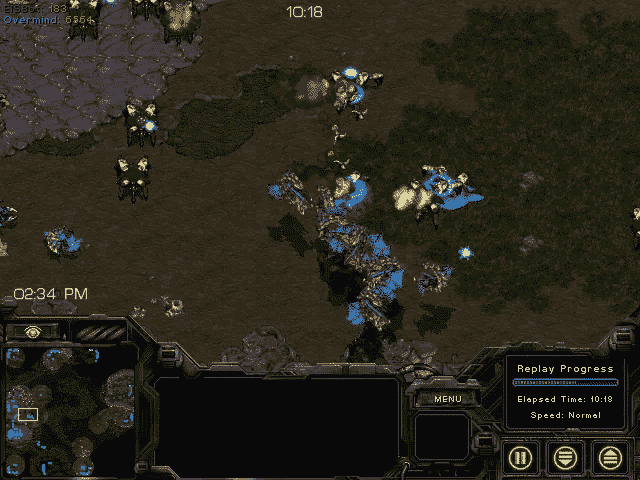
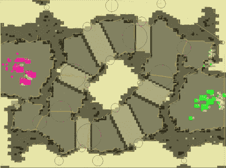
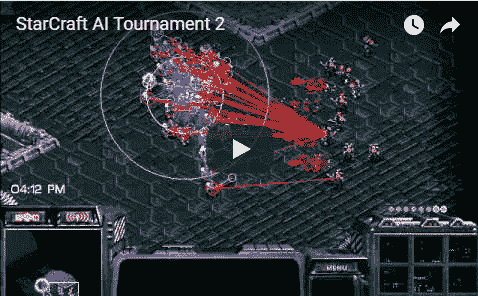
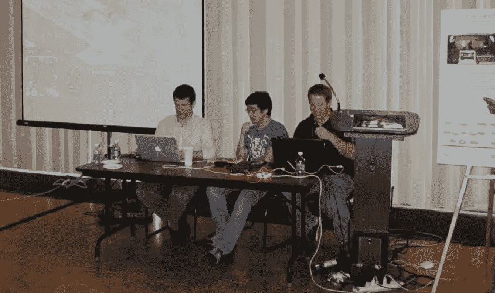

# 公开人工智能竞赛的终结

> 原文：<https://towardsdatascience.com/the-end-of-open-ai-competitions-ff33c9c69846?source=collection_archive---------12----------------------->

UC Berkeley’s Overmind winning the first StarCraft AI Competition

*出自星际争霸 AI 大赛创始人。*

*更新:* Dota 2 确实提供了一个[脚本接口](https://developer.valvesoftware.com/wiki/Dota_Bot_Scripting)，使得机器人可以用 Lua 编写。然而，这种有限的接口并不能使机器人与远程进程进行通信，并保存有关所玩游戏的数据。

OpenAI Five 对人工智能来说是一个巨大的进步，但对人工智能研究人员来说也确实令人生畏。以前从未有过这么多用于构建人工智能系统的开放工具，但也感觉近年来学术界的准入门槛实际上有所增加。早在 2009 年，我就发布了一个公开的[呼吁](https://games.slashdot.org/story/09/11/12/1729217/starcraft-ai-competition-announced)让任何感兴趣的人来建造最好的星际争霸 AI，并且它对任何对 AI 感兴趣的人开放。现在，似乎你需要获得封闭的 API、大规模计算能力和历史训练数据，才能在人工智能方面取得进展。

我提出这个论点是在唱反调，希望能证明我是错的。我希望看到更多的公开比赛，以及没有大量计算资源的研究人员可以继续在人工智能方面取得进展的领域。以下是我在最近的进展中看到的一些主要问题。

## 封闭 API

据我所知，OpenAI 正在使用一种 API 来构建和训练机器人，而学术研究人员却无法使用这种 API。如果你是一名研究生，想要为 Dota2 制作一个机器人，那么你需要等到当前的比赛结束，开源版本最终推出。对于像围棋这样的游戏来说，深度和强化学习已经取得了很大的进步，这个问题不是问题。但是，如果你是一名研究生，想从事拥有大量活跃玩家的视频游戏，你的选择是极其有限的。星际争霸 2 的 DeepMind API 看起来是一个很好的选择，但是你仍然会面临其他的挑战。

**解决方法:**找到带有您可以使用的 API 的游戏。我在研究生院的时候用[育雏战争 API](https://github.com/bwapi/bwapi) 为原版星际争霸写了一个机器人。这是一个巨大的黑客攻击，我设法让它与 Java 一起工作，但我非常幸运，这个项目没有被暴雪关闭。很高兴看到开源社区继续发展 BWAPI 和 [Java 版本](https://github.com/JNIBWAPI/JNIBWAPI)。

Bot debugging from an early BWAPI-Java prototype.

## **电脑很贵**

OpenAI 正在花费大量的计算能力来训练机器人，DeepMind 训练围棋机器人的努力也是巨大的。这是 OpenAI 在[博客文章](https://blog.openai.com/ai-and-compute/)中提到的一个问题，但这也让学术界感到沮丧。学生不太可能有大量的云计算资源来训练表现专业水平的机器人。

**变通:**找到你能解决的子问题。这实际上是 OpenAI 以前做的事情，通过专注于 1on1 匹配，然后通过放松越来越多的约束，慢慢进展到 5v5。我在最初的星际争霸 AI 比赛中加入了一场受技术限制的比赛，但它没有完整的游戏选项那么受欢迎，部分原因是没有了解这个版本游戏的人类对手可供参与者训练。

One of the sub-problems in the original StarCraft AI Competition.

## 培训用数据

我的论文研究的目标之一是建造一个从职业玩家那里学习的星际机器人，但现在一段时间过去了，我意识到一种不同的方法可能会更有效。我可以为机器人如何行动指定一个奖励函数，然后让它自我训练，而不是向我的机器人展示如何表演。但是，我没有一个好的模拟环境，只能依靠当时从网上搜集的稀疏的训练数据。当你在处理子问题时，这尤其是个问题，比如 Dota2 中的 1on1，专业回放根本不存在。

**变通办法:**从网络上挖掘数据集，比如 TeamLiquid 等网站的专业回放。这对于 sub 问题不起作用，但是你可以用你自己的游戏来启动 replay 集合。我使用第三方工具来解析回放，然后用 BWAPI 构建了一个导出工具。

Exhibition match at the first StarCraft AI Competition.

## 后续步骤

我为游戏 AI 的学者和爱好者提供了一个悲观的观点。看起来你需要连接和强大的计算能力来推进游戏人工智能。这很有帮助，但这并不意味着没有伟大的方向你就会取得进步。下面是我的一些建议，让人工智能竞赛变得更加开放:

*   开放 API 让机器人与人类对手对战
*   提供重放数据的语料库
*   与开源和云工具集成

由于 Keras 等工具和像 [Colaboratory](https://colab.research.google.com/notebooks/welcome.ipynb#recent=true) 这样的环境，使得与其他研究人员在模型上合作变得更加容易，现在很容易建立和运行深度学习环境。

在某种程度上，我最初呼吁研究开放的人工智能问题失败了。这是一个公开的问题，但我并没有完全鼓励参与者公开他们解决问题的方法。现在，伟大的协作工具已经存在，这是公开解决人工智能问题的好时机。

[本·韦伯](https://www.linkedin.com/in/ben-weber-3b87482/)是 Zynga 的首席数据科学家。我们正在[招聘](https://www.zynga.com/careers/positions/categories/data-analytics-user-research)！这篇文章是基于我在学术界的经验的观点，不代表 Zynga。