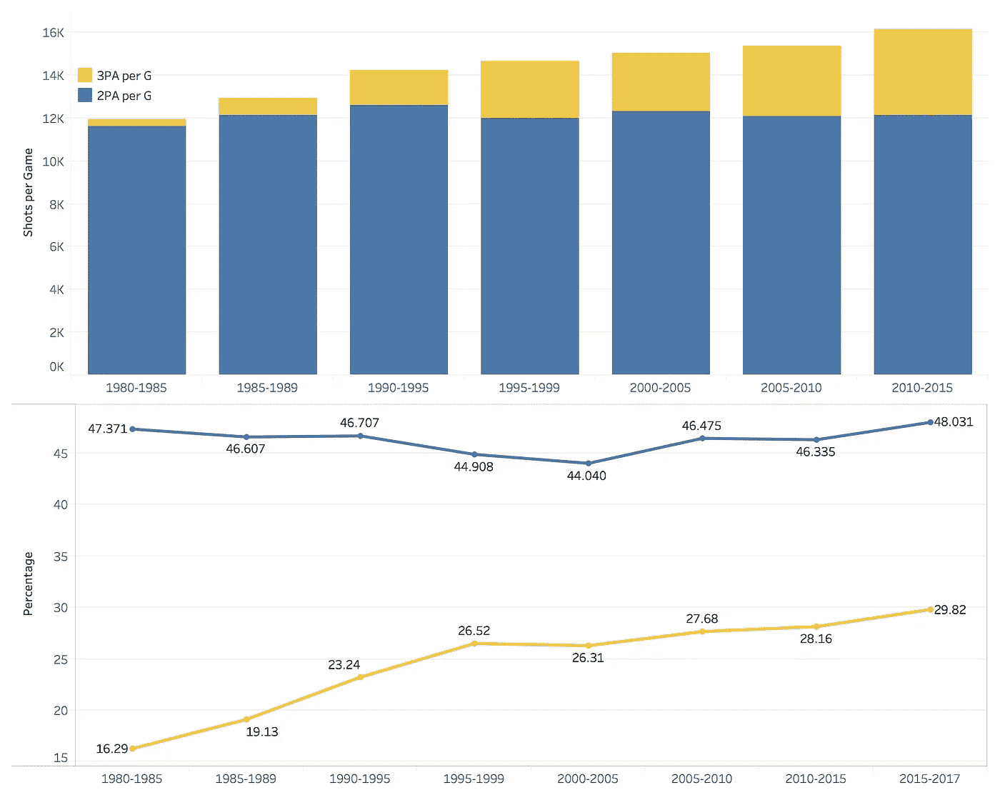
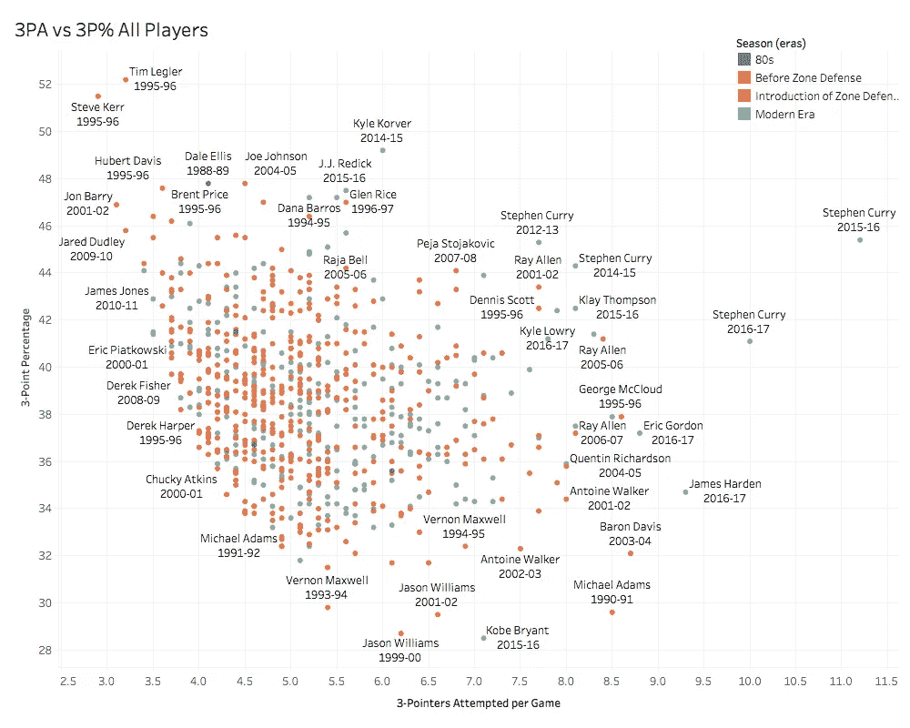
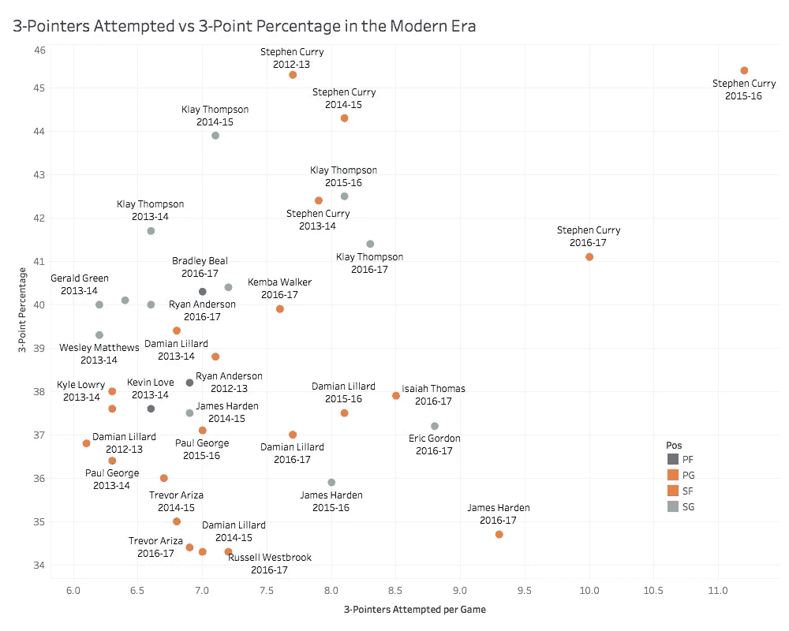
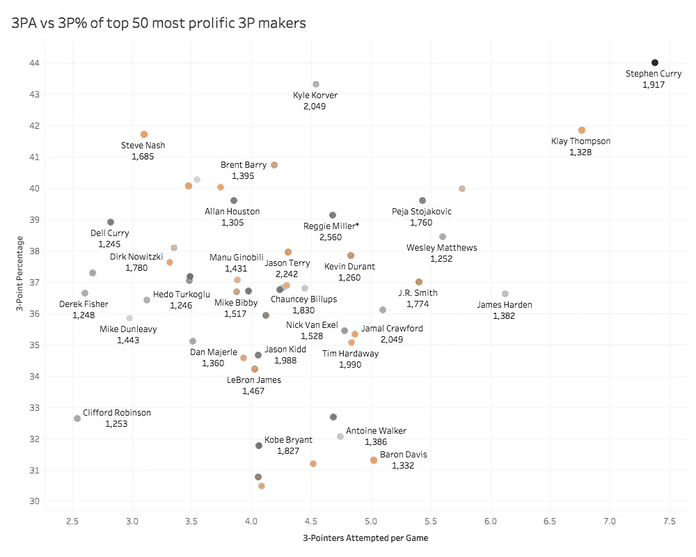
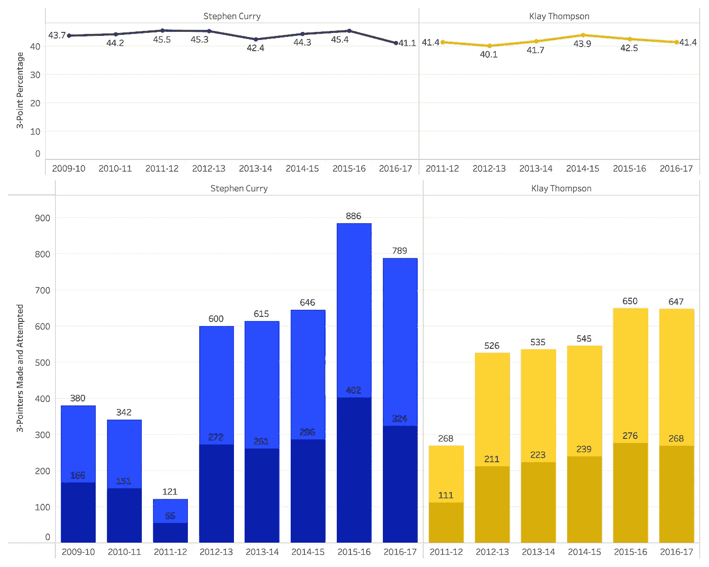

# NBA 三分线的演变

> 原文：<https://towardsdatascience.com/the-evolution-of-the-nba-3-point-line-da6700714ad2?source=collection_archive---------3----------------------->

在过去的几年里，我们已经看到各种统计数据向 NBA 观众展示了所有新的三分线记录，以及三分线现在的使用有多么不同。相比之下，87-88 赛季的领袖是丹尼·安吉，他投中了 148 个三分球。相比之下，17-18 赛季大约有 45 场比赛，克莱·汤普森以 154 个三分球领先 NBA。这篇文章介绍了球员如何提高三分线的优势。

自从 1980-81 赛季引入三分线以来，三分球的尝试和三分球的百分比稳步上升，而场均 2 分的投篮次数相对保持不变。

当我们看看 NBA 中最多产的投手时，我们可以看到大多数的条目，尤其是好的条目，都来自最近 15 年。脚注中描述了纪元组。

即便如此，有两个名字还是很突出

即使是在 NBA 中最多产的 3 分投手中，水花兄弟在制造和效率方面也远远超过其他人。右上角没有标签的点对应于雷·阿伦。

他们到底有多特别？他们在同一个队的时候，在高命中率**的时候，保持了很高的 3 分命中率。唯一的遗憾是这个小矮子凯文·杜兰特加入了球队。**

注意事项:

*   马克·杰克逊担任主教练的第一年是 2011-12 赛季。在那之后，斯蒂芬和克莱立即得到了拍摄的许可。
*   电子逆向拍卖分为以下几类:
*   80 年代:1980 年至 1989 年
*   区域联防之前:1990-2002
*   区域联防简介:2003-2010
*   现代:2011–2017
*   在 1994-95 和 1995-96 赛季，三分线被缩短，在这两年，史蒂夫·科尔和蒂姆·莱格勒的三分球命中率达到了 50%以上。
*   在第二个散点图中，限制是每个赛季至少打 1000 分钟和至少投中 120 个三分球。