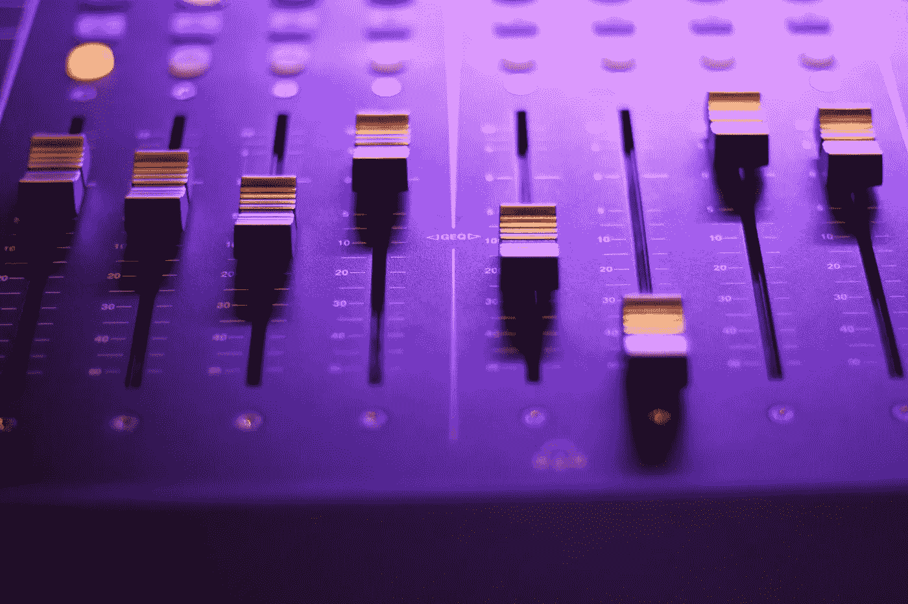
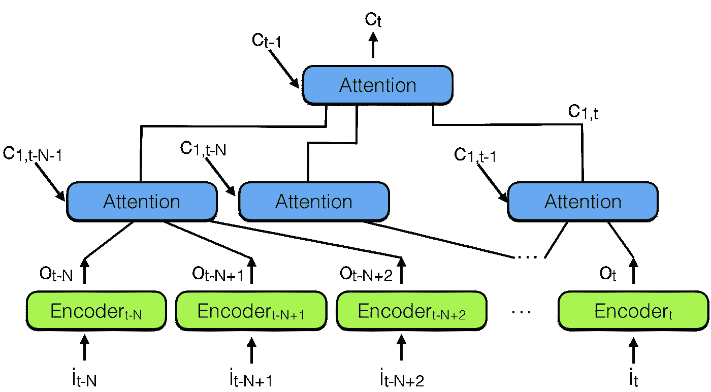

# RNN / LSTM 的陷落

> 原文：<https://towardsdatascience.com/the-fall-of-rnn-lstm-2d1594c74ce0?source=collection_archive---------0----------------------->

我们爱上了循环神经网络(RNN)、长短期记忆(LSTM)及其所有变体。现在是放下它们的时候了！

2014 年，LSTM 和 RNN 起死回生。我们都读过[科拉的博客](http://colah.github.io/posts/2015-08-Understanding-LSTMs/)和[卡帕西的《RNN 颂》](http://karpathy.github.io/2015/05/21/rnn-effectiveness/)。但是我们都很年轻，没有经验。几年来，这是解决序列学习、序列翻译(seq2seq)的方法，这也导致了语音到文本理解的惊人结果，以及 [Siri](http://www.businessinsider.com/apples-siri-using-neural-networks-2016-8) 、 [Cortana](https://venturebeat.com/2014/04/03/behind-cortana-how-microsoft-aims-to-stand-out-with-its-personal-assistant/) 、[谷歌语音助手](https://cloud.google.com/speech-to-text/)、 [Alexa](https://www.zdnet.com/article/amazon-echo-the-four-hard-problems-amazon-had-to-solve-to-make-it-work/) 的提升。我们也不要忘记机器翻译，它产生了将文档翻译成不同语言的能力或[神经机器翻译](https://research.googleblog.com/2016/09/a-neural-network-for-machine.html)，而且还将[图像翻译成文本](https://arxiv.org/abs/1502.03044)，将[文本翻译成图像](https://arxiv.org/abs/1511.02793)，以及[字幕视频](https://www.cs.utexas.edu/~vsub/naacl15_project.html)，而且……好了，你明白了。

然后接下来的几年(2015–16)就来了 [ResNet](https://arxiv.org/abs/1512.03385) 和[关注](https://arxiv.org/abs/1502.03044)。人们可以更好地理解 LSTM 是一种聪明的旁路技术。还注意到 MLP 网络可以被受*上下文向量*影响的*平均*网络所取代。稍后将详细介绍。

只花了两年多的时间，但今天我们可以肯定地说:

> "放下你的 RNN 和 LSTM，他们不好！"

但不要相信我们的话，也可以看到证据表明，基于注意力的网络越来越多地被[谷歌](https://arxiv.org/abs/1706.03762)、[脸书](https://code.facebook.com/posts/1978007565818999/a-novel-approach-to-neural-machine-translation/)、 [Salesforce](https://einstein.ai/research/non-autoregressive-neural-machine-translation) 等公司使用。所有这些公司已经取代了 RNN 和基于注意力模型的变体，这仅仅是个开始。RNN 在所有应用程序中都计算天数，因为它们比基于注意力的模型需要更多的资源来训练和运行。见[这篇文章](/memory-attention-sequences-37456d271992)了解更多信息。

# 但是为什么呢？

记住，RNN 和 LSTM 以及衍生工具主要使用时间顺序处理。请参见下图中的水平箭头:

Sequential processing in RNN, from: [http://colah.github.io/posts/2015-08-Understanding-LSTMs/](http://colah.github.io/posts/2015-08-Understanding-LSTMs/)

这个箭头表示长期信息在到达当前正在处理的单元之前必须依次通过所有单元。这意味着它很容易被乘以小数字< 0\. This is the cause of [消失梯度](http://www.wildml.com/2015/10/recurrent-neural-networks-tutorial-part-3-backpropagation-through-time-and-vanishing-gradients/)而被破坏。

为了挽救局面，出现了 LSTM 模块，它今天可以被视为多个开关门，有点像 [ResNet](https://arxiv.org/abs/1512.03385) 它可以绕过单元，从而记住更长的时间步长。因此，LSTM 有办法消除一些渐变消失的问题。

Sequential processing in LSTM, from: [http://colah.github.io/posts/2015-08-Understanding-LSTMs/](http://colah.github.io/posts/2015-08-Understanding-LSTMs/)

但不是全部，从上图可以看出。我们仍然有一个从旧的过去细胞到当前细胞的顺序路径。事实上，路径现在变得更加复杂，因为它有附加和遗忘分支。毫无疑问，LSTM、GRU 和衍生品能够学到很多长期信息！此处见结果[；但是他们能记住 100 的序列，而不是 1000 或 10000 或更多。](http://karpathy.github.io/2015/05/21/rnn-effectiveness/)

RNN 的一个问题是它们对硬件不友好。让我解释一下:我们不需要很多资源来快速训练这些网络。此外，在云中运行这些模型需要大量资源，鉴于语音到文本的需求正在快速增长，云是不可扩展的。我们将需要在边缘处理，直接进入亚马逊回声！更多详细信息，请参见下面的注释。

# 你是做什么的？

此时(2018 年 9 月)我会认真考虑这个方法[这里](https://arxiv.org/abs/1808.03867)。这是一个基于 2D 卷积的神经网络，具有因果卷积，可以胜过 RNN/LSTM 和注意力模型，如[转换器](https://arxiv.org/abs/1706.03762)。

从 2017 年到上面的论文，[变形金刚](https://arxiv.org/abs/1706.03762)绝对是一个很好的建议。它在训练和参数数量上有很大的优势，正如我们在这里讨论的。

**或者:**如果要避免顺序处理，那么我们可以找到“向前看”或更好的“向后看”的单元，因为大多数时候我们处理实时因果数据，我们知道过去并希望影响未来的决策。举例来说，在翻译句子或分析录制的视频时就不是这样了，我们有所有的数据，可以花更多的时间进行推理。这种回顾/前瞻单元是神经注意力模块，我们之前在这里解释过[。](https://medium.com/@culurciello/neural-networks-building-blocks-a5c47bcd7c8d)

为了解决这个问题，结合多个神经注意力模块，出现了“*分级神经注意力编码器*”，如下图所示:

Hierarchical neural attention encoder

查看过去的更好方法是使用注意力模块将所有过去的编码向量总结成上下文向量 Ct。

注意这里有一个注意力模块的层级，非常类似于神经网络的层级。这也类似于下面注 3 中报告的[时间卷积网络(TCN)](https://arxiv.org/abs/1803.01271) 。

在*分层神经注意力编码器*中，多层注意力可以查看最近过去的一小部分，比如说 100 个向量，而上面的层可以查看这些注意力模块中的 100 个，有效地整合了 100 x 100 个向量的信息。这将*分级神经注意力编码器*的能力扩展到 10，000 个过去向量。

> 这是回顾过去并影响未来的方法。

但更重要的是，看看将表示向量传播到网络输出所需的路径长度:在分层网络中，它与 *log(N)* 成比例，其中 N 是分层的层数。这与 RNN 需要做的 T 个步骤形成对比，其中 T 是要记忆的序列的最大长度，T > > N

> 如果你跳 3-4 次，比跳 100 次更容易记住序列！

这种架构类似于[神经图灵机](https://arxiv.org/abs/1410.5401)，但让神经网络决定通过注意力从内存中读出什么。这意味着实际的神经网络将决定哪些来自过去的向量对未来的决策是重要的。

但是存储到内存呢？上面的架构在内存中存储所有以前的表示，不像神经转动机器。这可能是相当低效的:想想存储视频中每一帧的表示——大多数情况下，表示向量不会逐帧改变，所以我们确实存储了太多相同的内容！我们能做的是添加另一个单元来防止相关数据被存储。例如通过不存储与先前存储的向量太相似的向量。但这真的是一个黑客，最好的办法是让应用程序来指导什么向量应该保存或不保存。这是当前研究的重点。请继续关注更多信息。

> 所以总之忘掉 RNN 和变种吧。利用注意力。你真正需要的是关注！

**告诉你的朋友！**我们非常惊讶地看到，如此多的公司仍在使用 RNN/LSTM 进行语音到文本的转换，许多公司都没有意识到这些网络是如此低效和不可扩展。请告诉他们这个帖子。

# **附加信息**

**关于训练 RNN/LSTM:** RNN 和 LSTM 很难训练，因为它们需要内存带宽限制的计算，这是硬件设计者最糟糕的噩梦，并最终限制了神经网络解决方案的适用性。简而言之，LSTM 要求每个单元 4 个线性层(MLP 层)在每个序列时间步长运行。线性层需要大量的内存带宽来计算，事实上，它们不能经常使用许多计算单元，因为系统没有足够的内存带宽来提供计算单元。增加更多的计算单元很容易，但增加更多的内存带宽却很难(注意芯片上足够多的线，从处理器到内存的长电线，等等)。因此，RNN/LSTM 和变体不是硬件加速的良好匹配，我们在此处[和此处](https://medium.com/@culurciello/computation-and-memory-bandwidth-in-deep-neural-networks-16cbac63ebd5)的[之前讨论过这个问题。一个解决方案将是在内存设备中进行计算，就像我们在](https://medium.com/@culurciello/computation-and-memory-bandwidth-in-deep-neural-networks-16cbac63ebd5) [FWDNXT 上所做的那样。](http://fwdnxt.com/)

# 笔记

**注 1:** *分层神经注意*类似于 [WaveNet](https://deepmind.com/blog/wavenet-generative-model-raw-audio/) 中的思路。但是我们使用分级注意模块，而不是卷积神经网络。另外:*分级神经注意力*也可以是双向的。

**注 2:** RNN 和 LSTM 是内存带宽受限问题([详见此](https://medium.com/@culurciello/computation-and-memory-bandwidth-in-deep-neural-networks-16cbac63ebd5))。处理单元需要的内存带宽与它们能够提供的操作数一样多，因此不可能充分利用它们！外部带宽永远不够，稍微改善这个问题的方法是使用高带宽的内部快速缓存。最好的方法是使用不需要从内存中来回移动大量参数的技术，或者可以重复用于每个传输字节的多次计算的技术(高算术强度)。

**注 3** :这里有一篇[比较 CNN 和 RNN](https://arxiv.org/abs/1803.01271) 的论文。时间卷积网络(TCN)“在各种任务和数据集上优于 LSTMs 等典型递归网络，同时表现出更长的有效记忆”。

**注 4** :与这个话题相关的是，[我们对人类大脑如何学习和记忆序列知之甚少](http://journals.plos.org/ploscompbiol/article?id=10.1371/journal.pcbi.1004592)。“我们通常以较小的片段来学习和记忆较长的序列，例如一个电话号码 858 534 22 30 被记忆为四个片段。行为实验表明，人类和一些动物在各种各样的任务中采用了这种将认知或行为序列分解成组块的策略”——这些组块让我想起了较小序列上的小卷积或注意力网络，然后这些小卷积或注意力网络按层次串在一起，就像在*分层神经注意力编码器*和时间卷积网络(TCN)中一样。[更多的研究](https://www.ncbi.nlm.nih.gov/pubmed/23541152)让我觉得工作记忆类似于使用递归真实神经元网络的 RNN 网络，它们的容量很低。另一方面，大脑皮层和海马体都让我们能够记住很长的步骤序列(比如:5 天前我在机场把车停在哪里)，这表明回忆长序列可能涉及更多的平行路径，其中注意力机制控制重要的块，并迫使序列中与最终目标或任务无关的部分跳跃。

**注 5:** 以上证据表明我们没有按顺序阅读，事实上我们是把字、词、句作为一个整体来解读的。一个基于注意力的或卷积的模块感知序列，并在我们的头脑中投射一个表征。如果我们按顺序处理这些信息，我们就不会误读了！我们会停下来注意不一致的地方！

**注 6:** 一篇[最近的论文](https://blog.openai.com/language-unsupervised/)用 attention/transformer 进行无监督训练，在迁移学习中表现惊人。NLP 的 VGG？这项工作也是杰瑞米和塞巴斯蒂安的[开创性工作的延伸，其中一个具有特别训练程序的 LSTM 能够在无人监督的情况下学习预测一系列文本中的下一个单词，然后也能够将这些知识转移到新的任务中。此处](https://arxiv.org/abs/1801.06146)给出了 LSTM 和 Transformer(基于注意力)的有效性比较[，并显示注意力通常是注意力获胜，并且“仅 LSTM
在一个数据集上优于 Transformer——MRPC。”](https://blog.openai.com/language-unsupervised/)

**注 7** : [在这里](https://jalammar.github.io/illustrated-transformer/)你可以找到关于变压器架构和数据流的精彩解释！

# 关于作者

我在硬件和软件方面都有将近 20 年的神经网络经验(一个罕见的组合)。在这里看关于我:[媒介](https://medium.com/@culurciello/)、[网页](https://e-lab.github.io/html/contact-eugenio-culurciello.html)、[学者](https://scholar.google.com/citations?user=SeGmqkIAAAAJ)、 [LinkedIn](https://www.linkedin.com/in/eugenioculurciello/) 等等…