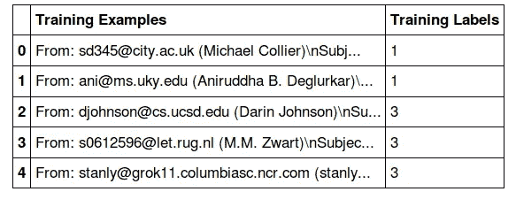
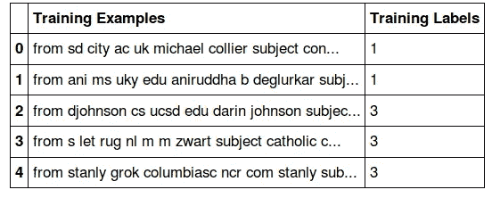
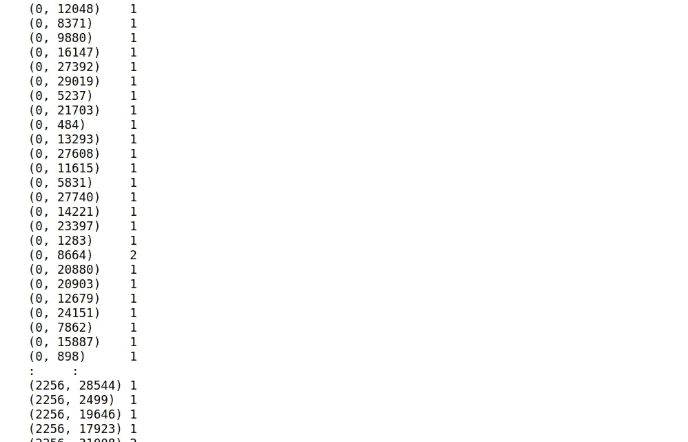

# 最后一幕——就像一个天真的贝叶斯专家！

> 原文：<https://towardsdatascience.com/the-final-act-just-like-a-na%C3%AFve-bayes-pro-5c440b511b8d?source=collection_archive---------8----------------------->

## 对于 ML 初学者


从零开始展开朴素贝叶斯！Take-3🎬

你几乎是在掩盖朴素贝叶斯文本分类算法的所有方面。

> *以防你错过了之前的博文，你可以参考下面的链接*
> 
> [***从零开始展开朴素贝叶斯 Take-1🎬***](/unfolding-naïve-bayes-from-scratch-2e86dcae4b01) *！一个简单明了的朴素贝叶斯解释，以便在开始编码之前清楚地了解这个算法是如何工作的*
> 
> [***从零开始展开朴素贝叶斯！*take-2***🎬*](/naïve-bayes-from-scratch-using-python-only-no-fancy-frameworks-a1904b37222d) *:在转向 python 的 ML 工具包之前，在基本 python 中从头实现朴素贝叶斯只是为了巩固核心理解*

## 目标受众是谁？🗣 🗣 🗣

就像我在以前的博客文章中提到的一样，这篇文章也是为 ML 初学者准备的——关注基本概念。

## 本教程的成果—NB 的实践 Scikit-learn 实施

使用 Python 的机器学习框架 Scikit-learn 实现 NB 的完整演练

# 定义路线图…..🚵

**里程碑# 1:** [**预处理训练数据集**](#e4a9)

**里程碑# 2:** [**在预处理的训练数据集上训练 NB 模型**](#6198)

**里程碑# 3:** [**使用训练好的 NB 模型**](#2959) 进行测试

**里程碑# 4:** [**培训&使用 Scikit 测试-学习管道功能**](#ad35)

> 让我们从 Scikit-learn 实现开始吧！

# **预处理训练数据集**

一些进口货…

预处理函数与[从头开始展开朴素贝叶斯中定义的相同！Take-2🎬](/naïve-bayes-from-scratch-using-python-only-no-fancy-frameworks-a1904b37222d)

## 正在加载 20 个新闻组数据集

这与之前在[从头开始展开朴素贝叶斯中使用的数据集相同！Take-2🎬](/naïve-bayes-from-scratch-using-python-only-no-fancy-frameworks-a1904b37222d)

这是原始形式的训练数据集的样子…..



让我们从训练数据集的预处理开始，包括

1.  文本清理
2.  创建我们的训练数据集的 BoW 表示(测试数据集也需要同样的表示)

**文字清理**

处理后的训练数据集如下所示



**创建我们的训练数据集的 BoW 表示**

> ***count vectorizer 上的几行***
> 
> *计数矢量器的作用是什么？
> 接收文本语料库，建立其术语文档矩阵(即 BoW ),并将其返回*
> 
> *每个单词被分配一个固定的唯一整数 id，该矩阵的每个单元的值代表单词计数——BoW*
> 
> *例如，X_train_counts[ i，j ] ( i 指的是一个文档，在我们的例子中，每个文档指定一个训练示例，j 指的是单词 w 在其各自的文档 I 中的索引)将返回单词 j 的计数*

下面是 X_train_counts 矩阵的样子:
X_train_counts[0，12048]将检索整数 id = 12048、文档/示例 id 为 0 的 word 的字数



**里程碑# 1 已实现**👍

# **在预处理的训练数据集上训练 NB 模型**

简单地在实例化一个 NB 对象后，我们调用*拟合函数*来训练一个 NB 模型。我们将简单地传递训练示例作为第一个参数&训练集标签作为第二个参数。

> *注意，X_train_counts(术语文档矩阵)作为训练示例而不是文本数据被传递*

我们只用 3 行代码就完成了培训！

**里程碑# 2 已实现**👍 👍

# **使用经过训练的 NB 模型进行测试**

在我们开始测试之前，我们将首先需要以与训练数据集相同的方式对其进行预处理

**测试设置文本清理**

**创建测试数据集的 BoW 表示** 为训练数据集实例化的相同 count_vect 对象将用于测试数据集。但是请记住，我们不是在测试集上调用 fit_transform，因为我们只想将测试数据转换为术语-文档矩阵，而 fit_transform 首先学习词汇词典，然后返回术语-文档矩阵。我们应该只学习训练数据集中的词汇

```
fit_transform : learns the vocabulary dictionary and returns term-document matrixtransform : transforms documents to document-term matrix
```

**现在我们可以在测试数据集的转换版本上进行测试**

我们将简单地调用为 NB 模型拟合/训练的 clf 对象上的预测函数


> ***里程碑# 3 实现*** *👍 👍 👍*

# **培训&使用 Scikit 测试-学习管道功能**

管道创造奇迹！通过使用 sklearn 的管道功能，上述代码可以进一步减少到 3 行代码

> 我们只需通过指定管道动作来构建一个管道对象，一旦该管道对象用于训练，它将按照指定的顺序自动执行管道步骤。
> 
> *在我们的例子中，因为我们首先需要为 BoW 构建一个 CountVectorizer，然后拟合/训练一个 NB 模型，所以以完全相同的方式，我们将在管道中指定这些操作。*
> 
> *请注意，现在当调用 fir 方法时，我们将传递原始文本数据，因为现在管道中的 count_vect 将自己将其转换为数字形式。因此，在这里传递文本数据很重要，否则会出现令人讨厌的错误。测试数据也是如此。不需要单独对其进行计数矢量化，但我们需要从清理的角度对测试数据进行预处理*

最后一部分——测试

> 所有的培训和测试只需 3 行代码！


# 你做到了！

> ***里程碑# 4 实现*** *👍 👍 👍 👍*

你可以在 Jupyter 笔记本 [**这里**](https://github.com/aishajv/Unfolding-Naive-Bayes-from-Scratch/blob/master/%23%20Unfolding%20Na%C3%AFve%20Bayes%20from%20Scratch!%20Take-3%20%F0%9F%8E%AC.ipynb) 找到所有源代码

如果您有任何想法、意见或问题，欢迎在下面评论或联系📞与我一起上 [**LinkedIn**](https://www.linkedin.com/in/aisha-javed/)