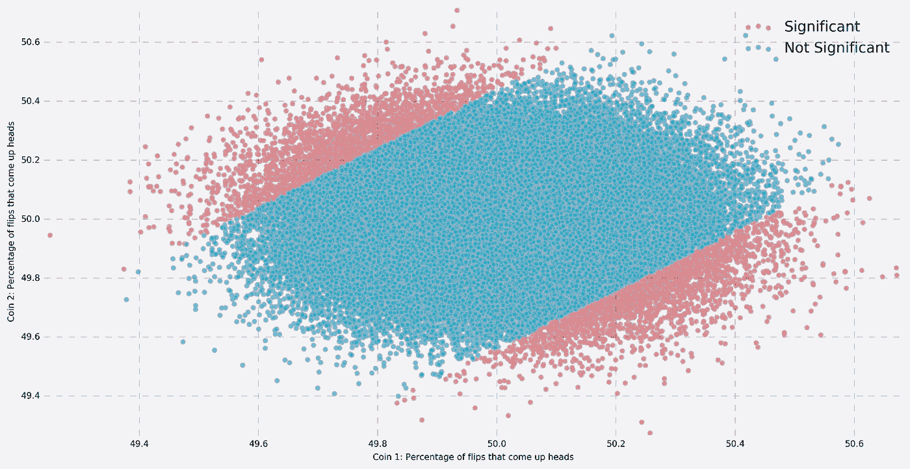
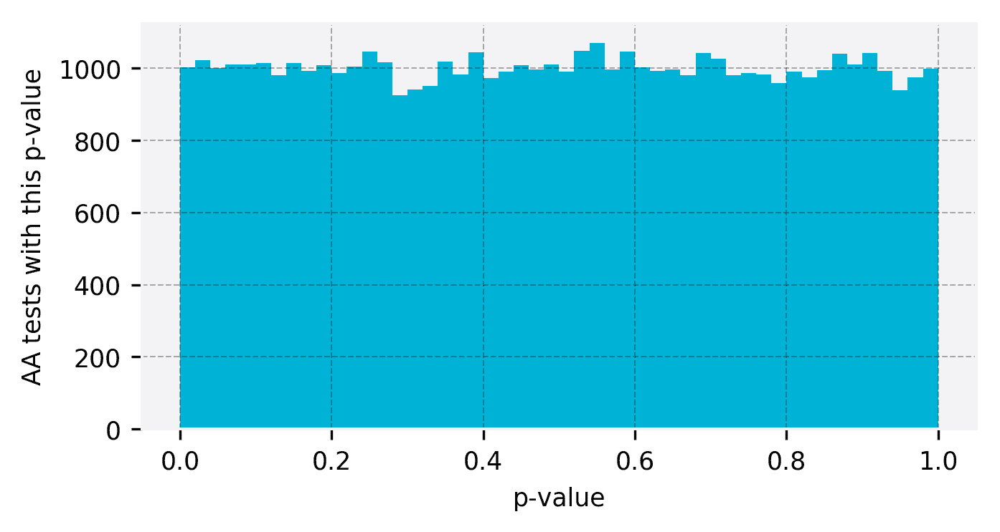

# 实验的第一个幽灵:要么有意义，要么是噪音

> 原文：<https://towardsdatascience.com/the-first-ghost-of-experimentation-its-either-significant-or-noise-b897e3058655?source=collection_archive---------6----------------------->

汤姆·奥利弗，科林·麦克法兰和利兹·埃德里

The first Ghost of Experimentation: It’s either significant or noise

👻这篇文章是探索导致[追逐统计幽灵](https://medium.com/@SkyscannerCodevoyagers/chasing-statistical-ghosts-in-experimentation-3f393323a1c1)的实验从业者普遍误解的系列文章的一部分。

在进行了一项实验后，我们想了解观察到的任何差异是随机噪声，还是真实的。不幸的是，确认偏差表明我们倾向于以确认我们已经想到的方式来消化数据。

实验者很容易思考，如果实验没有达到预先设定的宣布信号而不是噪声的阈值，那么这些实验是否是“几乎显著的”或类似的短语。p 值是反直觉的，经常被曲解，所以让我们来探讨如何更彻底地对 p 值做出反应。

一个 p 值试图回答这个简单的问题:这个数据有多令人惊讶？或者更正式地说:给定零假设，找到观察到的(或更极端的)数据的概率是多少。p 值提供了一个条件概率，因为它假设零假设为真。

> *“从某种意义上来说，它(p 值)提供了防止被随机性愚弄的第一道防线，将信号与噪声分开”——Benjamini，2016 年*

标准的显著性水平是 0.05。在这种情况下，如果 p 值小于 0.05，这意味着您观察到的数据只是偶然发生的条件概率(假设为空)小于 5%。因此，如果我们结束实验，观察到 p 值为 0.05，根据数据，我们可以有把握地说零假设是不正确的，并接受观察到的因果关系。

*“但我的结果几乎意义重大”…*

这可能会有问题；一个实验数据样本并不具有显著性——结果要么显著，要么不显著，否则无法定性。这是对 p 值如何工作的最大误解，或者更确切地说，是对它们如何分布的误解。

我们可以通过模拟抛硬币实验来证明这一点。如果我们模拟 100，000 次实验，其中我们将两个无偏的硬币翻转 100，000 次以创建我们的 A 组和 B 组，那么我们预计在大约 5%的时间(使用标准水平)中会看到两组之间的显著差异。下面的散点图显示了每个实验的一个点，如果 A 和 B 之间的差异显著，则每个点都是红色的，如果不显著，则是蓝色的:

因此，我们确实看到了显著性的预期模式，5.0%的实验显示了显著差异。更有趣的是，当我们观察 p 值在所有实验中的分布时。

请记住，硬币是无偏的，所以测试实验就像 A/A 实验一样，处理之间没有真正的区别:

我们看到的是，当数据中不存在真效应时(或者当零假设为真时)，每个 p 值的概率是相等的。实验并不致力于显著性，在阈值之外比较 p 值的相对显著性是一个错误，会导致大量的假阳性。

p 值不应被视为显著，除非它在显著性水平内-当测试假设(拒绝空值)时，我们只能这样做，或者不这样做，所以找到显著性或声明不显著。如果我们没有达到预定的阿尔法水平，我们只能保持*不确定*。

[丹尼尔·拉肯斯](https://www.coursera.org/learn/statistical-inferences)提供了一个简单的纠正你可以遵循，以避免长期以来经常出错。其中α是我们的显著性水平:

> p <= alpha: Act as if the data is not noise.
> p > alpha:保持不确定性或表现得好像数据是噪音一样。

👻更:[追统计鬼](https://medium.com/@SkyscannerCodevoyagers/chasing-statistical-ghosts-in-experimentation-3f393323a1c1)。

# 与我们合作

我们在 Skyscanner 以不同的方式做事，我们正在全球办事处寻找更多的工程团队成员。看看我们的 [Skyscanner 职位](https://www.skyscanner.net/jobs/)寻找更多空缺。

Team in action.