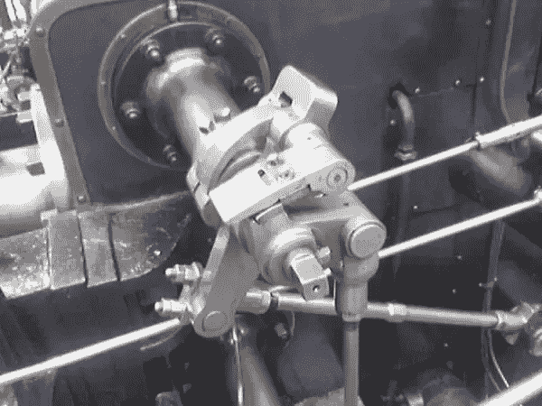
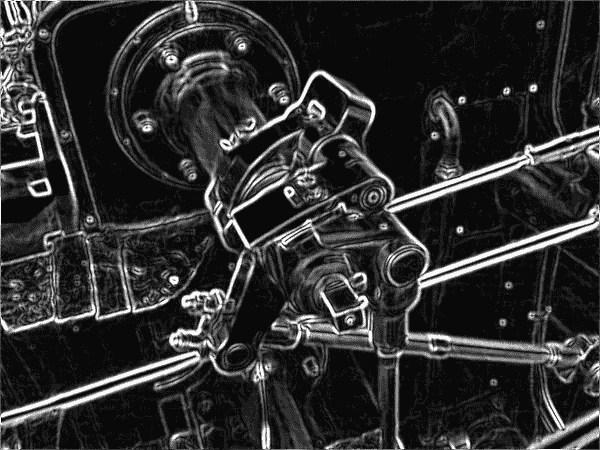
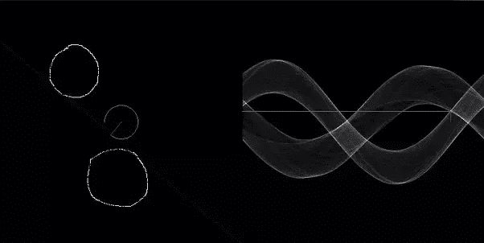

# 我做的第一个机器学习程序。

> 原文：<https://towardsdatascience.com/the-first-machine-learning-program-i-have-made-5ad09814184e?source=collection_archive---------7----------------------->

我做的第一个机器学习程序是 2011 年我上高中时提交的 NASA 陨石坑识别竞赛

下面是链接:[Ideone.com](http://ideone.com/X9O1GZ)

编写这段代码花了我几周时间和大量的研究。很有趣！我已经设法通过一个非常聪明的优化来调整算法性能。

它没有包含很多机器学习，主要是计算机视觉。然而，我已经成功地使用简单的逻辑回归调整了它的参数！:)我一直非常兴奋，我的提交获得了高分，这激励我将我的职业生涯奉献给这一领域。

它首先使用[高斯滤波器](https://en.wikipedia.org/wiki/Gaussian_filter)对数据进行预处理，以消除可能误导进一步视觉算法的噪声。

下一步，我使用了一个 [Sobel 算子](https://en.wikipedia.org/wiki/Sobel_operator)。它将图像转换为黑白轮廓图像，其中黑色代表图片的相似部分，白色代表边缘——图像的两个一致部分相互接触的地方。

预处理后，核心组件基于霍夫变换——一种识别圆形等形状并将它们转换到概率空间的算法。

这个想法是扫描图像，寻找不同大小和形状的椭圆，这是环形山的特征。

最后，将启发式和线性模型相结合来产生结果。它已经使用单独的可执行文件进行了微调，以使用线性回归找到最佳参数。

*转贴自 Quora*[*https://www . Quora . com/What-is-the-first-the-machine-learning-program-you-made*](https://www.quora.com/What-was-the-first-machine-learning-program-you-made)