# 足球德比——一个数据科学故事

> 原文：<https://towardsdatascience.com/the-football-derby-a-data-science-story-f903d2c9e2ff?source=collection_archive---------15----------------------->

因此，这是我今年夏天发表的一系列中型文章中的下一篇文章，在这篇文章中，我一直致力于培养我在数据科学方面的技能，以朝着数据科学家的职业生涯迈进。

处理足球数据是我长期以来一直想做的事情，这一次，我抓住机会，利用足球运动员位置的数据集，对不同的比赛顺序和比赛进行了分析，以得出一些关于比赛顺序或比赛本身的有趣见解。


Photo by [Willian Justen de Vasconcellos](https://unsplash.com/@willianjusten?utm_source=medium&utm_medium=referral) on [Unsplash](https://unsplash.com?utm_source=medium&utm_medium=referral)

我从 STATS，从他们的网站[https://www.stats.com/data-science/](https://www.stats.com/data-science/)获得了这个数据集。您可以从他们的网站上填写足球数据的申请表，以便发送数据请求，之后他们会在向您提供数据集之前向您发送一份协议供您签署。

这个分析的 Jupyter 笔记本是这里的。

# 出发

所以总结一下我在这次分析中想要做的事情

*   想象足球比赛的顺序，
*   显示关于单个游戏序列序列统计数据，
*   想象比赛中球员在球场上的位置，
*   对数据集应用 KMeans 聚类，以获得关于数据的有趣见解

# 数据集结构

数据集包含来自实际足球比赛的多列比赛序列(“序列 _1”到“序列 _18”)，其中记录了每个球员和球的位置

让我们根据上面的可用信息定义数据中的列:前 22 列是防守球员的 X，Y 位置，后 22 列是进攻球员的 X，Y 位置，最后 2 列是比赛中球的 X，Y 位置

TLDR；关于数据集的这些信息是随数据集一起提供的，如果您想了解关于数据集的详细信息，请阅读此信息

> 数据集中包括 7500 个序列的训练集和两个单独的测试序列集。Python 用户可以将训练数据(以 pickle 格式)加载到字典中，每个序列的键将是“ ***sequence_n*** ”，其中 n 是从 1 到 7500 的任意值。
> 
> 每个序列包含一段对应于最近职业足球联赛的实际比赛的跟踪数据。每个序列的格式如下:
> 
> -每个序列是具有 46 列的矩阵(numpy 2D 阵列)。每一行包含 23 对(x，y)坐标，来自两个队的 22 名球员和频率为 10Hz 的球。
> 
> ——前 22 列是 11 对(x，y)联防队员。接下来的 22 列是进攻球队的坐标(定义为连续控球的球队)。最后两列是球的坐标。
> 
> -攻击队和防守队的每组 22 列包括守门员的(x，y)对，随后是其他 10 名队友的 10 个连续的(x，y)对。身份和团队因序列而异。然而，在每个序列中，身份是一致的。因此，具体来说，在每个序列的 46 列中，我们知道前 2 列代表防守队守门员的坐标。列 2 到 22 包含 10 对连续的(x，y)其他防守队员。列 23 和 24 携带攻击队守门员的 x 和 y 坐标。列 25 到 44 包含 10 对连续的(x，y)其他进攻队员。列 45 和 46 携带球的 x 和 y 坐标。
> 
> -坐标通常属于沿 x 轴的[-52.5 米，+52.5 米]范围和沿 y 轴的[-34 米，+34 米]范围，间距的正中心为[0，0]。因此，例如，要将数据标准化到范围[-1，+1]，可以简单地将 x 列除以 52.5，y 列除以 34(这将有效地重新缩放球场，大致相当于 105×70 米大小的足球场，从矩形框到正方形框)
> 
> -坐标也进行了调整，以便攻击队从左向右移动，这意味着防守队在右手边防守球门。
> 
> -总的来说，该数据集相当于大约 45 场比赛的比赛时间，其中删除了冗余和“死亡”情况。

# 采集和处理数据

为了开始这个分析，我将数据集导入 Jupyter 笔记本。数据在数据库里。pkl '格式，这对我来说是新的，但是快速的谷歌搜索显示了熊猫的 *pd.read_pickle* 功能。

```
import pandas as pd
import seaborn as sns
import matplotlib.pyplot as plt
from matplotlib import patches
import numpy as np
%matplotlib inlinedata = pd.read_pickle('football/test_data_1.pkl')
```

让我们根据上面的可用信息定义数据中的列:前 22 列是防守球员的 X，Y 位置，后 22 列是进攻球员的 X，Y 位置，最后 2 列是比赛中球的 X，Y 位置

```
columns = ['GKDef_X', 'GKDef_Y', 'Def1_X', 'Def1_Y','Def2_X', 'Def2_Y','Def3_X', 'Def3_Y','Def4_X', 'Def4_Y','Def5_X', 'Def5_Y', 'Def6_X', 'Def6_Y', 'Def7_X', 'Def7_Y','Def8_X', 'Def8_Y','Def9_X', 'Def9_Y','Def10_X', 'Def10_Y', 'GKAtt_X','GKAtt_Y','Att1_X','Att1_Y','Att2_X','Att2_Y','Att3_X','Att3_Y','Att4_X','Att4_Y','Att5_X','Att5_Y','Att6_X','Att6_Y','Att7_X','Att7_Y','Att8_X','Att8_Y','Att9_X','Att9_Y','Att10_X','Att10_Y','Ball_X','Ball_Y']
```

从这里开始，现在是时候创建一个熊猫数据框架来保存这些值了

```
test_sequence = 'sequence_1'
df = pd.DataFrame(data[test_sequence], columns = columns)
df.head(5)
```

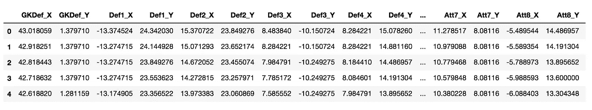

Result from the code above, we can see now the data split into the respective columns in a DataFrame

## 想象足球场和球的运动

在分析的这一部分，我们将把上面的内容转换成球的位置的可视化。让我们使用上面设计的列将数据转换成数据帧，并显示测试序列的球的轨迹。这是序列中单个时间点的球位置代码。

```
# Obtaining the positions occupied by the ball
ball_pos = df[['Ball_X','Ball_Y']].values.tolist()
ball_pos[0]# Output = [-19.961977005004883, 3.843478202819824]
```

这里是构建球场的代码，这里我使用 matplotlib 来构建它，并使用了这篇[文章](https://fcpython.com/visualisation/drawing-pitchmap-adding-lines-circles-matplotlib)中的代码。

```
# Plotting the ball along with the position of the ball
# Run with createPitch([]) to just display the pitch
def createPitch(ball_pos, defense_pos, attack_pos, size=0.2):
    #Create figure
    fig=plt.figure()
    ax=fig.add_subplot(1,1,1)#Pitch Outline & Centre Line
    plt.plot([-52.5,-52.5],[-35,35], color="black")
    plt.plot([-52.5,52.5],[35,35], color="black")
    plt.plot([52.5,52.5],[35,-35], color="black")
    plt.plot([52.5,-52.5],[-35,-35], color="black")
    plt.plot([0,0],[-35,35], color="black")

    #Left Penalty Area
    plt.plot([-39.5,-39.5],[16,-16],color="black")
    plt.plot([-52.5,-39.5],[16,16],color="black")
    plt.plot([-39.5,-52.5],[-16,-16],color="black")

    #Right Penalty Area
    plt.plot([39.5,39.5],[16,-16],color="black")
    plt.plot([52.5,39.5],[16,16],color="black")
    plt.plot([39.5,52.5],[-16,-16],color="black")

    #Left 6-yard Box
    plt.plot([-52.5,-47.5],[-10,-10],color="black")
    plt.plot([-47.5,-47.5],[-10,10],color="black")
    plt.plot([-52.5,-47.5],[10,10],color="black")

    #Right 6-yard Box
    plt.plot([52.5,47.5],[-10,-10],color="black")
    plt.plot([47.5,47.5],[-10,10],color="black")
    plt.plot([52.5,47.5],[10,10],color="black")

    #Create Arc and add it to our plot
    leftArc = patches.Arc((-45.5,0),height=18.3,width=18.3,angle=0,theta1=310,theta2=50,color="black")
    rightArc = patches.Arc((45.5,0),height=18.3,width=18.3,angle=0,theta1=130,theta2=230,color="black")#Assign circles to variables - do not fill the centre circle!
    centreCircle = plt.Circle((0,0),10,color="black",fill=False)
    centreSpot = plt.Circle((0,0),0.8,color="black")
    leftPenSpot = plt.Circle((-43.5,0),0.4, color="black")
    rightPenSpot = plt.Circle((43.5,0),0.4, color="black")

    #Draw Arcs
    ax.add_patch(leftArc)
    ax.add_patch(rightArc)#Draw the circles to our plot
    ax.add_patch(centreCircle)
    ax.add_patch(centreSpot)
    ax.add_patch(leftPenSpot)
    ax.add_patch(rightPenSpot)

    # Plotting the ball
    for pos in attack_pos:
        locBall = plt.Circle((pos[0],pos[1]),size,color="red")
        ax.add_patch(locBall)
    for pos in defense_pos:
        locBall = plt.Circle((pos[0],pos[1]),size,color="blue")
        ax.add_patch(locBall)
    for pos in ball_pos:
        locBall = plt.Circle((pos[0],pos[1]),size,color="green")
        ax.add_patch(locBall)

createPitch(ball_pos, [], [])
```

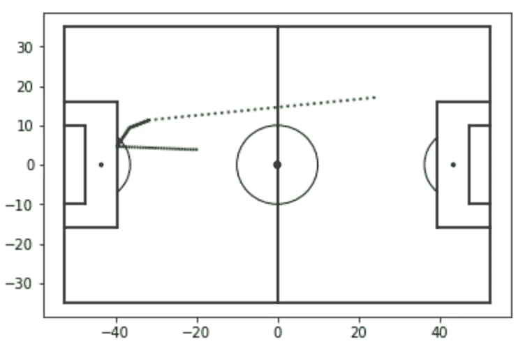

Result from the code above, position of the ball

## 想象整个游戏过程

在我们连接数据之前，我们必须做一些数据处理来转换每个序列中球员的位置。这一部分将会非常代码密集，但是最终结果是非常值得努力的。

```
positions = []
new_cols = columns + ['seq']
for seq in data:
    for d_seq in data[seq]:
        seq_list = d_seq.tolist()
        seq_list.append(seq)
        positions.append(seq_list)
df_data = pd.DataFrame(positions, columns = new_cols)df_data.seq = df_data.seq.apply(lambda x: int(x.strip('sequence_')))
sequences = list(set(df_data.seq))
grp = df_data.groupby('seq')
sequenced_data = []
for sequence in sequences:
    sequenced_data.append(grp.get_group(sequence))
sequenced_data[0].head(5)
```

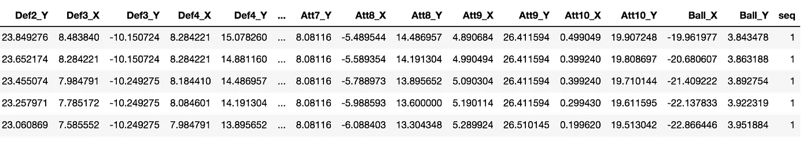

We just made a ‘seq’ column to store the entire dataset within this dataFrame and grouped by sequence

现在更多的争论是如何将每个球员的 X 和 Y 组合起来，并根据上面数据框中的值提供一个在球场上的位置。

```
def parse_data(data, seq):
    df = data[seq]
    defense = []
    attack = []
    ball = []
    defense.append(df[['GKDef_X','GKDef_Y']].values.tolist())
    defense.append(df[['Def1_X','Def1_Y']].values.tolist())
    defense.append(df[['Def2_X','Def2_Y']].values.tolist())
    defense.append(df[['Def3_X','Def3_Y']].values.tolist())
    defense.append(df[['Def4_X','Def4_Y']].values.tolist())
    defense.append(df[['Def5_X','Def5_Y']].values.tolist())
    defense.append(df[['Def6_X','Def6_Y']].values.tolist())
    defense.append(df[['Def7_X','Def7_Y']].values.tolist())
    defense.append(df[['Def8_X','Def8_Y']].values.tolist())
    defense.append(df[['Def9_X','Def9_Y']].values.tolist())
    defense.append(df[['Def10_X','Def10_Y']].values.tolist())
    attack.append(df[['GKAtt_X','GKAtt_Y']].values.tolist())
    attack.append(df[['Att1_X','Att1_Y']].values.tolist())
    attack.append(df[['Att2_X','Att2_Y']].values.tolist())
    attack.append(df[['Att3_X','Att3_Y']].values.tolist())
    attack.append(df[['Att4_X','Att4_Y']].values.tolist())
    attack.append(df[['Att5_X','Att5_Y']].values.tolist())
    attack.append(df[['Att6_X','Att6_Y']].values.tolist())
    attack.append(df[['Att7_X','Att7_Y']].values.tolist())
    attack.append(df[['Att8_X','Att8_Y']].values.tolist())
    attack.append(df[['Att9_X','Att9_Y']].values.tolist())
    attack.append(df[['Att10_X','Att10_Y']].values.tolist())
    ball = df[['Ball_X','Ball_Y']].values.tolist()
    def_list = []
    att_list = []
    for i in range (0,11):
        def_list = def_list + defense[i]
        att_list = att_list + attack[i]

    return def_list, att_list, ball
```

现在到了关键时刻，想象防守球员和进攻球员的整个比赛过程。这里进攻队用红色表示，防守队用蓝色表示

```
list_defense, list_attack, list_ball = parse_data(sequenced_data,0)
createPitch(list_ball, list_defense, list_attack)
```

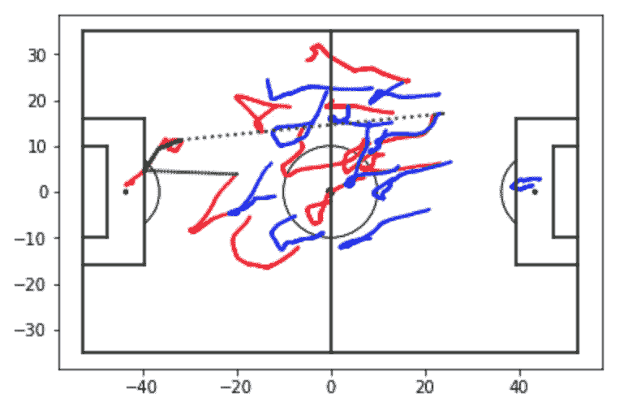

Visualizing a sequence of play, attacking team in red, defending team in blue

不错！以我从小看足球训练有素的眼光来看，这里我们想象一名后卫将球回传给守门员，长时间踢向前锋/中场，绿色虚线是传球。

# 单个游戏序列的统计

我在这里选择了另一个序列，因为在进攻和防守队伍的位置之间有更多的重叠。这看起来像一个通向目标的复杂的传球序列

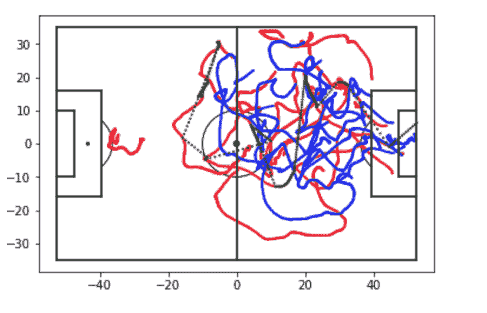

The sequence we will be working with for the analysis

## 球员和球的关系

我构建了一个函数来找出球员与球之间的距离，并返回一个距离列表来绘制球员与球之间的关系。你可以在我的笔记本[这里](http://http)找到这部分分析的代码

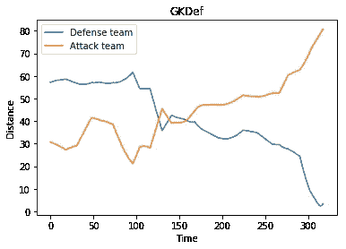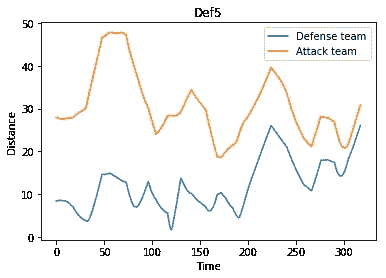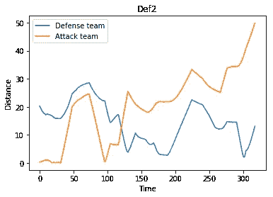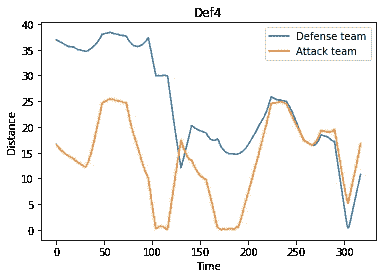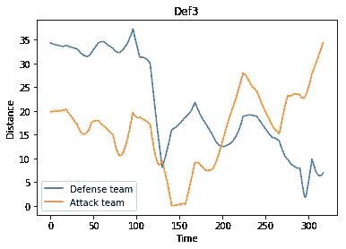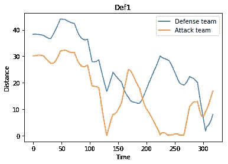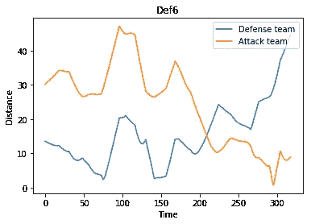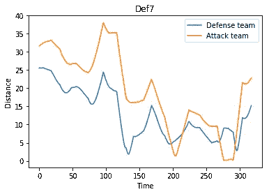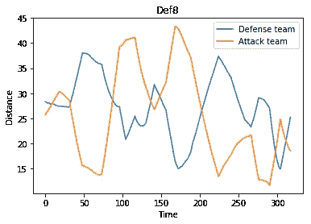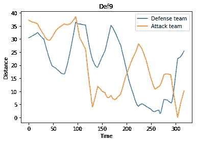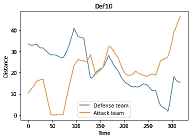

A complex sequence of play leading to a shot visualized with the player’s distances from the ball plotted over the time of the sequence

我们可以看到进攻和防守队伍中的一些球员如何在同一时间出现上升/下降，因为他们经常对传球做出反应。

## 进攻统计—控球

从这部分分析来看，每支球队的控球统计是一个简单的步骤。每当球的位置非常接近球员的位置时，就说球在球员手中。该序列应该对进攻方而不是防守方有更多的机会，因为数据集是作为进攻序列构建的。

让我们来看看这部分的代码

```
player_ppa = []
player_ppd = []
for i in range(0,11):
    player_df = pd.DataFrame(player_game_plot[i], columns = ['player', 'seq_num','def_ball','att_ball'])
    # Adding values to each team ppa = attacking ppd = defending
    player_ppa.append((player_df[player_df['att_ball'] < 2].seq_num.count()/len(player_game_plot[i]))*100)
    player_ppd.append((player_df[player_df['def_ball'] < 2].seq_num.count()/len(player_game_plot[i]))*100)# create plot
fig, ax = plt.subplots()
index = np.arange(0,11)
bar_width = 0.4
opacity = 0.8

rects1 = plt.bar(index, player_ppa, bar_width,
                 alpha=opacity,
                 color='b',
                 label='Attacking')

rects2 = plt.bar(index + bar_width, player_ppd, bar_width,
                 alpha=opacity,
                 color='g',
                 label='Defending')plt.xlabel("Player on team")
plt.ylabel("Percentage with Posession")
plt.legend()
plt.show()
```

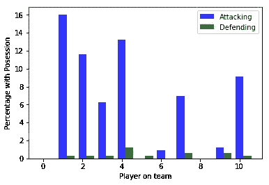

Possession stats for each player in sequence of play

这是一个普遍的趋势，看到攻击队保持球从防守队。我们在这里可以看到，6 名球员比攻击队中的其他人拥有更多的控球权，这表明这次攻击是 6 名球员参与的结果。6 名进攻球员强烈参与了这场比赛，另外 2 名进攻球员轻微参与了这场比赛。

## 进攻位置——距离球门的距离

现在让我们仔细看看在这个游戏序列中每个玩家离目标的距离。我将距离函数定义为(x0-y0) + (x1-y1)的平方根。

```
def dist(x, y):
    return math.sqrt(math.pow((x[0] - y[0]),2) + math.pow((x[1] - y[1]),2))
```

在这里，我将计算进攻球员的位置，并找出他们距离球门的平均距离

```
def attackingPosition(attack):
    att_players = np.array_split(attack, 11)
    distance = []
    # For each sequence time j
    for j in range(len(att_players[0])):
        # for each player on the attacking team k = 1 to 11
        for k in range(11):
            # Add the distances of the players on the attacking team to the goal
            player_dist = min(dist([52.5,-4], att_players[k][j]),dist([52.5,4], att_players[k][j]))
            distance.append((j,k,player_dist))

    return distanceatt_positions = attackingPosition(list_att)
att_values = pd.DataFrame(att_positions, columns = ['time', 'player', 'dist'])
players = att_values.groupby(['player']).mean()
```

然后我试着想象球员离球门的距离，并在做的时候用颜色来取乐。

```
def plotDistanceFromGoal(player_distances):
    ig, ax = plt.subplots()
    index = np.arange(0,11)
    bar_width = 0.6
    opacity = 0.8dist = plt.bar(index, player_distances, bar_width,
                     alpha=opacity,
                     label='Attacking team')
    # Some fun with colors
    colors = ["#FF5733", "#FFFF33", "#33FF39", "#33FFE0", "#333FFF", "#DA33FF", "#FF3333", "#000000", "#0087FF", "#B2FF00", "#00FFC1"]
    i = 0
    for color in colors:
        dist[i].set_color(color)
        i+=1
    plt.xlabel("Player on attacking team")
    plt.ylabel("Distance from Goal")
    plt.show()
plotDistanceFromGoal(players['dist'])
```

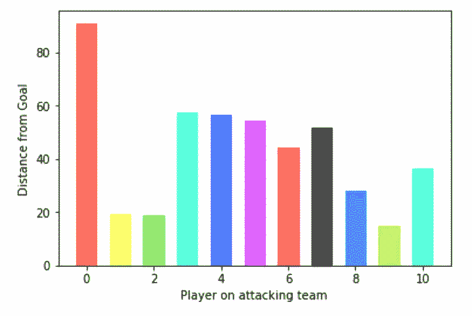

Distance from goal for each player on the attacking team

## **攻击性统计——是目标吗？**

现在我们可以看的更重要的一件事是这个序列是否会导致一个目标。这非常简单，因为我可以使用 sequence 的最后一个值，看看它是否在门柱内。这是代码。

```
def isGoal(sequence):
    seq = sequence[-1]
    #print(seq)
    if (((-39.5 < seq[0] < -52.5) or (39.5 < seq[0] < 52.5)) and ((-4 < seq[1] < 4))):
        return True
    else:
        return False
isGoal(list_ball)# Output: False
```

**哦，原来这个序列并没有导致一个目标！**我在数据集中搜索了一个序列，找到了这个。

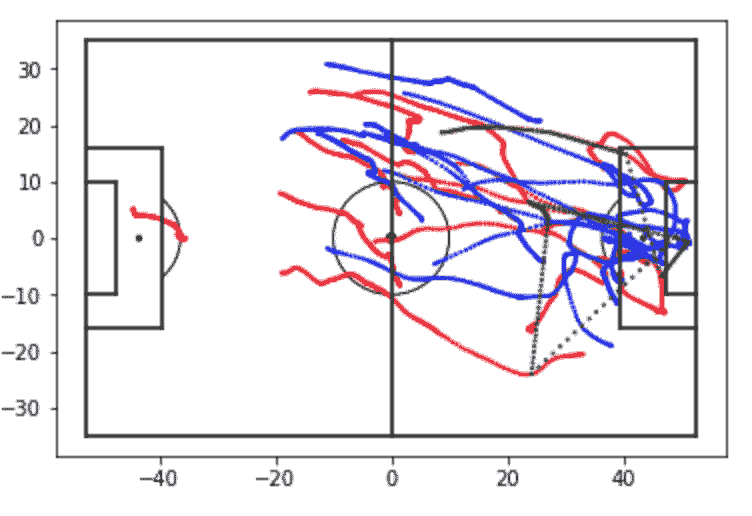

Visualizing a classic counterattack leading to a goal

哇，一个经典的反击导致进球。所以我们的功能似乎是在寻找目标。

## 防御分析—标记

现在让我们更仔细地看看比赛的防守方，这里我为防守队的每个球员定义了一个新的指标作为**最近的进攻球员**，以分析这些球员与进攻队的球员的距离有多近。这是一种特征提取的尝试。

现在让我们来看看防守球员盯防对手的能力有多强，这里我假设盯防的唯一标准是与进攻方最近球员的距离。有人指出，这种假设可能是不正确的，因为球员可能会试图阻止传球。但是在这个分析的范围内，我只考虑最近的进攻球员的距离。

分析的这一部分是为了看到同一防守队的不同球员在对攻击的反应上的相似之处。

在下面的函数中，我找到了序列中每个时间步进攻球员与防守球员之间的距离。

```
def closestPlayerDist(defense, attack):
    def_players = np.array_split(defense, 11)
    att_players = np.array_split(attack, 11)
    distance = []
    # For each sequence time j
    for j in range(len(def_players[0])):
        # for each player on the defensive team k
        for k in range(11):
            # Add the distances of the players on the attacking team to the list
            player_dist = [dist(def_players[k][j], att_players[i][j]) for i in range(11)]
            distance.append((j,k,player_dist))

    return distancedistances = closestPlayerDist(list_def, list_att)
```

最近的进攻球员距离测量将显示:

*   拉开距离，防守队中的每个球员在多大程度上缩小了他们盯防的进攻者的空间
*   序列中每个时间步长的平均值将表明团队离拿到球有多近
*   并且序列中每个时间步长的中值将指示运动员的某些部分离球有多近
*   数据序列中每个时间步的变化显示了团队的“静态性”,即他们移动了多少来适应团队的进攻

```
def plotdist(distances):
    distances_2 = [(distances[i][0], distances[i][1], distances[i][2][np.argmin(distances[i][2])]) for i in range(len(distances))]
    x = [distances_2[i][0] for i in range(len(distances_2))]
    y = [distances_2[i][2] for i in range(len(distances_2))]
    plt.plot(x,y,'bo', alpha=0.2)
    plt.ylabel('distance of closest attacking player')
    plt.xlabel('time')

plotdist(distances)
```

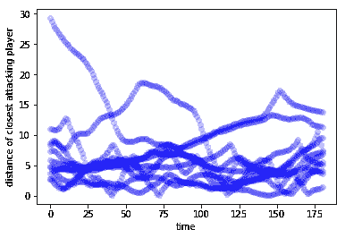

Distance of closest attacking player for each player on the defending team

```
def plotmeans(distances):
    distances_2 = [(distances[i][0], distances[i][1], distances[i][2][np.argmin(distances[i][2])]) for i in range(len(distances))]
    values = pd.DataFrame(distances_2, columns = ['time', 'player', 'dist'])
    means = values.groupby(['time']).mean()
    medians = values.groupby(['time']).median()
    fig, ax = plt.subplots()
    x = [i for i in range(len(means))]
    ax.plot(x,means.dist,'bo', alpha=0.5)
    ax.plot(x,medians.dist,'ro', alpha=0.5)
    ax.legend(['mean','median'])
    plt.ylabel('mean and median distance of closest attacking player')
    plt.xlabel('time')

    plt.show()plotmeans(distances)
```

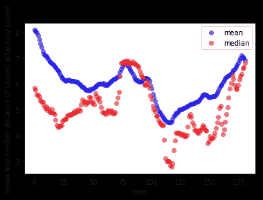

Mean and median of closest attacking player distance for the sequence of play

```
def plotvariance(distances):
    distances_2 = [(distances[i][0], distances[i][1], distances[i][2][np.argmin(distances[i][2])]) for i in range(len(distances))]
    values = pd.DataFrame(distances_2, columns = ['time', 'player', 'dist'])
    variance = values.groupby(['time']).var()
    fig, ax = plt.subplots()
    x = [i for i in range(len(variance))]
    ax.plot(x,variance.dist,'go', alpha=0.2)
    ax.legend(['variance'])
    plt.ylabel('variance of distance to closest attacking player')
    plt.xlabel('time')

    plt.show()plotvariance(distances)
```

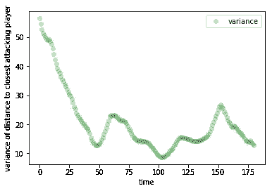

The variance of closest attacking player distance for sequence of play

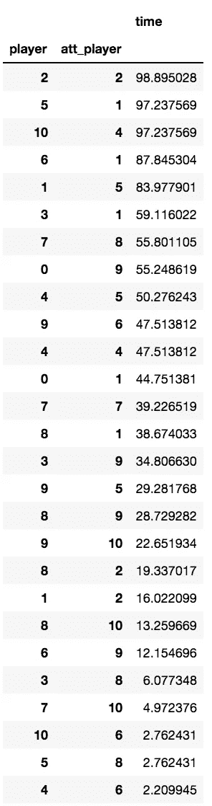

player column indicates defense, att_player indicates attack, time indicates percentage of time in sequence spent marking specific attacking player

现在让我们来看看防守方球员盯防对方球员的时间百分比。

这部分的代码

```
distances_3 = [(distances[i][0], distances[i][1], np.argmin(distances[i][2])) for i in range(len(distances))]marking = pd.DataFrame(distances_3, columns = ['time', 'player', 'att_player'])
marking = marking.groupby(['player','att_player']).count().sort_values(by='time', ascending=False)
marking.time = (marking.time/(len(distances)/11))*100
marking
```

以我训练有素的眼光来看，我们可以看到防守球员 2、5、10、6 和 1(守门员)靠近他们的进攻球员，但之后有一个急剧下降，这表明防守球员要么被进攻球员超过，要么作为一个团队进行区域防守。

我不认为统计上这是一个伟大的功能，否则。

# 在整个比赛中可视化球员在球场上的位置，

既然我们现在已经查看了一个单一的游戏序列并对其进行了分析，那么让我们将数据集作为一个整体来看。

## 球员位置热图

在这里，我们将构建一个玩家位置的热图，并显示每个玩家占据的位置

我首先构建了一个助手函数来解析数据并构建玩家位置的热图。接下来，我必须将这些值解析为整数，因为我使用的是 plt.pcolor，它必须在数据中包含整数值。52 和 35 是硬常数，以确保我的数据中没有任何负值。

```
def parse_sequence(values, data):
    round_data = [(round(x[0]),round(x[1])) for x in data]
    for r in round_data:
        a = r[0] + 52
        b = r[1] + 35
        values[b,a] += 1
```

在这里，我获得了原始数据，并从数据中提取了球员位置的值，用球员的位置填充网格

```
values = np.zeros((71,107))
ball = np.zeros((71,107))
for i in range(len(sequenced_data)):
    list_defense, list_attack, list_ball = parse_data(sequenced_data,i)
    parse_sequence(values, list_defense)
    parse_sequence(values, list_attack)
    parse_sequence(ball, list_ball)
```

最后，在这个分析的第二个关键时刻，玩家位置的热图

```
def createGrid(values, title_str):
    v = np.asarray(values)
    plt.pcolor(v)
    plt.title(title_str)
    plt.legend()
    plt.show()
createGrid(values, "Heatmap for player's position on pitch")
```

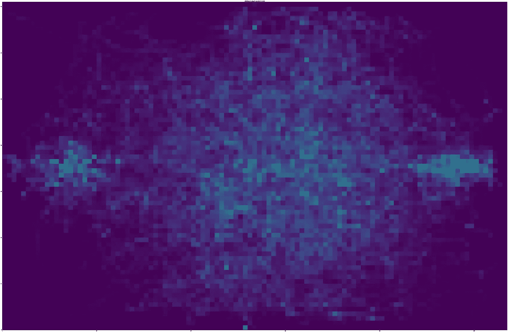

Look at this thing of beauty, heat map for positions of players for all the sequences of play

现在继续，我想看看比赛中的传球，以及整场比赛中球的位置热图。

```
createGrid(ball, "Heatmap for ball position on pitch")
```

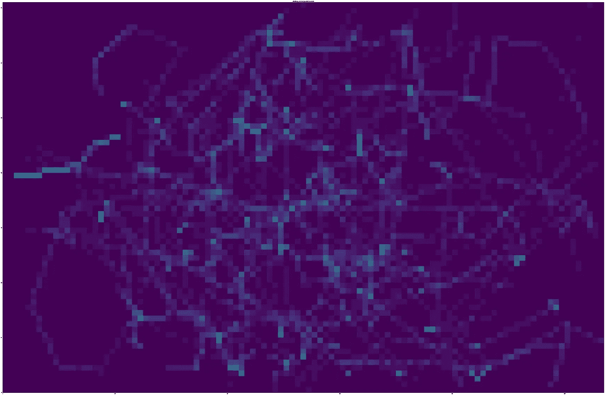

Heat map for position of the ball throughout the entire game

# k 均值聚类分析

显然，有了一组我可以聚集的点，我发布了 KMeans 是聚集这些数据的最简单的方法，以显示对数据的一些有趣的见解

**我选择 KMeans 的原因**

*   KMeans 聚类用于对非结构化数据进行分类——非结构化数据具有两个特征，每个球员位置的 X 和 Y 坐标非常适合分析
*   KMeans 通过查找数据的特征映射的质心来工作——我使用它来查找球员位置的 X，Y 坐标的质心，这为进攻和防守团队提供了对团队相对结构的洞察
*   在防守球员和进攻球员的位置上使用 KMeans 将揭示比赛中球场的自然位置

让我们来看一下代码，这是为了获得所有的数据，以馈入我们的 KMeans 分类器

```
from sklearn.cluster import KMeanslist_def = []
list_att = []
list_bll = []
for i in range(len(sequenced_data)):
    list_defense, list_attack, list_ball = parse_data(sequenced_data,i)
    list_def = list_def + list_defense
    list_att = list_att + list_attack
    list_bll = list_bll + list_ball
```

现在转到 KMeans 分类器和可视化代码。笔记本也可以在[这里](https://github.com/raghav96/datascience/blob/master/Football%20Analysis.ipynb)买到。

```
def plotKMeans(train, data, title_str, k=11):
    # Number of clusters
    kmeans = KMeans(n_clusters=k)
    # Fitting the input data
    kmeans = kmeans.fit(train)
    # Getting the cluster labels
    labels = kmeans.predict(data)
    # Centroid values
    centroids = kmeans.cluster_centers_
    def xy(lst):
        x = [l[0] for l in lst]
        y = [l[1] for l in lst]
        return x, y
    x, y = xy(data)
    fig, ax = plt.subplots()
    if (title_str[0] == 'D'):
        ax.scatter(x, y, marker='o', color='#ffff00', alpha=0.03)
    else:
        ax.scatter(x, y, marker='o', color='#00ffff', alpha=0.03)ax.scatter(centroids[:,0], y=centroids[:,1], marker='*', c='#050505', s=100)
    plt.title(title_str)
    plt.legend()
    plt.show()
    return centroids
```

## k 表示防守和进攻队的质心

现在画出克曼质心和防御队的位置

```
def_average_pos = plotKMeans(list_def, list_def, "Defensive team average positions")
att_average_pos = plotKMeans(list_att, list_att, "Attacking team average positions")
```

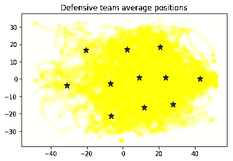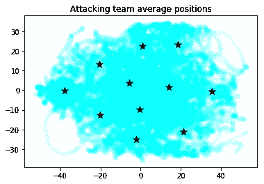

These do indeed look like formations, but we’ll come to that in a second.

## 与球的关系

所以这一次，我试着看看球的位置会如何影响进攻和防守球队的 KMeans 集群，但似乎没有太大的影响

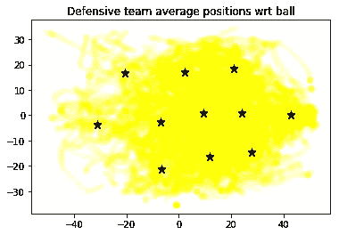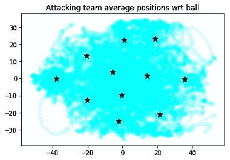

Not much of a difference eh?

## 最活跃的球场区域

现在让我们来看看球场的哪个部分是最受欢迎的，这是对比赛本质的一种洞察。在这里，我将整个数据集的聚类数设为 10，希望看到双方球员在球场上占据的 10 个质心。这是它的代码

```
plotKMeans(list_def+list_att, list_def+list_att, "Areas of the pitch with most activity", 10)
```

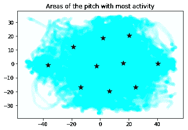

This resulted in this heat map showing 10 positions (KMeans centroids) on the pitch that players of both teams occupy

## 形成

现在，我们终于明白了，我们可以看到，使用 KMeans 对 11 个集群进行聚类，我们可以找到防守和进攻团队中每个球员的位置，从而形成一个阵型。现在我从防守队和进攻队的位置提取质心，并绘制它们，它们看起来就像一个编队。把这个放在足球场上，从这个分析的前面部分，把它放到真正的背景中。

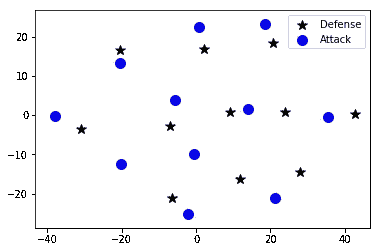

My first try to plot the centroids of the attacking and defending team

不错！以我训练有素的眼光来看，我可以看到防守排成 3-3-3-1 阵型，而进攻排成 4-2-3-1 阵型，边后卫被推得更高，让我在球场上展示一下

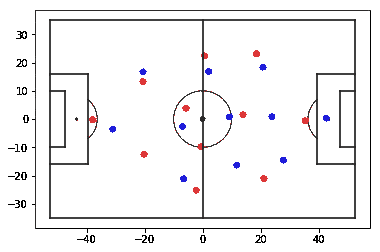

The attack is red and defense is blue.

# 结束了

我们从球员在球场上的位置开始，分析了不同度量的比赛序列，球员如何相对于球移动，相对于对方球队移动，尝试构建一个特征，分析球场上占据的位置，尝试使用 KMeans 聚类对数据进行分类，并最终使用 KMeans 质心对阵型进行可视化

这是一个具有挑战性的数据集，但我们最终得出了一些有趣的结果。期待大家对这个[笔记本](https://github.com/raghav96/datascience/blob/master/Football%20Analysis.ipynb)的评价，多提建议。