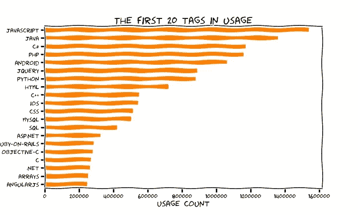
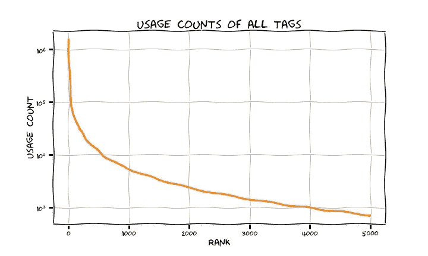
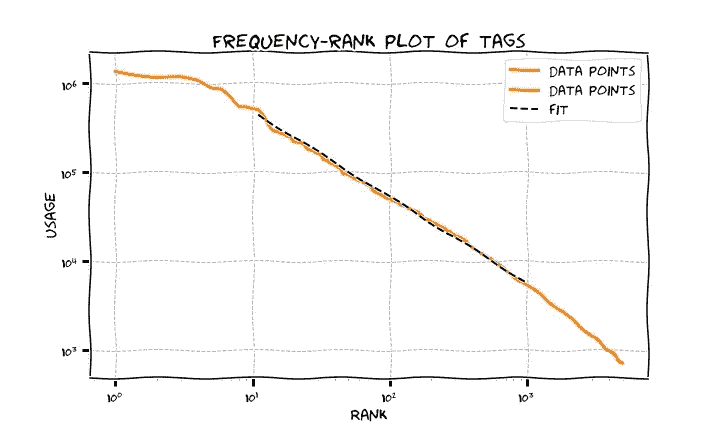
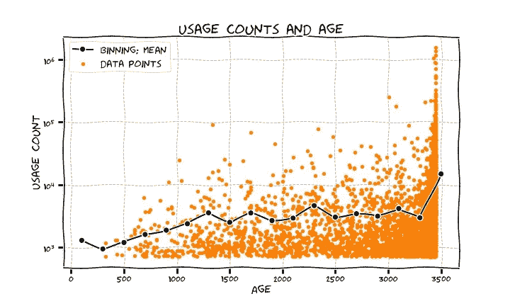
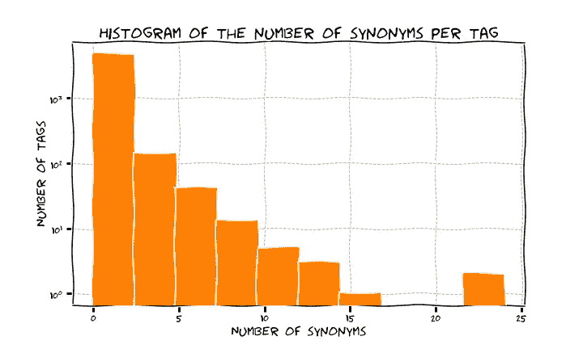

# 堆栈溢出标签的频率

> 原文：<https://towardsdatascience.com/the-frequency-of-tags-on-stack-overflow-2fb47600e2b2?source=collection_archive---------5----------------------->

在本帖中，我们将了解一些关于标签的数据，这些标签在 [Stack Overflow](http://stackoverflow.com/) 上用来标记问题，它们的频率以及我们可以测量它们周围的内容。

Image from [https://pixabay.com](https://pixabay.com/)

对于那些堆栈溢出严重的用户来说，这可能是绝大多数做技术的人，让帖子有适当的标签对于浏览网站的巨大存档是至关重要的。在写这篇文章的时候(2018 年 1 月)，Stack Overflow 包含了超过 1500 万个问题，有大约 54000 个独特的标签。这里的[帮助页面](http://stackoverflow.com/help/tagging)旨在就如何最好地使用该功能提供一些指导，因为以最佳方式标记您的问题以便相关人员能够找到并回答它是非常重要的。标签是技术的名称，如编程语言、框架、软件或技术元素和组件，如编码技术或计算机科学一般主题。

# 历史的片断

根据[维基百科页面](https://en.wikipedia.org/wiki/Stack_Overflow)的说法，堆栈溢出已经在 2008 年 9 月推出，现在已经相当成熟地成为编程的一站式资源。一年后，在 2009 年 9 月(仍然是根据维基百科),它的成功模式已经扩展到了一个普通的 Q &站点，这个站点被分成了许多主题的子站点(其中许多是科技之外的)，栈交换。总而言之，这个网络已经存在了 8/9 年，所以我们都在准备庆祝它的 10 周年纪念日。从历史的角度来看，阅读这篇名为[的文章非常有趣，这篇文章讲述了在 2009 年网络刚刚诞生时，StackExchange](http://www.zdnet.com/article/find-the-answer-to-anything-with-stackexchange/) 的所有问题的答案。

Stack Overflow Wikipedia 页面还断言，截至 2014 年 12 月，*根据分配给问题的标签类型，网站上讨论最多的前八个主题是:Java、JavaScript、C#、PHP、Android、jQuery、Python 和 HTML* 。我们将看到这种情况是否以及如何改变！

# 获取一些数据

为了查询堆栈溢出 API，我们将使用 Python 包 [StackAPI](http://stackapi.readthedocs.io/en/latest/) 。注意，API 允许每 24 小时 10000 个请求。

我们将获取 5000 个最频繁的标签(那些具有最高使用计数的标签),因为由于所述 API 限制，我们不能获取所有的标签:如果我们确实将请求拆分为在多天内获取，因为标签的使用计数随时间变化，我们将不会有一致的画面。不管怎样，5000 美元看起来足够看一些有趣的东西了。

所有遵循的方法和结果都记录在本报告中，还有一本 Jupyter 笔记本供感兴趣的人使用。对于图，请注意我们将使用 Matplotlib 的 [XKCD 主题，并且我们试图再现堆栈溢出的颜色！](https://matplotlib.org/api/_as_gen/matplotlib.pyplot.xkcd.html)

首先(这是 2018 年 1 月 11 日的数据)，最常见的标签是什么？频率作为使用计数给出，即带有该标签的问题的数量。下图显示了按频率排列的前 20 个标签: *Javascript* 为王，出现次数超过 150 万次，然后我们看到许多其他熟悉的语言和操作系统。不是特别惊讶！

自 2014 年底以来，最常见的 8 个标签是 Java、JavaScript、C#、PHP、Android、jQuery、Python 和 HTML，有什么变化吗？嗯，谁是最频繁的 8 个没有改变，但假设句子是按照频率递减的顺序报告它们，似乎发生了一个转变:Java 当时比 Javascript 更受欢迎。这是时代的标志吗？

有趣的是， *AngularJS* 是唯一一个进入前 20 名的 Javascript 框架(它诞生于 2010 年，所以可能已经足够老了),而*数组*作为一种数据结构被讨论了很多。

总之，请注意，即使只有这么小的一组数据，频率也跨越了很大的区间，最后一个显示的 *AngularJS* 大约有 20 万个计数，与上面的 150 万个 *Javascript* 相比。让我们探索一下我们检索到的所有标签的频率是如何随着标签的等级(在按频率排序的列表中的位置)而下降的。下图准确地显示了这一点，并清楚地表明标签频率确实跨越了几个数量级。

事实上，频率的分布是幂律的，如果你符合频率与等级的趋势(Zipf 定律)，你最终会得到，分布的内部体积，趋势为。这是否暗示了富人越来越富的现象？

Zipf 定律决定了一种语言中单词的趋势频率/排名；斜率为-1 的幂律趋势意味着第二个出现频率最高的单词是第一个的一半；第三种是三分之一的频率，以此类推。我们在标签的频率方面也看到了同样的情况。

在文本生成的优先附件(也称为“rich gets richer”)模型中，当您选择要使用的单词时，您会选择一个与其频率成比例的现有单词，以便更频繁的单词有更高的概率被重用，这将生成频率的幂律趋势。以我们的标签为例，我们推断我们所看到的东西可能有类似的机制，这可能取决于一系列的原因。

首先，Stack Overflow 中的 UI 根据你写的内容的主题，为你的文章推荐标签。最常见的标签将变得更丰富，因为努力的方向是填充现有的标签，如果它们合适的话，而不是创建一个几乎没有填充标签的分散网络。此外，一些语言和工具确实比其他语言和工具更受欢迎，所以这再次加强了它们标签的频率。这就是为什么 *Javascript* 在网站上如此受欢迎的原因。

# 越老越有钱？

我们还可以询问数据，无论如何，旧的也变得更富有，也就是说，时间上更老的标签是否吸引了更多的帖子。这似乎是一件合理的事情，随着时间的推移，现有标签上会有越来越多的帖子。就这么简单，但有多真实呢？

关于这一点，我们需要注意，API 的`tags/`端点并不提供标签的创建日期，尽管[标签的信息页面](https://stackoverflow.com/tags/angularjs/info)会提供。所以我们所做的是附加一个标签，该标签带有从该标签出现的第一个问题中提取的创建日期(查询`search/`端点)；请注意，由于问题总是可以编辑，包括重新标记，这可能意味着当新标签首次出现时，旧问题会看到其标签被修改。这就是为什么有些标签的创建日期比它们所代表的技术还要早(例如，AngularJS 出生于 2010 年，但他的标签是 2009 年的)。

下面的图显示了使用计数与其年龄的散点图(以天为单位，此数据是在 2018 年 1 月 11 日检索的，因此是到那时的天数)。它还显示使用计数的平均宁滨，仓位为 200 天。

值得注意的是，对于最老的标签，在最后一个容器中有相当大的跳跃。除了有点神经质的行为之外，正如预期的那样，旧标签变得越来越富有。但是最老的一个比其他的更富有，这意味着有一个峰值:你从倒数第二个箱子的大约 3000 到最后一个箱子的 15000！这表明，在网站生命的头 200 天里，涵盖绝大多数热门话题的标签已经被创建出来，并一直保持着巨大的吸引力。自诞生以来的大约一年时间里，Stack Overflow 已经见证了大多数当今仍然非常流行和有趣的主题。

标签可以有同义词。当一个问题被标记了某个现有事物的变体时，它会自动映射到母标签，因此使用计数会与我们检索到的母标签相对照。请注意，当您在 API 中查询与母标签同义的标签时，您将获得母标签的使用计数。

获得一定声誉的用户将标签折叠为现有标签的同义词，参见[帮助页面](https://stackoverflow.com/help/privileges/suggest-tag-synonyms)。这个过程控制标签的增加，使它们保持有序。例如， *javascript* 的一些同义词是类似 *javascript-dom* 或 *javascript-module* 的东西；一些 *python* 是 *python-shell* 或 *python-interpreter* 。

每个标签的同义词数量分布如图所示，这也是一个非常不均衡的情况，只有少数标签有大量的同义词。

作为参考，拥有最多同义词(25 个)的标签是 *css* (比如 *font-weight* 、 *dynamic-css* 、 *inline-block* )。

现在，你认为有同义词的标签会得到更高的频率计数吗？这很直观地归因于这样一个事实，即带有同义词的标签是一种可以用多种风格表达的标签，可能是一种复合和广泛的技术，这意味着人们可能对它的不同部分感兴趣。我们运行了一个快速 t-test 来确定有同义词和没有同义词的标签的使用计数分布的均值是否显著不同，结果是它们实际上是不同的，所述均值分别位于 21500 和 3200:一般来说，有同义词的标签的受欢迎程度大约是没有同义词的标签的 7 倍。

# 关于时间趋势的一个注记

2017 年，Stack Overflow 推出了一个很棒的工具，向每个人展示他们生成的关于技术受欢迎程度的数据，它被称为 **Stack Overflow Trends** ，你可以阅读[这篇由 D Robinson 撰写的关于它的博客文章](https://stackoverflow.blog/2017/05/09/introducing-stack-overflow-trends/)。简而言之，这是一个用户界面，你可以及时查询你选择的一些标签的使用计数数据，因为栈溢出诞生了。我们为上面提到的 8 个最受欢迎的标签中的一些标签做了这个[这个](https://insights.stackoverflow.com/trends?utm_source=so-owned&utm_medium=blog&utm_campaign=trends&utm_content=blog-link&tags=javascript%2Cjava%2Cc%23%2Cpython)就是结果: *c#* 在 2009-2010 年达到了它的最好年龄，现在正在稳步下降； *Javascript* 和 *Python* 正在崛起，第一个出现并且一直是王者， *Java* 在最近几年缓慢衰落。

# 一句小小的警告

从表面上看，这些时间趋势结果背后的假设是，堆栈溢出是周围技术专家的代表性社区，问题被正确标记，数据没有偏差。举个极端的例子，标签的流行可能是因为缺乏相关工具的良好文档，而不一定是因为它在用户中有多流行和有趣:网站上的许多用户会突然出现在那里，以获得一些帮助来解决他们在其他地方找不到好参考的问题。

总而言之，这是一个很好的工具，可以看到技术世界是如何发展的！

*原载于 2018 年 1 月 14 日*[*martinapugliese . github . io*](https://martinapugliese.github.io/stackoverflow-tags/)*。*