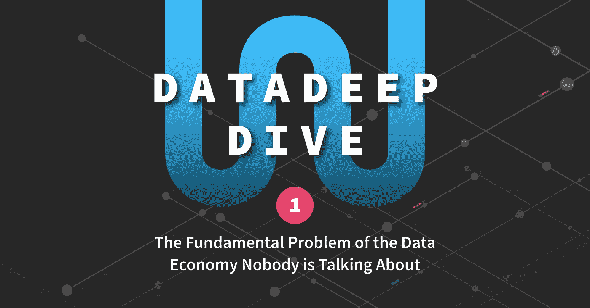

# 没有人谈论数据经济的根本问题

> 原文：<https://towardsdatascience.com/the-fundamental-problem-of-the-data-economy-nobody-is-talking-about-d4168ebe9983?source=collection_archive---------12----------------------->

这是数据深度挖掘系列的第 1 部分，重点关注作为资产的**数据**、**数据市场**以及**区块链**技术如何让**数据经济**成为现实。

# 数据是新的石油

世界上最有价值的资源不再是石油，而是数据。在信息时代，数据推动增长和变革，提高生活质量，为更公平、更高效的社会铺平道路。

例如，在医疗保健领域，数据被用于预测流行病、预防疾病和改善治疗[ [福布斯](https://medium.com/u/3126f7dd42c1?source=post_page-----d4168ebe9983--------------------------------)、[来源](https://www.forbes.com/consent/?toURL=https://www.forbes.com/sites/bernardmarr/2015/04/21/how-big-data-is-changing-healthcare/) ]。政府使用数据在最需要的地方实施项目，例如，通过了解应该在哪里建造新学校或开辟新的公交线路。事实上，从气候到人工智能，现代社会的几乎所有领域都将受到更好的数据访问的积极影响[ [世界经济论坛](https://medium.com/u/7d44f110eb09?source=post_page-----d4168ebe9983--------------------------------)，[来源](https://www.weforum.org/agenda/2015/12/how-is-big-data-going-to-change-the-world/) ]。

这也创造了围绕数据的重大经济机会。据估计，2016 年仅欧盟的数据经济价值就接近 3000 亿€，预计到 2020 年将翻一番以上，达到€的 7390 亿[ [欧盟委员会](https://medium.com/u/960f4c0ad987?source=post_page-----d4168ebe9983--------------------------------)，[来源](https://ec.europa.eu/digital-single-market/en/news/final-results-european-data-market-study-measuring-size-and-trends-eu-data-economy)。在全球范围内，据估计，更好地访问数据可以帮助释放至少 3-5 万亿美元的全球经济价值[ [麦肯锡](https://www.mckinsey.com/business-functions/digital-mckinsey/our-insights/open-data-unlocking-innovation-and-performance-with-liquid-information) ]，这相当于世界生产总值的 2-5%的增长！

# 数据很难交易

如果数据的价值显而易见，潜力如此巨大，为什么数据革命还没有发生？为什么我们仍然在等待承诺的数据驱动的创新和改变游戏规则的社会变革？

原因很简单。

*   大多数数据以未提炼(或非结构化)的形式存在，将其转换为结构化数据(软件中使用的格式)并不容易。
*   数据所有者使用不兼容的数据模型来构建他们的数据，这些数据保存在孤立的孤岛中，尽管经常受到其他人的追捧。
*   还没有人想出如何有效地定价和交换数据。

简而言之，没有标准或平台可以让数据交换像股票市场那样顺利进行——这很疯狂——因为数据将成为本世纪最有价值的资产。

因此，交易数据是乏味的。它通常如此昂贵、低效且法律上繁琐，以至于组织宁愿完全避免交易数据[[Gartner](https://blogs.gartner.com/andrew_white/2017/05/08/the-economist-front-page-this-week-the-worlds-most-valuable-resource-data/)；[经济学家](https://medium.com/u/bea61c20259e?source=post_page-----d4168ebe9983--------------------------------)，[来源](https://www.economist.com/briefing/2017/05/06/data-is-giving-rise-to-a-new-economy)。

这是没有人谈论的数据经济的基本问题:

> 除非我们为数据所有者和收集者创造必要的基础设施和激励机制，使他们的数据可供他人使用，否则我们无法释放数据经济的全部潜力。

# 创建一个开放的数据市场

从历史上看，连接供给和需求的最佳方式是开放市场。它们提供了基础设施，并通过允许各方自由买卖彼此的资源，为交易创造了激励。

数据的问题在于，为它创建一个开放的市场带来了一系列独特的挑战，因为它是一种**无形的非竞争资产**，不像今天几乎所有的商业交易。

也就是说，一旦数据被获取，它就可以与另一方免费共享，这在传统的基于稀缺性的资源定价方法中产生了矛盾——以及许多其他问题。

下一篇数据深度探讨文章将探讨新兴的开放数据市场、它们的实际应用，以及为什么区块链是实现开放数据交换所缺少的关键技术。 [**继续阅读** ➔](/data-marketplaces-the-holy-grail-of-our-information-age-403ef569fffb)