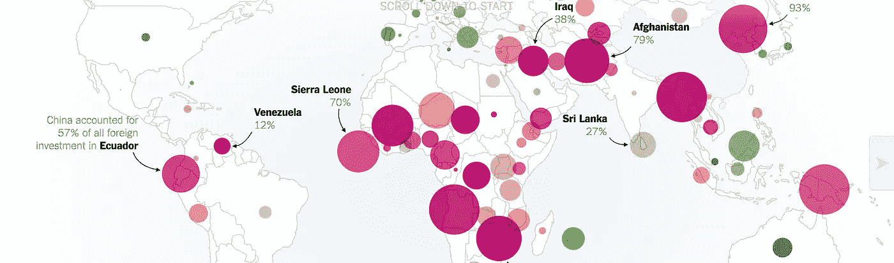
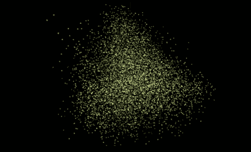
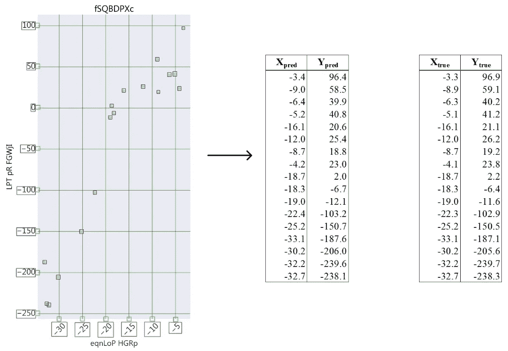
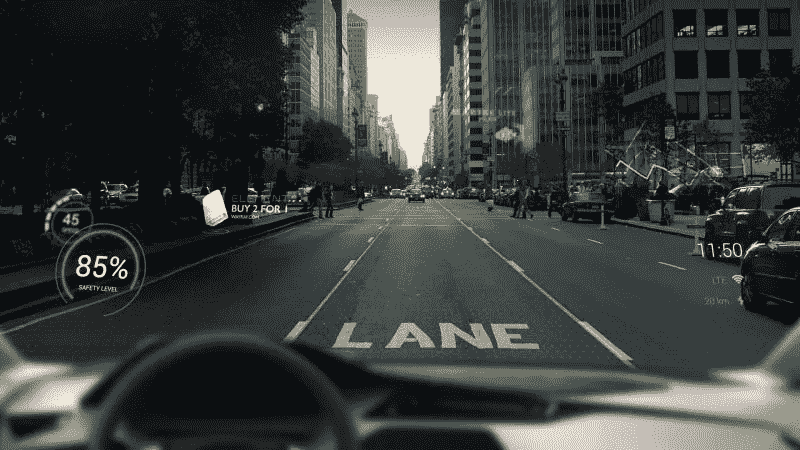
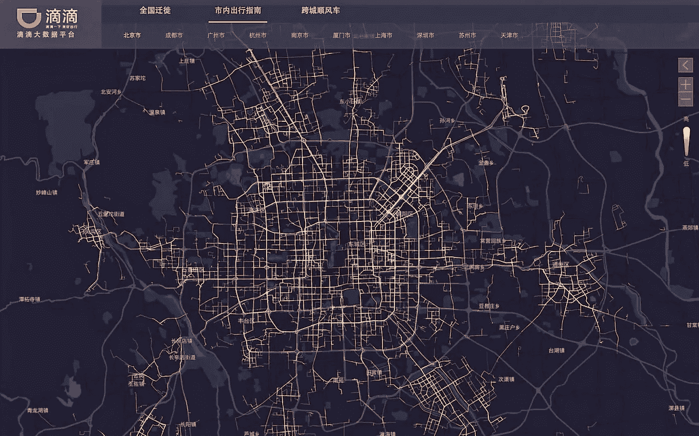
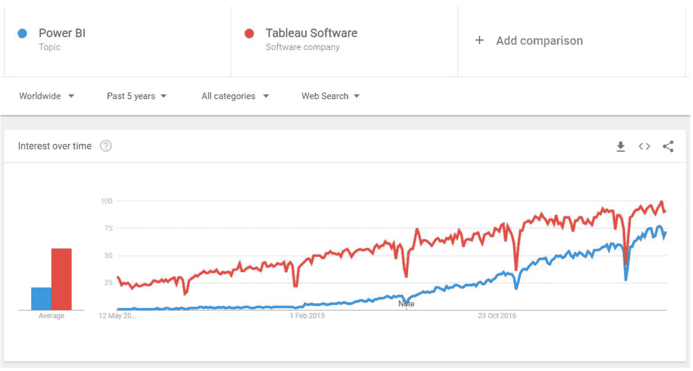
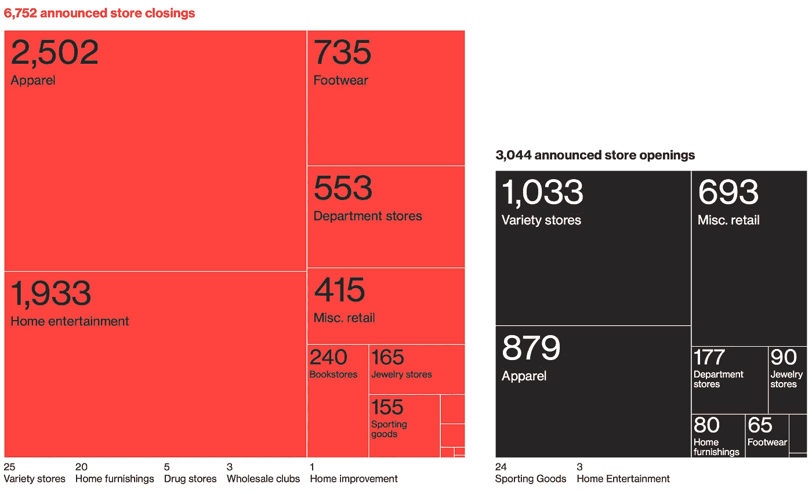

# 数据可视化的未来

> 原文：<https://towardsdatascience.com/the-future-of-data-visualization-2f976b90b93d?source=collection_archive---------10----------------------->

## 数据改变了我们对世界得出结论的方式，数据可视化帮助我们更好地理解数据。

数据可视化——正如我所观察到的——由于三大领域的发展而发生了变化。用流代替静态数据，改变上下文和更好的数据处理和设计工具。这将深刻改变数据可视化对我们未来生活的影响。

# 新上下文

潘多拉是希腊神话中众神创造的第一个人。作为一个概念，这很重要，因为潘多拉是我们渴望成为的人的隐喻。她是我们自己的代表，她是我们想要成为的样子。非常像在场的社交媒体中的数字化身。在脸书，我们不分享我们最糟糕的时刻或弱点，我们炫耀我们的成就，只上传我们最好的照片。我们创造更好的自我版本，比如数字潘多拉。

Data visualization of related topics and users on Twitter

我去谷歌和其他社交媒体平台下载了所有我能找到的关于我自己的个人数据。1.2GB 的下载数据之后，我可以自信地说，这是惊人的准确，但也有些不完整。虽然，这比我预期的要多。

将来这种情况会改变。目前，我们正以指数级的速度每年创建 28 万亿字节的数据，因此很容易预测，将会有更多关于我的数据，事实上是关于我们所有人的数据，从而创建一个关于我们是谁的更完整的图像。不仅如此，还包括我们在过去任何特定时间的身份和位置。有一天，我的数字化身可能没有潘多拉漂亮，但比我们任何人希望的都要准确。

不仅人的数据将更容易获得，而且任何东西的数据都可以获得，比如我们的汽车，当然还有我们的家。通过数据流互连的所有设备将帮助我们提高安全性，提高运营效率，并更好地了解消费者需求。

# 不断增长的数据雪崩

由于我们收集的数据量惊人，以及我们用来收集数据的传感器，基于流的 API 变得越来越普遍。

Data visualization for a conceptual car dashboard of the future

我们收集的数据中只有很小一部分应该放在数据库中。其中大部分是由发出事件的系统收集的，比如电动汽车的电池电量。这些数据以数据流的形式出现，并被高效地交付给那些可能想要使用它们的人。在传感器和消费者之间放置一个数据库将成为不必要的奢侈品。没有明确目的地囤积数据代价高昂。

使用数据流改变了我们对世界得出结论的方式。这意味着每一个新的数据点都会立即影响我们对世界的理解。

图表插入到实时数据流中。消息更快地传遍市场。阅读每篇文章所用的时间更少，而生成数据甚至新闻的自动化程度更高。

Data visualization of TensorFlow experiment called T-SNE by Google

你所需要交流的只是一种情绪，让一个算法来拾取你的故事并对其进行分类。例如，当马斯克在 Twitter 上宣布他正在考虑将特斯拉私有化时，市场的反应非常迅速。

然而，对于算法来说，从图表和动画视频等非结构化数据中获取情感几乎是不可能的。图表和动画总是为人类消费而创造的。

不再是了。彭博创造了一个名为[散射行动](https://github.com/bloomberg/scatteract)的系统。它可以沿着一个轴读取每个像素，以揭示产生每个点的信息。

Data visualization reversed: From chart to data with Scatteract by Bloomberg

该系统使用光学字符识别(OCR)和深度学习技术从图表的图像中提取数字数据点，然后将结果转换为表格。这是有史以来第一次数据可视化被逆转。现在我们可以从视觉再回到数据，而不是从数据到视觉。

尽管 Scatteract 还很粗糙，但这些工具的改进只是时间问题，在未来，数据可视化对于算法来说将是完全清晰的。

# 塑造未来的工具

在谷歌、苹果和宝马的许多产品公告中，越来越多的数据将通过增强现实或投影覆盖在我们的物理环境中。这意味着不仅数据将更加可视化，而且我们周围的视觉现实也将转化为数据。

Data visualization of a new AR wind shield by Apple

到 2020 年，70%的新车将搭载某种形式的 AR 技术，就像这个[苹果挡风玻璃](http://fortune.com/2018/08/08/apple-filed-a-patent-for-putting-augmented-reality-on-car-windshields/)。

智能城市交通管理，如“滴滴出行智能交通大脑”，将允许交通参与者和寻路软件做出更明智的决策。今年，中国城市安装了滴滴智能交通灯，节省了多达四分之一的等待时间。滴滴所有 4.5 亿移动用户的数据都是共享的。包括来自联网汽车和交通管理系统的数据，以创建最佳的交通流量图。

Data visualization of traffic by Didi Smart Transportation Brain

城市交通问题不仅仅是呈现一幅画面。智能交通系统可以预测未来几小时内哪里会发生交通堵塞。它可以预测出租车和公共交通的短缺，并可以重定向其他交通参与者，以最有效地处理即将到来的拥堵。

一个城市变得越聪明，它的数据就越需要被分析和“读取”。数据可视化可以轻松检测数据中的异常、模式和峰值。随着数据可用性的增加，用户对其有用性的期望也在增加。

如果像滴滴这样的新解决方案告诉我们关于新工具的任何事情，那就是人们将对数据的可用性、准确性、有用性以及未来如何可视化有更高的期望。很明显，新工具的趋势是向用户提供更多数据，而不是更少。它们将更容易使用，因此覆盖范围更广，正如我们看到的对 Tableau 和 Power BI 的兴趣越来越大。

Power BI compared to Tableau in Google Trends

在未来，专业人士将比以往任何时候都更需要像记者一样，根据数据做出决策。在“假新闻”时代，新闻故事越来越受到数据的破坏。一个很好的例子是“美国零售业的末日”。

Data visualization of America’s Retail apocalypse by Bloomberg

它描绘了一幅关于美国各地商店倒闭的清晰画面。不仅如此，光是数据就不会那么可怕了。红色和黑色的油漆，它的情感诉求被大量强调。商店的关闭给人以威胁的感觉。

为了对更广泛的受众产生更大的吸引力而呈现的数据，允许通过更多样化的解释进行更广泛的数据审查。

数据可视化不同于纯粹的理性分析，因为它旨在讲述一个故事，以产生情感反应。你可以有理性的证据就在你面前，但是如果你不能想象以前从未存在过的东西，就不可能刺激深远的行动。

> 算法可以预测，人类可以想象。数据可视化最能激发想象力。

未来的工具将允许更多的方式来分割数据。这一点很重要，因为工具非常有限，很容易陷入重视可衡量的东西的陷阱，而不是衡量有价值的东西。这将允许更准确地描绘我们周围的世界，避免潘多拉风格的虚假未来的烟雾和镜子。

以下是来自莫斯科 BigData 的演讲全文: