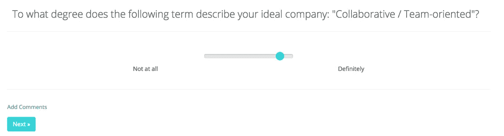

# 工作的未来是现在:人工智能帮助求职者找到、获得和保持梦想中的工作

> 原文：<https://towardsdatascience.com/the-future-of-work-is-now-ai-helps-job-hunters-find-land-keep-dream-jobs-b58a3a247c34?source=collection_archive---------3----------------------->

刚从商学院毕业，劳拉就开始建立关系网，并在适当的时候附上一份简历。反过来，她接到了一家商务旅行社的电话，这家旅行社对她的才华非常感兴趣。劳拉接受了面试，她穿着一套新西装，手里拿着一份精心制作的相关简历，提前 30 分钟到场，准备给人留下最好的印象。

等了一个小时后，一名助理把她带进了首席执行官的办公室，在那里，她被反复训练她来自哪里，她的父母是否大学毕业，他们是否患有任何精神疾病，他们以什么为生(“只是为了确保她是专业人士”)，她是否已婚或有孩子，以及她将如何吸引劳拉知道对商务旅行丝毫不感兴趣的潜在客户。在采访结束时，这位首席执行官尴尬地透露，他不关心自己即将退休后公司会发生什么。礼貌地感谢首席执行官后，劳拉离开了，希望公司里没有人会再打电话给她。遗憾的是，四个月后，她确实收到了回电。

是的，这是一个真实的故事。而且，不幸的是，这样的面试恐怖故事并不少见。

破碎的招聘流程意味着更多的求职时间
《财富》500 强人力资源高级副总裁兼《福布斯》人力资源撰稿人利兹·瑞恩[向](https://www.forbes.com/sites/lizryan/2018/04/12/no-youre-not-crazy-the-hiring-process-is-broken/#4981acbc4751)证实，“招聘流程已经破碎了 20 年，但其下放的步伐最近一直在加快。”

而且，即使找到了工作，糟糕的招聘过程也会转化成不太好的就业经历: [65%](https://www.forbes.com/sites/karstenstrauss/2018/02/02/the-role-of-artificial-intelligence-in-the-future-of-job-search/#23a0567f4cb0) 的人在被聘用后的 3 个月内就开始寻找下一份工作。

好消息是，求职者现在有了一个准备为他们的利益而战的后起之秀:人工智能。

人工智能为求职者提供更好的长期成功
Ken Lazarus、Marlina Kinnersley、WorkFusion、Scout Exchange、Fortay.ai 和无数人工智能公司正在研究、构建和完善人工智能平台，求职者可以依靠这些平台来改善体验。他们的专业知识和解决方案揭示了人工智能在幕后工作的四种方式，以提供更顺畅、更成功的求职旅程。

*   **人工智能帮助求职者找到适合他们技能的合适职位**

在搜索空缺职位、研究公司、为职位准备简历、写求职信、建立关系网以及参加每个职位空缺的几次面试的过程中，求职往往是一项全职工作。尤其是当求职者没有过滤掉那些不太可能符合他们技能的职位的面试时。人工智能使寻找相关就业机会更加有效，因此也更加成功。

[肯·拉扎勒斯](https://www.linkedin.com/in/kenlazarus/)，Scout Exchange 的首席执行官，一个为创业品牌和财富 10 强公司服务的人才匹配平台，解释了求职者如何依靠人工智能。他表示，优秀的招聘人员非常了解他们所在的行业，包括完成各自工作所需的技能，以及在主要雇主面前赢得观众所需的人脉。

“如果我在弗吉尼亚州，我想找一份为政府做国防研究和分析的工作，有专门从事这方面工作的招聘人员，获得这份工作的最佳方式是了解他们，”他说。

但是，并不是所有的招聘人员都同样擅长他们的工作。因此，他强调求职者与合适的招聘人员建立关系的重要性。他们可以使用人工智能驱动的侦察交换来衡量参与的招募者。为此，他鼓励求职者向招聘人员询问他们的平台评级。

Scout Exchange 生成一个由人工智能驱动的评级，反映每个招聘人员将候选人与工作匹配的成功程度。糟糕的评级提醒求职者，招聘人员不太可能向他们推荐值得他们付出努力和时间的工作。

*   人工智能帮助求职者找到完美的工作文化。

组织文化有无穷无尽的变化和怪癖。一个组织可能有随意的沟通规范，但等级森严，而另一个组织有正式的社会规范，但强调团队合作和扁平的组织结构。

同样，求职者对工作环境的偏好也各不相同。他们可能更喜欢创业文化、扁平化组织、强大的社交环境、团队环境，或者独立工作。

为了确保候选人保持参与和致力于他们所提供的工作，人才公司正在依靠人工智能来匹配求职者的组织文化偏好和与之一致的公司。虽然许多人才匹配平台是供雇主使用的，但 [Fortay](https://fortay.co/) 为求职者提供了一个测试，他们可以通过这个测试来确定他们最有可能在什么样的公司文化中茁壮成长。

一旦完成一项测验，Fortay 的人工智能算法就会开始汇编相关公司的列表。求职者随后会在收件箱中收到一份公司列表，并配有一个按钮，一旦按下，就会引导他们申请这些公司的空缺职位。

*   **人工智能确保招聘偏见不会制造障碍。**

研究表明，即使我们无意，人类也会无意识地产生偏见。因此，[招聘偏见会给求职者制造障碍。“如果我们假设人们有偏见…那么我们知道无论我们有什么数据集都会有偏见，因为数据集是基于过去发生的人类决策，”Ken Lazarus 解释说。](https://theblog.adobe.com/breaking-bias-from-the-hiring-process/)

因此，他说，有经验的数据科学家编程算法，以消除招聘偏见，从而防止算法污染。好消息是，给定一个良好规模的数据集，当数据科学家依靠人工智能时，他们可以减少偏见的影响，以获得更好的未来工作。

例如，Ken 知道男性或女性招聘人员推荐与他们性别相匹配的求职者的几率要高 25%。因此，当一名男性招聘人员推荐四名男性候选人时，Scout Exchange 的数据科学家删除了其中一人，以消除结果中的偏见。然后，他们将这个公式编程到他们的人才匹配算法中，以防止偏见被纳入他们未来的预测中。

一旦被编程到人工智能驱动的算法中，这个公式就可以影响数百万次人才匹配活动。反过来，由于雇主收到的求职者名单不那么有偏见，求职者在他们的行业和主要雇主面前享有公平的代表权。

*   人工智能有助于将内部员工与发展机会相匹配。

到目前为止，我们已经了解了人工智能如何在幕后帮助求职者求职。但是，即使在候选人被雇用后，AI 仍继续工作，以确保他们保留来之不易的工作，并从中获得成功的职业生涯。

例如，人工智能驱动的智能人群解决方案允许品牌监控员工的表现，以确定员工可以发展新技能的领域。然后，它设计了专门的培训项目，这样员工就能在当前的岗位上取得成功，并有更多的晋升机会。

此外，它还会监控员工，找出他们的优势，然后将工作分配给那些绩效评分最高的人。这意味着人工智能在幕后工作，挑选出最符合可用内部职位的员工，然后将他们推荐给这些职位的经理，以做出晋升决定。

**最终，诚实让人工智能能够在求职者旅程的各个阶段与他们同行。** 劳拉痛苦地认识到接受每一次面试都可能是一个错误。不相关的技能组合、不一致的文化偏好、招聘偏见和不良的在职成功倾向会导致可怕的面试和更糟糕的工作经历。

但是，人工智能显然让求职者的旅程变得更容易。此外，还有更多好消息:从现在开始，情况只会越来越好。不断增长的数据集和持续的人工智能学习意味着像 WorkFusion，Fortay 和 Scout Exchange 这样的人工智能平台只会变得更加智能和高效。

肯·拉扎勒斯说，求职者利用人工智能现在和未来所能提供的一切的诀窍是诚实。确保简历准确符合工作表现和技能。这样做，你就输入了人工智能数据集，为所有求职者在就业旅程的所有阶段提供了更光明的未来。