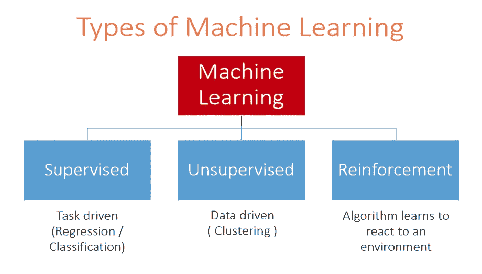
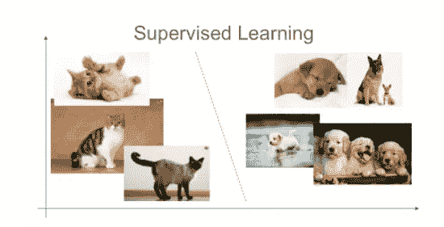
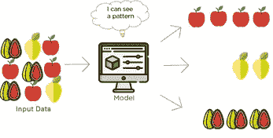
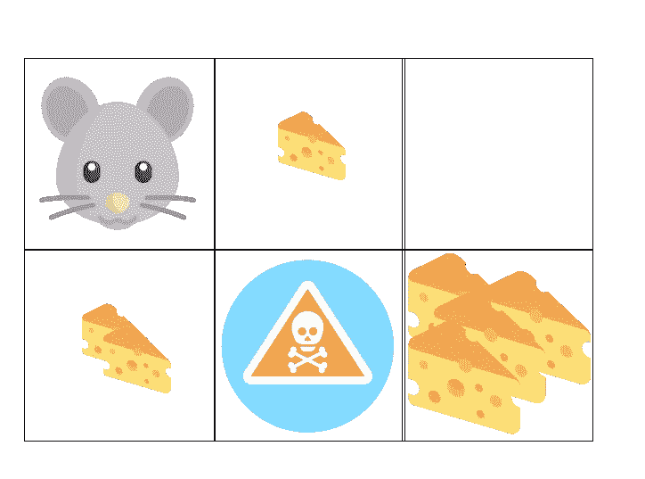
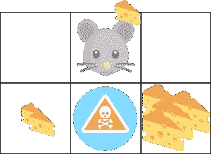
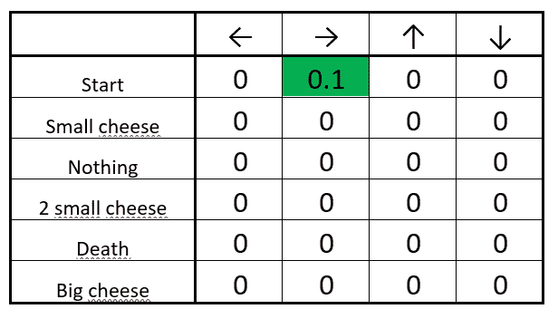
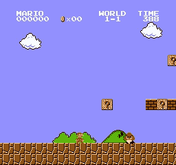
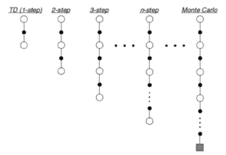
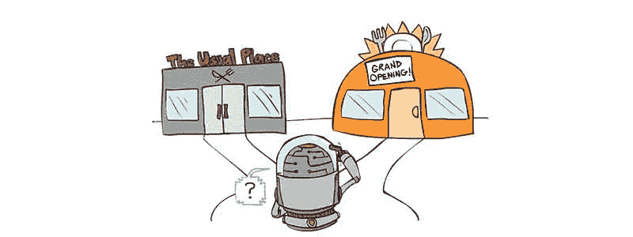
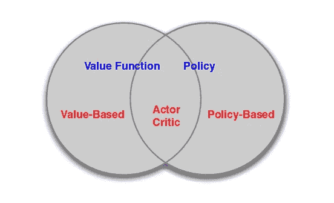

# 强化学习的未来

> 原文：<https://towardsdatascience.com/the-future-with-reinforcement-learning-877a17187d54?source=collection_archive---------15----------------------->

## 第 2 部分:比较和应用

如果你还没有读过[强化学习入门](https://recast.ai/blog/the-future-with-reinforcement-learning-part-1/)，先回去看看[这里](https://recast.ai/blog/the-future-with-reinforcement-learning-part-1/)。那篇文章将为你提供强化学习的关键概念。然后你就可以充分比较不同类型的机器学习了。

# 将强化学习与其他机器学习类型进行比较

A high-level breakdown of the three major categories of machine learning

你可能听说过其他类型的机器学习，例如:监督学习，非监督学习等。理解强化学习(RL)与它们有何不同，是把握机器学习前景的好方法。

# 监督学习

最容易掌握的 ML 类型是监督学习。监督学习是带有人类标签的学习。图像分类是一种监督学习。你有一个算法，根据标记的图像，系统可以将图像分类为一只猫或一只狗。该算法通过观察训练集进行学习，然后可以正确推断未知图像的主题。

监督学习问题的另一个好例子是回归问题。在回归问题中，你需要一组参数，并基于这些参数估计一个真实的、连续的值。例如，你可以获取一所房子的信息(房间数量、面积、窗户数量等。)并输出一个价格。我们知道很多房子的价值，可以将这些标记的例子输入到算法中。然后，当你把一栋新房子提交给系统时，它可以自己给出一个好的价格估计。这些问题很容易被框定为监督学习问题。

# 无监督学习

Using unsupervised learning, we can find the underlying patterns in data

另一方面，我们有无监督学习:没有标签的学习。一个很好的例子是获取用户购买数据，并将您的客户按照相似的购买模式分组。你的算法进行分组，你可以向特定类别的人推荐产品。我们不告诉算法标签或类别名称是什么，我们只是简单地给它一堆数据，它就根据数据中的模式创建组。无监督学习也广泛用于可视化大量复杂数据。这使得人们更容易看到一幅图像中的所有信息。

# 强化学习

强化学习经常被描述为介于监督学习和非监督学习之间。有时间延迟标签(奖励)，当算法学习在环境中交互时，它会得到这些标签。算法是基于学习问题的措辞来学习的。这正是强化学习擅长实时决策、视频游戏人工智能、机器人导航和其他复杂任务的原因。关键是让系统能够根据环境的当前状态，理解哪些决策是好的，哪些是坏的。

# 应用这些概念

在上一篇文章中，我们介绍了强化学习的基本概念。这里以一个具体例子的形式总结了我们到目前为止所涉及的内容:

想象一只老鼠在一个基本的迷宫里。鼠标将是我们的**代理**。首先，我们将检查代理需要的东西:

*   目标:老鼠的目标是获得最多的奶酪
*   动作:鼠标可以向四个主要方向移动
*   感官:老鼠可以观察到它所处的环境的状态(开始，什么都没有，小奶酪，两个小奶酪，大奶酪，死亡)。对于我们这个简单的例子，仅仅对环境的状态有一个简单的了解就足够了。

Our simple mouse agent exploring for cheese!

此外，让我们看看问题的子元素，看看它们如何符合标准:

*   策略:在任何给定的状态下，我们的鼠标会采取四个动作中的哪一个？
*   奖励信号:阳性(获得了一个奶酪；但是多大的奶酪呢？)、中立(未达到任何状态)或消极(死亡状态已结束我们的游戏)。
*   价值函数:这是我们的鼠标动态构建和维护的东西。它可以在一次迭代的过程中进行调整，也可以在迷宫中多次运行。
*   模型:如果我们让我们的老鼠知道它周围环境的大小，它就能在记忆中储存一个模型。我们可以将世界表示为一个 2D 网格(数组)，当鼠标穿过并观察实际环境时，允许它在给定的网格方块中填入是积极的、消极的还是没有奖励

让我们剖析一个代理可能采用的基本贪婪策略:

策略之一是 Q 表策略。Q-table 代表“质量表”。这是一个动作和状态的表格，以及与它们相关的奖励。我们可以采用一个基本策略，当我们遇到一个状态时，选择能给我们的代理人最大回报的行动。当我们的代理不知道什么会给出最大的回报时，随机选择一个行动。

A basic Q-table where the rows are potential states and the columns are the actions our agent can take

一开始，我们老鼠的桌子是空的。它什么都不知道。例如，它随机选择策略，可能向右移动并得到少量奶酪。很好，我们的代理收到了奖励信号！该表得到相应的更新，我们的代理将继续选择行动，直到用尽所有的可能性或已经死亡。

Hurrah! Our mouse gets some cheese!

你可能已经看到一个问题出现了:当我们重新开始我们的迷宫时，我们的代理人总是倾向于向小奶酪移动，从不选择未知的替代品。这被称为探索与开发的权衡，但是我们一会儿会回到这个问题上来。

Updating our Q-table for the reward that we have received.

现在我们已经看到了这些组件是如何协同工作的，让我们深入了解一下我们希望解决的任何强化学习问题所需要的一些东西。

# 用任务组织强化学习

强化学习应用程序需要考虑的一个主要因素是任务的结构。这些通常分为两类:插曲式或连续式。

# 1.偶发性任务

情节任务有不同的开始和结束状态。我们可以保存这些“情节”，并对它们进行“离线”训练一个主要的例子就是我们上一篇文章中的马里奥关卡。

# 2.连续任务

连续的任务没有终点。这可能就像一个决策算法，预测某人何时应该在股市中买入或卖出股票。这总是随着许多环境因素而不断发展变化。没有明确的开始和停止状态可以让我们轻松地截取一集进行训练，因为害怕让我们的算法过于接近一小段时间。

股票市场总是在变化。将它分割成几段就是忽略了它如何演变的相关连续性

我们如何制定我们的代理人的目标和奖励是由我们期望完成的任务类型决定的，因为它可以改变我们学习的性质(我们将在接下来谈到这一点)。

# 何时学习

时间对于代理如何执行任务至关重要。也许代理应该在游戏的每一帧都学习，或者代理可以一集一集地学习。我们可以采用蒙特卡洛策略，在整个学习过程中循环，然后在每次迭代中变得更好、更聪明。这些选项有不同的权衡，可能可行也可能不可行，这取决于我们的代理试图完成的任务类型(连续任务可能永远不会使用蒙特卡罗策略，因为它需要循环一集进行训练，这对于连续任务来说甚至是不存在的！).

# 探索与开发

当代理探索一个环境时，很快就会遇到探索与利用的权衡。如果代理人很早就发现，如果它做了简单的事情，它将获得少量的奖励，它可能会一遍又一遍地继续做那个简单的事情，随着时间的推移积累少量的奖励。如果它探索未知，并试图发现新的情况，它可能会获得更大的回报。

用人类的话来说，这就像问这样一个问题:你会去你经常去的那家你知道会很好的餐馆吗？或者你会冒险进入未知的领域，去一个你以前从未尝试过的地方看看，那可能会非常棒。

If you ask me, the new place looks pretty fantastic

代理的策略是如何构建的，将决定它将学习利用什么样的动作，以及何时决定探索。早期探索可能会产生更高的长期回报，然而，过度关注探索可能会导致我们非常了解的状态下的次优行动。这导致你最终得到的奖励比我们本可以得到的要少。

在我看来，探索与开发的权衡仍然是一个悬而未决的问题，也是一个特别有趣的研究领域。

# 方法

这给我们带来了制作强化学习应用程序的另一个重要因素。是基于价值还是基于政策？

# 基于政策的方法

我们之前提到过，代理的策略是它如何根据环境的当前状态来决定采取什么行动。具有基于策略的学习方法的 RL 代理将尝试并学习具有决策结构的复杂策略，该决策结构允许它在任何给定情况下尝试并采取最佳行动。

# 基于价值的方法

另一方面，我们有基于价值的 RL 应用。价值函数是我们的 RL 算法将累积的长期回报的当前估计。如果我们有一个基于价值的代理，它将专注于基于该功能的优化。这包括专注于学习对长期回报越来越好的估计，以及采取贪婪的行动在任何给定时间最大化该功能。在很多方面，我们可以认为这是一个代理学习采取行动的隐含贪婪策略。

# 演员-评论家方法

基于值的算法和基于策略的算法之间的决定是决定强化学习算法看起来像什么的重要决定。这两条思路的交叉部分被称为演员-评论家方法。它的特点是跟踪估计的未来回报收入(我们的价值函数)以及学习新的、更复杂的政策，以使我们的代理在更长的时间范围内获得更大的回报。由于该算法现在同时优化两个函数，它很快变成一个更难的问题。

在演员-评论家领域有很多焦点，并且已经产生了许多很酷的算法。谷歌的异步优势演员-评论家(A3C)是一个很酷的演员-评论家算法的主要例子，已经显示了很多好的结果。

# 结论

在过去的两篇文章中，我们讨论了基本的术语以及一些围绕强化学习问题的更复杂的概念。希望有了这两个组件，你会觉得你已经很好地掌握了什么是强化学习，以及使用它编写算法的一些考虑因素。

现在，你可能对 RL 感到非常兴奋。您可能想知道如何在 RL 系统上开始工作。在下一篇文章中，我们将深入研究 RL 的优势，主要的开放性问题是什么，以及一些关于学习自己编写 RL 算法的资源！

*原载于 2018 年 8 月 14 日*[*recast . ai*](https://recast.ai/blog/the-future-with-reinforcement-learning-part-2-comparisons-and-applications/)*。*