# 强化学习的未来——第一部分

> 原文：<https://towardsdatascience.com/the-future-with-reinforcement-learning-part-1-26e09e9be901?source=collection_archive---------10----------------------->

想象一个世界，每个计算机系统都是根据你自己的个性定制的。它学习你如何交流和你希望如何被交流的细微差别。与计算机系统的交互变得比以往任何时候都更加直观，技术素养直线上升。在强化学习成为常态的未来，这些是你可以看到的潜在结果。

在这篇文章中，我们将分解强化学习，剖析一些组成强化学习系统的组件。

# 强化学习的高级概述

如果你以前从未听说过强化学习(RL ),不要着急！这个概念非常简单。在一个非常高的层次上，强化学习只是一个代理学习如何根据它从环境中收到的反馈信号与环境进行交互。这使得它不同于其他机器学习方法，在其他机器学习方法中，学习代理可能在训练期间看到正确的答案。在强化学习中，我们可以把我们的学习代理想象成获得一个等级或分数，让它知道自己的表现。

让我们用一个电子游戏来描述这个想法。假设我们有一个玩马里奥游戏的电脑程序。它学会控制角色，以变化的屏幕形式接收来自环境的反馈。基于我们算法的成功(或失败)，它可以学习与环境互动，并通过使用它收到的反馈来改进。

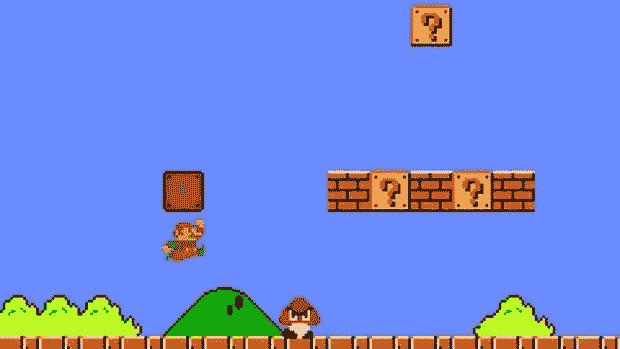

*To learn about the environment, we need to explore! The only way we can find out that Goombas are bad and power-ups are good is through trail-and-error and feedback.*

强化学习试图模仿人类或其他智能生物与新环境互动的方式:试错法。它诞生于计算机科学、心理学、神经科学、数学等许多领域的研究成果。尽管今天在工业中很少见到 RL，但它的潜在影响是巨大的。

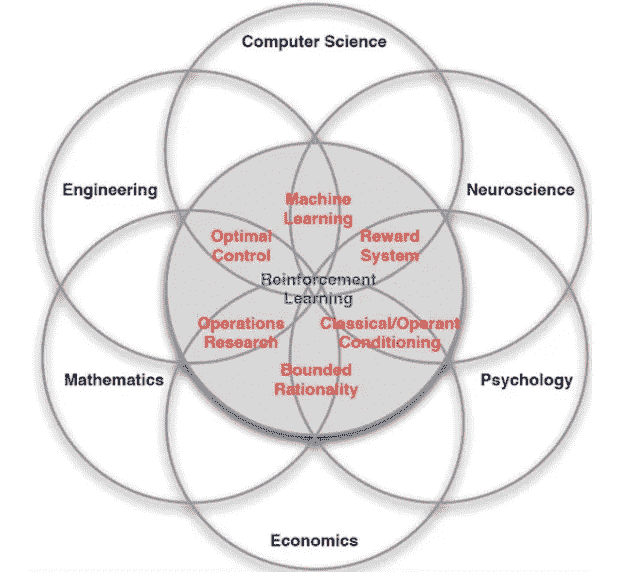

*Reinforcement learning really is the culmination of many fields and has a rich history in optimization and behavioral psychology.*

这种潜力就是我要为你揭示的。

# 马里奥游戏强化学习词汇

我们已经提到了 RL 玩视频游戏的经典例子。现在，让我们继续使用我们的马里奥例子，同时我们更深入地挖掘这个想法和围绕这个概念的词汇。

# 经纪人:马里奥

首先，我们有我们的代理人。我们的代理是我们的算法和程序。它是操作的大脑。它将与我们的环境相互作用。在这种情况下，我们的经纪人是马里奥，他将发号施令。

*Our agent: Mario*

# 环境:游戏级别

代理存在于环境范围内。环境就是我们玩的马里奥的水平。是屏幕上的敌人和积木组成了这个世界。时间在流逝，分数在上升(或者我们希望如此！).我们的代理人的目标是以一种获得回报的方式与环境互动。

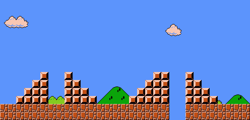

*Our environment: a simple level*

# 动作:跳，蹲下，向前移动

什么是奖励，我们的代理如何获得奖励？我们的特工必须与环境互动。它可以通过从它可能采取的潜在动作列表中选择一个动作来做到这一点。也许我们的代理马里奥决定向上跳。或者向左或向右移动。也许他们有火球术，所以我们的代理人决定发射一个。关键是，这些行动中的每一个都将改变环境，并导致变化。我们的代理可以观察到这种变化，将其作为反馈信号，并从中学习。

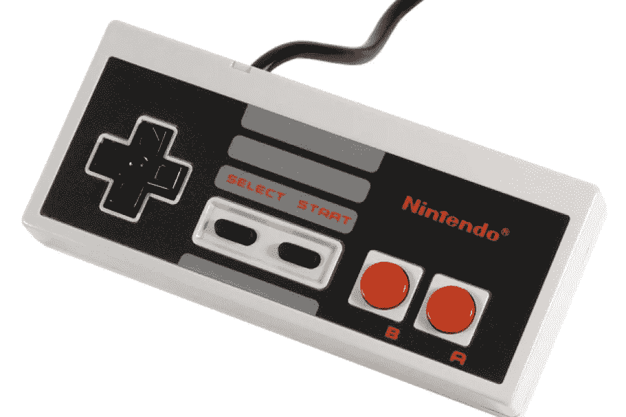

*The interface a human might use to execute actions that affect the environment*

# 状态:马里奥+动作+环境=状态

我们的代理观察到的这些变化是环境状态的变化。我们的代理观察到的新状态可能会产生一个“奖励”信号。将代理采取的行动、状态的变化以及从状态变化中获得的潜在回报结合在一起，代理开始为他们正在探索的环境建立工作模型。

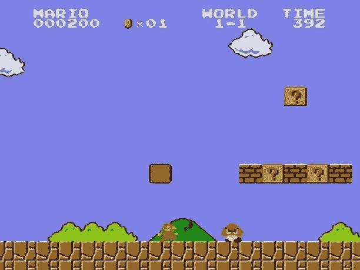

*The state holds all the information about what’s going on in the environment from what we can observe. Things like where our character is, our current score, and enemies on the screen all play into what the state of our environment is currently.*

# 奖励:点数+生存

如果代理人知道当它跳到并落在一个敌人身上时，它会得到一点提升，并且不会再被这个敌人杀死，这是一件值得学习的好事情！它还可能知道，如果马里奥掉进了一个洞里，游戏就结束了，以后就没有机会再得分或赢得关卡了。这些是代理可以随着时间学习的东西，它与环境的交互越多，它学习的就越多。

*In Mario, a good way to measure reward might be the score!*

这包含了对强化学习问题中所有主要组成部分的介绍。在这一部分要记住的重要的事情是代理人、环境、行动、状态和奖励，并尝试在你的头脑中有一个这些需要的工作定义。

如果你是一个视觉学习者，这张图片很好地将这些结合在一起。

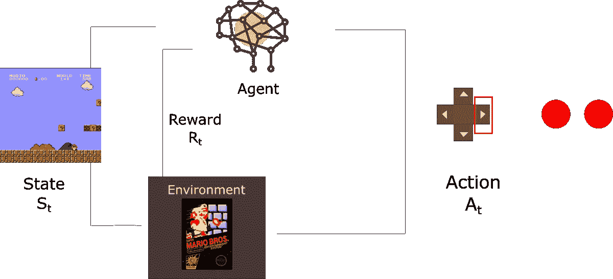

*All of the components coming together to make up how an agent learns from its environment!*

# 它是如何工作的？

既然我们理解了一些基本词汇，我们可以应用它来学习代理如何操作。一个代理人如何决定采取行动来获得最大的回报？

我们需要分析理解两个主要的流:RL 代理需求及其子元素。

# 强化学习需求

RL 代理必须学会在充满不确定性的环境中决定什么是好的行动。反馈作为延时的奖励信号被接收，作为观察到的状态变化和可以从中计算出的奖励。代理人必须能够探索这种不确定性，并对给予奖励的原因进行推理。要做到这一点，代理需要有三个简单的东西:行动、目标和感觉。

## 行动

动作是代理在任何给定时刻可以对环境进行的操作列表。通过执行动作，代理影响其环境并改变其状态。如果不能做到这一点，一个主体就永远无法积极地影响国家，从其行动如何积极或消极地影响环境中获得任何可解释的回报，甚至无法学会在未来采取更好的行动。

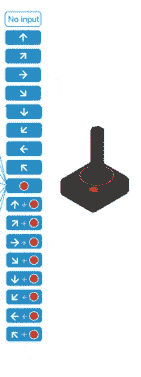

*A list of actions someone might take with an Atari controller.*

## 目标

目标是我们定义奖励信号的方式。我们在电子游戏中会根据分数来奖励吗？完成一个级别？什么是好的和坏的行为？这些是我们在 RL 环境中定义目标时必须考虑的问题。这就是我们激励代理完成任务的方式。

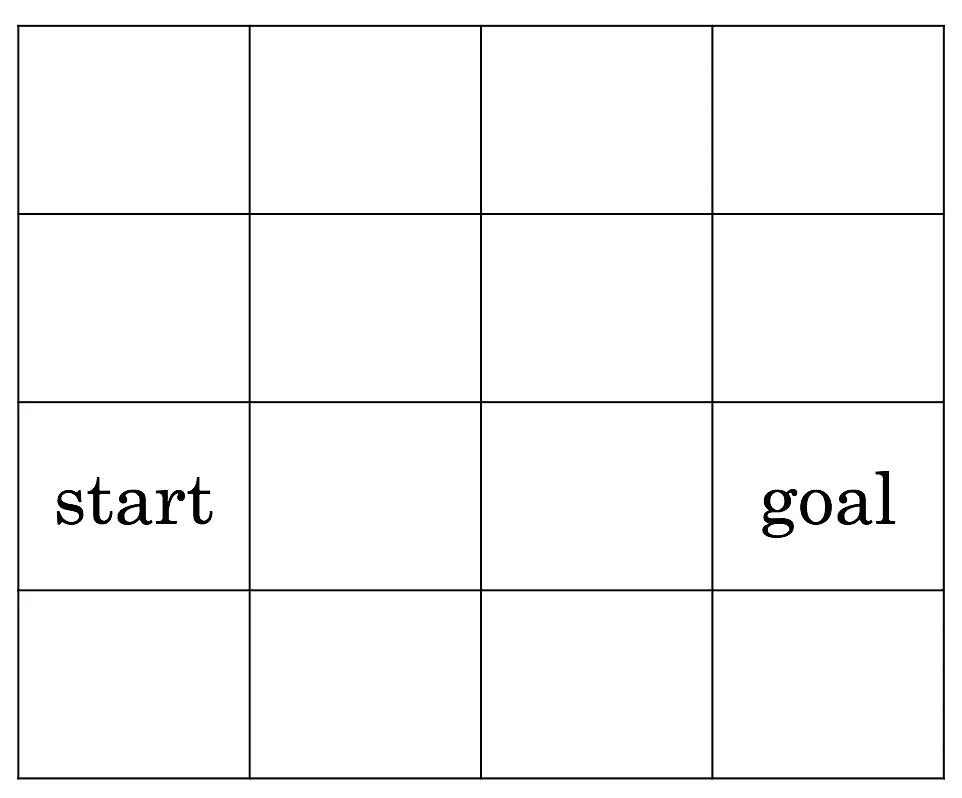

*A simple setup of a goal. How can one get from start to finish?*

## 感觉

感官是智能体用来观察环境的东西。在视频游戏环境中，使用计算机视觉设置中的技术来观察屏幕上的对象以及当我们的代理采取行动时它们如何变化可能是有用的。也许我们用光学字符识别来观察一个点值。关键是，如果一个代理不能感知环境，他们就不能思考他们的行为如何影响环境。因此，我们需要感官来监控我们与之互动的环境。

# 强化学习系统的子元素

现在，我们可以过渡到 RL 系统的子元素:政策、奖励信号、价值函数和环境的最优模型。

## 该政策

保单是我们 RL 代理的核心。这是我们的代理在当前环境状态下的行为方式。这是我们的代理人将采取的行动。在生物学中，我们可能会将一项政策视为一个有机体如何根据它所接受的刺激做出反应。我们的代理观察环境的状态，策略是它已经学会要做的。好的政策会产生积极的结果。

*Our policy will dictate what an agent will do given a state of the environment. We can see here a policy might be that given a certain tile, our agent moves in a certain direction.*

## 奖励信号

奖励信号是我们衡量代理成功的标准。这是我们成功实现目标的量化指标。奖励信号可以是积极的，也可以是消极的，这样我们的代理人就可以衡量一个行为是好的、坏的还是中性的。这些可以是视频游戏中的分值，也可以是我们的特工是否还活着。关键是，我们的代理人接受这些奖励信号，衡量当前目标的执行情况，并根据这一反馈制定政策，以便进一步努力改变环境，使未来可能获得的奖励最大化。

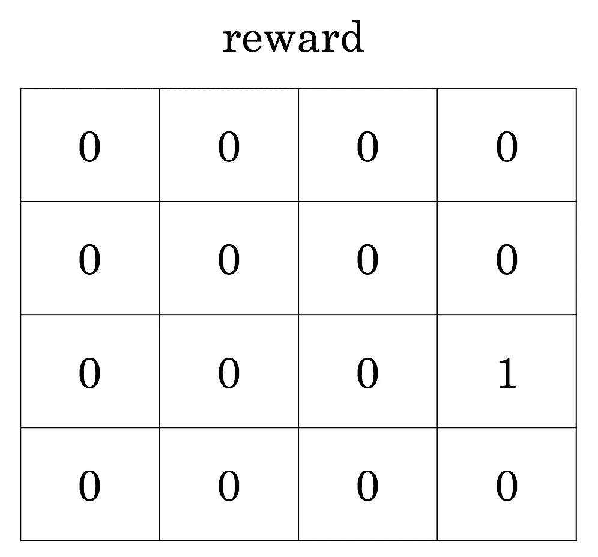

*We can think of this as the hidden reward mapping from the previous goal image. Only by exploring the environment the agent can learn that stepping on the goal tile yields a reward of 1!*

## 价值函数

我们可以把奖励信号看作是一个行为好坏的直接指示器。然而，强化学习不仅仅是直接的积极或消极的结果。它是关于长期规划，以最大限度地成功完成一项任务。为了对这种长期性能进行建模，我们引入了一个叫做价值函数的概念。价值函数是对我们的代理取得长期成功的可能性的估计。这是很难估计和衡量的，但它是我们的 RL 问题的最关键的组成部分之一！在一个不确定的环境中，我们的代理将不断地修改他们对价值的估计，学习更好地制定政策和行动，以接管长序列的行动和状态。

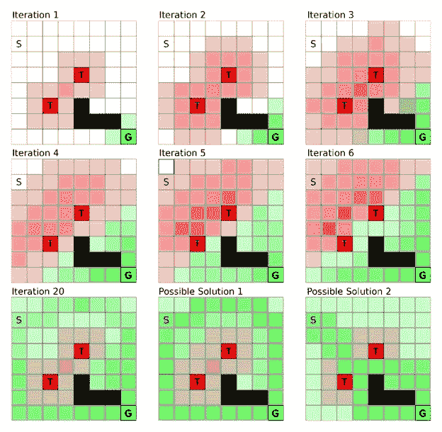

A visualization of a value function being shaped by an agent. As it becomes more and more certain about its potential long term reward given its state, it can come up with solutions to this challenge.

# 环境的最佳模型

最后，我们的 RL 系统可以模拟环境。我说可能是因为不是所有的 RL 代理都会模拟一个环境。一些代理人只是通过试错来学习，通过良好的价值函数和策略组合来构建某种程度上隐含的环境模型。其他代理可以显式地创建环境的内部模型，允许代理基于它希望直接采取的行动来预测结果状态和奖励。这似乎是一个非常好的方法，但是在高度复杂的环境中，建立这样一个内部模型是非常困难的，所以代理通常不会选择这种策略。

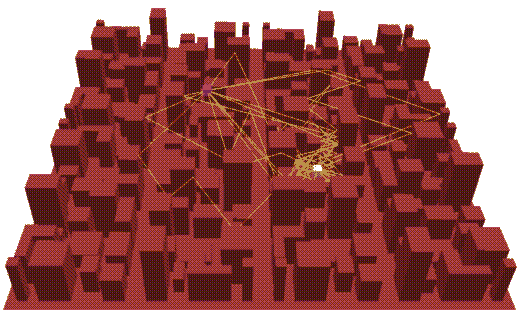

As an agent explores an environment, they could build a 3D interpretation of the world around them to help them reason about the actions they might take in the future.

# 摘要

有了这些基本概念，我们可以开始看到这样的未来，计算机系统根据我们的行动和反应进行学习，专门针对我们的个性进行调整。在我们上面例子中的马里奥代理中，我们可以想象未来的计算机系统会像马里奥角色阅读环境一样阅读我们的动作和反应。它得到的回报信号越多，我们就越快乐，我们就能越快实现目标。很容易看出这种未来的结果是如何在我们的能力范围之内。

# 即将推出:第 2 部分和第 3 部分

所有这些综合起来给了我们一个增强系统如何执行和操作的基本概述。这篇高水平的初级读本将有助于我们的第 2 部分文章，其中我们讨论了强化学习与其他类型的机器学习的比较，以及我们在制定强化学习问题时考虑的一些因素，以及我们的第 3 部分文章，其中我们查看了强化学习领域的一些最新成就和开放的研究问题。

观看马里奥游戏！看看你是否能识别强化学习场景中需要的所有元素。

如果你喜欢读这篇文章，给我留言或者给我的 GoFundMe 捐款来帮助我继续我的 ML 研究！

*原载于 2018 年 8 月 8 日*[*recast . ai*](https://recast.ai/blog/the-future-with-reinforcement-learning-part-1/)*。*