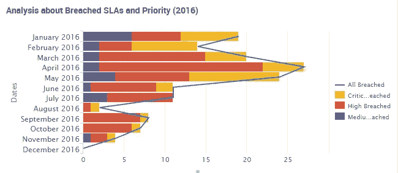

# 假设的数据驱动的组织和他们对重塑过程的需求之间的差距

> 原文：<https://towardsdatascience.com/the-gap-between-hypothetical-data-driven-organizations-and-their-need-for-remodeling-processes-476d852a7ff6?source=collection_archive---------1----------------------->

*图示:* [*Splunk*](http://www.splunk.com/) *中票务管理洞察示例用于收集和分析此类数据*

在过去的组织中，我的角色一直是一个快乐、横向的角色，对当今数字议程中发生的事情有 360 度的视角。我更喜欢保持顾问的风格，同时在典型 IT 项目的开发步骤中亲自动手。

在过去的两年里，我有机会参与不同 SMB(中小型企业)的许多转型过程，处理数字化、变革管理、分析和数据驱动战略等主题。然而，我的看法是，在这些组织能够实际实施的内容和它们如何实现这些内容之间存在差距。

> 迫切需要将**变革**确立为核心竞争力。

这种冲动有两个方面:

*   *组织产生过量的数据*
*   *难以提供见解和商业价值*

这两者都会导致技术选择和培养所需人才方面的延误和混乱。

我工作过的大多数组织都低估了他们使用、保存或删除的数据的价值和丰富程度。这就是为什么我在考虑数据之前谈论*重塑流程*的原因。

这里我举个例子！每当我们听到大数据、开放数据、公共数据，我们都会听到不同的相关问题:缺乏标准(开放数据的例子:意大利的两个地区，[伦巴第](http://dati.lombardia.it/)和[皮埃蒙特](http://www.dati.piemonte.it/)，有完全不同的格式)、安全性、隐私和数据一致性(大多数数据已经过时或质量很差)、失去效用和增加获取价值的难度。

几年前，在一家小公司(但本质上对技术和创新问题“敏感”)，服务台团队的工作方式是让员工进入办公室(同事不断敲门)并抱怨！这是他们的“全天候门票管理”系统。

一个基于云的产品的引入(有很多名字: [ServiceNow](http://www.servicenow.com/) 、 [Salesforce](http://www.salesforce.com) 、 [Zendesk](http://www.zendesk.com/) 、 [CA](http://www.ca.com/us/products/ca-service-desk-manager.html) 等等)最终塑造了同事们面对它的方式。代理组与特定部门相关联，以便解决相关的票据并在它们之间共享信息。引入 SLA-s 是为了尊重优先级、紧急性和 QoS。员工从不同渠道(内部网、网络、社交网络……)使用他们的账户开罚单。几个月后，他们也开始解决自己和对方的抱怨。

一个*知识管理*存储库在云服务中得到丰富，将信息聚集在可搜索的文件夹中。响应时间比以前缩短了 40%。通过分析树状结构中的票证类别，他们了解到大多数问题都是以多米诺骨牌效应的形式出现的(在同一业务领域中，一个问题会引发其他子问题)。数据分析(关键词计数、要解决的时间、采取的步骤和其他 KPI)使得检测*模式*成为可能(类似的问题可能需要类似的解决方案！).

> 此外，不同部门(营销、销售、IT、CRM)之间的沟通得到了改善，同时信息可通过云服务平台社区和论坛立即获得。交流的流程发生了变化。现在正在分析这类数据。

云是范例，产品是媒介，但真正使重塑成为可能的是他们态度的改变。这被证明是一个成功的模式，因为它调动了所有参与者(IT 团队、来自其他业务部门的同事和管理层)并利用了数据的力量。

这看起来像是“最低要求”的思维模式(*“只要法律、法规或主管期望我做的，我就做最低限度的事情”*)阻止组织通过实施变更管理流程来做出战略决策。

在我看来，在定义一个日期驱动的策略之前，最好开始重塑过程。