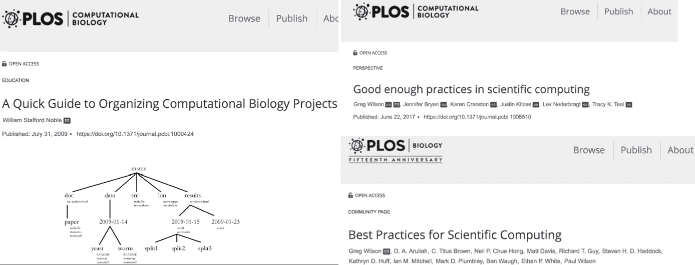
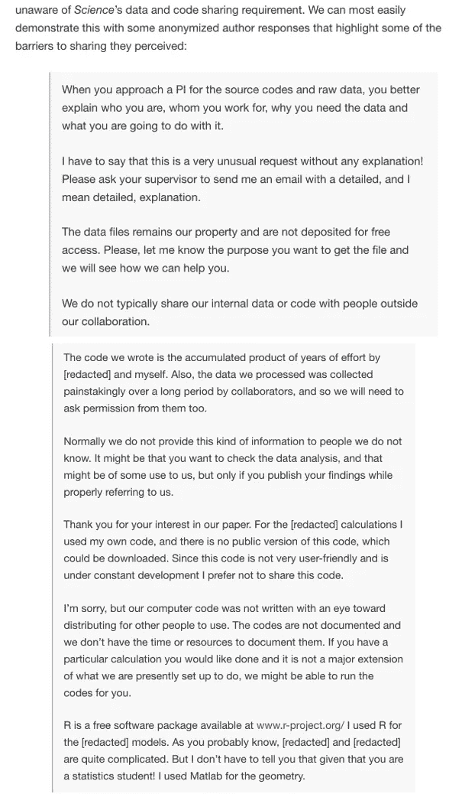
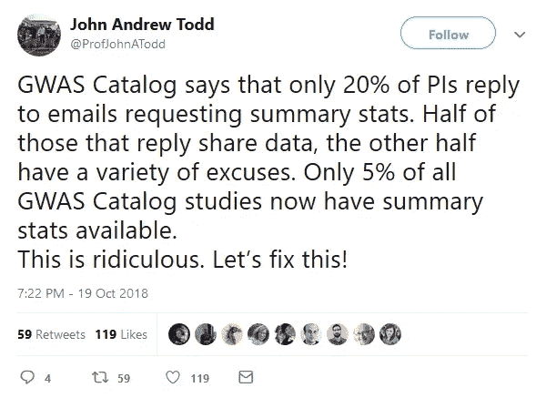
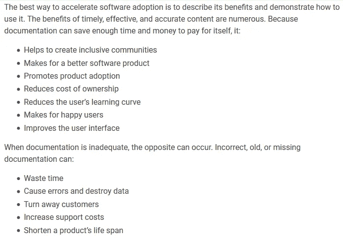
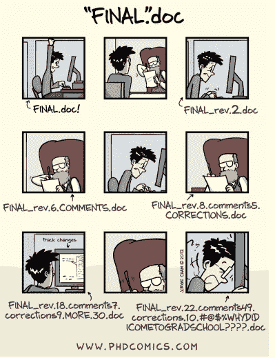
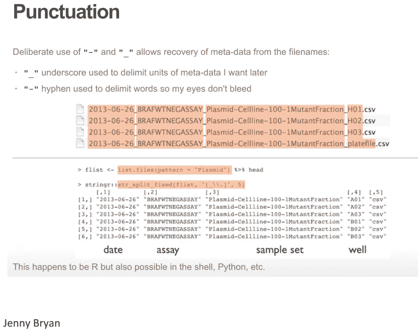
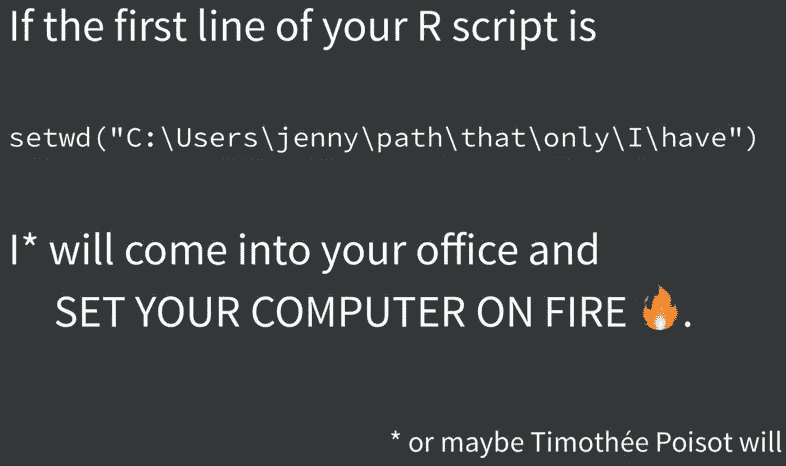

# 数据科学项目管理的“黄金标准”

> 原文：<https://towardsdatascience.com/the-gold-standard-of-data-science-project-management-13d68c9e85d6?source=collection_archive---------7----------------------->


Photo by [rawpixel](https://unsplash.com/photos/a2VqhP3d4Vg?utm_source=unsplash&utm_medium=referral&utm_content=creditCopyText) on [Unsplash](https://unsplash.com/search/photos/big-data?utm_source=unsplash&utm_medium=referral&utm_content=creditCopyText)

这篇文章的灵感最近来自哈佛大学生物信息学家[唐明](https://twitter.com/tangming2005)的[幻灯片](https://divingintogeneticsandgenomics.rbind.io/talk/2018-uf-talk/)，以及约翰·霍普斯金大学[杰弗瑞·莱克](https://twitter.com/jtleek)提供的 [Chromebook 数据科学新课程](https://leanpub.com/universities/courses/jhu/cbds-organizing)。Leek 认为这很重要，建议你"**在数据科学项目中安排 10-20%的时间来组织和记录你的工作。**

然而，这是我思考了一段时间的话题。我过去读过的许多其他优秀资源( [1](http://journals.plos.org/ploscompbiol/article?id=10.1371/journal.pcbi.1000424) 、 [2](https://nicercode.github.io/blog/2013-04-05-projects/) 、 [3](http://lab.loman.net/2014/05/14/how-i-start-a-bioinformatics-project/) 、 [4](https://www.biostarhandbook.com/) )启发我创建了一个 [Github repo](https://github.com/moldach/project-directory) ，用于建立新的数据科学项目目录的**黄金标准**工作流。



来自 UBC 的统计学家和数据科学家 Jenny Bryan 对 R 脚本的合理布局、工作流程和文件组织/命名有着强烈的看法，他说得很好:


[Image Source](https://twitter.com/dguarch/status/663049353007931392)

Leek 过去曾在 [simplystats](https://simplystatistics.org/2012/02/27/the-duke-saga-starter-set/) 博客上谈论过杜克丑闻(还有[罗杰·彭](http://www.biostat.jhsph.edu/~rpeng/)和[拉法·伊里扎里](http://rafalab.github.io//)),所以这也成为他的课程就不足为奇了。对于那些不想看演讲“[高通量生物学中可重复研究的重要性:法医生物信息学中的案例研究](http://videolectures.net/cancerbioinformatics2010_baggerly_irrh/)”的人，我会给出[科尔斯笔记](https://en.wikipedia.org/wiki/Coles_Notes)版本(但我警告你，你错过了！).

杜克大学的研究人员发表了一项关于使用个性化基因组学进行患者特异性化疗的研究。来自 MD 安德森的两位研究人员[巴格利和库姆比斯](https://www.nytimes.com/2011/07/08/health/research/08genes.html)要求提供数据和代码。花了好几个月的时间来来回回(*追逐*)才真正得到数据和代码——当他们得到数据和代码的时候，它们是杂乱无章的，并且没有很好的文档记录。巴格利和库姆比斯最终在代码中发现了一个错误，表明它实际上将患者置于风险之中，导致了一场重大诉讼并终止了临床试验。

另外，可悲的是，不愿意分享数据的现象今天仍然很普遍。一个典型的例子是，现在臭名昭著的“寄生虫研究”社论由该领域的权威期刊《新英格兰医学杂志》发表。我还附上了 Stodden *等人的截图，*2018“[计算再现性期刊政策有效性的实证分析](http://www.pnas.org/content/115/11/2584)”。作者随机抽取了 204 篇发表在《科学》杂志上的科学论文，这些论文是在他们的政策实施后发表的，该政策于 2011 年 2 月“要求作者在发表后根据要求提供再现性所必需的数据和代码”。在这 204 篇论文中，有 24 篇有足够的信息(通过链接或在支持信息中)让他们在不联系作者的情况下找到数据/代码。在那些被联系和回复的人当中，有些人要么不确定科学的政策，要么不愿意遵从:



Special thanks to [Luis D. Verde](https://twitter.com/LuisDVerde) for reminding me of the [Image Source!](http://www.pnas.org/content/115/11/2584)

Stodden 和他的合作者从 204 篇文章中的 89 篇文章中获得数据和代码，并随机选择了 22 篇来尝试复制(除了一篇之外都成功了)。他们据此估计，26%将重现这 89 篇文章(`56*(1-1/22))`)，置信区间为 95%[20%，32%]——作者建议我们继续就记录代码、元数据、工作流以及软件使用和重用的最佳实践和标准进行对话(*例如* Docker 容器)。



Source: [https://twitter.com/ProfJohnATodd/status/1053471430149435392](https://twitter.com/ProfJohnATodd/status/1053471430149435392)

我知道有些科学家会先浏览一份手稿的摘要，但我的认可是一份**再现性声明**，其中包含所有可用的( *r* a *w* )数据和代码。如果你没有看到类似这样的东西，请运行！


未能使你的项目具有可复制性是学术不端行为，会有严重的后果。这是对最近[名誉扫地的康奈尔大学研究员布莱恩·万辛克](https://www.cnn.com/2018/09/20/health/brian-wansink-retractions-resignation-misconduct-bn/index.html)的指控之一(**未能正确记录和保存研究成果**)(我不是说这比 p-hacking 指控更糟糕，但我也拒绝说这比 p-hacking 指控更好)。

一项 [2017 Github 调查](http://opensourcesurvey.org/2017/)显示，“不完整或混乱的文档”是对开源软件的头号投诉。

Daniele Procida 在软件文档的**黄金标准**上发表的这篇 [*优秀*文章很好地总结了这一点，他说:](https://www.divio.com/blog/documentation/)

> “你的软件有多好并不重要，因为**如果文档不够好，人们就不会使用它**。
> 
> 即使出于某种原因他们不得不使用它，因为他们没有选择，没有好的文档，他们不会有效地使用它或以您希望的方式使用它。"

因此，遵循 Procida 先生的明智建议，让最终用户毫不费力地理解您在项目中做了什么，并能够重现那些结果(最好不必联系您)。这对于与现在的同事合作以及为了子孙后代都是至关重要的(例如，当你被要求在 6 个月后重新进行一项分析时，或者对于任何希望复制你的工作并对其进行扩展的研究人员来说，这是你未来的自我)。



Source: [https://opensource.googleblog.com/2018/10/building-great-open-source-documentation.html](https://opensource.googleblog.com/2018/10/building-great-open-source-documentation.html)

由于我的 [Github repo](https://github.com/moldach/project-directory) 已经解决了在您的数据科学项目中建立文件夹的**黄金标准**(*请启动 repo，因为我计划在未来几天更新和改进它*)我将谈论数据科学项目管理的另一个重要方面，即:



# 文件命名

Jenny Bryan 给出了数据科学项目文件命名的三个关键原则。

1.  机粕读的
2.  人类可读的
3.  与默认排序配合良好

为了机器的可读性，我们希望**避免空格、标点、句点和任何其他特殊字符(除了 _ 和-)** 。



为了便于阅读，你需要给文件取一个有意义的名字。当命名`R`对象时，有一种缩写`object`名称的倾向，只要包含注释，这是可以的。例如，`cv_perf_recall_rf` 对象是对随机森林模型的每个交叉验证折叠的验证召回的计算。

```
# Calculate the validate recall for each cross-validation fold
cv_perf_recall_rf <- cv_prep_rf %>%
 mutate(validate_recall = map2_dbl(validate_actual, validate_predicted, ~recall(actual = .x, predicted = .y)))
```

然而，在命名文件时，我会警告不要使用首字母缩写词，除非绝对必要，如果是这样，在`README`文件中包含该信息。

下一条建议是将日期和数字放在文件名的开头。始终使用 ISO8601 日期格式(`yyyy-mm-dd`)和带零的左补数字。最大位数将由您可能生成的文件数量决定。假设您希望保存 100 个结构性 MRI 图像文件，那么它应该是这样的`001_T1_mri.nii.gz.` 假设您认为您实际上会生成 1000 个文件，那么它应该是这样的`0025_T1_mri.nii.gz`。

# 采取相反的立场


Leek 还说你应该避免区分大小写，例如`Esophageal-Cancer_Report.md` 显然是一个可怕的文件名(我的手指因为所有额外的击键而受伤😫)而是暗示`esophageal-cancer_report.md` 高人一等。

恕我直言，我不同意他的观点。就我个人而言，我觉得[茶包](https://en.wikipedia.org/wiki/Camel_case)在美学上令人愉悦，而`esophagealCancer_report.md`看起来更令人愉快，而且它没有 Leek 提到的风险；只要你不忘记包括适当的选项来忽略大小写的敏感性。在`R`中，你可以用`stringr`包来做这件事，

```
library(stringr)
str_detect('TOYOTA subaru', fixed('toyota', ignore_case=TRUE)) 
```

在终端中，您可以使用`-iname` 标志来忽略`find`命令的不区分大小写。如果你是健忘的，或者仅仅是有效率的( *i.* e. lazy)，你可以在你的`.bashrc`文件中包含这个别名🤷

让你的文件名以大写字母开头显然不是一个好主意，因为这会导致你添加额外的击键来生成大写字母(*例如*T3)。然而，使用`camelCase`,你可以通过使用 Tab 键自动完成来避免额外的击键。

# 结束语

如果你使用`R`，你应该仔细阅读 [Kirill Müller](https://twitter.com/krlmlr) 的`here()`软件包，它可以消除由`setwd()`引起的尴尬的工作流程问题。



Jenny Bryan 大力提倡使用他的软件包，并在她的博客文章“面向项目的工作流”中写了关于如何做和为什么做的内容。

遵循这条**黄金标准**数据科学项目管理建议，你在处理“大数据”时将不会有任何问题🙄


如果你觉得这篇文章有用，请随意与他人分享或推荐这篇文章！😃

一如既往，如果您有任何问题或意见，请随时在下面留下您的反馈，或者您可以随时通过 LinkedIn 联系我。在那之前，下一篇文章再见！😄