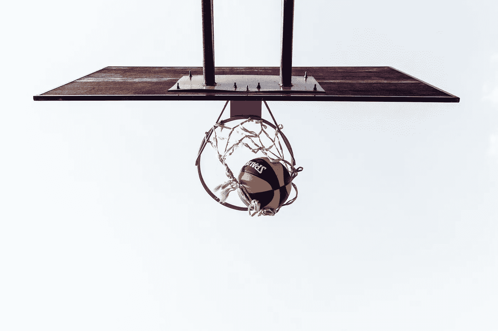
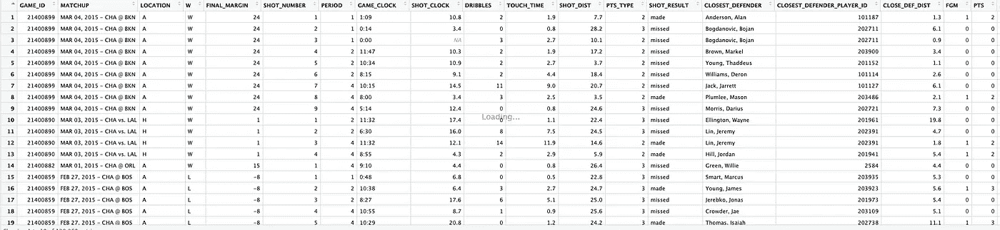
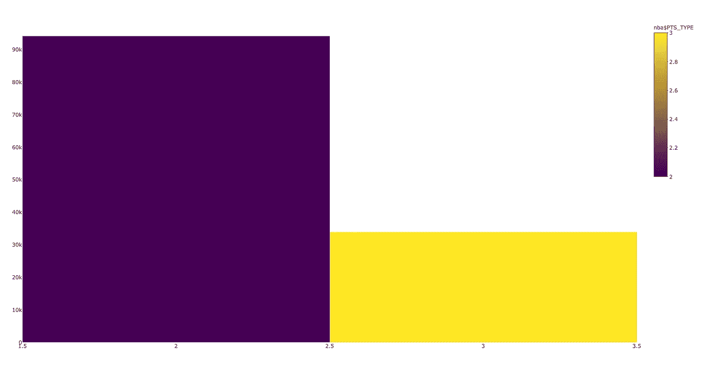
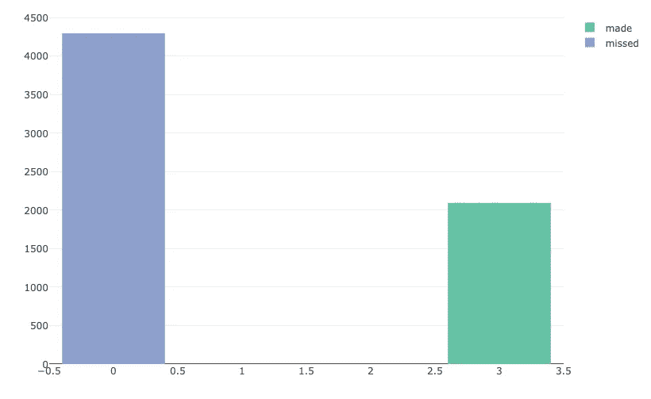
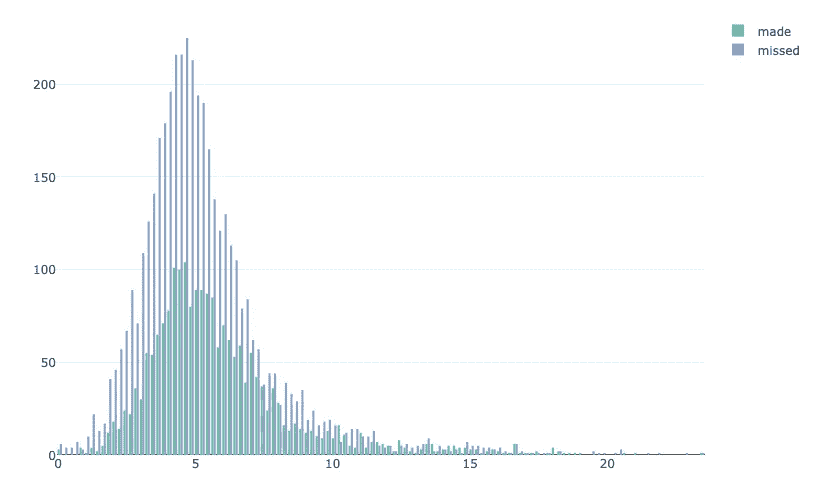
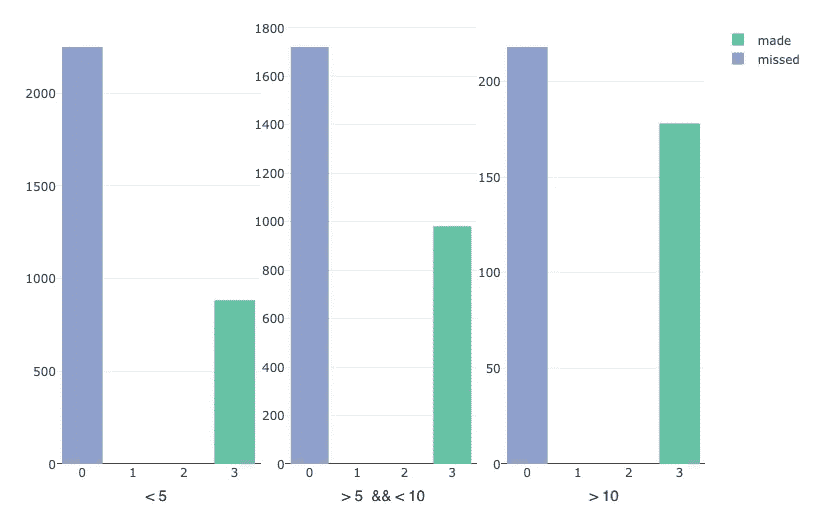
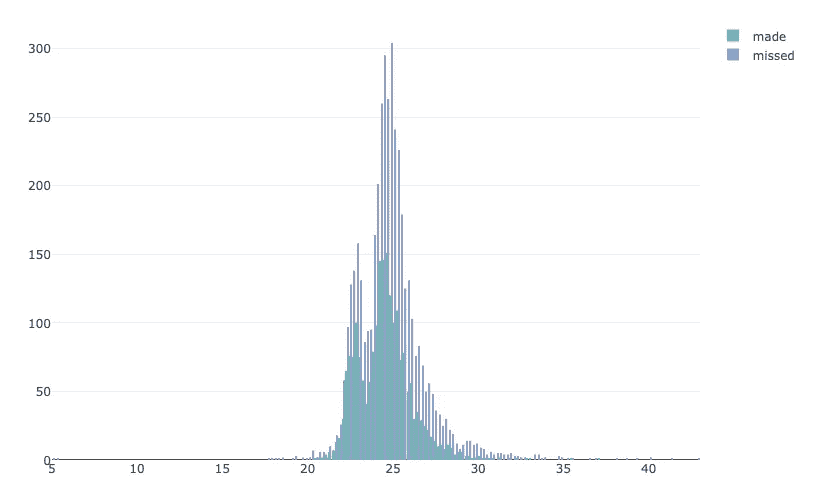
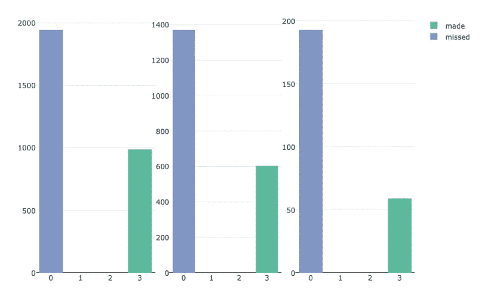
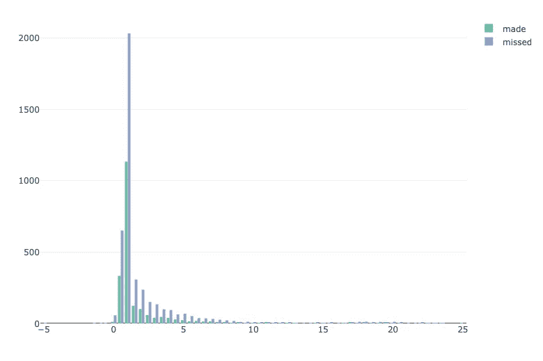
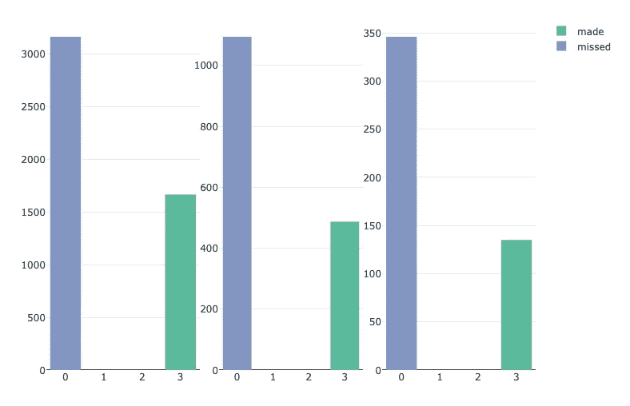

# 数据科学的黄金机会|第 1 部分

> 原文：<https://towardsdatascience.com/the-golden-shot-with-data-science-part-1-b81eb00ec30f?source=collection_archive---------13----------------------->

今年是 2013 年，这是圣安东尼奥马刺队和迈阿密热火队之间的 2013 年 NBA 总决赛第六场。圣安东尼奥以 3 分领先。在比赛还剩 12 秒的时候，勒布朗·詹姆斯接了一个球，并尝试了一次三分投篮。迈阿密需要三分来打平比赛，并且仍然有机会赢得 NBA 总冠军。尝试失败了。人群发现自己处于一种沉默和顺从的混合状态。然后球从篮板上掉了下来，克里斯·波什抢到了篮板。在比赛还剩 7 秒时，他将球传给右翼的雷·阿伦，后者后退三步。球掉了进去，人群爆炸了。比赛只剩下 5 秒钟，双方打成平手，被迫进入加时赛。迈阿密赢了第 6 场比赛，并迫使第 7 场比赛。**剩下的就是历史了……**

像来自雷·阿伦的 T3 这样的镜头是最难找到的。首先，球员必须承受巨大的压力。他知道需要 3 分来扳平比赛，重新获得 NBA 总冠军的机会。其次——多名防守队员高速赶来，防守这场比赛中可能是最后的一击。第三，考虑到这些情况，你必须做好充分准备才能打出这样的一杆。

Ray Allen’s three point shot against SA ([https://giphy.com/gifs/nba-basketball-miami-heat-26grzzeWoSsK1ieoU/links](https://giphy.com/gifs/nba-basketball-miami-heat-26grzzeWoSsK1ieoU/links))

在这篇文章中，我们想分析哪些参数对三分球的性能有影响，哪些是不相关的。我们想看看 NBA 球员超过 120000 次投篮的测量参数，以获得洞察力，并寻找这些参数与最后一秒投篮的表现和成功之间的可能联系。我们将关注球员在投篮时必须应对的所有情况。我们不会考虑球员的个人技能，因为我们想调查环境及其对击球的影响。这导致了基于数据使用的论文证明。最终结果应该是知识，允许我们将所有这些输入到神经网络中，以预测三分之一的成功率，或者换句话说，球员是否应该射门。

# 数据和分析

我们将使用的数据集测量了来自 NBA 比赛的超过 120000 个镜头，并提供了大量信息。这里 可以找到 [**。让我们仔细看看它:**](https://www.kaggle.com/dansbecker/nba-shot-logs)

First rows of the used dataset

首先，我们有比赛和日期。接下来，我们有一些非常有趣的参数，比如镜头时钟和游戏时钟。我们必须考虑的下一个参数是触摸时间和射击距离。我们还有到最近的防守队员的距离以及射门是否成功的信息。所有这些信息真的很有趣，使我们能够发挥创造力，越来越多地研究这些参数。

## 1️⃣滤波三分球

首先，我们要使用我们数据集中的所有三点射击尝试，因此让我们检查我们数据集的分布。

Distribution of 2 point shots(violet) and 3 point shots(yellow)

我们的数据集包含超过 94，000 次两点射击尝试和超过 33，000 次三点射击尝试。这是一个有趣的信息，因为现在我们知道我们的数据集中有多少有趣的样本。我们将尝试拍摄 3 个点，并将两个点的数据分开，因为我们只想处理我们案例中感兴趣的数据。

## 👨‍💻数据准备

在我们开始询问具体问题和调查我们的数据集之前，我们必须先对其进行过滤。如上所述，我们有超过 33.000 个三分球，但我们不想处理所有的三分球。这是因为我们想只关注最后一秒镜头和“正常”镜头之间的关键区别。因此，我们将我们的 33.000 个三分球分成所有投篮，投篮时间小于 7 秒。既然我们已经对数据进行了分离和过滤，是时候提问和获取知识了。

## 2️⃣:拍摄时间会影响第三次拍摄的成功吗？

这是一个非常有趣的问题，因为通常你会认为在拍摄时间压力下拍摄的镜头比拍摄时间长的镜头成功率低。为了研究这个问题，我们必须得到与炮时钟压力相关的成功和失败炮的分布。

Distribution of made and missed 3 point shots with < 7 seconds shot clock

仔细观察这个图，可以发现失败的三分比成功的三分多得多。如果我们用绝对数字来说，这意味着 7 秒钟以下的成功率是 33%。或者换句话说，在 7 秒钟内 3 次三分球尝试中的 1 次是成功的。这是我们能够实现的第一次知识增长。现在的问题是:“成功的三和不成功的有什么区别？有没有区别或者根本没有区别而且都只是基于纯技巧？

## 后卫距离 3️⃣

我们要检查的下一个参数是最近的防守者距离。如果我们想到一个典型的最后一秒投篮，应该有一个紧密的防守，这应该使球员更难投进三分。

Distribution of successfull and unsuccessfull shots related to the defender distance

如果我们现在看一下分布情况，很明显，防守队员越靠近，球员就越难投篮。我们还可以看到，大多数投篮都是在 5 英尺范围内进行的，而大多数投篮不中也是在这个范围内进行的。此外，我们可以注意到，在 10 英尺范围内，投篮不中的次数远远高于 10 英尺范围外的投篮次数。这意味着射手有越多的空间，他就越有可能得分空位三分。现在考虑防守队员的平均距离，它也向我们表明，失败组的防守队员比成功组的防守队员离射手更近约 0.6 英尺。

> *平均成功定义距离= 5.95 英尺*
> 
> *平均故障定义距离= 5.34 英尺*

现在让我们记住，根据给定的数据，3 分投篮的总体成功率是 33%。但是如果我们现在回顾一下不同的后卫距离等级，我们会看到一些不同的东西:

Success rate of three pointers in relation to defender distance

结果应该不令人惊讶，但有趣的是，如果防守队允许对手占据太多空间，三分球的转化率会迅速增长。

## 4️⃣射击距离

在我们提出了取决于后卫空间的三分投篮成功率的差异之后，我们现在准备看看投篮距离。和前面的参数一样，对于三分球来说，投篮距离也是一个非常重要的参数。从比三分线更高的距离得分要复杂得多。通过仔细观察根据投篮距离的三分命中和失误的分布，我们可以看到大多数命中和失误的投篮都在 23 到 26 英尺之间。

Distribution of successfull and unsuccessfull shots rekated to shooting distance

让我们不要关注不同的投篮距离:我们可以清楚地看到，射手的距离越大，三分球尝试的成功率下降得越多。

Distribution of successfull and unsuccessfull shots in relation to shooting distance(left = 23 to 25 feet, middle = 25 to 28 feet, right = 28 to 32 feet)

这意味着三分球尝试的投篮距离越高，该球被标记为失误的几率就越高。

## 5️⃣的触摸时间

触球时间描述了球员在射门前控制球的时间。知道成功率和接触时间之间是否有联系是很有趣的。为了实现这一点，我们首先需要对照该参数检查投篮命中和投篮不中的分布:

Distribution of made and missed shots compared to the touch time

我们可以清楚地看到，大部分镜头的触摸时间在 0 到 2 秒之间。此外，越来越清楚的是，大多数单位放置在 0 和 5 秒之间。现在让我们放大大部分数据所在的区域。如果我们仔细观察 0 到 5 秒之间拍摄的照片，我们会发现一些突出的东西:

Made and missed shots compared to touch time in 3 categories (left = 0 to 1 sec, middle = 1 to 3 sec, right = 3 to 5 sec)

球员控球时间越长，成功率就越低。这是非常令人惊讶的，因为通常我们可以假设，随着时间的推移，球员有更多的机会把自己放在最佳位置，打出好球。

# 🏁结论

在这篇文章中，我们定义并研究了在拍摄时钟压力下三点拍摄的最重要参数。总结本文中获得的所有信息，我们可以说:

*   33%的拍摄时间少于 7 秒的三次拍摄都是成功的
*   防守者给球员的空间越大，相对于射门距离来说，三分球的成功率就越高
*   球员投三分球的距离越大，成功率就越低
*   在触摸时间不太高的情况下，拍三的成功率更高

所有这些都是可以成功获得的洞察力，并用数据来证明。现在的问题是，这是否可以用来为未来的射击创建一个概率建议，或者需要更多的参数来预测一些有价值的信息？我想在第二部分回答这个问题。因此，我们将在“keras”中建立和训练一个神经网络，以预测在几种情况下三分球成功的概率，以及是否接受它。

我希望你喜欢这个数据分析，即使它证明了比发现一些突出的新东西更众所周知的事实。但是证明事实和获得知识是建立神经网络的第一步，因为我们确实需要知道我们需要遵循哪些规则。