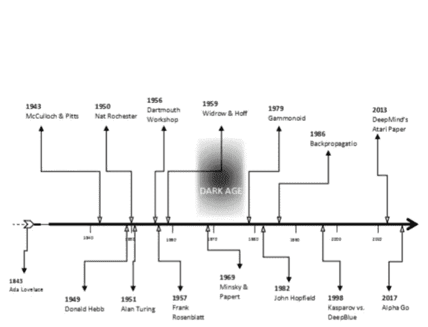
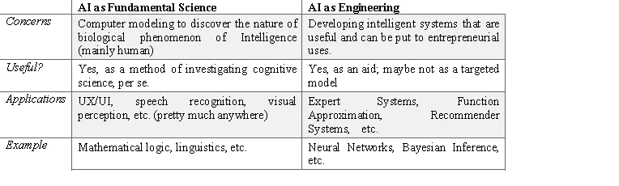

# 人工智能的巨大鸿沟

> 原文：<https://towardsdatascience.com/the-great-divide-in-ai-450bec3974e9?source=collection_archive---------7----------------------->

作者:Aadhar Sharma、Deepak Singh 和 Sukant Khurana

Figure 1: Timeline of AI development

洛夫莱斯伯爵夫人兼*查尔斯·巴贝奇*的助手艾达 T3 被认为在 1843 年编写了第一个计算机程序。她是第一个认识到计算机不仅仅可以用于纯粹的计算的人。她也是第一个就人工智能(AI)的概念对分析引擎发表评论的人；她在笔记中写道:

*“分析引擎并不自命能创造任何东西。它可以做我们知道如何命令它执行的任何事情。它可以跟随分析；但它没有能力预测任何分析关系或真理。”*

Ada 不希望分析引擎能像人一样聪明；艾伦·图灵在他 1950 年题为“计算机器和智能”的论文中反对的东西。人工智能的出现是由麦卡洛和皮茨的开创性研究(1943；M&P)——单点神经元的计算模型(一个过于简化的大脑模型)——和*唐纳德·赫布的*可塑性法则(1949)。艾伦·图灵(Alan Turing)在机器智能方面有影响力的工作(始于 1951 年的《模仿游戏》(the Imitation Game)一书)为他赢得了“现代计算之父”和人工智能(AI)的称号。

20 世纪 50 年代，计算机终于变得足够强大，可以模拟这些想法。据报道，纳特·罗切斯特首次尝试对 *M & P* 型号进行编程，尽管最初并不成功。最初的失败导致研究人员**约翰·麦卡锡**马文·明斯基* *克劳德·香农和纳特*组织了 1956 年至关重要的达特茅斯研讨会[【3】](#Ref)。这个大联盟集会的想法是就如何模拟智能(主要是人类)进行头脑风暴。这正式确立了人工智能作为计算机科学的一个子领域。*

*1957 年， *Frank Rosenblatt，*发明了感知机，一种模式识别算法，导致了人工智能的一场革命，吸引了像苍蝇一样的研究人员，直到 *Minsky* 和 *Papert* 在 1969 年出版了他们的书《感知机》，这本书开启了臭名昭著的人工智能冬天。1982 年春天，约翰·霍普菲尔德(John Hopfield)的联想神经网络(T7)问世。Rumelhart、Hinton 和 Wiliams 在 1986 年发表了“反向传播”学习算法，这重新引发了人们对人工智能的极大兴趣，也许对神经网络来说尤其如此。*

*据陷入科学与工程辩论的人说，人工智能具有双重性；它既是科学也是工程。帕特里克·温斯顿(Patrick Winston)写道，人工智能有两个目的:一是我们试图理解什么是智能的诺贝尔奖获得者的目的，二是让机器更有用的创业目的。作为一门科学，它是要发现某些生物系统的本质，主要是人类的智能；研究认知科学的方法。作为工程，它关心的是开发对某些目的有用的智能系统。无论分类如何，我们*

***人工智能作为基础科学***

***人工智能工程***

**担忧**

*计算机建模以发现智能生物现象的本质(主要是人类)*

*开发有用的智能系统，并将其应用于企业。*

**

****表 1: AI 作为基础科学与工程****

*作为一个领域，人工智能已经走过了漫长的道路，从建模思维、感知和行动的科学到在无数职业中提供帮助和援助的工程系统。人工智能的演变非常丰富，并在生物学、哲学、语言学和心理学中找到灵感，尽管不是每个人都赞赏人工智能作为科学如何演变为工业研究。看来，虽然洛夫莱斯女士对人工智能的看法是错误的，但她对计算机应用的认识是正确的。应用人工智能驱动的进化极大地影响了人工智能领域，并引发了许多关于对它的伦理和道德义务的关注。*

*作为基础科学的人工智能:好与坏*

*MAC(机器辅助认知；1963)项目是麻省理工学院的一个主要项目，由 ARPA 资助，每年的预算超过 300 万美元， *Minsky* ，AI 历史上最有影响力的人物之一，提到超过 100 万给了人工智能小组；*

**“最初几年，我们把这笔钱花在硬件和学生身上，但到了第十年，我们开始制造自己的硬件，所以我们几乎把所有的钱都花在了教职员工和学生身上”*[【5】](#Ref)*。**

*他的目标是雇用人才来学习和设计可以解决非算术问题的计算机系统，使机器智能化。他非常热衷于为人工智能研究提供一个意义深远的平台，以至于他将所有的资金和努力都用于人工智能的健康和可持续发展，其中可持续发展不仅意味着传播负担得起的人工智能，还包括研究语言学、视觉感知、模式识别、机器人等问题。使用各种模型和技术，例如数理逻辑、概率和神经网络等等。他和当时的其他研究人员在这个领域培养了一批杰出的科学家。*

*帕特里克·温斯顿曾经是明斯基的研究生，后来接替他成为人工智能实验室的主任。Pat 解释了事情开始走下坡路的原因——人工智能和机器人技术发展到了一个可以实际做有用的事情的地步，所以焦点转向了实际应用，主要是由工业需求和创业激情驱动的，这一些——将更基本的科学问题放在了一边[【6】](#Ref)。*诺姆·乔姆斯基*一贯蔑视“新人工智能”对统计技术的严重依赖，他不期望这些模型能够提供人工智能作为一门科学有义务提供的探索性洞察力。他认为，这种依靠加速研究、大规模记忆和计算能力的更新的科学不太可能预测关于智慧生物或认知性质的一般原则；这使得工程学远离了科学。然而，并非所有人都同意他的观点， *Peter Norvig，*(一位杰出的人工智能研究人员，《*人工智能:一种现代方法*》的合著者，谷歌的研究主管)有着非常不同的哲学和技术观点，他写道[【7】](#Ref):*

*“我同意工程上的成功不是科学的目标或衡量标准。但我注意到科学和工程是共同发展的，工程上的成功表明某些东西在正常工作，科学上成功的模型的证据(但不是证明)也是如此”。*

*诺姆承认了这些评论，他承认统计技术本身就像一个搜索引擎，有着巨大的实用潜力。*

*杰出的神经科学家和意识专家 Christof Koch 提到了理解潜在机制对开发高质量工程产品的重要性。他写道，*

**“这种知识的缺乏使得任何关于我们何时能实现强大人工智能的预测都充满了不确定性”**

*该领域目前的一个趋势是机器学习，它几乎已经成为人工智能的同义词；深度学习(以下简称 DL)是机器学习的一种类型，目前正在大肆宣传。DL(或多隐层神经网络)从 *M & P* 神经元中汲取灵感。神经网络的想法首先由 Frank Rosenblatt*推广用于模式识别应用，然后由 Minsky*和 Papert 取消推广，部分导致了人工智能的冬天。*明斯基*提到，“*我们做得太好了*”，十年的时间里没有一篇该课题的论文[【5】](#Ref)。虽然这是通过批评一个分析不足和夸大的模型来谈论科学的良好实践，但通过贪婪地发现所有存在的东西来停止一个领域的研究进展肯定是不好的，明斯基后来承认了这一点。*

*被尊称为神经网络之父的杰弗里·辛顿对神经网络的重新普及负有部分责任。他自 1986 年以来一直在全球范围内领导神经网络研究，是由 *Yoshua Bengio* 、 *Yann LeCun* 及其学生组成的 AI[【9】](#Ref)知名加拿大学术界成员；一起创造了目前 DL 的全球热潮。今天，DL 无处不在，部分是因为它的函数逼近能力和模式识别的倾向。它们可以应用于几乎任何人工智能应用程序，而不需要很好的头脑风暴(但需要一些调整)。然而，最大的担忧是我们无法理解他们是如何做这些事情的；从技术上讲，这是一个非常困难的问题，它引发了许多伦理和哲学上的关注，如果它普遍存在，它对这个领域具有直接的重要性。*

***人工智能作为工程:工业和创业目标***

*其他道德问题源于人工智能战争，这是一场由行业技术巨头资助的公司之间研究人工智能革命性进展的竞赛。问题包括对小型独立研究的负面影响，以及在某些情况下以过早的趋势驱动人工智能初创公司，以及收集未经请求的数据。*

*许多人担心学术界将不再有顶尖人才，因为这个行业正在吸走所有的博士。2014 年被谷歌以 6 亿美元收购的 DeepMind 公司雇佣了超过 100 名博士，与 OpenAI、脸书、Twitter 和百度等其他巨头的趋势相似。*

*尼克·博斯特罗姆问辛顿，当他认为这项技术可能被滥用时，为什么还要做研究，他回答说:*

**“我可以给你通常的理由，但事实是发现的前景太美好了。”**

*类似的回应也曾被*奥本海默*在他的核武器研究中引出；*“当你看到技术上很好的东西时，你就去做，只有在你取得技术上的成功后，你才争论该怎么办”。**

*人们必须认识到，一个新现象或技术进步的发现对研究人员来说是甘露，但有时科学和技术发展太快，以至于没有足够的时间来完全理解它们的影响。Pat Winston*将这种增长模式比作“气球模式”，即“这个领域被夸大到令人难以置信的程度，而且存在被超卖的严重危险”。**

*Juergen Schmidhuber 对 hint on*、Bengio* 和 LeCun 提出了批评，因为他认为在关于 DL 的学术研究中存在自引现象[【9】](#Ref)。*

*虽然 DL 因其盲目计算而受到一些批评，但企业家界出现了一种新的担忧。DL 算法执行大量的向量运算并处理大量的高维数据，由于它们在工业中被广泛使用，一个新的想法是制造专用于 DL 的数据处理芯片。目前，大多数 DL 计算是由 CPU 和 GPU(在某些情况下是 FPGAs)处理的，这些处理单元是为通用程序和图形处理的处理而设计的，因此处理 DL 操作需要许多中间原语 CPU/GPU 操作。这被专注于开发新半导体芯片的初创企业视为一个机会之窗，这些芯片可以更快、更有效地处理 DL 计算，并且能耗低得多。DL 的新热潮对投资者也很有吸引力，五年前这种冒险会让他们歇斯底里。像英伟达和英特尔这样的大联盟公司已经意识到了这一点，并且已经在开发他们自己的版本[【11】](#Ref)。*

*DeepMind 的联合创始人戴密斯·哈萨比斯表示，就人工智能的创新速度和目前的情况而言，人工智能战争中公司之间的合作和协调是虚拟的。比竞争对手更快地推进研究往往会导致偷工减料，这是灾难的原因。他提到我们必须避免抄近路的 AI 比赛[【12】](#Ref)。*

*当我们致力于我们的会议只是机制时，有一种倾向，不是致力于基本问题，而是，只是那些机制可以处理的问题，这是人工智能进化成人工智能的部分原因。除了道德义务之外，还有很多技术问题。毫无疑问，机器视觉的准确性已经大大提高，语音处理系统也比以前做得更好，这都要归功于 DL，但事实确实如此。我们可能正在走向 DL 的饱和点，如果是这样的话，那么就迫切需要通过与神经科学、心理学、生态学等领域的合作来寻找接近智力的新灵感。(回到灵感循环)*

*伦理问题在两个阵营中都很普遍；伦理上的争论不是我们必须把人工智能当作科学或工程来追求，也不是工程创新应该落后于科学发现，而是人工智能中的工程和科学应该齐头并进，一个不能支配另一个，以至于偏离目标。我们忽视了我们对人工智能作为一个领域的责任，无论是为了我们贪婪的发现前景，还是财务和创业议程。我们对人工智能的责任是推动它理解什么是真正的智能，并设计可持续使用的系统。一位伟大的哲学家，蜘蛛侠的叔叔*本*曾经说过，“权力越大，责任越大”；一本书名粗鲁的书的作者马克·曼森提出了他自己的观点:“责任越大，力量越大”。我们必须理解我们对人工智能的道德义务，尊重它作为一个领域，并以最佳方式利用它来解决紧迫的问题，而不仅仅是那些具有巨大经济前景的问题。*

***参考文献:***

*[1]: [阿达·洛芙莱斯笔记和女士日记](http://www.cs.yale.edu/homes/tap/Files/ada-lovelace-notes.html)，耶鲁大学*

*[2]: [计算、机械与智能](https://www.csee.umbc.edu/courses/471/papers/turing.pdf)，艾伦·图灵；1950*

*[3]: [关于人工智能的达特茅斯夏季研究项目提案](http://www-formal.stanford.edu/jmc/history/dartmouth/dartmouth.html)，麦卡锡，明斯基，罗切斯特，香农；1955 年 8 月*

*[4]: [人工智能:一个视角](https://pdfs.semanticscholar.org/75d0/3d764d147b751de9fb835fb5935aa08e0013.pdf)，帕特里克·h·温斯顿；麻省理工学院出版社；1982*

*[5]: [马文·明斯基的未来愿景](https://www.newyorker.com/magazine/1981/12/14/a-i)，杰里米·伯恩斯坦；《纽约客》；1981 年 12 月*

*[6]: [诺姆·乔姆斯基论人工智能哪里出了问题](https://www.theatlantic.com/technology/archive/2012/11/noam-chomsky-on-where-artificial-intelligence-went-wrong/261637/)，雅登·卡茨；大西洋；2012 年 11 月*

*[7]: [论乔姆斯基和统计学习的两种文化](http://norvig.com/chomsky.html)，彼得·诺维格；*

*[8]: [人工智能会超越我们自己的](https://www.scientificamerican.com/article/will-artificial-intelligence-surpass-our-own/)，克里斯托夫·科赫；科学美国人；2015 年 9 月*

*[9]: [欢迎来到 AI 阴谋](https://www.recode.net/2015/7/15/11614684/ai-conspiracy-the-scientists-behind-deep-learning)，Bergen M .和 Wagner K 重新编码；2015 年 7 月*

*[10]: [末日哲学家](https://www.newyorker.com/magazine/2015/11/23/doomsday-invention-artificial-intelligence-nick-bostrom)，拉菲 k；《纽约客》；2015 年 11 月*

*[11]:强大人工智能硅脑的竞赛，麻省理工技术评论；马丁·贾尔斯；2017 年 11 月*

*[12]: [超智能:科学还是虚构](https://www.youtube.com/watch?v=OFBwz4R6Fi0)，未来生命研究所；2017 年 8 月*

***图表列表:***

*图 1:人工智能进化的时间线*

***表格列表:***

*表 1:作为基础科学和工程的人工智能*

*阿达尔·夏尔马是苏坎特·库拉纳博士团队的实习生，从事人工智能伦理方面的工作。Deepak Singh 博士在印度艾哈迈达巴德的物理研究实验室工作，与 Khurana 博士在人工智能伦理和科学普及方面进行合作。*

*你可以在[www.brainnart.com](http://www.brainnart.com)或[www.dataisnotjustdata.com](http://www.dataisnotjustdata.com)了解更多关于 Sukant Khurana 博士的信息，如果你希望从事人工智能或数据科学研究项目以造福公众，你可以在 skgroup.iiserk@gmail.com 联系他或在 linkedin 上联系他。*