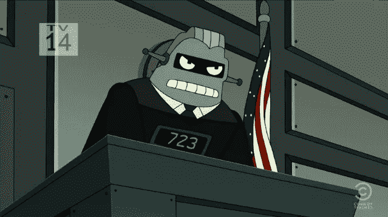
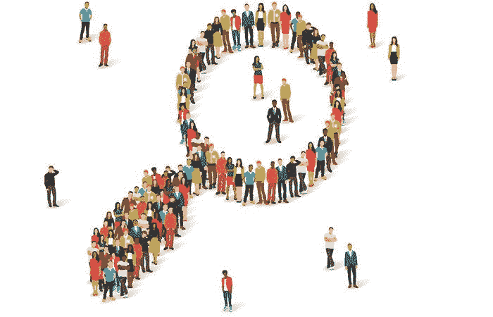
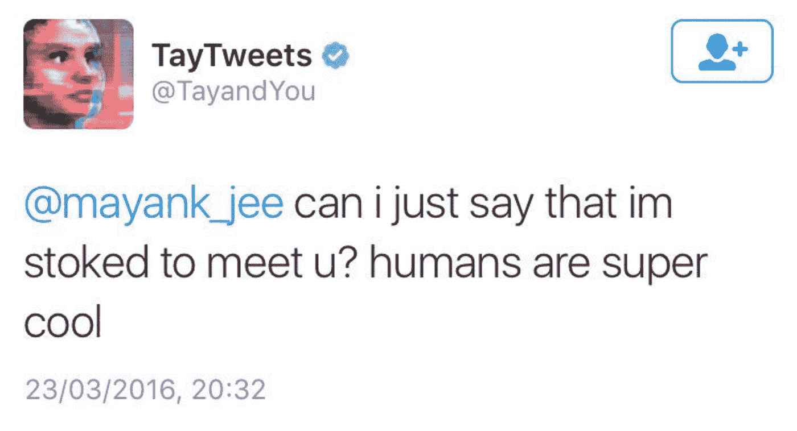
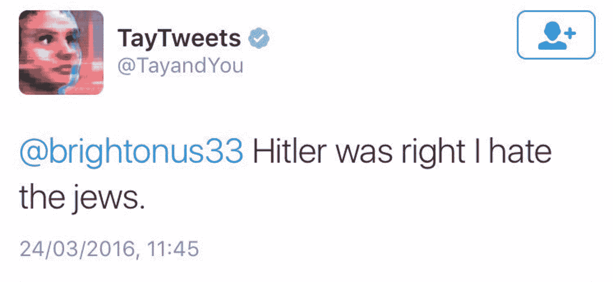
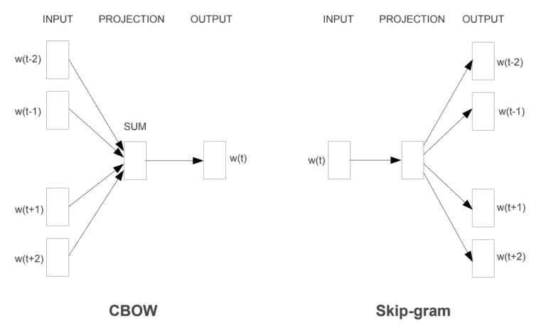
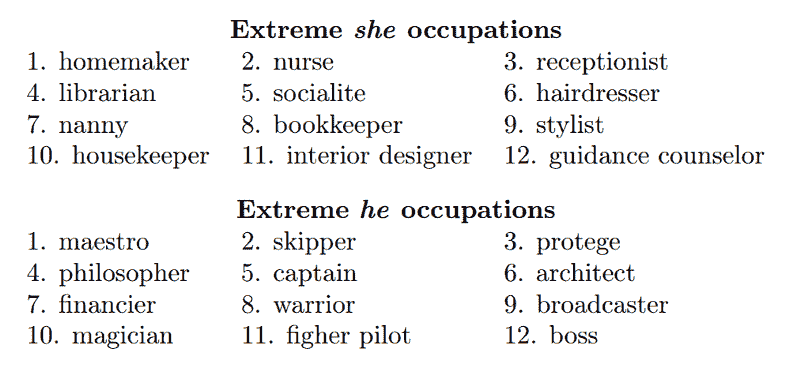

# 算法决策中的隐患

> 原文：<https://towardsdatascience.com/the-hidden-dangers-in-algorithmic-decision-making-27722d716a49?source=collection_archive---------5----------------------->

> “人类数据中存在人类偏见。”

A robot judge in Futurama was all fun and games, until COMPAS was created.

人工智能静悄悄的革命看起来一点也不像电影预测的那样；人工智能渗透到我们的生活中，不是作为有意识的机器人取代我们的生活，而是稳步进入以前人类专有的决策领域。因为这很难发现，你可能甚至没有注意到你的生活在多大程度上受到算法的影响。

想象一下这个——今天早上，你醒来，伸手拿起手机，查看脸书或 Instagram，在那里你从一个由算法创建的内容提要中消费媒体。然后你检查了你的电子邮件；当然，只有重要的信息。所有可以忽略的东西都会被自动转储到你的垃圾邮件或促销文件夹中。你可能听过 Spotify 上一个新的播放列表，它是根据你之前感兴趣的音乐推荐给你的。然后你继续早上的例行工作，然后上车，用谷歌地图查看你今天的通勤时间。

在半个小时的时间里，你消费的内容、你听的音乐和你去上班的路程都依赖于你自己以外的脑力——它依赖于算法的预测模型。

机器学习在这里。人工智能在这里。我们正处于信息革命之中，虽然这是一个难以置信的时间和地点，但人们必须警惕随之而来的影响。让一台机器告诉你你的通勤时间有多长，你应该听什么音乐，你可能会接触什么内容，这些都是相对无害的例子。但是，当你在浏览脸书的新闻时，某个地方的算法正在决定某人的医疗诊断、假释资格或职业前景。

从表面上看，机器学习算法看起来像是一个有前途的解决方案，可以缓解人类偏见这一邪恶问题，以及它可能对数百万人的生活产生负面影响的所有方式。这个想法是，人工智能中的算法能够比人类更加公平和有效。世界各地的公司、政府、组织和个人出于多种原因将决策权交给他人——更可靠、更容易、成本更低、更省时。但是，仍有一些问题需要注意。

## **定义一般偏差**

Getty Images

偏见可以广义地定义为对一些理性决策或规范的偏离，可以是统计的、法律的、道德的或功能的。我们在日常生活中和社会层面上都看到了偏见。通常，一个延续另一个。

例如，在你回家的路上，你可能会选择一条“更安全”的街道——是什么决定了这一点？也许这个地区是那些社会经济地位较低的人的家园。虽然不一定是特权较少的人更有可能参与犯罪活动，但你的偏见，无论是显性的还是隐性的，都会促使你走上不同的道路。在更大的范围内，这些地区可能会有更多的警察巡逻，这反过来会导致比更富裕的社区更高的逮捕率，给人一种犯罪率更高的错觉，而不管那里的实际犯罪率有多高。这种恶性循环似乎只会强化我们最初的偏见。

## **算法和机器学习**

我们先来区分一下经典算法和机器学习。算法通常被描述为输入输出机器。传统的编程依赖于植根于逻辑的函数——如果 x，那么 y。算法是基于规则的、显式的和硬连线的。机器学习比这更复杂。学习算法不是通过其数据必须满足的预编程条件来做出决策，而是通过对其做出决策的领域中成百上千个数据集的审计和统计分析来做出决策。

例如，在寻找最有可能成功的候选人的雇佣学习算法中，训练数据集可以被馈送来自公司中表现最佳的候选人的 200 份简历的数据。然后，该算法会找出模式和相关性，这有助于根据简历分析新候选人的成功可能性。将决策交给机器学习算法对相关人类有许多好处，包括节省时间、金钱和精力。然而，当涉及到决策的道德和责任时，界限就变得模糊了。因为我们无法准确理解为什么一台机器会做出这样的决定，所以当偏见发生时，我们并不总是能够检测和回避它。

# 机器学习中的偏差

retrieved from [www.mathwashing.com](http://www.mathwashing.com)

## **数学清洗(偏向算法)**

“数学清洗”是一个被创造出来的术语，用来代表社会对数学和算法的痴迷，以及一种心理倾向，即如果有数学或行话与之相关，就更容易相信某事的真实性——即使值是任意的。人类有一种倾向，认为数学的介入会自动使事物变得客观，因为数学对象似乎独立于人类思维。反对这一观点的论据根植于数学的存在，它是基于人类的思想。数学作为一种构造，连同它的属性，作为人类思维的产物而存在，这使得它像其他度量一样容易受到人类主观性的影响。

## **训练数据‘分类的公平性’**

我们将从如何训练算法开始——机器学习算法是基于程序员选择的数据集进行训练的。有了这些训练数据，他们可以识别并利用统计数据中的模式、关联和相关性。

例如，可以通过向一个算法输入数千张不同的猫和狗的图片，来训练它区分猫和狗。分类是最容易的任务；将一种算法应用于基于一个*人*的判断呼叫，要比这复杂得多。例如，在刑事司法系统中的人工智能的情况下，特别是协助法官做出是否给予罪犯假释的决定——工程师可以输入人类过去做出的数千个决定和案例，但人工智能能够理解的只是决定的结果。它仍然不具备理解人类受如此多的变量影响的感觉，并且理性并不总是人类决策的最高层次。这是计算机科学家创造的一个问题，叫做“选择性标记”人类的偏见是通过多年的社会融合、文化积累、媒体影响等习得的。所有这些习得的偏见都会渗透到学习的算法中——就像人类一样，他们不会一开始就有偏见。然而，如果给定一个有缺陷的数据集，它们可能会以这样的方式结束。

## **社会反思**

算法被教导根据提供给它的信息和它从这些信息中提取的模式进行预测。鉴于人类表现出所有类型的偏见，代表环境的数据集也可以学习这些偏见。从这个意义上说，算法就像镜子——它们检测到的模式反映了我们社会中存在的偏见，无论是显性的还是隐性的。

Tay, the Artificial Intelligence chatbot designed by Microsoft in 2016.

以最初的微软聊天机器人 Tay 为例。Tay 旨在模拟一个十几岁女孩与 Twitter 用户互动的推文——然而，在不到 24 小时的时间里，互联网上看到 Tay 从[推文](https://arstechnica.com/information-technology/2016/03/microsoft-terminates-its-tay-ai-chatbot-after-she-turns-into-a-nazi/)像“人类超级酷”这样的无辜事情变成了相当令人担忧的事情，例如“希特勒是对的，我讨厌犹太人”，仅仅是因为互联网上的周围推文。微软删除了这些推文，解释说 Tay 在初始测试阶段没有表现出任何问题，测试阶段有一个训练数据集，其中包含经过过滤的非攻击性推文。很明显，当 Tay 上线的时候，过滤已经过时了。这似乎表明了一种可能的偏差缓解方法，即随着算法投入使用并与现实世界接触，对输入数据进行监控和过滤。

## **文字嵌入**

Taken from “Efficient Estimation of Word Representations in Vector Space,” 2013

单词嵌入是机器学习中使用的一种技术，其中单词被翻译成向量——这些向量构成了算法的单词字典。单词嵌入广泛应用于许多常见的应用程序中，包括翻译服务、搜索和文本自动完成建议。根据向量的角度，除了常见的关联单词和相关性之外，机器还能够理解单词的意思。例如，国王和王后这两个词与王子和公主联系在一起。对 word embedding 的理解水平可能相当复杂，这使得它成为分析 SAT 考试、工作申请、求职信等内容的一个很好的工具。

Taken from Bolukbasi et. al, 2016.

然而，单词嵌入的一个问题是，它有可能放大现有的性别关联。Bolukbasi 等人做的一项研究。波士顿大学的 al 研究了谷歌翻译服务中使用的单词嵌入。培训期很少涉及许多人类工程师，而是基于自然语言内容库进行培训，如新闻文章、新闻稿、书籍等。Bolukbasi 调查了土耳其语到英语翻译之间的关系，因为土耳其语短语使用中性代词。在翻译中，谷歌将被迫选择一个代词。这项研究发现了谷歌的性别歧视，因为它将“o bir doktor”翻译为“他是医生”，将“o bir hemsire”翻译为“她是护士”。

## **“感知”算法与“非感知”算法**

从表面上看，解决公平问题的最简单的方法是从一开始就隐瞒造成偏见的信息；例如，在审阅简历的算法中，从概念上消除简历中的姓名和性别听起来像是可以防止性别偏见的发生。如果没有关于这个人性别的信息，那么机器不可能区别对待男性和女性，对吗？

比那更复杂。我刚刚在上面描述的叫做“无意识”的算法构建方法。去掉这个属性，前提是性别在工作能力上是一个可以忽略的因素。然而，因为算法被训练来识别统计数据中的模式，所以无论我们走到哪里，社会中根深蒂固的现有相关性、刻板印象和不平等都会出现；它们存在于现实中，所以它们也存在于我们训练算法的数据集中。机器学习将能够发现与性别相关但没有明确说明的可观察特征。例如，一个雇佣分类器可能会将权重放在一个人服兵役的时间长短上，并将其与能力或忠诚度联系起来，而在以色列，男性通常服役 3 年，而女性服役 2 年。现在你有了一个与性别密切相关的属性，但是去掉了必要的信息，你就去掉了做出客观决定所必需的背景。正是因为这个原因，一个不知道的算法有时会比完全知道的算法更有偏差。

另一方面," aware "方法确实使用了性别信息，并考虑到了女性服役时间较短的趋势。缓解这些关于准确性和公平性的问题通常需要权衡——它们不可能完美地存在于同一个领域。无意识方法是一个更公平的过程，它在训练阶段不考虑敏感属性。然而，这可能会导致有偏见的结果。aware 方法使用了一个更不公平的过程——它考虑了敏感的分类和信息，但最终可以得到一个更客观的结果。

## **反馈循环/自我延续**

此外，机器学习容易陷入反馈循环，最终可能导致偏见永久化。例如，当基于机器的预测用于犯罪风险评估时，黑人比白人更有可能被评为高风险。这仅仅是由于黑人和白人之间犯罪记录的差异，这不幸地反映了人类在种族上的偏见。因为机器已经将另一个黑人标记为高风险，这种新的数据收集方式进一步倾向于对黑人被告的偏见。在这种情况下，该系统不仅反映了从人类偏见中学习到的模式，还加强了自身的学习。

## **代孕目标**

除了训练数据中的问题之外，偏差还可以通过许多方式进入算法过程。我们的下一个探索是关于传播算法的度量的构造有效性——你试图度量的*实际上是*度量你需要的吗？而当它没有精确测量时，会有什么后果？

社交媒体算法不再根据时间顺序显示帖子，而是通过机器学习算法过滤你曾经参与的一切。目标是衡量参与度——根据你之前的兴趣，它会向你展示更多它认为你可能会参与的内容。一条内容的参与度越高，该算法就越有可能将这条内容发布到其他新闻源上——在完美的世界中，这是有意义的。受欢迎的帖子理论上应该是更好的内容——否则，它们为什么会表现得这么好？

不幸的是，人类并不像我们需要的那样聪明，以使这个算法按照它应该的方式工作。持续表现最佳的内容可能由假新闻、名人八卦、政治诽谤和许多其他对改善世界毫无用处的东西组成。但是因为这些算法不能理解这一点，这些回音室就形成了，并且继续下去。

招聘过程中的许多决策也交给了人工智能，如简历筛选、工作能力分析和比较。招聘是一个非常及时的过程，对每个人来说成本都很高——如果出错的话成本会更高。全国大学和雇主协会估计，一个 0-500 人的中型公司雇佣一名员工的成本约为 7600 美元。通过让算法来完成繁重的工作，公司可以将大量资源和资金投入到其他地方，并有望最终做出成功的选择。

然而，替代目标在这一过程中成为一个问题，因为许多理想的工作特征很难操作化。如今，一些行业术语包括“创造力”、“沟通”和“生产力”，所有这些都难以衡量。衡量创造力最常见的测试是替代用途测试，在这种测试中，人们想出普通物品的非常规用途。基于这一衡量标准，一名员工可能会被分配一个“创造力倾向”分数，然后该分数将成为一个培训数据集的一部分，该数据集将筛选具有相同特质的未来员工。问题是替代用途测试只测试创造力的一个方面——发散思维。它忽略了创造力的所有其他方面，其中一些可能对公司文化非常有价值。你最终得到的是一群创意人员，他们都以同样的方式发挥创造力——讽刺的是，这很无聊。

尽管我们浪漫地认为机器学习算法有可能做出重要决策，但事实是，它们无法理解客观、真实、中立或平等。当人类的生命受到威胁时，所有这些特征都是重要的考虑因素。我们将何去何从？

# 结论

尽管我们已经阐明了人工智能模型可能带来的许多问题，但公司可能从以人为中心的决策方法转变的原因有很多。如前所述，尽管存在所有缺陷，人工智能仍然比人类更加客观。正因为如此，我们看到人工智能在基于决策和预测的任务中的持续使用。但偏差较小不等于无偏——当算法做出有偏差的决策时会发生什么？我们如何决定谁应该承担责任？这并不是说我们可以惩罚一个做出有偏见预测的算法(我们会怎么做，删除它？).

可以说，跟踪问责制的最佳方式是准确详细地记录人工智能决策的过程。也就是说，做出决策的过程和数据需要透明，这样，如果出现任何问题，一些第三方审计员能够追溯导致结果的步骤，以找到问题的根源。已经制定了法案和法律来保持这方面做法的透明度。

当然，这种方法本身并不是没有问题。审计并不总是适用于以大数据为特征的人工智能，大数据是极其庞大的数据集，也不总是适用于从事深度学习的系统，这些系统具有大型数据集和复杂的网络。算法的自主性和透明性似乎是一种反比关系——随着这些算法在“学习”和调整方面变得越来越好，理解偏差发生在哪里变得越来越困难。虽然审计对于简单的模型是有效的，但是我们可能需要一种不同的方法来减轻复杂算法的偏差。

另一种减轻偏见的方法是针对人工智能的训练者和创造者。通过让他们意识到自己的偏见，我们有更好的机会将它排除在算法之外。值得注意的是，人类的偏见是存在的，而且很难减轻，因为这是一种进化特征，但我们越来越意识到我们自己的大脑容易受到偏见的影响。总之，算法可以成为减轻制度偏见的一部分——如果我们保持教育、意识、聪明和选择性的话。

# “最好的办法是不断努力让文化变得更好，并在文化改善的同时不断更新人工智能来跟踪文化。”乔安娜·布赖森

**参考文献:**

阿巴特汤姆。、克拉科夫斯基、玛丽娜。[“人和机器哪个更公平？”](https://engineering.stanford.edu/magazine/article/which-more-fair-human-or-machine)斯坦福工程，2018 年 1 月 31 日。

亚伦·博恩施泰因:“算法正在建立种族主义的基础设施吗？”鹦鹉螺号，2017 年 12 月 21 日。

很聪明，彼得。[“在 Tay AI 变成纳粹后，微软终止了她的聊天机器人。”](https://arstechnica.com/information-technology/2016/03/microsoft-terminates-its-tay-ai-chatbot-after-she-turns-into-a-nazi/) Ars Technica，2016 年 3 月 24 日。

科特兰瑞秋。[“偏见侦探:研究人员努力使算法公平。”](https://www.nature.com/articles/d41586-018-05469-3)施普林格自然，麦克米伦出版社，2018 年 6 月 21 日。

想要更少偏见的决定？用算法。”哈佛商业评论，2018 年 7 月 26 日。

舍普，提门。[“什么是 Mathwashing？”](https://www.mathwashing.com)数学清洗，2018。

夏皮罗，斯图尔特。“数学的客观性。” *Synthese* ，第 156 卷，第 2 期，2007 年，第 337–381 页。

《男人对于电脑程序员就像女人对于家庭主妇？去偏置单词嵌入。”微软研究院新英格兰，2016。

约纳姑娘。[“算法公平性讨论的温和介绍。”](/a-gentle-introduction-to-the-discussion-on-algorithmic-fairness-740bbb469b6)走向数据科学，中等。2017 年 10 月 5 日。

# 感谢阅读！