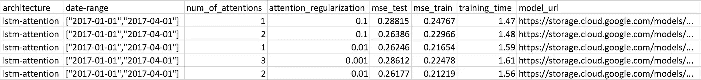
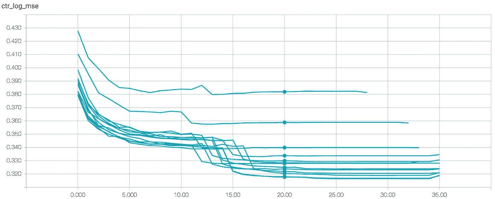

# 超参数调谐指南

> 原文：<https://towardsdatascience.com/the-hitchhikers-guide-to-hyperparameter-tuning-cd0122042595?source=collection_archive---------5----------------------->


自从我们的第一个深度学习项目出现以来，一年多已经过去了，我们必须继续前进，尽我们所能提供最好的模型。

这样做需要大量的研究，尝试不同的模式，从简单的[袋](https://en.wikipedia.org/wiki/Bag-of-words_model)、 [LSTM](http://colah.github.io/posts/2015-08-Understanding-LSTMs/) 和 [CNN](https://en.wikipedia.org/wiki/Convolutional_neural_network) ，到更高级的[注意力](https://distill.pub/2016/augmented-rnns/)、 [MDN](http://publications.aston.ac.uk/373/1/NCRG_94_004.pdf) 和[多任务学习](http://ruder.io/multi-task/index.html)。

即使我们尝试的最简单的模型也有许多超参数，就模型的准确性而言，调整这些参数可能比我们最终使用的实际架构更重要。

尽管在超参数调整领域有很多活跃的研究(见 [1](https://arxiv.org/pdf/1607.08316.pdf) 、 [2](https://arxiv.org/pdf/1705.08520.pdf) 、 [3](https://arxiv.org/pdf/1703.01785.pdf) )，但实现这一调整过程却一直没有引起人们的注意。

如果你四处去问人们他们是如何调优他们的模型的，他们最有可能的回答将是“只要写一个脚本来帮你调优就行了”。嗯，说起来容易做起来难…

显然，在实现这样一个脚本时，您应该记住一些事情。

这里，在 Taboola，我们实现了一个超参数调优脚本。让我与你分享我们一路走来学到的东西…

# 让我们从简单的开始

有时使用 scikit-learn 进行超参数调优可能就足够了——至少对于个人项目是如此。

对于长期项目，当您需要跟踪您已经执行的实验，并且您尝试的不同架构的种类不断增加时，这可能是不够的。

# 梗概

脚本的第一个版本很简单，但是包含了我们的大部分需求。

这些要求是:

## 易于运行

您将多次运行这个脚本。因此，应该尽可能容易地指定要运行的实验。我们最终得到了下面的 JSON 格式:

```
{ "architecture": "lstm-attention", "date-range": [["2017–01–01", "2017–04–01"]], "parameters": { "num_of_attentions": [1, 2, 3], "attention_hidden_layer_size": [32, 128, 256], "attention_regularization": [0.1, 0.01, 0.001] }}
```

*   **架构**:假设您的代码支持多种类型，您想要调优的架构
*   **日期范围**:元组列表，每个元组定义将用于训练模型的数据的时间范围。每个实验将在每个日期范围内执行一次
*   **参数**:每个超参数的尝试值。我们最初的实现只支持有限的一组值(网格搜索)

该脚本从这个 JSON 中随机生成实验。

我们创建了一个 Jenkins 作业，它在我们的一台配有 GPU 的机器上运行脚本，从而使我们不再需要使用 SSH。

## 用指标丰富实验

我们的培训流程会生成许多指标，如 MSE、损失和培训时间。你可以选择你想要的，它们会显示在结果中。

## 将结果保存到云中



结果以 CSV 文件的形式保存在 Google 云存储中，这使我们能够从任何机器上启动脚本，并从我们的笔记本电脑上观看结果。

结果是不断上传的，所以我们不必等到所有的实验完成后才开始检查结果。

模型本身也被保存。

# 那么到目前为止我们学到了什么？

这第一个实现是最重要的一个。

简单来说，脚本没有为您做任何聪明的事情。它不知道要执行哪些实验——每次运行都必须手动定义 JSON 输入。

在多次运行脚本后，您开始理解哪些值比其他值更有效。这是我们从剧本中得到的最重要的东西之一——对我们的模型有了更深入的理解。

第一次使用这个脚本给我们带来了很大的改进 MSE 提高了 10%以上。

# 我们确定这是真的吗？

当你运行数百个实验时，最好的实验通常只有微不足道的差异。你怎么知道它有统计学意义？

假设你有足够的数据，解决这个问题的一个方法是在几个日期范围内训练同一个模型。如果一个模型在所有的日期范围内都比其他的好，你可以更有信心它是真实的。

假设今天是六月，你运行脚本。以下是脚本将选择的日期范围:


请注意，如果您在不同的月份运行该脚本，它会选择一组新的日期范围。这一点很重要，因为否则你可能会因为大量的超参数调整而意外地使你的模型过拟合。

# 我没时间做这个

谁有时间将每个实验运行三次？你可以得到可靠的结果，这很好，但这意味着你最终将运行更少的不同实验。

该脚本的下一版本通过支持新的操作模式解决了这个问题:

*   仅使用一个日期范围
*   日期范围仅包含一个月的数据
*   训练仅限于较少的时期

但是，如果我们使用更多的数据和时期，这些结果与我们会得到的结果相关吗？

为了回答这个问题，我们进行了一些实验，每个实验都使用了从一周到三个月不等的不同数量的数据。我们发现一个月在 MSE 和训练时间之间有一个很好的权衡。

(您是否注意到我们使用了超参数调整脚本来调整超参数脚本？多酷啊。)

为了研究什么是正确的历元数，我们分析了 TensorBoard 上的 MSE。



图中的每一个图都代表一个根据不同数量的数据训练的不同模型。经过 20 个时期后，所有的模型几乎都收敛了，所以就此打住是安全的。

# 来吧脚本，为我做的工作！

此时，我们决定脚本应该为您选择超参数值。
我们从学习率相关的超参数开始:初始学习率、衰减因子、早期停止无改善的时期数等。

为什么是学习率？

*   它显著影响训练时间。我们应该首先确定一个好的学习率，包括准确性和训练时间，然后再调整其他的
*   [有人建议](https://books.google.co.il/books?id=Np9SDQAAQBAJ&pg=PA417&dq=%22The+learning+rate+is+perhaps+the+most+important+hyperparameter.+If+you+have+time+to+tune+only+one+hyperparameter,+tune+the+learning+rate%22&hl=en&sa=X&ved=0ahUKEwj-kdXZn8bWAhWEbRQKHeAbAiMQ6AEIJDAA#v=onepage&q=%22The%20learning%20rate%20is%20perhaps%20the%20most%20important%20hyperparameter.%20If%20you%20have%20time%20to%20tune%20only%20one%20hyperparameter%2C%20tune%20the%20learning%20rate%22&f=false)它以一种比其他超参数更复杂的方式控制模型的有效容量，因此最好从这一点开始。

脚本的新模式使用对我们的模型合理的硬编码值范围。

然后是下一个要求:


下一个版本的脚本就是这么做的:提供一个架构名称，它会自动为您生成实验。您不需要指定任何超参数值。

# 让我们随机选择

尽管在[的某些情况下](http://www.jmlr.org/papers/volume13/bergstra12a/bergstra12a.pdf)比随机搜索差，但是网格搜索更容易分析:每个值都被多次实验使用，所以很容易发现趋势。

既然我们已经对什么值更有效有了直觉，是时候实施随机搜索了。这样做有助于脚本找到更好的超参数。

# 一些最后的想法

在任何机器学习项目的研究阶段，超参数调优都可以手动完成。然而，当您想要将项目提升到下一个级别时，自动化过程是非常有效的。在这篇文章中，我描述了我们在自动化过程中实现的一些小细节。有些可能对你有用，有些可能没用。如果你发现其他令人兴奋的事情对你有帮助，请在评论中留言。

*最初由我在* [*Taboola 工程博客*](https://engineering.taboola.com/hitchhikers-guide-hyperparameter-tuning/) *发表。*