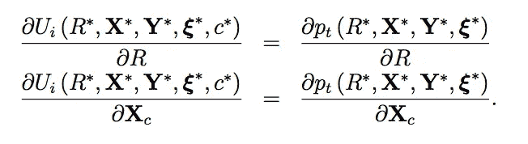
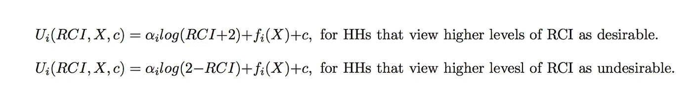
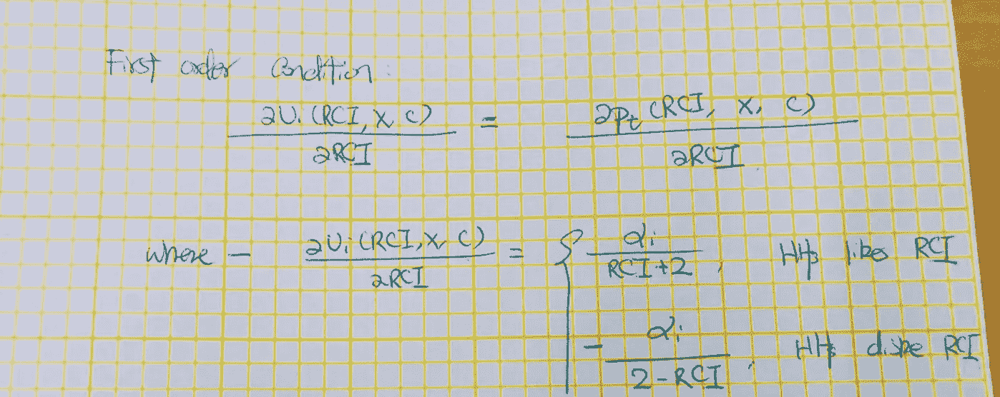
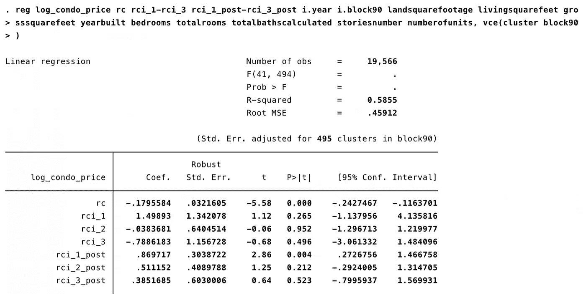
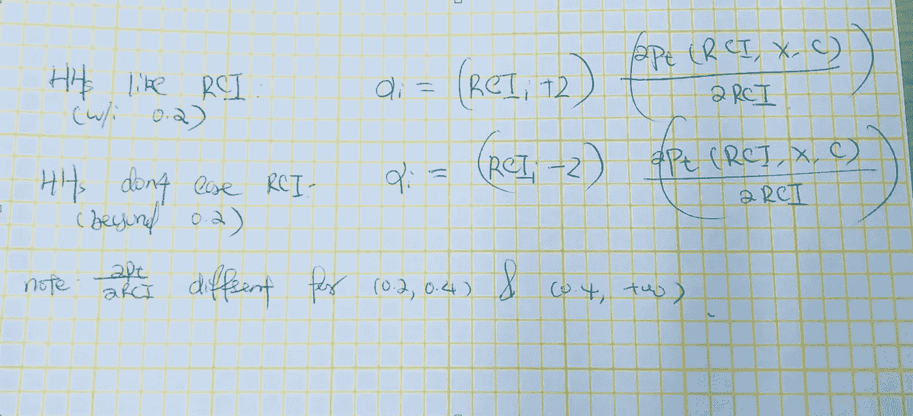
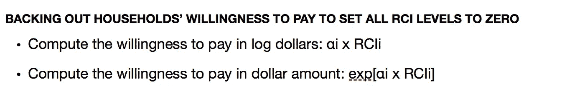
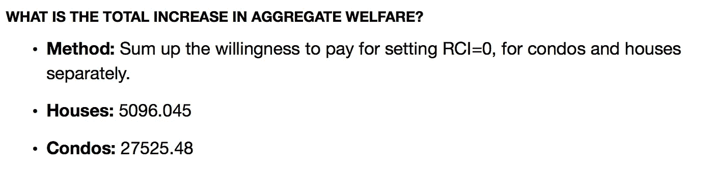
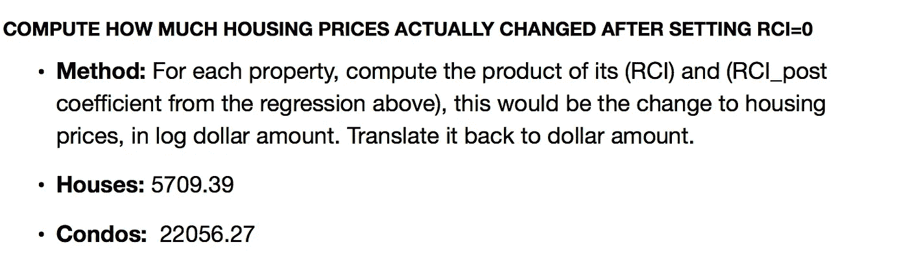

# 因果推理的圣杯

> 原文：<https://towardsdatascience.com/the-holy-grail-of-econometrics-3a45a2295ce5?source=collection_archive---------6----------------------->

什么是结构估计？

# 介绍

结构估计，应用计量经济学的圣杯，这两个词让最勇敢的灵魂感到恐惧。作为一名博士生搞定它，你就走上了通往顶级终身教授职位的道路。

那么神奇的是什么呢？具体来说，它如何胜过通常的因果推断技术，如 A/B 检验、匹配、差异中的差异、工具变量、回归不连续性、固定/随机效应估计等。？

> 简而言之，答案是外部有效性。

Or pure magic! Source: Walt Disney Giphy

## (尤指为开车者设计的) 公路交通图

在这篇文章中，我将告诉你所有关于结构估计的内容。这部分的讨论是基于 Hamish Low 和 Costas Meghir 在计量经济学中对结构模型的使用。

然后，我将使用丽贝卡·戴蒙德和蒂莫西·麦奎德的 NBER 工作论文来说明结构估计的力量: [*谁想要他们后院的经济适用房*](http://www.nber.org/papers/w22204.pdf) *？*

> 您将看到丽贝卡和蒂莫西如何能够仅使用租金控制时代的数据，完美地预测剑桥解除租金控制后的房价上涨。纯魔法！

这两篇论文加起来有 91 页。我会把它们改写成轻松的 7 分钟读物给你。

# 什么是结构估计？

形式上，

> 完全指定的结构模型对经济参与者的目标及其经济环境和信息集做出明确的假设，并指定在模型中做出哪些选择。我们称这些模型为完全指定的，因为它们允许作为当前信息集的函数的个体优化问题的完整解决方案。

这是一个很大的难题。让我们来看一个例子。

# 谁想要自己后院的经济适用房？

## 经济行为者的目标

在这篇论文中，人们在他们的预算内选择最好的地方。形式上，代理人 I 根据他的预算 y 最大化他的效用 U:

其中:

*   U()是代理人 I 的效用函数。函数形式将在以后详细说明；
*   **y 是代理人 I 的收入**；
*   **代理 I 正在做出的选择:**他可以选择在消费品(c)、房屋(y-c)、房屋类型和邻近地区(X，Y，xi)上花费多少，以及离最近的低收入住房项目(R)的远近。
*   **经济环境**由消费者价格(p)、代理商收入(y)和可用住房存量决定。
*   **信息集:**代理人 I 观察每栋房子(X，Y，xi)的住房和邻里特征；有些是计量经济学家观察到的(X，Y)，有些则不是(xi)

## 个体最优解

代理 I 的最优解由一组一阶条件表征:

这组一阶条件将代理人 I 的某些住房特征的边际效用(R，X)等同于他为这些特征支付的边际意愿(R，X)。

# 如何估计结构模型？

此时，估计结构模型似乎是不可能的。毕竟，跟踪所有模型参数已经够难的了！

Estimate what?! Source: Giphy

过去几代计量经济学家正是这么做的——估计所有模型参数，而现代经济学家采取了一种更简化的方法。我们只估计模型的充分统计量。

## **1。我们再来看看一阶条件的集合:**

## **2。让我们假设效用函数采用以下形式:**

其中:

*   RCI 是租金控制强度；
*   HH 代表家庭。

我们如何知道我们的效用函数假设是否有意义？只有数据能告诉我们，我们很快就会讲到。

## **3。重写左侧的第一个订单条件:**

## **4。使用数据估计一阶条件的右侧:**

## **5。让我们对每个家庭的效用函数参数 alpha 进行回溯:**

## 6.该模型预测，剑桥取消租金控制后，房价将上涨这么多:

## 7.根据数据，房价上涨了这么多:

## **8。注意这两组数字是多么的相似！**

外部有效性，我的朋友:)

Source: Giphy

# 结构评估的力量

## 外部效度

在上面的例子中，丽贝卡和蒂莫西几乎完美地预测了剑桥解除房租管制后的房价上涨。使用传统方法很难做到这一点。例如，很难使用任何匹配方法来预测房价，因为租金控制单元与其他单元确实不同。

## 与自然实验的协同作用

诚然，结构模型确实很复杂，涉及许多假设。为了验证该模式，我们通常将它与自然实验配对，以显示我们的模型产生类似的预测。

## **反事实**

**那么为什么不能单纯依靠自然实验呢？**

好吧，回想一下，自然实验只得到一个点估计。它告诉我们，在一个非常特定的设定下，治疗效果的大小是多少。

> 但是假设我们想在一套完全不同的环境下获得治疗效果呢？简单地从一个环境中提取结果，然后不加区别地应用于其他环境，这将是错误的。

我们能做的最好的事情，就是用我们的结构模型来模拟结果。例如，如果我们在富裕社区建设低收入项目，商品房价格会发生什么变化？我们无法回答这个问题，因为大多数现有项目都建在离富人区很远很远的地方。

# 结构评估的成本:复杂性

结构估计的黑暗面是其纯粹的复杂性。你需要了解你的系统的来龙去脉，并用简洁的数学描述它。**没有固定的食谱可以遵循，也没有简单的函数调用——你美丽的头脑会从头开始设计。这就是为什么结构评估如此困难，但却是值得的。**

是否值得取决于你自己的需求:

*   如果你只对在非常稳定的环境中生成预测感兴趣，那么传统的机器学习工具会更合适。
*   但是如果你对在完全不同的环境下获得治疗效果感兴趣，那么结构估计可能正是你所需要的。

## 附:你可能喜欢的文章

如果你对因果推理很感兴趣，这里有几篇我写的文章:

*   [眼球数据科学的危险](/the-lazy-jobless-reality-or-myth-b3adfdc23ffa)
*   [因果推断 101:差异中的差异](/causal-inference-101-difference-in-differences-1fbbb0f55e85)