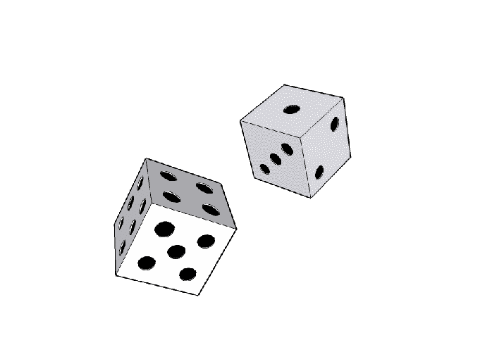
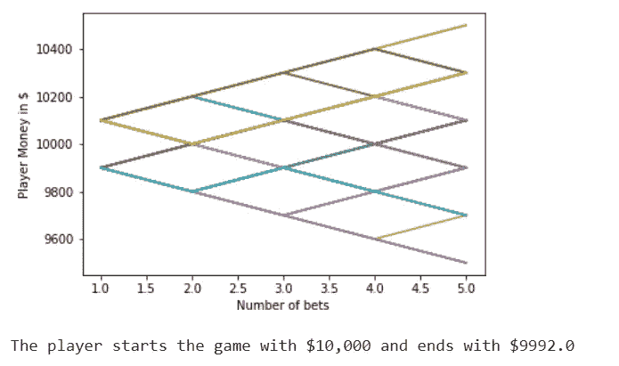
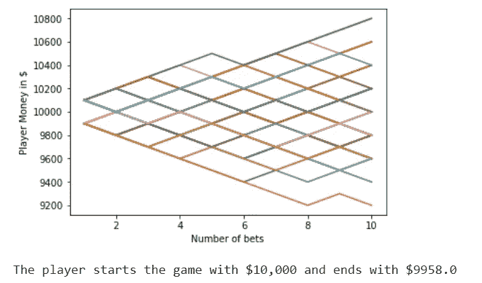
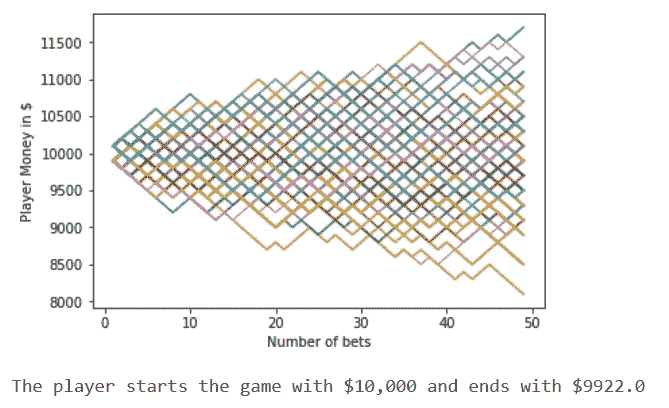
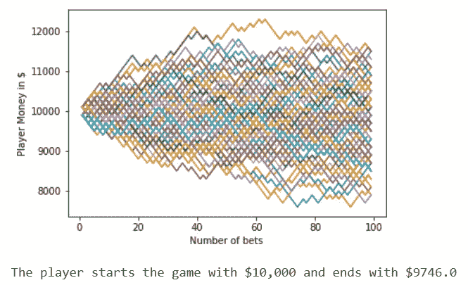
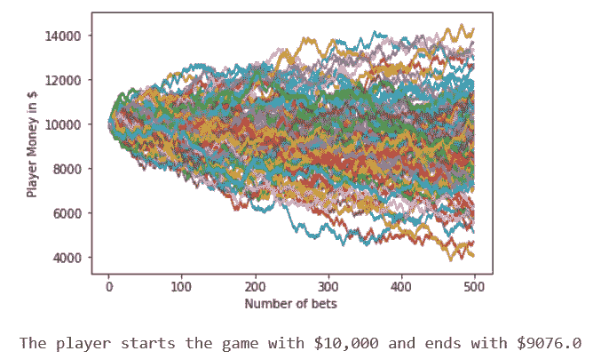
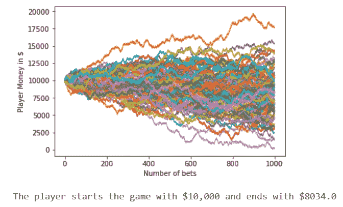

# 赌场总是赢家:蒙特卡洛模拟

> 原文：<https://towardsdatascience.com/the-house-always-wins-monte-carlo-simulation-eb82787da2a3?source=collection_archive---------0----------------------->

赌场是怎么挣钱的？诀窍很简单——你玩的时间足够长，输钱的概率就会增加。让我们用一个简单的蒙特卡罗模拟来看看这是如何工作的。

> **蒙特卡洛模拟**是一种用于理解金融、项目管理、成本和其他预测模型中风险和不确定性影响的技术。蒙特卡洛模拟器有助于人们将大多数或所有的潜在结果可视化，从而对决策的风险有更好的了解。

考虑一个假想的游戏，其中我们的玩家“杰克”掷出一个假想的骰子，得到 1 比 100 的结果。如果杰克掷出 1-51 之间的任何数字，赌场赢，但是如果掷出的数字是 52-100，杰克赢。够简单吗？



在模拟结果之前，让我们计算一下房子的边缘。房子边缘显示了赌场在赢得赌注方面的优势。**这是赌场从玩家下注中获得的平均利润。**

让我们假设杰克在这个游戏中下注 1 美元。

杰克赢的概率= 49/100

赌场获胜的概率= 51/100

[玩家的预期](http://www.statisticshowto.com/probability-and-statistics/expected-value/)利润= 1 *(49/100)-1 *(51/100)=-0.02 =-2%

所以，**我们假想游戏中的房子边缘是 2%。**作为对比，欧洲轮盘最低的房子边缘是 2.7%。简而言之，我们在想象的游戏中比在轮盘赌中有更大的胜算。

现在，让我们在 Python 中模拟不同的场景，以可视化玩家持续下注时的不同结果。

**1。导入所需的库**

```
#Import libraries
import random
import matplotlib.pyplot as plt
```

**2。我们需要一个骰子模拟器，它能以均匀的概率分布抛出一个从 1 到 100 的值。让我们用 Python 创建一个函数，如果玩家赢了，它返回“真”,如果赌场赢了，它返回“假”。**

```
#Create function for simulating die roll 
#The die can take values from 1 to 100\. If the number is between 1 #and 51, the house wins. 
#If the number is between 52 and 100, the player wins.def rolldice():

    dice = random.randint(1,100)

    if dice <=51:
        return False
    elif dice >51 & dice <=100:
        return True
```

**3。创建一个模拟赌注的函数。我们需要为函数提供三个参数:**

I .总资金:玩家开始的资金(10，000 美元)

二。下注金额:玩家在每场游戏中下注的金额(100 美元)

三。总游戏次数:玩家玩游戏的次数(该值因创建不同的场景而异)

```
#Define a function for the play which takes 3 arguments :
#1\. total_funds = total money in hand the player is starting with
#2\. wager_amount = the betting amount each time the player plays
#3\. total_plays = the number of times the player bets on this gamedef play(total_funds, wager_amount, total_plays):

    #Create empty lists for :
    # 1.Play_number and 
    # 2.Funds available
    # 3.Final Fund
    Play_num = []
    Funds = []#Start with play number 1
    play = 1
#If number of plays is less than the max number of plays we have set
    while play < total_plays:
        #If we win
        if rolldice():
            #Add the money to our funds
            total_funds = total_funds + wager_amount
            #Append the play number
            Play_num.append(play)
            #Append the new fund amount
            Funds.append(total_funds)
        #If the house wins
        else:
            #Add the money to our funds
            total_funds = total_funds - wager_amount 
            #Append the play number
            Play_num.append(play)
            #Append the new fund amount
            Funds.append(total_funds)

        #Increase the play number by 1
        play = play + 1
            #Line plot of funds over time
    plt.plot(Play_num,Funds)
    Final_funds.append(Funds[-1])
    return(Final_funds)
```

**4。最后运行一个循环调用以上函数，模拟游戏多种场景。要对我们游戏的最终结果**[](http://blog.3dcs.com/dimensional-analysis-how-many-monte-carlo-simulations-should-i-run)****有信心，每个场景都会模拟 100 次。****

```
#Call the function to simulate the plays and calculate the remaining #funds of the player after all the bets
#Intialize the scenario number to 1
x=1
#Create a list for calculating final funds
Final_funds= []while x<=100:
    **ending_fund = play(10000,100,5)**
    x=x+1#Plot the line plot of "Account Value" vs "The number of plays"
plt.ylabel('Player Money in $')
plt.xlabel('Number of bets')
plt.show()#Print the money the player ends with
print("The player starts the game with $10,000 and ends with $" + str(sum(ending_fund)/len(ending_fund)))
```

****5。让我们用下面的图表来想象 7 种不同的场景。在每个场景中，杰克下注 n 次。****

**为了生成多个场景，使用上方的**代码块(#4)，但是只修改突出显示的代码(如下所示)来调整玩家下注的数量。****

```
ending_fund = play(10000,100,**5**)
```

**x 轴:杰克下注的次数**

**y 轴:每次下注后杰克的账户余额**

****每张图显示了杰克继续玩游戏时的账户余额。此外，为了找出 Jack 的期末余额，我们将对 100 个不同模拟的余额进行平均。****

> ****这个实验的目的是回答一个简单的问题——“如果一个人以 10，000 美元开始，玩这个游戏 n 次(每局下注 100 美元)，平均来说，玩家最后会有多少钱？”****

# ****场景 1 - >投注数量:5****

****

# ****场景 2 - >投注数量:10****

****

# ****场景 3 - >投注数量:50****

****

# ****场景 4 - >投注数量:100****

****

# ****场景 5 - >投注数量:500****

****

# **场景 6 ->投注数量:1000**

****

# ****场景 7 - >投注数量:10000****

****

**从模拟实验中，我们可以观察到，如果杰克下注较少，他就有更大的机会盈利(或最大限度地减少损失)。**

****还可以观察到，在每个场景中损失的金额大约是下注金额的 2%(与房子边缘相同)**。例如，在我们的最后一个场景中，杰克下了 10，000 次注，每次 100 美元。因此，我们预计杰克将损失大约(10，000)*(0.02*100)，相当于 20，000 美元。**

**此外，在最后一个场景中，当他玩 10，000 次时，资金变成了负数，即杰克比他开始时输掉了更多的钱(在现实生活中，这意味着杰克输掉了所有的钱)。**

**总之，**房子永远是赢家！****

**资源:**

**1.[https://pythonprogramming.net/monte-carlo-simulator-python/](https://pythonprogramming.net/monte-carlo-simulator-python/)**

**2.[http://math.info/Misc/House_Edge/](http://math.info/Misc/House_Edge/)**

**在 [**LinkedIn**](https://www.linkedin.com/in/rohan-joseph-b39a86aa/) 上连接。**

**请找到下面嵌入的 Python 笔记本:**