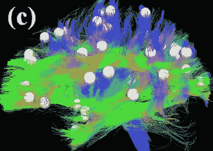
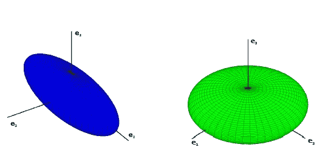
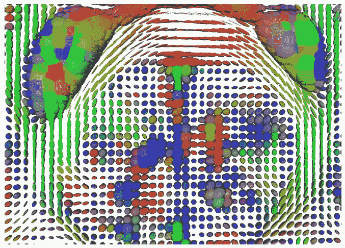
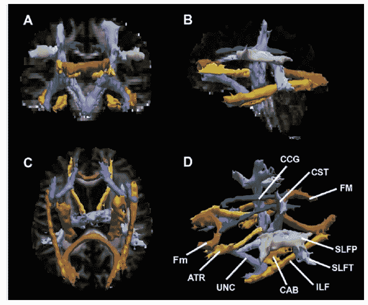
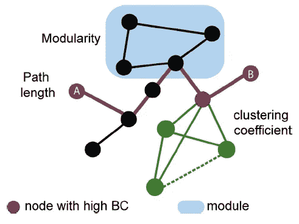

# 人类连接体和神经网络

> 原文：<https://towardsdatascience.com/the-human-connectome-and-anns-62c0b6c041d0?source=collection_archive---------9----------------------->

Photo by [Donald Giannatti](https://unsplash.com/photos/Wj1D-qiOseE?utm_source=unsplash&utm_medium=referral&utm_content=creditCopyText) on [Unsplash](https://unsplash.com/search/photos/neuro?utm_source=unsplash&utm_medium=referral&utm_content=creditCopyText)

最近，我有兴趣了解更多的成像模式，因为我可能很快就会进入这个研究领域。医学成像社区已经取得了许多进步——例如，在 [Kaggle](https://datasciencebowl.com/) 的合作和 [NIH 向公众发布图像](https://www.nih.gov/news-events/news-releases/nih-clinical-center-releases-dataset-32000-ct-images)。

很快，我们将看到机器学习社区在日常医疗保健环境中的影响越来越大(当然，也有自己的一系列挑战)。

鉴于这些进展，我想强调一下您可能会感兴趣的医疗保健成像领域的一个子集，以及更广泛的机器学习社区如何从该领域受益。

***连接体***

如果你还没有见过这样的例子，那就尽情享受这个非常酷的连接体吧。

**Fig. 1**: From this [paper](https://www.ncbi.nlm.nih.gov/pubmed/24123412)

这种成像技术让我们能够了解大脑的结构。

当你看整个东西的时候，你可以看到大脑的结构。这些看起来不同的纤维线是主**节点**之间的**边**，主**节点是白色的大圆圈。**

这些节点是大脑中感兴趣的区域或共同的界标。它们之间的连线将节点连接在一起。颜色代表不同程度的**连通性**。

连接体的构建方式实际上是通过观察大脑内水分子的扩散速率。通常，这种类型的测量在大脑中取一个大小为 X 的盒子，然后我们看一看分子如何在一段时间内在这个盒子中扩散。

然后，这个快照将由一个椭圆体概括，该椭圆体带有那个盒子的平均扩散方向。在下图中，你会发现不同的形状可以定义大脑一小块区域的平均扩散率。

**Fig. 2**: From this [paper](http://www.cs.sfu.ca/~hamarneh/ecopy/crc2015b.pdf)

当这些在整个大脑中聚集时，输出看起来像这样:

**Fig. 3**: From this [paper](http://www.cs.sfu.ca/~hamarneh/ecopy/crc2015b.pdf)

很酷，对吧？

不同的颜色可以代表大脑特定部分或节点之间的联系。椭圆体的不同方向使我们能够直观地理解扩散是如何在整个大脑中发生的。

您可以跟踪从图像左侧到图像中间再到右侧的轨迹。你可以交易左下角的小曲线。或者甚至在中间与大斑点的固定连接。

然后，它们进一步融合在一起，形成了扩散在大脑中所走的高速公路或共同道路。这些显示了大脑的整体结构。

**Fig. 4**: From this [paper](https://www.ncbi.nlm.nih.gov/pubmed/26255305)

这些可以被进一步分析，以给我们一些关于大脑如何随时间变化的科学见解，或者找出哪些联系对于特定的神经相关疾病(如帕金森病)是重要的。

我将在另一篇文章中更深入地探讨这个问题，但现在让我们先讨论机器学习。

***与神经网络的关系***

现在你对连接体的样子有了一个大致的概念，我们可以深入研究我在几篇论文中看到的一种分析。

如前所述，大脑中的主要节点通常被称为感兴趣区域(ROI)，这些是大脑中有许多连接的部分，可能充当正在传递的信息的公共*枢纽*。这些节点在下图中显示为圆圈。

主节点之间是边，或下图中的线。这些是信息所依赖的节点之间的连接。

如您所见，有多种方法可以描述节点和边的网络。本文使用了一些独特的术语，如模块化和聚类系数等。然而，让我们不要担心那个。

**Fig. 5**: From this [paper](https://www.sciencedirect.com/science/article/pii/S0306452218304718)

我想展示的是，有一些有趣的特征定义了这些 DTI 的大脑快照图像。比如我们拿紫色的节点来描述一下。

> 来自报纸:
> 
> 介数中心性(BC)表示特定节点对于网络通信的重要性，并且由网络中任何两个节点之间必须经过该特定节点的最短路径的数量来概念化。网络中的紫色节点具有很高的介数中心性，因为许多最短路径必须流经它。

这个概念非常容易理解，并且在确定特定的大脑是否退化时，可能会提供很多预测能力。这是定义网络结构和完整性的众多网络特征之一。

然而，如果我们看看神经网络的更广泛的背景，也许我们可以得出一些类比。

我的意思是——如果有不同的神经网络拓扑结构，我们可以用来预测患者患癌症的可能性，或者杂货店实现下个月销售目标的可能性。

这些拓扑结构由人工神经元组成，这些神经元之间可以有强连接和弱连接。除了使我们选择的损失函数最小化的权重之外，我们能想出更好地描述它们的方法吗？

这些对网络的描述会让我们更深入地了解网络中的特征是如何相互关联的吗？随着时间的推移，网络如何随着训练数据的增加或减少而变化？或者甚至允许我们在 3D 空间中可视化连接，以理解这些“**黑色**盒子”。

这个清单可以一直列下去。

也许这些想法已经存在了，我还没有碰到它们或者看到它们被有意义地使用。请在评论中告诉我。

感谢阅读。