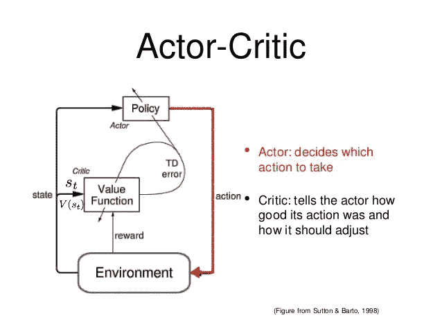
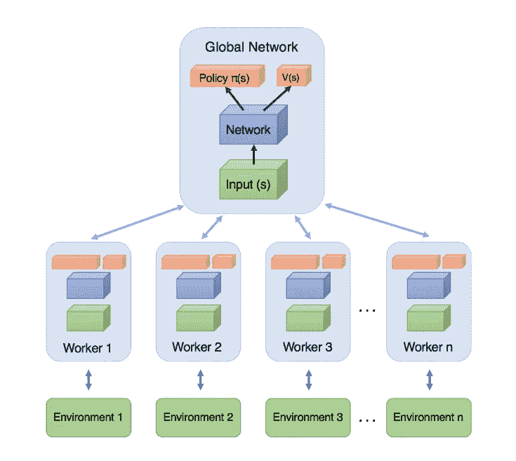
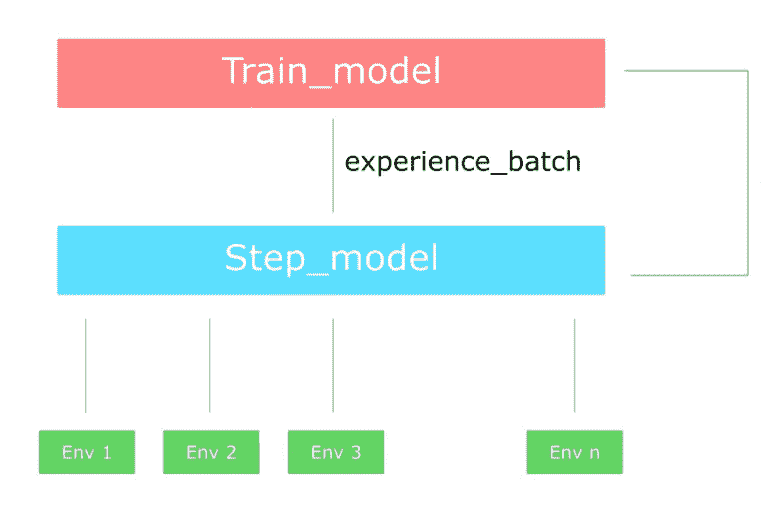

# 演员评论家背后的想法以及 A2C 和 A3C 如何改进他们

> 原文：<https://towardsdatascience.com/the-idea-behind-actor-critics-and-how-a2c-and-a3c-improve-them-6dd7dfd0acb8?source=collection_archive---------11----------------------->

是时候进行一些强化学习了。这一次我们的主要话题是行动者批评算法，它是几乎所有现代 RL 方法的基础，从最近策略优化到 A3C。因此，要理解所有这些新技术，你应该很好地理解什么是演员-评论家以及他们是如何工作的。

但是不要着急。让我们回顾一下以前的知识。您可能知道，有两种主要的 RL 方法:

*   基于值:他们试图找到或接近最优的**值**函数，它是一个动作和一个值之间的映射。值越高，动作越好。最著名的算法是 Q 学习和它的所有改进，如深度 Q 网络，双决斗 Q 网络等
*   基于策略:基于策略的算法，如 Policy Gradients 和 REINFORCE，试图直接找到最优策略，而不需要 Q 值作为中间人。

每种方法都有其优点。例如，基于策略的方法更适合连续和随机的环境，具有更快的收敛速度，而基于值的方法更有效和稳定。查看我以前关于强化学习的[帖子](https://sergioskar.github.io/Reinforcement_learning/)了解更多细节。

当这两个算法家族在科学界建立起来时，下一个明显的步骤是…试图将它们融合。这就是演员评论家的诞生。演员批评家的目标是利用基于价值和基于政策的所有好东西，同时消除它们所有的缺点。他们是怎么做到的？

主要思想是将模型一分为二:一个用于基于状态计算动作，另一个用于产生动作的 Q 值。

参与者将状态作为输入，输出最佳动作。它通过**学习最优策略**(基于策略)来控制代理的行为。另一方面，评论家**通过计算价值函数**(基于价值)来评估行动。这两个模型参与了一个游戏，随着时间的推移，他们都在各自的角色中变得更好。结果是，整体架构将比单独的两种方法更有效地学习玩游戏。

这种让两个模型相互交互(或竞争)的想法在最近几年的机器学习领域变得越来越流行。例如，考虑生成性对抗网络或可变自动编码器。

但是让我们回到强化学习。演员兼评论家的一个很好的类比是一个小男孩和他的母亲。孩子(演员)不断尝试新事物，探索周围的环境。他吃它自己的玩具，他摸热烤箱，他用头撞墙(我的意思是为什么不)。他的母亲(评论家)看着他，或者批评或者称赞他。这个孩子听他妈妈告诉他的话，并调整他的行为。随着孩子的成长，他学会了什么行为是好的或坏的，他基本上学会了玩一个叫做生活的游戏。这和演员兼评论家的工作方式完全一样。

执行器可以是一个函数逼近器，如神经网络，其任务是为给定状态产生最佳动作。当然，它可以是全连接神经网络或卷积网络或任何其他网络。批评家是另一个函数逼近器，它接收环境和行动者的动作作为输入，将它们连接起来并输出给定对的动作值(Q 值)。让我提醒你一下，Q 值本质上是未来的最大回报。

这两个网络的训练是分开进行的，它使用梯度上升(找到全局最大值而不是最小值)来更新它们的权重。久而久之，演员正在学习产生越来越好的行动(他开始学习政策)，而评论家在评估这些行动上越来越好。重要的是要注意，权重的更新发生在每一步(TD 学习)，而不是在事件结束时，与策略梯度相反。

事实证明，演员评论家能够学习大型复杂的环境，他们已经在许多著名的 2d 和 3d 游戏中使用，如《毁灭战士》、《超级马里奥》等。

你累了吗？因为我现在开始变得兴奋，我计划继续下去。这是一个很好的机会来谈论两个非常受欢迎的演员-评论家模型的改进，A2C 和 A3C。

# 最佳演员兼评论家(A2C)

什么是优势？事实上，q 值可以分解成两部分:状态值函数 V(s)和优势值 A(s，A):

Q(s，a)= V(s)+ A(s，A)= A(s，a) =Q(s，A)-V(s)= A(s，a)= r+ γV(s_hat) -V(s)

优势函数捕捉的是在给定状态下，一个行为与其他行为相比有多好，而价值函数捕捉的是在这种状态下有多好。

你猜这是怎么回事，对吧？我们没有让批评家学习 Q 值，而是让他学习优势值。这样，对一个行动的评估不仅基于这个行动有多好，还基于它还能变得更好。优势函数的优势(看到我在这里做了什么吗？)在于，它降低了策略网络的高方差并稳定了模型。

# 异步优势行动者-批评家(A3C)

DeepMind 在 2016 年发布的 A3C 在科学界引起了轰动。它的简单性、健壮性、速度和在标准 RL 任务中获得更高的分数使得策略梯度和 DQN 过时了。与 A2C 的关键区别在于异步部分。A3C 由**多个独立的代理**(网络)组成，它们有自己的权重，与环境的不同副本并行交互。因此，他们可以在更短的时间内探索国家行动空间的更大部分。

代理(或工人)被并行训练并定期更新全球网络，该网络保存共享参数。更新不是同时发生的，这就是异步的来源。在每次更新之后，代理将它们的参数重置为全局网络的参数，并且继续它们的独立探索和训练 n 步，直到它们再次更新它们自己。

我们看到，信息不仅从代理流向全局网络，而且在代理之间流动，因为每个代理通过全局网络重置其权重，全局网络具有所有其他代理的信息。聪明吧？

# 回到 A2C

异步的主要缺点是一些代理会使用旧版本的参数。当然，更新可能不是异步发生的，而是同时发生的。在这种情况下，我们有一个改进版本的 A2C，有多个代理，而不是一个。A2C 将等待所有代理完成其网段，然后更新全局网络权重并重置所有代理。

酪总有但是。有些人认为，如果代理是同步的，就没有必要有很多代理，因为它们本质上没有什么不同。我同意。事实上，我们所做的就是创建**环境的多个版本**和两个网络。

第一个网络(通常称为 step model)并行与所有环境交互 n 个时间步，输出一批体验。根据这些经验，我们训练第二个网络(训练模型),并用新的权重更新步长模型。我们重复这个过程。

如果你对 A2C 和 A3C 的区别感到困惑，看看这个 Reddit [的帖子](https://www.reddit.com/r/reinforcementlearning/comments/7eljkx/understanding_a2c_and_a3c_multiple_actors/)

> [*https://medium . freecodecamp . org/an-intro-to-advantage-actor-critic-methods-let-play-sonic-the-hedgehog-86d 6240171d*](https://medium.freecodecamp.org/an-intro-to-advantage-actor-critic-methods-lets-play-sonic-the-hedgehog-86d6240171d)

我试图在不使用太多数学和代码的情况下给你一个所有这些技术背后的直观解释，因为事情会更复杂。然而，它们并不是难以实现的模型，因为它们依赖于与政策梯度和深度 Q 网络相同的思想。如果你想建立你自己的演员兼评论家模型来扮演毁灭战士，看看这个。我认为你应该。只有我们自己建造这个东西，我们才能真正理解这个模型的所有方面、技巧和好处。

顺便说一下，我借此机会提到 Deepmind 最近开放源代码的库，名为 [trfl](https://github.com/deepmind/trfl) 。正如他们所声称的，它揭示了实现强化学习代理的几个有用的构件。我会试着告诉你更多的细节。

在 2018 年，结合策略和基于值的方法的想法现在被认为是解决强化学习问题的标准。大多数现代算法依赖于演员评论家，并将这一基本思想扩展到更复杂的技术中。一些例子是:深度确定性策略梯度(DDPG)、近似策略优化(PPO)、信任区域策略优化(TRPO)。

但是不要心急。我们会及时覆盖它们…

> ***如果你有任何想法、评论、问题或者你只是想了解我的最新内容，请随时与我联系***[**Linkedin**](https://www.linkedin.com/in/sergios-karagiannakos/)**[**Twitter**](https://twitter.com/KarSergios)**[**insta gram**](https://www.instagram.com/sergios_krg/)**[**Github**](https://github.com/SergiosKar)**或者********

*****要阅读整个深度强化学习课程，学习所有你需要知道的关于人工智能的知识，去* [*这里*](https://medium.com/@SergiosKar/deep-reinforcement-learning-course-baa50d3daa62) *。*****

*****原载于 2018 年 11 月 17 日*[*sergioskar . github . io*](https://sergioskar.github.io/Actor_critics/)*。*****