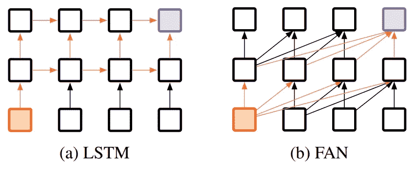
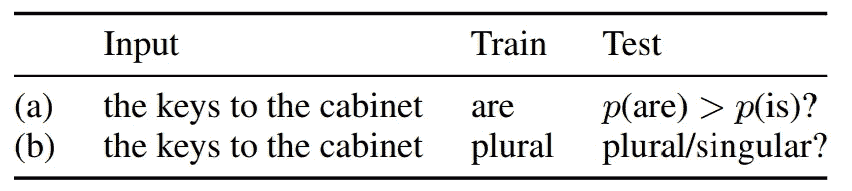
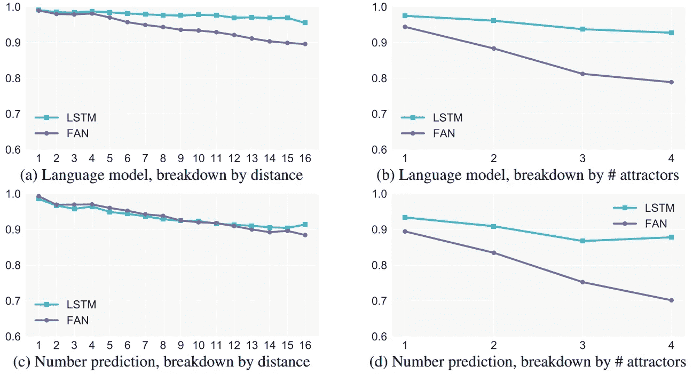
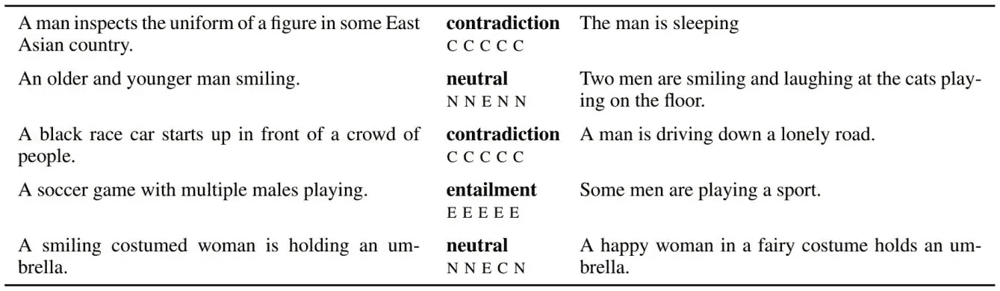
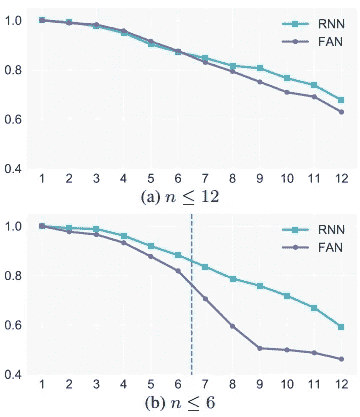

# 递归对层次结构建模的重要性

> 原文：<https://towardsdatascience.com/the-importance-of-being-recurrent-29c65cfa456f?source=collection_archive---------12----------------------->

## 将这篇高水平的人工智能研究论文总结成字节大小的片段

Photo by [Nathaniel Shuman](https://unsplash.com/@nshuman1291?utm_source=medium&utm_medium=referral) on [Unsplash](https://unsplash.com?utm_source=medium&utm_medium=referral)

这是对

> 递归对层次结构建模的重要性

由[柯川](https://www.linkedin.com/in/ketran/)、[阿里安娜](https://www.linkedin.com/in/arianna-bisazza-92754329/)、&T4【克里斯托夫】蒙兹在这里发现:

[aclweb.org/anthology/D18-1503](http://aclweb.org/anthology/D18-1503)

# 两句外卖

递归神经网络(RNNs)，如长短期记忆网络(lstm)，目前有性能限制，而更新的方法，如完全注意网络(FANs)显示出替代 lstm 的潜力，而没有这些限制。因此，作者开始使用标准化方法来比较这两种方法，并发现当应用于语言的层次结构时，LSTMs 在预测准确性上普遍超过 FANs。

# rnn 具有固有的性能限制

有一段时间，RNN 似乎在自然语言处理(NLP)领域掀起了一阵风暴(大约从 2014 年到 2017 年)。然而，我们最近开始意识到 RNN 的局限性，主要是它们“[低效且不可扩展](/the-fall-of-rnn-lstm-2d1594c74ce0)”。虽然[通过使用更专业的处理硬件(如](https://arxiv.org/abs/1511.05552)[现场可编程门阵列](https://www.quora.com/What-is-FPGA-How-does-that-work))有望克服这些限制，但解决方案至少还需要一代硬件。这意味着值得探索其他选择，如卷积神经网络(CNN)或变压器，用于文本理解，看看我们是否可以使用另一种更适合当前硬件现状的技术来实现类似或更好的结果。

# LSTM 变压器与风扇变压器的性能比较

由于这种需要，本文作者选择了两种有前途的自然语言理解方法(NLU)进行基准测试，使用客观标准比较两者之间的结果。具体来说，他们通过测试主语和动词之间的关系，以及在逻辑推理任务中测试模型，来衡量模型对语言的层次性理解程度。

当谈到 NLP/NLU 时，递归神经网络，更具体地说，长短期记忆网络是黄金标准。因此，作者从那里开始作为基线，然后将其比作一个完全注意力网络:一个来自尖端论文的新模型架构 [*注意力是你所需要的全部*](https://papers.nips.cc/paper/7181-attention-is-all-you-need.pdf) *。*LSTM 是一个连续的框架，一次接收一个输入，例如一次一个单词地阅读一个句子；它不同于其他 rnn，因为每个节点在更长的时间内记住依赖性。参见[这篇由](/introduction-to-sequence-models-rnn-bidirectional-rnn-lstm-gru-73927ec9df15) [Rohith Gandhi](http://www.linkedin.com/in/grohith327) 撰写的帖子，了解 RNNs 和一些流行变体的解释。

虽然 LSTM 比其他 rnn 有更长的长期记忆，因此在 LSTM 是长的，但当相关数据点之间有很大的距离时，如下一个句子中的主语和动词，它们仍然会很困难。此外，由于 LSTMs 的方向性和在每个时间步长对其单元状态的一致调整，当句子的前面部分的上下文依赖于句子的后面部分的信息时，LSTMs 往往会有问题。Rohith 在上面的帖子中举了一个例子:

> “他说，泰迪熊正在出售”和“他说，泰迪·罗斯福是一位伟大的总统”。在上面的两个句子中，当我们看到单词“泰迪”和前面的两个单词“他说”时，我们可能无法理解这个句子是指总统还是泰迪熊

进入 FAN transformer，它通过一次查看整个输入(如整个句子)而不是按顺序查看来解决这些问题，它具有一个注意力层，可以帮助保留相关数据点之间的上下文，无论距离远近。除了这些优势，[FAN 架构是高度并行化的](https://mchromiak.github.io/articles/2017/Sep/12/Transformer-Attention-is-all-you-need)，这有助于它克服或避免 RNNs 的上述性能限制。

The difference in the architectures can be seen by the way information flows through the nodes (indicated with orange arrows). This graph was originally included in the [subject paper](http://aclweb.org/anthology/D18-1503).

目前，句子嵌入模型的技术状态是具有注意层的[双向 LSTM (bi-LSTM ),它是在这篇主题论文发表之后发表的，但是 bi-LSTM 和注意层在这篇论文的发布之前已经得到了很好的发展。双向 lstm 基本上是两个 lstm(一个从左到右阅读文本，另一个从右到左阅读文本),它们比较笔记以进行集体预测。关注层与上面针对粉丝描述的类似，但是在 RNN 中，它位于模型的连续部分之外，允许在时间步长之间保留更多的上下文。作者选择使用普通的 LSTM，没有这些升级(解决了前面提到的所有缺点，除了并行化)，但这并不重要，因为 LSTM 仍然比风扇变压器实现了更好的精度。](https://arxiv.org/pdf/1806.09828.pdf)

# 为什么要分等级？

虽然*的《注意力是你所需要的全部》*的论文关注的是一般语言到语言的翻译性能，但这篇论文的作者选择研究模型对语言层次的理解。层次对于真正理解句子的意思至关重要，也是达到接近人类水平的 NLU 的必要步骤。这里有一些例子突出了理解等级的困难，即使对人类来说也是如此，以及它如何改变句子的意思，这些例子来自[雷切尔·塔曼](https://twitter.com/rctatman)对这篇论文的演讲:

> “我看见了那个拿着望远镜的人”
> 
> 我把钥匙放在架子上，桌子上，沙发旁边，书桌旁边……”

# 测试主语/动词一致性

This diagram was originally included in the [subject paper](http://aclweb.org/anthology/D18-1503).

确保模型理解层次结构的一个重要方法是，确保它预测给定单/复数主语的适当单/复数动词。上面的图表显示了一个示例句子，包括输入和动词复数如何用于训练模型，以及如何用于测试预测准确性。

在这项任务中，LSTM 在 3 项测试中表现优于风扇，在第 3 项目标上与风扇持平。

These graphs were originally included in the [subject paper](http://aclweb.org/anthology/D18-1503).

注意，上面提到的“距离”是主语和动词之间的字数。而“吸引子”是主语和动词之间的名词数量，这可能会扰乱模型对什么词是主语的理解。雷切尔举了另一个例子:

> **总线**总是**来得**晚。|吸引子= 0
> 
> 破窗*的**公交车***总是**来得**晚。|吸引子= 1

# 测试逻辑推理

为了避免过于关注使用样本文本可能引入的微妙之处和变化，作者利用了 Bowman et al. (2015b) 的一种简化语言，仅使用六种单词类型、三种逻辑运算符和一些符号来执行这项任务。他们使用基于规则的系统生成训练和测试数据集，以确保数据的 100%准确性。虽然文中的字母和符号可能看起来没有多大意义，但这个示例应该有所帮助:

These examples were originally included in [Bowman et al (2015b)](https://arxiv.org/pdf/1506.04834.pdf).

These graphs were originally included in the [subject paper](http://aclweb.org/anthology/D18-1503).

再一次，我们看到普通香草 LSTM 匹配或超过风扇在所有帐户。请注意， *n* 是等式左侧的运算符数量。

# 那么，为什么 LSTM 是明显的赢家呢？

这篇论文不敢回答甚至探究为什么会观察到这些结果。他们很好地解释了他们的过程，并详细说明了用于可重复性的超参数，但他们似乎有意避免超越纯粹的经验主义。此外，他们的代码是干净的、可读的和有文档记录的，所以你可以自己尝试:[https://github.com/ketranm/fan_vs_rnn](https://github.com/ketranm/fan_vs_rnn)

## 一些理论可以解释这些结果:

*   LSTMs 是一种经过多年研究的高度精细的模型架构，而风扇变压器现在大约有一年的历史，仍然处于研究的前沿。因此，也许为网格搜索选择的超参数超出了这项任务中粉丝的最佳范围。
*   也许 LSTM 的序列性本质上更符合人类语言的序列性本质。毕竟，我们说话和写作是按顺序进行的。
*   事实上，粉丝可能更适合于语言翻译这样的任务，而 LSTMs 更擅长于理解语言的结构。

进一步探索这些结果的一些有趣机会可能包括调整变压器(如尝试加权变压器和/或试验更多超参数)或添加第三种架构进行比较，如 [Convs2S](https://nvidia.github.io/OpenSeq2Seq/html/machine-translation/convs2s.html) 一种基于卷积神经网络的框架。

从理论上讲，一个完全集中注意力的网络转换器似乎在所有方面都应该胜过一个简单的长期短期记忆网络，但是通过彻底的测试，情况似乎并非如此。虽然我们应该继续研究和调整球迷探索这一新的选择，我们不应该折扣古老的 LSTM 只是还没有。请阅读[文件](http://aclweb.org/anthology/D18-1503)了解更多详情。

如果你对这类事情感兴趣，并且你在西雅图地区，我强烈建议你参加[普吉特湾编程 Python (PuPPy) Meetup](https://www.meetup.com/PSPPython) 参加我们每月一次的机器学习(AToM)高级主题讨论之夜，这激发了我写这篇文章的灵感(感谢[瑞秋·塔曼](https://twitter.com/rctatman)，她最近在本文上做了一个[的精彩演讲](http://www.rctatman.com/talks/atom-rnn))。如果你不在这个地区，我建议你在任何地方寻找，甚至开始做一些类似的事情。

这种类型的文章是我将要做的一件新事物，产生于明显缺乏平易近人的内容，这些内容可以迅速告知任何人关于前沿人工智能研究的状态，并有一些背景，以便在上下文中看到它。因此，我期待着听到您对本文或讨论主题的任何反馈或问题，无论是在这里还是在社交媒体上。欢迎联系我(只要告诉我你看到了这篇文章)->

[twitter.com/theNathanielW](https://twitter.com/theNathanielW)

[linkedin.com/in/theNathanielWatkins](https://www.linkedin.com/in/theNathanielWatkins/)