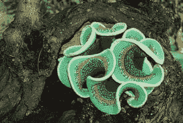
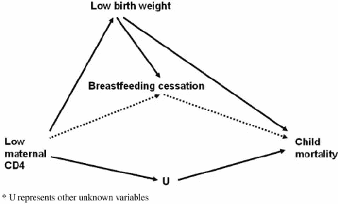

# 臭名昭著的因果关系与相关性

> 原文：<https://towardsdatascience.com/the-infamous-causation-vs-correlation-c9cdf4fc6563?source=collection_archive---------3----------------------->

**Figs**. **1 and 2**: Both pictures from [The Guardian](https://www.theguardian.com/science/alexs-adventures-in-numberland/gallery/2014/may/14/beauty-visions-mathematics-pictures)

因果关系和相关性。

我们一生中听到的这两个词数不胜数。相关性已经成为被认可的两者的兄弟，这已经被宣扬了很多年了。

另一方面，因果关系面临着许多困难时期。因果关系是打开实验之门的钥匙，是神秘背后的解释。但是相关性是一个更简单的结论，它仅仅表明有一类钥匙有可能打开这扇门。但仅此而已。

我们可以回顾历史，了解我们是如何处理这些麻烦的。

吸烟导致肺癌的观点被激烈地争论了多年，没有结果。当然，怀疑论者对混淆变量有他们的观点——也许有一种与肺癌相关的基因碰巧也存在于吸烟者身上。这种可以解释吸烟和肺癌之间关系的不确定变量的来回变化，恰恰证明了我们描述因果关系的语言是多么年轻。

这进一步证明了混淆相关性和因果性是多么容易。相信来自相关研究的任何说法是多么的不可能。

但是我们仍然求助于相关性——可靠的 r 值和邻近的表亲 r 平方——来让我们窥见一个变量如何影响另一个变量。但是如果我们说 x *导致了* y，那我们就是在犯罪。

> 你持怀疑态度的朋友和同事会问:
> 
> 你怎么能这么肯定？
> 
> 有大量的研究发现其他变量也会导致 y。你如何解释这一点？

一定有办法出去的。

这是我通过阅读朱迪亚·珀尔的《为什么》这本书，以及通过与同龄人讨论这些话题而学到的，当我提出这种事情时，他们不会疯狂地看着我。

所以，我们需要做的是开始寻找因果关系:

**首先**我们需要开始从统计 101 课程中挣脱出来，这些课程是我们在学校几十年来一直珍视的。我们不应该害怕“因果关系”这个词——因为根据因果关系做出决定是我们的天性。

这就是为什么你的母亲告诉你去做文化上接受的例行公事来帮助你的普通感冒消失。因为它以某种方式起了作用，而且这种知识代代相传。

这可能是一个不好的例子(因为做完这些仪式后你可能仍然会生病)，但你明白我的意思。

**其次**，我们需要小心我们用机器学习算法计算的相关性。许多人已经证实，数据中可能存在固有的偏见——尤其是在决定影响现实生活的事情时。

立即想到的是确定某人是否有罪，以及给病人推荐什么样的治疗方法。让数据为我们说话是非常诱人的，但让我们给自己一些信任。我们也可以在数据的噪音中找到意义。

第三，我们需要开始寻找抓住问题本质的方法。仅仅把一堆变量扔进锅里，运行一个算法来告诉我们什么是重要的，并从*预测*中获益是不够的。

这本书强调绘制因果图，以真正理解变量之间的关系。我们可以在另一篇文章中对此进行更深入的探讨，但总体思路是:

1.  以 X 导致 Y 的形式建立你的假设
2.  列出你认为与问题相关的所有变量
3.  画箭头指出这些变量是如何相互关联的

**Fig. 3**: From [ResearchGate](https://www.researchgate.net/figure/Causal-diagram-of-the-effect-of-maternal-CD4-count-on-child-mortality-through_fig1_23560010)

一旦你有了大概的概念，你就可以开始在一系列问题上运用这个概念。这感觉就像儿戏，但它对提高你对你试图解决的问题的理解有巨大的好处。

让我们共同努力，开始理解支配我们今天试图解决的问题的潜在规律的旅程。医疗保健。社会公正。教育。不公平。这些都需要因果关系的语言来推动我们今天所知道的边界。

感谢阅读。