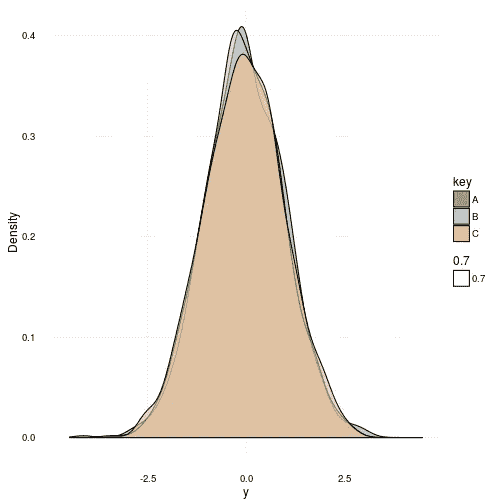
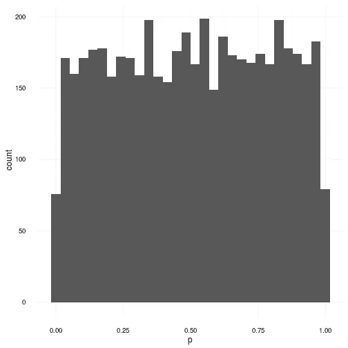
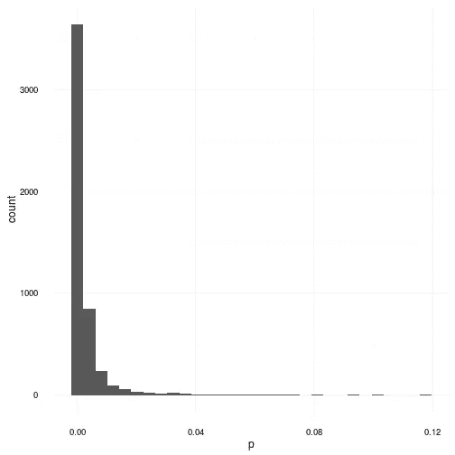
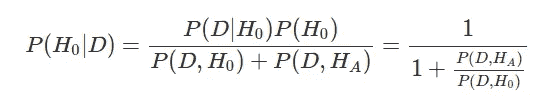
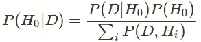

# 意义的渺小

> 原文：<https://towardsdatascience.com/the-insignificance-of-significance-bb6947e08db4?source=collection_archive---------4----------------------->

统计学的重要性在研究界和其他领域都有一种神奇的地位。这种立场是没有根据的，对这种立场的信任是被严重误导的。如果你不相信我，我能理解。所以我不唠叨了，让我们做个小实验，好吗？让我问你以下问题:

> *假设原假设为真；得到 p 值> 0.5 的概率有多大？*

好好想一想。；)你说完了吗？很好。答案是这样的:是 50%。等等什么？是的，是真的。获得大于 0.5 的 p 值的概率为 50%。但是为什么呢？我来告诉你为什么！

> *零假设下 p 值的概率分布是均匀的！*

这意味着你得到 p 值 0.9999 的概率和得到 p 值 0.0001 的概率是完全一样的。原则上这一切都很好，除了一点点恼人的做法，将这解释为[零假设](https://en.wikipedia.org/wiki/Null_hypothesis)为真的概率！没有什么比这更偏离事实了。将数据的可能性解释为假设为真的概率，从而陈述*P*(*D*|*H*0)=*P*(*H*0 |*D*)是一种逻辑谬误。不，不，你说；那肯定不是真的！的确如此。但别让我用数学和文字说服你。我宁愿给你看。

# 逻辑谬误

在 R 的奇妙统计语言中，有一个很好的小测试叫做[夏皮罗-维尔克正态性测试](https://en.wikipedia.org/wiki/Shapiro%E2%80%93Wilk_test)，它基本上，嗯，测试[正态性](https://en.wikipedia.org/wiki/Normal_distribution)。本例中的零假设 *H* 0 是指待测样本来自一个[正态分布](https://en.wikipedia.org/wiki/Normal_distribution)*y*∩*N*(*μ*， *σ* )。因此，为了拒绝零假设，我们需要一个小的 p 值。看在过去的份上，让我们要求这个值小于 0.05。首先，我将从三个具有零均值和单位方差的相同正态分布中生成 1000 个样本。它们如下所示。

Probability densities for three independent Gaussian distributions with zero mean and unit variance.

正如你所看到的，它们确实是高斯分布，或多或少是相同的。现在我提议做一个实验。让我们从相同的高斯分布中选择 5000 个实现的样本集，每个样本集中有 100 个样本。然后，我们将对每组数据进行夏皮罗检验，然后绘制出所有 p 值的分布图。记住:在这种情况下，零假设是正确的，因为我们知道所有的样本都来自于*y*∽*N*(0，1)分布。

A simulation of p-values calculated on data sets generated under the null hypothesis which clearly states that the p-values are uniformly distributed even when the null hypothesis is true.

对于那些思维敏捷的人来说，你现在可以看到，即使我们直接从高斯分布中采样，然后试图检测它是否来自高斯分布，我们也没有得到任何信息。我们得到的只有“伙计，我真的不知道。它可能是任何东西。”这当然不是很有帮助。我之所以这么说，也是因为在零假设下，p 值为 0.001 和 p 值为 0.999 的概率相等。因此，在这些测试之后，我们不能断定生成分布是高斯分布。事实上，我们能得出的结论很少。然而，我们可以说:

> *我们无法在 5%的显著性水平上成功反驳来自高斯分布的数据的零假设。*

但这也是我们所能说的。这并没有使数据更有可能真的来自于[高斯分布](https://en.wikipedia.org/w/index.php?title=Gaussian_distribution)。同样，在这种情况下，与 p 值为 0.1 相比，p 值为 0.999 并不会使其更有可能来自高斯分布。现在我已经听到反对的人在喊“好吧，那么你是说统计测试是无用的？”。事实上，我不是这个意思。我要说的是，他们是狡猾的混蛋，必须如此对待。所以为了支持我最后的陈述，让我们来看一个场景，在这个场景中，测试确实成功地反驳了一些东西！

# 成功的例子

在下面的例子中，我们重复了前面的实验，但是用均匀分布代替了生成分布。生成的 p 值如下图所示。

An example of a successful application of the null Hypothesis testing.

正如你可以明显看到的，在这种情况下，零假设一直被反驳，吹嘘大多数 p 值低于 0.05。这张图表解释了这些测试的受欢迎程度。在分布明显不是正态分布的情况下,[夏皮罗维尔克测试](https://en.wikipedia.org/wiki/Shapiro%E2%80%93Wilk_test)和许多其他人成功地宣布，这个数据是由高斯分布产生的可能性极小。

# 浅谈假设检验

让我们回到假设为真的可能性与概率的陈述。我陈述了*P*(*D*|*H*0)≦*P*(*H*0 |*D*)；但我没说到底是什么关系。为了补救这一点，让我们谈一谈我们真正想要通过假设检验达到的目的。在科学中，我们通常会看到假设空间的二元版本，其中有一个零假设 *H* 0 和一个替代假设 *HA* ，我们希望评估 *H* 0 为真的后验概率。这用下面的关系式表示。

这清楚地表明，为了量化 H 0 的概率，我们必须考虑 HA T21 的概率。这并不奇怪，因为他们不是独立的。事实上，在给定观察数据的情况下，为了找到假设为真的概率，我们需要评估数据的可能性及其为真的先验概率，并将其与两个假设的全部证据联系起来。

然而，我们并不总是希望看到假设空间只有两种可能的结果。实际上，多重假设的完全广义空间是这样的。

每当你设计实验时，这种关系都值得记住。它是健全科学的基础，不应该被轻视。这篇小文章只是为了提醒您在统计课上使用 p 值和即插即用公式的危险。所以像往常一样，这里有一点建议

> 明确写下模型和假设，然后做推论！

目前就这些。

*原载于*[*doktormike . github . io*](http://doktormike.github.io/blog/The-insignificance-of-significance/)*。*